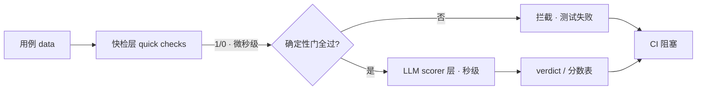

import { Canvas, Controls, Meta } from '@storybook/addon-docs/blocks';
import * as Stories from './evals-ci.stories';

<Meta of={Stories} name="Docs" />

# 集成测试与 CI

评估写完只算落地一半：要让质量判断持续生效，得把它接进测试与持续集成。本课覆盖三个入口：quick checks 用零 LLM 的确定性断言做第一道门；Vitest 集成把评估变成测试，评估不过即测试失败；`runEvals` 是共同底座，任何 ESM 测试框架或 CI 脚本都能消费它的返回值并断言阈值。三者共享同一套 scorer 管道，可分层组合——确定性门先行，LLM 评分补位。



| 入口 | 依赖 | 判定方式 | 适用时机 |
| --- | --- | --- | --- |
| quick checks | `@mastra/evals/checks` | 确定性 1/0，无 LLM 调用 | 每次都跑的零成本门 |
| Vitest 集成 | `@mastra/evals/vitest` + vitest 3/4 | 评估失败即测试失败 | 回归测试与 PR 门禁 |
| `runEvals` | `@mastra/core/evals` | 返回分数与统计，自行断言 | 任意 ESM 框架、CI 脚本 |

## Quick Checks：零 LLM 快检

quick checks 是一组可组合的微型评分器。每个 check 本质仍是标准的 `createScorer()` 实例：只走 preprocess（提取文本与工具调用）和 generateScore（产出 1 或 0）两步，跳过 analyze 与 generateReason，全程没有 LLM 调用，因此微秒级完成、零 token 成本。`similarity` 是唯一例外，返回 0-1 的 Dice 相似度，也可配 `threshold` 二值化。它们与 LLM scorer 放进同一个 `scorers` 数组即可，管道不变：

```ts
import { checks } from '@mastra/evals/checks';
import { createFaithfulnessScorer } from '@mastra/evals/scorers/prebuilt';
import { runEvals } from '@mastra/core/evals';

await runEvals({
  target: mastra.getAgent('weatherAgent'),
  data: [{ input: "What's the weather in London?" }],
  scorers: [
    checks.includes('London'),        // 文本：输出包含子串
    checks.calledTool('weatherTool'), // 工具：调用过该工具
    checks.noToolErrors(),            // 工具：没有工具调用报错
    createFaithfulnessScorer({ model: 'openai/gpt-5-mini' }), // LLM 层补语义
  ],
});
```

<Canvas of={Stories.Interactive} />
<Controls of={Stories.Interactive} />

| 读者操作 | 可观察证据 |
| --- | --- |
| 切换「用例场景」 | 漏关键词 / 调错工具被快检层 1/0 拦截、LLM 层跳过；语义偏差只有 LLM 层能拦 |
| 关闭「快检层」 | 确定性错误逃逸，LLM 层仍判「通过」——1/0 门不可替代 |
| 关闭「LLM 评分层」 | 语义偏差逃逸，只剩确定性门 |
| 看左下角读数 | 快检层耗时是实测微秒，LLM 层是示意秒级，相差约 6 个数量级 |

### 文本检查

文本 checks 对输出做包含、排除、全等、正则与相似度断言：

| Check | 写法 | 判定 | 评分 |
| --- | --- | --- | --- |
| `includes` | `checks.includes('London')` | 输出包含子串 | 1/0 |
| `excludes` | `checks.excludes('error')` | 输出不包含子串 | 1/0 |
| `equals` | `checks.equals('London')` | 输出完全等于目标字符串 | 1/0 |
| `matches` | `checks.matches(/^London/)` | 输出匹配正则 | 1/0 |
| `similarity` | `checks.similarity('参考答案')` | 与参考答案的 Dice 相似度 | 0-1，配 threshold 后二值 |

`similarity` 是唯一连续评分：需要「意思接近就算过」的软断言时用它，配 `threshold` 即回到二值门。

### 工具检查

工具 checks 读取运行中的工具调用记录，覆盖「调没调、调了几次、顺序对不对、有没有报错」：

| Check | 写法 | 判定 | 评分 |
| --- | --- | --- | --- |
| `calledTool` | `checks.calledTool('weatherTool')` | 该工具被调用过 | 1/0 |
| `didNotCall` | `checks.didNotCall('deleteTool')` | 该工具未被调用 | 1/0 |
| `toolOrder` | `checks.toolOrder(['search', 'answer'])` | 工具按期望顺序调用 | 1/0 |
| `maxToolCalls` | `checks.maxToolCalls(3)` | 总调用次数不超过 N | 1/0 |
| `usedNoTools` | `checks.usedNoTools()` | 完全没有调用工具 | 1/0 |
| `noToolErrors` | `checks.noToolErrors()` | 没有工具调用报错 | 1/0 |

边界：checks 只做字面与调用记录的确定性判断，主观或语义评估应交给 LLM scorer；快检 1/0 天然适合做 gates，与 [数据集与实验](?path=/docs/evals-datasets--docs) 的 verdict 判定衔接。

## Vitest 集成：评估即测试

`@mastra/evals/vitest` 把评估塞进 Vitest 的测试语义：断言不过就是测试失败，每个评估测试结束后由 reporter 打印分数表。安装 `npm install @mastra/evals vitest`（Vitest 3 或 4），在 `vitest.config.ts` 挂上 reporter 与 setup 文件——setup 负责把自定义匹配器注册到 `expect`：

```ts
// vitest.config.ts
import { defineConfig } from 'vitest/config';
import { MastraEvalsReporter } from '@mastra/evals/vitest';

export default defineConfig({
  test: {
    reporters: ['default', new MastraEvalsReporter()],
    setupFiles: ['@mastra/evals/vitest/setup'],
  },
});
```

不想加独立 setup 文件时，也可以在自己的 setup 里调用 `registerEvalMatchers()` 完成同样的注册。

### 数据集级断言：expectEvals

`expectEvals` 在普通 `test()` 里跑一次 `runEvals`（参数与 `runEvals` 相同），再断言通过率。gates 是逐条 pass/fail 的确定性门：`toPass(0.8)` 要求至少 80% 条目通过全部 gates，`toPass()` 不带参数则要求每条都过；scorer 阈值单独比较全部条目的平均分。断言必须 `await`：它 resolve 出完整 `RunEvalsResult`，并把分数附到当前测试上供 reporter 展示。

```ts
import { expectEvals } from '@mastra/evals/vitest';

test('weather agent 通过率', async () => {
  await expectEvals({
    target: mastra.getAgent('weatherAgent'),
    data: [{ input: "What's the weather in London?" }],
    gates: [checks.calledTool('weatherTool'), checks.noToolErrors(), checks.includes('London')],
    scorers: [{ scorer: mastra.getScorer('answerRelevancyScorer'), threshold: 0.7 }],
  }).toPass(0.8);
});
```

### 逐条断言：expectEval + test.for

`expectEval` 是单条版本，`data` 传一个条目而非数组。配合 `test.for` 每条数据一个测试：单条回归表现为一个失败测试，而不是拉低整体通过率。

```ts
test.for([
  { input: "What's the weather in London?", groundTruth: 'London' },
  { input: '那边天气如何？', groundTruth: 'London' }, // 歧义问法单独一条
])('weather agent: $input', { timeout: 60_000 }, async (item) => {
  await expectEval({
    target: mastra.getAgent('weatherAgent'),
    data: item,
    gates: [checks.calledTool('weatherTool'), checks.includes(item.groundTruth)],
  }).toPass();
});
```

### 匹配器

对 `runEvals` 返回值可直接断言；工作流等分类 scorer 用点路径引用嵌套分数，如 `trajectory.code-trajectory-accuracy-scorer`：

| 匹配器 | 断言 |
| --- | --- |
| `toHaveVerdict('passed')` | 运行 verdict：passed / scored / failed |
| `toHaveScoreAbove(name, min)` | 某 scorer 平均分高于下限 |
| `toHaveScoreBelow(name, max)` | 某 scorer 平均分低于上限 |
| `toPassGates()` | 全部 gates 通过；未配置 gates 时必然失败 |
| `toPassThresholds()` | 全部 scorer 阈值通过；未配置阈值时必然失败 |

LLM 评估远慢于 Vitest 默认 5 秒超时：按测试传 `{ timeout: 60_000 }` 或在配置里调大 `testTimeout`。并发是两者相乘——Vitest 文件并行 × `runEvals` 的 `concurrency`，遇 provider 限流先降 `concurrency`，再考虑 `fileParallelism: false`。

## 在 CI 中运行评估

`runEvals({ target, data, scorers })` 返回纯数据：`scores` 收录各 scorer 均分，`summary.totalItems` 是本次评估的条目数。Vitest 集成只是给它包了断言语义；任何支持 ESM 的测试框架（Vitest / Jest / Mocha 等）或 CI 脚本都能消费返回值、自行断言阈值，不达标就让任务失败：

```ts
import { runEvals } from '@mastra/core/evals';

const result = await runEvals({
  target: mastra.getAgent('weatherAgent'),
  data: typoCases, // 拼写错误等特定场景单独一组用例
  gates: [checks.includes('London'), checks.noToolErrors()],
  scorers: [{ scorer: relevancyScorer, threshold: 0.7 }],
});

expect(result).toPassGates();
expect(result).toHaveScoreAbove('answer-relevancy-scorer', 0.7);
```

建议为不同失败模式写独立测试组：歧义问法、拼写错误、拒答各自一组 data，各自的 gates 与阈值独立生效，失败时能直接定位是哪类场景退化。

## 最佳实践

- **分层设防**：确定性门（quick checks 作 gates）全量、每次都跑；LLM scorer 只对放行用例补语义判断。前者微秒级零成本，后者按 token 计费，先拦确定性错误显著省钱。
- **逐条显性化**：CI 门禁用 `expectEval` + `test.for`，单条回归就是一个失败测试；`expectEvals(...).toPass(0.8)` 留给容忍个别波动的数据集级整体门。
- **控住并发**：总 LLM 流量 = Vitest 文件并行 × `runEvals` 的 `concurrency`，限流时先降后者。

## 常见问题

- LLM 评估在 Vitest 里偶发超时失败
  按测试传 `{ timeout: 60_000 }` 或调大配置里的 `testTimeout`；Vitest 默认 5 秒，远低于 LLM 评估的常见耗时。
- `toPassGates()` / `toPassThresholds()` 直接失败
  这两个匹配器在本次评估未配置 gates / scorer 阈值时必然失败，先核对 `runEvals` 参数。
- quick check 拦下了本该通过的回答
  `includes` / `equals` 是字面匹配，输出措辞一变就失败；放宽为 `matches` 正则或 `similarity` + `threshold`，或把它移出 gates 只作追踪。
- 跑了 `runEvals` 但 reporter 不打印分数表
  reporter 只读 `expectEval` / `expectEvals` 附到测试元数据上的分数，绕过这两个断言的测试不会出现在分数表里。

## 总结回顾

摘要：

quick checks 把常见断言做成零 LLM 的微型评分器：每个 check 都是只走 preprocess 与 generateScore 的标准 `createScorer`，文本五件套与工具六件套输出 1/0（similarity 为 0-1），微秒级完成，与 LLM scorer 同管道分层组合。Vitest 集成把评估变成测试：MastraEvalsReporter 与 setup 文件注册匹配器后，`expectEvals(...).toPass(0.8)` 做数据集级门，`expectEval` + `test.for` 让单条回归显性化，五个匹配器可直接断言返回值。`runEvals` 是共同底座，返回 scores 与 summary，任何 ESM 框架或 CI 脚本都能消费并断言阈值。

一句话：

> 确定性错误交给微秒级的 quick checks 先拦，语义质量交给 LLM scorer 补位，再把两者接进 Vitest 与 CI，评估才持续生效。

知识要点：

- quick checks 为什么微秒级、零成本？它跳过了 scorer 管道的哪两步？
- 文本 checks 与工具 checks 各有哪些成员？分别断言什么？
- `toPass(0.8)` 与 `toPass()` 的通过率要求有何不同？
- 五个评估匹配器分别断言什么？未配置 gates 时调用 `toPassGates()` 会怎样？
- LLM 评估在 Vitest 里超时、限流时分别调什么参数？

## 参考资料

- [Quick Checks](https://mastra.ai/docs/evals/quick-checks)
- [Vitest Integration](https://mastra.ai/docs/evals/vitest-integration)
- [Running Evals in CI](https://mastra.ai/docs/evals/running-in-ci)
