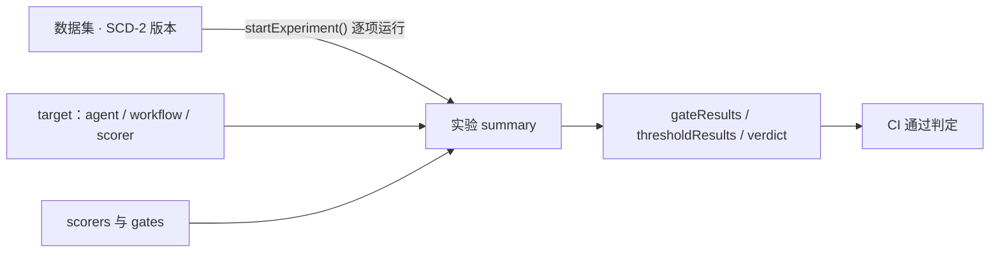

import { Canvas, Controls, Meta } from '@storybook/addon-docs/blocks';
import * as Stories from './evals-datasets.stories';

<Meta of={Stories} name="Docs" />

# 数据集与实验

单条 scorer 打分回答「这条输出好不好」（见 [评估基础与 Scorer](?path=/docs/evals-basics--docs)）；本课三个对象回答「这套系统整体过没过」：**数据集**是带版本控制的测试用例集合，**实验**把数据集逐项跑过 agent / workflow / scorer 并自动评分，**gates 与 verdicts** 把逐项得分合成一个可直接写进 CI 的通过判定。三者自 `@mastra/core@1.4.0` 起可用，且要求 storage adapter 支持 `datasets` 域（如 `LibSQLStore`）。



| 关键项 | 默认值 / 规则 | 回查要点 |
| --- | --- | --- |
| `maxConcurrency` | `5` | 实验 item 并发上限 |
| `itemTimeout` | `30000` ms / 条 | 超时该条按失败处理 |
| `maxRetries` | `2` | 指数退避；abort 错误永不重试 |
| `unmockedToolPolicy` | `'allow'` | 设 `'deny'` 阻断未声明 mock 的工具调用 |
| `persistence` | `'default'` | 可单独关 `experiments` / `scores` 落库 |
| 快照大小预算 | 4 MiB | `{ maxBytes }` 覆盖；超限不截断、直接报错 |
| gate 通过条件 | 全部用例均分恰为 `1.0` | 不是「≥ threshold」 |

## 数据集：SCD-2 版本化的测试用例集合

数据集是「跑实验用的测试用例集合」，每条用例是 `input` 加可选 `groundTruth`。入口是 `mastra.datasets` 管理器：`create` / `get` / `list` 负责增查；建库时用 Zod（或 Valibot / ArkType 等 Standard Schema）约束两类数据的形状，不符合 schema 的条目在插入时即被拒绝。

```typescript
const dataset = await mastra.datasets.create({
  name: 'translation-pairs',
  inputSchema: z.object({ text: z.string(), sourceLang: z.string(), targetLang: z.string() }),
  groundTruthSchema: z.object({ translation: z.string() }),
});
const existing = await mastra.datasets.get({ id: dataset.id });
const { datasets: all } = await mastra.datasets.list();
```

Studio 侧边栏 Datasets 覆盖同样的管理面：建库、JSON 编辑器增改条目、任意两版本 side-by-side diff（Compare Versions），以及 CSV / JSON 文件批量导入（列映射到 dataset 字段）。

### 条目操作与版本

每次增改删都产生新版本、旧行永久保留（SCD-2），这正是「实验可精确复现历史」的基础；删除是幂等软删，只有 `purgeItem` 真正清数据。

| 方法 | 行为 |
| --- | --- |
| `addItem` / `addItems` | 新增条目（`toolMocks` 等也在这里声明） |
| `updateItem` | 修订字段，bump 出新版本 |
| `deleteItem` / `deleteItems` | 幂等软删，历史保留在 tombstone |
| `purgeItem` | 清空该条目全部历史并删除关联实验结果；不创建新版本、不可撤销 |
| `listVersions` / `getItemHistory` | 查版本列表 / 单条目历史 |
| `listItems` | 按 `version`、`search`、`page` / `perPage` 取条目 |

```typescript
await dataset.addItem({ input: { text: 'Hello', sourceLang: 'en', targetLang: 'zh' }, groundTruth: { translation: '你好' } });
await dataset.updateItem({ itemId, groundTruth: { translation: '您好' } }); // 旧值仍在版本 1
const { versions } = await dataset.listVersions();
const items = await dataset.listItems({ version: 2, search: 'Hello', page: 0, perPage: 50 });
```

边界：`purgeItem` 用于抹除敏感数据，连历史一起清，所以不可撤销，MongoDB 上还需支持事务的部署；不要把敏感信息放进 `externalId`。

### 快照：带 SHA-256 校验的可移植格式

`createDatasetSnapshot()` / `parseDatasetSnapshot()`（`@mastra/core/datasets`）把数据集导出为自包含 artifact：完整条目 payload、可移植 UUID 与 provenance；默认 4 MiB 大小预算，可用 `maxBytes` 覆盖（超限不截断，直接报错）。

```typescript
import { parseDatasetSnapshot } from '@mastra/core/datasets';
const snapshot = parseDatasetSnapshot(jsonText); // digest 校验失败抛 Zod 错误
```

digest 是 envelope 做 RFC 8785 canonical JSON 后的小写十六进制 SHA-256，解析时复算比对，任何篡改（含时间戳与 provenance 变化）都会被拒。把快照提交进仓库，CI 上的实验就能与本地逐字节同源。

## 实验：把数据集逐项跑过目标并自动评分

实验把固定版本的数据集逐条送进 target，对输出自动跑 scorer 并落库，阻塞式返回 summary：

```typescript
const summary = await dataset.startExperiment({
  name: 'gpt-5.1-baseline',
  targetType: 'agent',            // 'agent' | 'workflow' | 'scorer'，或 inline task 函数
  targetId: 'translation-agent',
  scorers: ['accuracy', 'fluency'],
  version: 3,                     // 固定数据集版本，复现历史实验
  maxConcurrency: 5,              // 默认 5
  itemTimeout: 30_000, maxRetries: 2,
});
summary.status;                   // 'completed' | 'failed'
summary.succeededCount; summary.failedCount;
summary.results;                  // 逐条：itemId、output、各 scorer 的 score / reason
```

三种 target 消费 `input` 的方式：agent 直接把它当 prompt / 消息；workflow 把它作 `run.start()` 的 `inputData`；scorer 则调 `scorer.run(item.input)`——用来评测 judge 本身，此时 `input.groundTruth` 是给 judge 的参考答案，顶层 `groundTruth` 是对 judge 输出的期望。传 `task: async ({ input }) => ...` 可完全自定义。

长数据集改用 `startExperimentAsync()`：立即返回 `experimentId`，轮询 `dataset.getExperiment({ experimentId })` 直到 `'completed' | 'failed'`。传 `signal` 取消时剩余条目计入 `skippedCount`；`persistence: { experiments: 'none', scores: 'none' }` 可单独关闭落库。更细的控制面（`beforeAll` / `beforeEach` / `afterEach` / `afterAll` 钩子、`onEvent` 事件观察）见官方 Experiments 页。Studio 的 dataset 详情页有 Run Experiment 与 Experiments tab（含多实验 Compare）。

### scorer 来源优先级与工具模拟

每条用例的 scorer 来源恰好一个、不合并：实验级 `scorers` 优先于条目级 `scorerIds`，再优先于数据集级 `scorerIds`，最后是「无 scorer」；显式空数组等于选中「无 scorer」并阻止回退（`scorerIds: null` 则移除条目覆盖、继承数据集）。

agent target 可给每条用例声明工具模拟，让实验脱离真实工具稳定复现：

```typescript
await dataset.addItem({
  input: 'What is the weather in Seattle?',
  toolMocks: [{ toolName: 'getWeather', args: { city: 'Seattle' }, output: { temperature: 60, conditions: 'rainy' } }],
});
// 实验级设 unmockedToolPolicy: 'deny' 后，未声明 mock 的工具调用报 TOOL_MOCK_NOT_DECLARED 并立即中止该条
```

匹配是 args deep-equal（键序无关、数组顺序有关，不类型强转）；`matchArgs: 'ignore'` 只按 toolName 匹配，适合 mock prompt 由 LLM 生成的子代理工具。诊断读 `item.toolMockReport`（`served` / `unconsumed` / `liveCalls` / `failure`）。mock 需 LibSQL / PostgreSQL / MongoDB / Spanner 存储，MySQL 拒绝写入。

### 外部编排器模式

实验也可由外部系统驱动（如 Temporal worker），四个调用把生命周期拆开，写入的表与原生 run 完全一致：

```typescript
const { experimentId } = await dataset.createExperiment({
  id: 'temporal-wf-run-42',       // 传自有 id 幂等创建；冲突报 EXPERIMENT_ID_CONFLICT (409)
  targetType: 'agent', targetId: 'translation-agent', scorers: ['accuracy'],
});
const { result, scores } = await dataset.runExperimentItem({ experimentId, itemId: 'item-1' });
// 结果按 (experimentId, itemId, attempt) upsert，重试收敛到单行、不产生重复
// 完全自行执行与打分时改用：dataset.submitExperimentResult({ experimentId, itemId, output, scores: [...] })
const experiment = await dataset.finalizeExperiment({ experimentId }); // 幂等收尾
```

收尾由服务端统计：`succeededCount + failedCount + skippedCount === totalItems` 恒成立；finalize 之后提交报 `EXPERIMENT_ALREADY_FINALIZED`。

## Gates 与 verdicts：通过判定

gate 是硬性要求：必须得 1.0。它先于常规 scorer 在每条用例上运行，全部用例的平均分必须恰为 1.0，否则整个 run 判 `failed`。任何 scorer 都能当 gate——返回 0/1 的 quick checks 最合适。只传 gates 可省略 `scorers`（gate-only run）；两者都不传则直接抛错。

threshold 有三种写法：

| 写法 | 语义 | 适用 |
| --- | --- | --- |
| `threshold: 0.7` | 数字 = 最低分，均分 ≥ 0.7 通过 | 连续分 scorer |
| `{ max: 0.3 }` | 高分反而差 | 幻觉、毒性类 scorer |
| `{ min: 0.3, max: 0.8 }` | 均分须落在区间内 | 既不能太差也不能过头 |

结果读三处：`result.gateResults`（`id` / `passed` / `score`）与 `result.thresholdResults`（`id` / `passed` / `averageScore` / `threshold`）；裸 scorer（无 threshold）只进 `result.scores`，仅追踪、不影响 verdict。

<Canvas of={Stories.Interactive} />
<Controls of={Stories.Interactive} />

| 读者操作 | 可观察证据 |
| --- | --- |
| 「数据集版本」切到 v2 | gate 均分回到 1.0，但 helpfulness 均分 0.68 未达 0.7，verdict 变 scored |
| 版本 v3 + threshold 调到 0.9 | gate 全过但均分 0.86 未达 0.9，verdict 仍是 scored |
| 「scorer 组合」切「仅 threshold」 | 没有 gates，verdict 只会是 passed / scored，永远不会 failed |
| 打开 Show code | 看到 `runExperiment()` 按官方判定顺序合成 verdict |

verdict 三态按顺序判定：任一 gate 均分低于 1.0 → `failed`；gate 全过但有 threshold 未达 → `scored`；全部达标 → `passed`。没有 gates / threshold，或全部 scorer 返回 `notScorable()` 时，结果里省略 verdict（仍返回 `scores` 与 summary）。

落到 CI 就是一段退出码判定：

```typescript
import { runEvals } from '@mastra/core/evals';
import { checks } from '@mastra/evals/checks';

const result = await runEvals({
  data: [{ input: 'What is the weather in Brooklyn?' }],
  target: weatherAgent,
  gates: [checks.calledTool('get_weather'), checks.noToolErrors()],
  scorers: [{ scorer: relevancyScorer, threshold: 0.7 }, checks.includes('Brooklyn')],
});
if (result.verdict === 'failed') process.exit(1); // gate 挂了 → CI 红
if (result.verdict === 'scored') console.warn(result.thresholdResults.filter((t) => !t.passed));
```

`checks.*`（`@mastra/evals/checks`）提供零 LLM 的确定性检查（calledTool、noToolErrors、includes 等），与 quick checks、Vitest 集成的完整链路见 [集成测试与 CI](?path=/docs/evals-ci--docs)。

## 最佳实践

- **复现实验**：固定 `version` 加固定 scorer 组合；要跨环境同源，就用快照把数据集归档进仓库。
- **gate 选 0/1 检查，连续分做 threshold**：连续分几乎不可能恰好均分 1.0，当 gate 会让 run 永远 failed。
- **mock 子代理**：子代理 prompt 由 LLM 生成、args 无法预知，用 `matchArgs: 'ignore'` 只按 toolName 匹配。
- **评测 judge 本身**：`targetType: 'scorer'`，完整 payload 放进 `input`、参考答案放 `input.groundTruth`。

## 常见问题

- gate 分数明明有 0.9，为什么还是 failed？
  gate 要求全部用例平均分恰为 1.0，0.9 说明有用例得 0；把该检查改作 threshold，或换成确定性的 quick check。
- 实验结果里找不到 verdict 字段？
  没传 gates / threshold，或全部 scorer 返回 `notScorable()`；此时仍可读 `scores` 与 summary，补上 gates 或 threshold 即恢复判定。
- `purgeItem` 之后版本号没变，数据也查不到了？
  purge 不创建新版本，而是清空历史与关联实验结果、不可撤销；日常修订用 `updateItem`。
- 单条报 `EXPERIMENT_ITEM_SCORER_NOT_FOUND`，实验还继续吗？
  该条目跳过且不重试，其余继续；清理条目上过期的 `scorerIds` 覆盖即可。

## 总结回顾

摘要：

数据集用 SCD-2 版本化测试用例，`mastra.datasets` 负责 create / get / list 与条目增改删查，快照提供带 SHA-256 校验的可移植归档；实验把固定版本的数据集逐项跑过 agent / workflow / scorer 并自动评分，scorer 来源按实验级 > 条目级 > 数据集级解析，工具模拟让 agent 实验脱离真实工具复现，外部编排器模式把生命周期拆成四个可幂等重试的调用；gates（必须 1.0）与 threshold（最低分 / `{max}` / `{min,max}`）把逐项得分合成为 passed / scored / failed 三态 verdict，可直接写进 CI 作通过判定。

一句话：

> 数据集版本保证「跑的是同一批用例」，gates 与 verdicts 保证「过不过有唯一定论」——两者合起来才叫可复现的质量运营。

知识要点：

- `mastra.datasets` 提供哪些方法？SCD-2 版本如何支撑实验复现？
- `startExperiment` 的三种 target 各自怎么消费 `input`？scorer 来源优先级是什么？
- threshold 的三种写法语义是什么？verdict 三态按什么顺序判定？

## 参考资料

- [Datasets - Mastra Docs](https://mastra.ai/docs/evals/datasets)
- [Experiments - Mastra Docs](https://mastra.ai/docs/evals/experiments)
- [Gates and Verdicts - Mastra Docs](https://mastra.ai/docs/evals/gates-and-verdicts)
