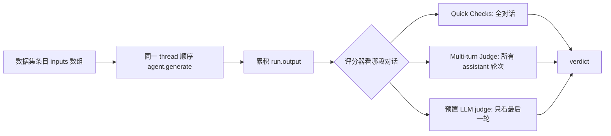

import { Canvas, Controls, Meta } from '@storybook/addon-docs/blocks';
import * as Stories from './evals-multi-turn.stories';

<Meta of={Stories} name="Docs" />

# 多轮与会话评估

单轮评估只验证一问一答；真实 agent 常在同一个 thread 上连聊多轮，还要靠 memory 召回历史。本课覆盖 Mastra 的两类场景：多轮评估把数据集条目写成 `inputs` 数组，各轮顺序发到同一线程，评分器看累积对话；带记忆 agent 的评估必须显式提供 `threadId`，共有三种组织方式。内嵌实例为离线示意：拖动控件改轮数与目标轮答案质量，读数显示逐轮断言与整体 verdict。



| 名称 | 用途 | 关键点 |
| --- | --- | --- |
| `inputs: string[]` | 多轮数据集条目 | 各轮顺序发到同一 thread，可与单轮 `input` 混用；空数组抛 `MastraError` |
| `turns: []` | 逐轮断言 | 每轮 `{ input, gates?, scorers? }`，检查只作用于该轮；不能与 `input` / `inputs` 混用 |
| `createMultiTurnJudgeScorer()` | 全对话 LLM 评审 | 拼接所有 assistant 轮次为 transcript，按一条 criterion 输出 1 或 0 |
| `run.output` / `run.input` | 累积输出 / 仅第一轮输入 | 输出类检查统计全部轮次；输入类 LLM judge 只见第一轮 |
| `targetOptions.memory` | runEvals 注入记忆 | 每次调用全局生效，不支持按条目覆盖 |
| `threadId` | 带记忆评估必需 | 缺失时报 ObservationalMemory requires a threadId |

## 多轮数据集条目与累积对话

多轮评估不引入新的评估入口，仍是 `runEvals`：变化只在数据条目和评分对象上。每个多轮条目自动获得唯一的 `threadId`，各轮通过 `agent.generate()` 在同一线程上顺序执行，agent 每轮都能看到之前的对话历史；`runEvals` 同时生成并注入 `resourceId`，默认从生成的 thread 派生，使每个对话相互隔离。

### inputs 数组：同一线程顺序发轮次

条目用 `inputs` 数组代替单个 `input`，两种条目可在同一次 `runEvals` 的 `data` 中混用：

```ts
import { runEvals, checks } from '@mastra/core/evals';

const result = await runEvals({
  target: myAgent,
  scorers: [{ scorer: checks.calledTool('get_weather', { times: 2 }), threshold: 1 }],
  data: [
    { input: '北京现在多少度？' },
    { inputs: ['伦敦天气如何？', '那巴黎呢？', '该带什么行李？'] },
  ],
});

result.verdict; // 'passed' | 'scored' | 'failed'
```

`checks.calledTool('get_weather', { times: 2 })` 统计的是全部轮次的工具调用——这就是「输出类检查看累积对话」的直接证据。边界：没有配置 memory 时轮次仍会顺序执行、输出仍累积供评分，但 agent 记不住前文，`runEvals` 会记录警告；`inputs` 为空数组抛 `MastraError`。

### 评分器看哪段对话

`run.output` 是所有轮次的累积输出，`run.input` 只包含第一轮用户输入。选评分器前先确认它读哪一段：

| 评分器 | 作用范围 |
| --- | --- |
| Quick Checks（`checks.calledTool` / `includes` / `similarity` / `noToolErrors` 等） | 整个对话（累积输出） |
| Multi-turn Judge（`createMultiTurnJudgeScorer`） | 所有 assistant 轮次按单一标准整体评分 |
| 预置 LLM judge（rubric、faithfulness、hallucination、bias、toxicity 等） | 只评最后一条带文本的 assistant 消息 |
| Trajectory scorers | 有 traces 用最后一轮 span，否则用累积消息中的工具调用 |
| 自定义 scorer | 自由读取 `run.output` |

### createMultiTurnJudgeScorer：整体评全对话

需要语义级判断「整段对话是否达成目标」时，用预置的多轮评审器。它把所有 assistant 轮次拼成 transcript 交给 judge 模型，按一条 criterion 输出 `1` 或 `0`：

```ts
import { createMultiTurnJudgeScorer } from '@mastra/evals/scorers/prebuilt';

const multiTurnJudge = createMultiTurnJudgeScorer({
  model: 'anthropic/claude-haiku-4-5',
  criterion: 'The agent provided forecasts for London and Paris, and gave weather-appropriate packing advice.',
});

// 传入 runEvals：scorers: [{ scorer: multiTurnJudge, threshold: 1 }]
```

自定义多轮 scorer 用 `createScorer`（`type: 'agent'`，含 `judge: { model, instructions }`）链上 `.analyze()` / `.generateScore()` / `.generateReason()`，在 `createPrompt` 里用 `extractAgentResponseMessages(run.output)`（来自 `@mastra/evals/scorers/utils`）按序提取每条 assistant 消息拼成 transcript。

### turns 数组：逐轮断言

`inputs` 形式只给整个对话一个分数，可能掩盖单轮失败——例如 `checks.includes('Brooklyn')` 只要任一轮提到就通过。正确性依赖具体轮次时改用 `turns`：每轮是 `{ input, gates?, scorers? }`，检查只作用于该轮的输入输出，其他轮的输出无法替它过关。

```ts
data: [
  {
    turns: [
      { input: '伦敦天气如何？', gates: [checks.calledTool('get_weather')] },
      {
        input: '那巴黎呢？',
        gates: [checks.calledTool('get_weather')],
        scorers: [{ scorer: checks.similarity('tomorrow forecast'), threshold: 0.5 }],
      },
    ],
  },
]
```

下面的离线示意复刻这套判定：第 1 轮只挂 gate，第 2 轮（目标轮）同时挂 gate 与阈值，后续轮次仅推进对话。把「目标轮答案质量」拖到 0.3 以下触发 gate 失败（整体 `failed`），拖到 0.3 以上但低于阈值则「阈值未达」（整体 `scored`），各轮达标才是 `passed`。

<Canvas of={Stories.Interactive} />
<Controls of={Stories.Interactive} />

调「对话轮数」增删轮次行并重算 verdict；调「阈值 threshold」移动所有阈值断言线，边缘轮次状态翻转。结果并入 verdict 的规则：轮次 gate 失败 → `failed`；gate 通过但阈值未达 → `scored`。逐轮结果在 `result.turnResults[i]`（含 `gateResults`、`thresholdResults`、`scores`），有 storage 时按 `metadata.turnIndex` 持久化并共享 `threadId`，跨多个对话聚合时按轮次索引取平均；顶层 `scorers` / `gates` 仍作用于累积输出，可与逐轮断言组合。

## 带记忆 Agent 的评估

thread 作用域的记忆（含 observational memory）必须有线程才能工作：缺 `threadId` 时直接报 `ObservationalMemory (scope: 'thread') requires a threadId...`。预先向 `RequestContext` 塞入 `MastraMemory` 不是受支持方式——线程解析读取的是 `args.memory.thread`，`RequestContext` 里的 memory 要等 `prepare-memory-step` 在 agent 解析线程之后才填充。三种方式按「线程归谁管」选择：

### runEvals + targetOptions.memory：所有条目共享会话

`runEvals` 的 `targetOptions` 会转发给 `agent.generate()`，传 `memory: { thread, resource }` 让全部数据项跑在同一线程，适合测「越聊越准」的召回。先建线程再评估：

```ts
const memory = await supportAgent.getMemory();
await memory.createThread({ threadId: 'eval-shared', resourceId: 'user-42' });

await runEvals({
  target: supportAgent,
  scorers,
  targetOptions: { memory: { thread: 'eval-shared', resource: 'user-42' } },
  data,
});
```

边界：`targetOptions` 每次调用全局生效，`RunEvalsDataItem` 不支持按条目覆盖；要复用现有用户记忆，用 `targetOptions: { memory: { resource: 'user-42' } }` 固定 resource，thread 仍由 `runEvals` 管理。

### 按条目循环 runEvals：每条独立线程

CI 场景常用：每条数据先 `randomUUID()` 建独立线程，再单项调用 `runEvals`，返回的 `{ scores, summary }` 由你自行聚合：

```ts
for (const item of data) {
  const threadId = randomUUID();
  await memory.createThread({ threadId, resourceId: 'user-42', title: item.input });
  const result = await runEvals({ target: supportAgent, scorers, data: [item] });
  scores.push(result.scores[recallScorer.id]);
}
```

边界：必须先 `createThread` 再跑评估——thread 作用域的 observational memory 读取的记录要先存在。

### startExperiment + 内联 task：数据集驱动线程

与 [8.4.3 数据集与实验](?path=/docs/evals-datasets--docs) 衔接的常见组合：把线程信息放进条目 `metadata`，由内联 `task` 解出后传给 `generate`，每行数据驱动自己的线程，不用改 agent 或 scorer；不传 `task` 而用注册目标时，带记忆 agent 默认每条 item 创建新线程。

```ts
const dataset = await mastra.datasets.create({ name: 'memory-evals', description: '召回回归' });
await dataset.addItems([
  { input: '我上一轮说了什么？', metadata: { threadId: 't-1', resourceId: 'user-42' } },
]);

await dataset.startExperiment({
  scorers,
  task: async ({ input, metadata }) => {
    const res = await supportAgent.generate(input, {
      memory: { thread: metadata.threadId, resource: metadata.resourceId },
    });
    return res.text;
  },
});
```

## 最佳实践

- 语义级全对话评分用 `createMultiTurnJudgeScorer` 或逐轮 scorers，不要指望预置 LLM judge——多轮下它们只评最后一轮，是最容易踩的静默偏差。
- 只要整体分数用 `inputs`；正确性依赖具体轮次用 `turns`，两者不能混在同一条目。
- 优先用输出类检查（工具调用、包含、相似度）做多轮断言；跑评估前先决定线程归谁管（共享 / 每条独立 / 数据集驱动），再选对应方式。

## 常见问题

- 带 memory 的 agent 一进评估就报 requires a threadId
  评估前先 `memory.createThread(...)`，或用 `targetOptions.memory` / 条目 `metadata` 显式带上线程；往 `RequestContext` 塞 memory 无效。
- 多轮对话的 faithfulness / rubric 分数和人工判断对不上
  预置 LLM judge 只看最后一条 assistant 消息；换成 `createMultiTurnJudgeScorer` 评全对话，或用 `turns` 逐轮布点。
- 多轮条目同时写了 `inputs` 和 `turns` 直接报错
  两者互斥：一条数据要么 `input` / `inputs`，要么 `turns`。

## 总结回顾

摘要：

多轮评估仍走 `runEvals`，只是条目换成 `inputs` 数组：各轮在同一线程顺序执行，评分对象是累积的 `run.output`，而 `run.input` 只有第一轮。Quick Checks 看全对话，`createMultiTurnJudgeScorer` 整体评所有 assistant 轮次，预置 LLM judge 只看最后一轮；`turns` 数组把 gate 与阈值下放到具体轮次，结果按 `result.turnResults` 汇入 verdict。带记忆 agent 的评估必须显式给线程：共享会话用 `targetOptions.memory`，CI 每条独立线程用循环 `runEvals`，数据集驱动则把 `threadId` 放进 `metadata` 配合内联 `task`。

一句话：

> 多轮评估的评分对象是同一线程上的累积对话——整体语义靠 multi-turn judge，逐轮正确性靠 turns 断言，跨轮记忆靠显式提供的 threadId。

知识要点：

- 多轮条目怎样写，各轮发到哪里，不同评分器分别看到哪段对话？
- `turns` 逐轮断言的条目结构与 verdict 判定规则是什么？
- 带记忆 agent 的三种评估方式各适合什么场景，`threadId` 从哪来？

## 参考资料

- [Multi-turn evals - Mastra Docs](https://mastra.ai/docs/evals/multi-turn)
- [Evaluating agents with memory - Mastra Docs](https://mastra.ai/docs/evals/evals-with-memory)

