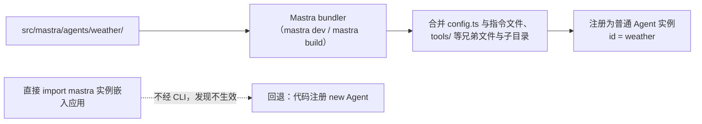

import { Canvas, Controls, Meta } from '@storybook/addon-docs/blocks';
import * as Stories from './file-based-agents.stories';

<Meta of={Stories} name="Docs" />

# 文件式 Agent 与项目组织

在 `src/mastra/agents/<name>/` 下放一个 `config.ts` 和指令文件，这个目录就"是"一个 Agent：目录名即注册 id，Mastra 的 bundler 在 `mastra dev` / `mastra build` 时自动发现、合并并注册成与 `new Agent({ ... })` 等价的普通 Agent 实例。它解决真实项目里多 Agent 定义与注册代码散落的问题——新增一个 Agent 就是新增一个目录，指令、工具、记忆按目录聚合；配套地，`src/mastra/` 的目录分层也是组织多 Agent、多 workflow 项目的约定。

> 成熟度：文件式 Agent 目前为 **Beta**（官方标注：API 稳定前可能在没有大版本升级的情况下出现破坏性变更）。



| 约定 | 默认值 / 规则 | 回查要点 |
| --- | --- | --- |
| 注册 `id` / `name` | 默认 = 目录名（`agents/weather/` → `weather`） | `id` 是稳定路由键；`config.name` 只改显示名 |
| `config.ts` | `export default agentConfig({ ... })`，来自 `@mastra/core/agent` | `model` 是唯一必填字段，缺失构建失败 |
| instructions | 三选一：`instructions.md` / `instructions.ts` / `config.instructions` | 全缺构建失败；动态 config 覆盖文件，静态被文件覆盖 |
| 兄弟文件与子目录 | `tools/`、`skills/`、`memory.ts`、`workspace.ts`、`processors/`、`subagents/` | 与 config 同名多为 config 胜；config 为函数则忽略目录发现 |
| 发现时机 | bundler 在 `mastra dev` / `mastra build` 时扫描 `src/mastra/` | 非 CLI 启动不触发发现，须回退代码注册 |
| 成熟度 | Beta | 升级版本时重点核对 config 字段 |

## 目录即身份：config.ts 与 instructions

一个最小的文件式 Agent 只需要目录、`config.ts` 和一份指令；目录里有更多成员时按固定规则合并。下面先按"身份 → 指令"讲清最小组成。

### config.ts 与 agentConfig()

`config.ts` 是目录的入口文件，`agentConfig()` 接受与 `Agent` 构造器相同的选项（`defaultOptions`、`maxRetries`、`scorers` 等），但 `id`、`name` 可由目录名兜底：

```ts
// src/mastra/agents/weather/config.ts
import { agentConfig } from '@mastra/core/agent';

export default agentConfig({
  model: 'openai/gpt-5.6-sol', // 唯一必填：目录不提供 model 时构建失败
  name: 'Weather',             // 可选显示名；省略时默认 = 目录名 weather
});
```

可观察证据：`mastra dev` 打开的 Studio 里出现的 Agent 显示名为 `Weather`（或省略时的 `weather`），而稳定路由键始终是目录名 `weather`。

### instructions 三选一

指令有三个来源，构建时**至少要有其一**，三者全缺则构建失败：

- `instructions.md`——静态提示词，直接写 Markdown；
- `instructions.ts`——用 TS 计算、组装指令文本；与 `.md` 并存时 `.ts` 胜出；
- `config.instructions`——写在 `agentConfig()` 里；函数形式（动态）会覆盖指令文件，字符串形式（静态）会被指令文件覆盖。

```md
<!-- src/mastra/agents/weather/instructions.md -->
你是天气助手，回答当前天气与预报。
```

```ts
// src/mastra/agents/weather/config.ts（静态 instructions 示例）
export default agentConfig({
  model: 'openai/gpt-5.6-sol',
  instructions: '你是天气助手。', // 静态字符串：与 instructions.md 并存时会被文件覆盖
});
```

边界：与 instructions 不同，`config.memory` 与 `memory.ts` 全缺不报错——没有配置就是没有记忆；`workspace` 同理。另外文件式 subagents 要求 config 提供非空 `description`，父代理靠它做委派路由。

## 子目录扩展与合并

目录里还可以放 `tools/`（每个工具一个模块）、`skills/`（按需加载的技能）、`memory.ts`、`workspace.ts`、`processors/`（输入输出处理管线）、`subagents/`（每个子代理一个子目录）。bundler 会把"文件发现"与"config 声明"合并成最终 Agent，规则用下面的实例直接验证：切换控件，看目录树标注与右侧注册结果如何联动。

<Canvas of={Stories.Interactive} />
<Controls of={Stories.Interactive} />

| 读者操作 | 可观察证据 |
| --- | --- |
| 「instructions 来源」切到"全缺" | 右栏变构建失败卡片：三选一全缺即失败 |
| 切到"md + config 静态 / 动态" | 读数显示覆盖关系：动态 config 胜出，静态让位文件 |
| 「tools 组成」切到"目录 + config 同名覆盖" | 工具名单合并，同名项取 config 版 |
| 切到"config.tools 函数" | `tools/` 目录标为被忽略，只剩函数结果 |

合并优先级速查（依据官方 config 参考页）：

| 域 | 组合 | 胜出方 |
| --- | --- | --- |
| instructions | 动态 config vs 指令文件 | 动态 config |
| instructions | 静态 config vs 指令文件 | 指令文件 |
| instructions | `instructions.ts` vs `instructions.md` | `.ts` |
| tools / skills | config 对象 vs 目录 | 双方合并，同名键 config 胜 |
| tools / skills | config 函数 vs 目录 | 仅取函数结果，目录发现被忽略 |
| memory / workspace | config vs `memory.ts` / `workspace.ts` | config |

## 发现机制与运行时

发现由 bundler 完成：`mastra dev` / `mastra build` 时扫描 `src/mastra/` 下的 agent 目录，读取 TS/JS 模块、Markdown 指令与 skills，复制 workspace 种子文件并注册原语。策略保守——符号链接、测试文件与非 agent 目录会被跳过。

发现之后运行的就是普通 `Agent` 实例：从 Agent API、Studio、workflow 还是应用代码调用，行为一致。反过来，**不经 CLI 启动就没有发现**：把 mastra 实例直接 import 嵌入应用时，`agents/` 目录不会生效，须回退代码注册：

```ts
// 嵌入应用（不走 mastra dev / mastra build）时的等价写法
import { Agent } from '@mastra/core/agent';
import { weatherTools } from './tools';

export const weather = new Agent({
  name: 'weather',
  model: 'openai/gpt-5.6-sol',
  instructions: '你是天气助手，回答当前天气与预报。',
  tools: weatherTools,
});
```

## 多 Agent 项目的目录组织

真实项目按"共享层 + 每单元一目录"分层，让文件式约定承担注册职责：

- `src/mastra/index.ts`——创建并导出 mastra 实例（注册 workflows 等原语）；
- `src/mastra/agents/<name>/`——每个 Agent 一个目录，自带 config 与指令；Agent 专属工具放目录内 `tools/`；
- `src/mastra/tools/`、`src/mastra/workflows/`——跨 Agent 共享的工具与各 workflow 的定义；
- 编码场景可直接用 `createCodingAgent()` 工厂生成配套编码代理，机制见 [Agent Controller](?path=/docs/agent-controller--docs)。

取舍：目录内 `tools/` 适合只服务该 Agent 的动作；被多个 Agent 复用的工具提到共享层，避免同名工具在多个目录里重复维护。

## 常见问题

- 直接在应用里 import mastra 实例后，`agents/` 目录里的 Agent 不存在。
  文件式发现只发生在 `mastra dev` / `mastra build` 的 bundler 流程；嵌入场景改用 `new Agent({ ... })` 代码注册，或让应用改走 CLI 产物。
- 构建失败，提示缺少 instructions。
  在 `instructions.md`、`instructions.ts`、`config.instructions` 三者中补齐任意一个；只写 `model` 不够。
- 同名工具或技能的行为和预期不一致。
  检查 config 与目录的同名冲突：对象式 config 同名键胜出；函数式 config 直接忽略目录发现。

## 总结回顾

摘要：

文件式 Agent 把 `src/mastra/agents/<name>/` 目录当作身份单元：目录名即注册 id，`config.ts`（`agentConfig()`）提供 `model` 与运行时选项；指令从 `instructions.md` / `instructions.ts` / `config.instructions` 三选一，全缺构建失败。`tools/`、`skills/`、`memory.ts` 等兄弟文件与 config 按固定优先级合并——动态 config 覆盖文件、静态被文件覆盖、对象式同名 config 胜、函数式忽略目录。bundler 在 `mastra dev` / `mastra build` 时完成发现与组装，产物就是普通 Agent 实例；不经 CLI 启动的嵌入场景须回退 `new Agent({ ... })` 代码注册。

一句话：

> 目录即 Agent：命名靠目录名、组装靠 bundler、兜底靠代码注册。

知识要点：

- 注册 id 由什么决定？`config.name` 改的又是什么？
- instructions 三个来源的优先级顺序是什么？全缺会怎样？
- `tools/` 目录与 `config.tools` 同名时谁胜？config 写成函数呢？
- 哪种启动方式不会触发文件式发现？此时应该怎么办？

## 参考资料

- [File-based Agent config.ts 参考（选项、兄弟文件约定、优先级表与发现机制）](https://mastra.ai/reference/file-based-agents/config)

