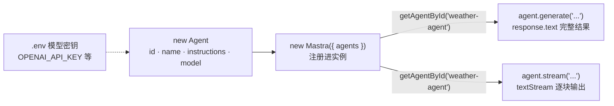

import { Canvas, Controls, Meta } from '@storybook/addon-docs/blocks';
import * as FirstAgent from './first-agent.stories';

<Meta of={FirstAgent} name="Docs" />

# 第一个 Agent

Agent 是 Mastra 的核心原语：把一段 instructions（系统提示词）和一个 model 绑成可注册、可复用的推理单元。定义它只需要一个对象——`new Agent({ id, name, instructions, model })`，不需要安装任何厂商 SDK 包；注册进 `Mastra` 实例后，用 `generate` 拿完整回复，或用 `stream` 边生成边读。本课沿最小路径走完第一次对话：定义 agent → 写好 instructions → 注册 → 跑通 generate / stream。

读完本课，你能写出并跑通第一个 agent，还能预测「instructions 写得含糊还是明确」「挂不挂工具」分别会把行为带向哪里——下面的实例把这种预测做成了可切换的配置卡。



| 项 | 值（回查用） |
| --- | --- |
| 导入 | `import { Agent } from '@mastra/core/agent'` |
| 最小构造字段 | `id`（唯一标识）、`name`（显示名）、`instructions`（系统提示词）、`model`（模型字符串） |
| instructions | 系统级提示词：定义 agent 的行为、人格与能力边界，每轮对话都会注入 |
| model | `provider/model` 两段式字符串，如 `openai/gpt-5.6-sol`（解析规则见「模型接入」） |
| 注册 | `new Mastra({ agents: { weatherAgent } })`，对象键名即注册 key |
| 取用 | `mastra.getAgentById('weather-agent')` 按 id（官方推荐）；`mastra.getAgent('weatherAgent')` 按注册 key |
| 一次性运行 | `await agent.generate(prompt)` → `response.text` |
| 流式运行 | `await agent.stream(prompt)` → `for await (const chunk of stream.textStream)` |
| 挂工具 | `tools: { weatherTool }`，工具必须用 `createTool()` 定义（见「工具」） |

## 定义 Agent

`Agent` 类来自 `@mastra/core/agent`。构造一个 Agent 不发起网络请求，也不需要安装厂商 SDK 包——`model` 字符串由 model router 解析，API key 从环境变量读取（前置配置见「模型接入」，`?path=/docs/model-access--docs`）。最小可用的 agent 只需要四个字段：

```ts
import { Agent } from '@mastra/core/agent';

export const weatherAgent = new Agent({
  id: 'weather-agent',
  name: 'Weather Agent',
  instructions: 'You are a helpful assistant.',
  model: 'openai/gpt-5.6-sol',
});
```

| 字段 | 作用 | 回查要点 |
| --- | --- | --- |
| `id` | agent 的唯一标识 | 之后用 `mastra.getAgentById('weather-agent')` 取回 |
| `name` | 显示名 | 出现在 Studio 与日志中，便于人读 |
| `instructions` | 系统提示词 | 决定行为、语气与能力边界，见下一小节 |
| `model` | 模型字符串 | 两段式 `provider/model`；写成冒号 `openai:model` 不被识别 |

### instructions：系统提示词

instructions 是注入每轮对话开头的系统级提示词，建立 agent 的核心身份与专长——行为、人格、能力边界都由它定义。它也是行为可控性的关键：只写一句抽象的 "You are a helpful assistant."，模型只能按默认方式发挥；把角色、规则、输出要求写清楚，输出才可预期。

官方示例采用「角色一句 + 规则列表 + 工具指令」的多段结构。可以照抄的三段式写法——角色（你是谁）、规则（怎么做事、何时不做）、输出要求（结果长什么样）：

```ts
export const weatherAgent = new Agent({
  id: 'weather-agent',
  name: 'Weather Agent',
  instructions: `
你是 Weather Agent，负责查询并解读天气。

规则：
- 用户提到城市时，先调用 get-weather 工具获取实时数据，不凭记忆猜测
- 数据缺失时明确说明，不编造数值
- 回答保持简洁

输出要求：
- 先给一句结论，再列温度、体感与出行建议
- 不确定时如实说「我不确定」
`,
  model: 'openai/gpt-5.6-sol',
  // tools: { weatherTool },  ← 工具的定义与挂载见「工具」课程
});
```

三段式写到什么程度、挂不挂工具、选哪种运行方式——对行为的影响可以在下面的配置卡里对照。切换控件，读数给出对应的预测：

<Canvas of={FirstAgent.Interactive} />
<Controls of={FirstAgent.Interactive} />

| 读者操作 | 可观察证据 |
| --- | --- |
| 切换「instructions 明确度」 | 配置卡的 instructions 区在抽象一句与三段结构间切换，底部提示与「预测行为」读数同步变化 |
| 切换「挂载 get-weather 工具」 | 执行流程出现或消失工具调用回路，「工具调用」读数同步变化 |
| 切换「运行方式」 | 响应区在完整结果条与逐块输出块之间切换 |
| 打开 Show code | 看到 Canvas 实际执行的 `agent-config-flow.ts` |

边界：实例是离线示意，不调用真实 LLM——读数是「结构决定行为」的预测，真实效果以 Studio 实测为准（见「用 Studio 调试」，`?path=/docs/studio--docs`）。instructions 在构造时写死；需要按用户或请求动态生成的场景用动态 instructions，见「上下文工程」（`?path=/docs/context-engineering--docs`）。

## 注册进 Mastra 实例

Agent 定义在单独文件里，注册进 `Mastra` 实例后才接入框架的共享能力（存储、日志、agent 注册表）。注册方式是把导出的 agent 放进 `agents` 对象，键名即注册 key：

```ts
import { Mastra } from '@mastra/core';
import { weatherAgent } from './agents/weather-agent';

export const mastra = new Mastra({
  agents: { weatherAgent },
});
```

注册后有两种取用方式：

| 取用方式 | 代码 | 说明 |
| --- | --- | --- |
| 按 id（官方推荐） | `mastra.getAgentById('weather-agent')` | 与构造字段的 `id` 对应；保证拿到实例级共享服务（存储、日志、注册表） |
| 按注册 key | `mastra.getAgent('weatherAgent')` | 与 `agents` 对象的键名对应 |

边界：直接 `import { weatherAgent }` 调用也能跑通对话，但拿不到实例注入的共享服务；凡是要接存储、日志、记忆等框架能力的场景，统一走 `mastra.getAgentById()` 取用。

## 运行：generate 与 stream

两种方式都接收一个 prompt 字符串，都会完整走完 agent 的推理循环（包括工具调用）；区别只在结果怎么交付。

### generate：拿完整结果

`generate` 在所有工具调用与步骤完成后返回完整结果，适合脚本、批处理等一次性消费场景：

```ts
const agent = mastra.getAgentById('weather-agent');

const response = await agent.generate('东京现在天气如何？');
console.log(response.text);
```

响应对象的关键字段：

| 字段 | 内容 |
| --- | --- |
| `text` | 最终文本回复 |
| `toolCalls` | 过程中发起的工具调用 |
| `toolResults` | 工具返回的结果 |
| `steps` | 逐步执行记录 |
| `usage` | token 用量统计 |

### stream：边生成边读

`stream` 在 token 到达时即可消费，`textStream` 只吐文本增量，适合 CLI 与聊天界面的打字机效果：

```ts
const agent = mastra.getAgentById('weather-agent');

const stream = await agent.stream('东京现在天气如何？');

for await (const chunk of stream.textStream) {
  process.stdout.write(chunk);
}
```

回查三点：`toolCalls` / `toolResults` / `steps` / `usage` 以 Promise 形式提供，流结束后兑现；除 `textStream` 外还有包含文本片段与工具事件的完整事件流 `fullStream`，见「流式输出」（`?path=/docs/streaming--docs`）。选型判断：要整体结果用 `generate`，要即时反馈用 `stream`——回到上面实例切「运行方式」，响应区直接对照两种形态。

## Agent 还是 workflow

Agent 适合开放式任务：步骤事先定不下来，由模型自己决定调哪些工具、循环几轮、何时收尾（比如「帮我规划今天的行程」）。步骤固定、控制流明确的多步流程（比如「取数 → 计算 → 发邮件」）用 workflow 确定性编排，不交给模型自由发挥。

| 任务形态 | 选择 |
| --- | --- |
| 开放式，步骤无法预先确定 | Agent（本课） |
| 预定义的多步流程，需要显式控制流 | workflow |

判断框架与混合用法（在 workflow 步骤里调 agent）见「Agent 还是工作流」（`?path=/docs/agent-or-workflow--docs`）。

## 最佳实践

- **先锁行为，再加能力**：把 instructions 的行为与输出格式调稳（在 Studio 里实测基线），确认可用后再挂工具、接记忆——出了问题才分得清是提示词还是新能力引入的。
- **工具使用策略写进规则**：「提到城市就先调 get-weather」这类指令要显式写进 instructions 的规则段，比指望模型自觉调用可靠。
- **取用统一走 `getAgentById`**：让 agent 拿到实例级存储与日志，避免「直连能跑但记忆、日志不生效」的隐性分叉。

## 常见问题

- 挂了工具，agent 从不调用，也不报任何错。
  工具必须是 `createTool()` 定义的实例——普通对象字面量会静默失败（不执行、不报错）。逐项检查 `tools: { ... }` 里每个工具的来源，定义方式见「工具」（`?path=/docs/tools--docs`）。
- `model` 写成 `openai:gpt-5.6-sol`（冒号）后请求失败。
  model router 只认斜杠分段：`openai/gpt-5.6-sol`，也不要传 provider 对象。字符串规则见「模型接入」（`?path=/docs/model-access--docs`）。
- 直接 import agent 文件也能调用成功，但存储、日志不生效。
  绕过了 Mastra 实例：改为 `mastra.getAgentById('weather-agent')` 取用，只有实例注册的 agent 才共享存储、日志与注册表。

## 总结回顾

摘要：

本课把第一次对话拆成四步：用 `new Agent({ id, name, instructions, model })` 定义推理单元，构造时不发请求、不装厂商包；instructions 作为系统提示词按「角色 + 规则 + 输出要求」三段式书写，决定行为与输出格式的可控性；注册进 `new Mastra({ agents })` 后用 `getAgentById` 取用，才能共享实例级存储与日志；`generate` 在推理循环结束后返回完整结果（`response.text` 与 toolCalls / toolResults / steps / usage），`stream` 通过 `textStream` 边生成边读。开放任务交给 agent 自主推理，固定步骤的编排交给 workflow。

一句话：

> Agent = instructions（系统提示词）+ model（`provider/model` 字符串），注册进 Mastra 实例后 generate 拿全量、stream 拿增量。

知识要点：

- `new Agent` 的四个基本字段各是什么？`id` 与 `name` 的区别是什么？
- instructions 为什么决定行为可控性？三段式怎么写？
- 注册 key 与 agent id 分别对应哪个取用方法？为什么官方推荐 `getAgentById`？
- `generate` 与 `stream` 各适合什么场景？各自的响应结构里有什么？
- 哪种工具定义方式会静默失败？如何避免？

## 参考资料

- [Agents Overview（Agent 概览）](https://mastra.ai/docs/agents/overview)
- [Agent 类参考（Agent Class Reference）](https://mastra.ai/reference/agents/agent)
- [Create an Agent（Learn）](https://mastra.ai/learn/create-an-agent)
