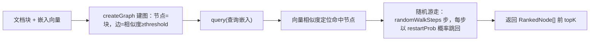

import { Canvas, Controls, Meta } from '@storybook/addon-docs/blocks';
import * as Stories from './graph-rag.stories';

<Meta of={Stories} name="Docs" />

# GraphRAG

GraphRAG 是 Mastra RAG 中处理「跨文档关联」的检索层：把每个文档块当作图的节点，语义相似度达到 threshold 的块之间连边；查询时先用查询向量定位命中节点，再从命中节点出发做带重启的随机游走，把多跳邻居一并纳入结果。普通向量检索（见 [检索与重排](?path=/docs/retrieval-and-rerank--docs)）回答「哪一段与问题最像」，GraphRAG 回答「与命中段落语义相连的整个邻域有什么」。



## API 回查表

| API / 参数 | 默认值 | 说明 |
| --- | --- | --- |
| `new GraphRAG(dimension, threshold)` | 1536 / 0.7 | dimension 对齐嵌入模型维度；threshold 为建边相似度阈值，越高图越稀疏 |
| `createGraph(chunks, embeddings)` | — | 块与向量按下标配对建图，两两比较，复杂度 O(n²) |
| `query({ query })` | — | query 是查询文本的嵌入向量（number[]），不是原文 |
| `topK` | 10 | 返回的节点数 |
| `randomWalkSteps` | 100 | 每次查询的随机游走步数 |
| `restartProb` | 0.15 | 每步跳回命中节点的概率 |
| `serialize()` / `GraphRAG.deserialize()` | — | 图快照导出与恢复 |
| `createGraphRagTool()` | — | 官方现成工具，把 GraphRAG 封装为 agent 工具 |

## 建图：threshold 决定邻域密度

`new GraphRAG(dimension, threshold)` 创建空图，`createGraph(chunks, embeddings)` 把块与向量按顺序配对：每对块之间计算相似度，达到 threshold 就连边。dimension 必须与嵌入模型输出维度一致（如 1536）；threshold 越高图越稀疏，0.8 就比 0.7 严格——只有语义非常接近的块才连边。

```ts
import { GraphRAG } from '@mastra/rag';

const graphRag = new GraphRAG(1536, 0.7);
graphRag.createGraph(chunks, embeddings); // chunks 与 embeddings 按下标一一对应
```

下面的离线示意把「建图 + 随机游走」压缩到一张手工构造的小图上：三个语义簇由桥接节点相连，橙色双圈是向量相似度命中的节点，游走沿边扩散，青色外环是最终进入 topK 的选中集合。

<Canvas of={Stories.Interactive} />
<Controls of={Stories.Interactive} />

| 读者操作 | 可观察证据 |
| --- | --- |
| 调大「游走步数」 | 蓝色游走痕迹变粗变密，远端簇也被染上热度 |
| 调大「重启概率」 | 游走收敛回命中节点附近，桥接节点更难被选中 |
| 调大「返回数量 topK」 | 青色外环扩大到更多边缘节点 |

## 检索：随机游走的三个参数

`query` 接收一个对象：`query` 是查询文本的嵌入向量（GraphRAG 不收原文，嵌入需先用嵌入模型生成）；`topK` 控制返回条数；`randomWalkSteps` 控制游走步数，步数越多探索越远；`restartProb` 控制每步以多大概率跳回命中节点，越大越贴近命中邻域。返回 `RankedNode[]`，每个节点带 `id`、`content`、`metadata` 和图遍历综合得分 `score`。

```ts
const results = await graphRag.query({
  query: queryEmbedding, // 查询文本的嵌入向量，需先用嵌入模型生成
  topK: 5,
  randomWalkSteps: 200,
  restartProb: 0.2,
});
// results: { id, content, metadata, score }[]
```

边界：随机游走有随机性，同一输入多次查询的 score 与排序可能有细微差异；得分排在 topK 之外的节点不会返回，即使它们与命中节点相连。

## 持久化：快照复用避免 O(n²) 重建

`serialize()` 返回深拷贝快照 `GraphRAGSnapshot`，含 `version`、`dimension`、`threshold`、带完整嵌入的 `nodes` 和 `edges`；`JSON.stringify` 存盘后用静态方法 `GraphRAG.deserialize(snapshot)` 原样恢复。建图要两两比较全部块（O(n²)），所以官方模式是「有快照就加载，没有才重建并落盘」：1000 个块、1536 维的快照约 20 MB JSON。快照不支持增量更新，文档集合变化后要整体重建并重新落盘。

```ts
import { readFile, writeFile } from 'node:fs/promises';
import { GraphRAG, type GraphRAGSnapshot } from '@mastra/rag';

async function loadOrBuildGraph(chunks, embeddings) {
  const file = 'graph-rag.snapshot.json';
  try {
    return GraphRAG.deserialize(JSON.parse(await readFile(file, 'utf8')) as GraphRAGSnapshot);
  } catch {
    const graph = new GraphRAG(1536, 0.7);
    graph.createGraph(chunks, embeddings);
    await writeFile(file, JSON.stringify(graph.serialize()));
    return graph;
  }
}
```

## 适用边界与现成工具

- **适合：** 答案分散在多个文档块、需要顺着「块 A 提到 X → 块 B 展开 X」多跳推理的关联问题；命中段落的直接向量邻居未必排在相似度前列，但语义上确实相连。
- **不适合：** 答案集中在单个文档块的简单事实检索——普通向量查询更便宜也更稳定（见 [检索与重排](?path=/docs/retrieval-and-rerank--docs)）。
- **不想手写管线：** 官方提供现成的 `createGraphRagTool()`，把 GraphRAG 封装成可直接挂到 agent 上的检索工具。

## 最佳实践

- 快照先行：进程启动时 `deserialize` 一次并常驻内存，所有请求共用；只有文档集合变化时才重建并重新落盘。
- threshold 与游走参数联动：threshold 调高图变稀疏，同样步数的可达范围变小，需要加大 `randomWalkSteps` 或调低 `restartProb` 补偿。
- 多跳问题宁可放大 `topK` 换覆盖，再靠 `score` 排序截断，而不是一开始就压小返回数。

## 常见问题

- 检索结果比预期少，远端相关块总是缺席。
  先确认 `threshold` 是否调得过高导致图稀疏、桥接边消失；再调大 `randomWalkSteps` 或调低 `restartProb`，观察游走能否到达远端簇（对应上方示意中的桥接节点 N9）。
- 每个请求都重建图，接口明显变慢。
  建图是 O(n²)，不该出现在请求路径上；按「持久化」一节的快照模式改为启动时加载，请求时只做 `query`。

## 总结回顾

摘要：

GraphRAG 把文档块组织成「节点 + 相似度边」的图，查询时先用查询嵌入定位命中节点，再以 `randomWalkSteps` 和 `restartProb` 控制的随机游走把多跳邻居纳入结果，返回带综合得分 `score` 的 `RankedNode[]`。`threshold` 决定图的密度，建图 O(n²) 的代价通过 `serialize` / `deserialize` 快照复用摊销，快照不增量、文档变更需重建。它适合跨文档多跳关联问题；简单事实检索应退回普通向量检索。

一句话：

> GraphRAG 的价值在「顺藤摸瓜」：向量命中是藤头，随机游走把语义相连的多跳邻域拉进结果。

知识要点：

- `new GraphRAG(dimension, threshold)` 两个参数各控制什么，默认值是多少？
- `query()` 接收什么，`topK`、`randomWalkSteps`、`restartProb` 的默认值分别是什么？
- 为什么建图要用快照复用，快照在什么情况下必须重建？
- 什么问题该用 GraphRAG，什么问题该退回普通向量检索？

## 参考资料

- [GraphRAG API Reference](https://mastra.ai/reference/rag/graph-rag)
