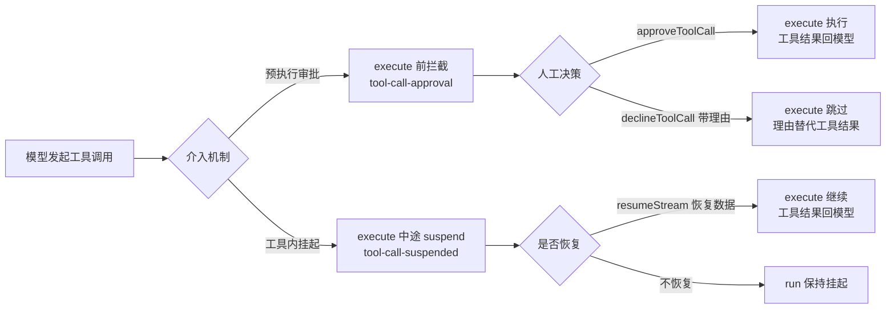

import { Canvas, Controls, Meta } from '@storybook/addon-docs/blocks';
import * as Stories from './human-in-the-loop.stories';

<Meta of={Stories} name="Docs" />

# 工具审批与挂起

Agent 的工具可能删除数据、转账、发邮件——模型一句话就会触发。人工介入（Human-in-the-Loop，HITL）让这类调用先停下来，等人的决定再继续。Mastra 在 Agent 层提供两种机制：**预执行审批**在工具 `execute` 之前整段拦截，用 `approveToolCall` / `declineToolCall` 恢复；**工具内挂起**由工具在 `execute` 运行中调用 `suspend()`，用 `resumeStream()` 带上恢复数据继续。

两种机制都把挂起状态以快照形式写入 storage：Mastra 实例必须配置 storage，否则恢复时报 `snapshot not found`；进程重启后快照是否还在，也取决于 storage 是否持久化。

边界：本课只讲 Agent 侧的工具审批与挂起。工作流步骤的人工介入（suspend 载荷、resume 提交决策、bail 提前退出）在工作流人工介入一课：`?path=/docs/workflow-human-in-the-loop--docs`；`createTool` 的基础定义见工具课：`?path=/docs/tools--docs`。



两种机制的关键输入与恢复 API（默认都不拦截，需要显式开启）：

| 机制 | 触发配置 | 流上事件 | 恢复方式 | generate 变体 |
| --- | --- | --- | --- | --- |
| 预执行审批 | 工具级 `requireApproval: true`；调用级 `requireToolApproval: true`（可传函数） | `tool-call-approval` | `approveToolCall({ runId })` / `declineToolCall({ runId, reason? })` | `approveToolCallGenerate` / `declineToolCallGenerate` |
| 工具内挂起 | execute 内 `await suspend(payload)`，配 `suspendSchema` / `resumeSchema` | `tool-call-suspended` | `resumeStream(resumeData, { runId })` | `resumeGenerate` |

## 预执行审批

在工具 `execute` 之前把整次调用拦下来：流上出现 `tool-call-approval` 事件，携带 `toolCallId`、`toolName`、`args`；`generate()` 则立即返回，`finishReason` 为 `suspended`，附带 `suspendPayload` 与 `runId`。两个开关是 **OR 关系**——任一为 `true` 就暂停：

- **工具级** `requireApproval: true`：写在 `createTool()` 定义里，只拦这一个工具；
- **调用级** `requireToolApproval: true`：写在 `agent.stream()` / `generate()` 选项里，拦本次请求的所有工具调用。

### 开关与条件函数

```ts
import { createTool } from '@mastra/core/tools';
import { z } from 'zod';

const deleteRecord = createTool({
  id: 'delete-record',
  description: '按 ID 删除一条记录',
  inputSchema: z.object({ id: z.string() }),
  outputSchema: z.object({ deleted: z.boolean() }),
  requireApproval: true, // 工具级开关：只拦 delete-record
  execute: async ({ id }) => ({ deleted: true }),
});
```

```ts
// 调用级开关：本次请求的所有工具调用都要审批
const stream = await agent.stream('删除记录 rec_42', {
  requireToolApproval: true,
});

// 也可以传函数，按工具名 / 参数决定拦谁：
const filtered = await agent.stream(prompt, {
  requireToolApproval: ({ toolName }) => /^delete_/.test(toolName),
});
```

条件函数的边界：

- 函数收到 `toolName`、`args`、`requestContext`、`workspace`，返回 `true` 即暂停，可以是异步函数；
- 函数抛错时按「需要审批」处理（fail closed）；
- 工具级布尔 `true` 强制审批；工具级 `false` 不会关掉调用级审批；工具级 `requireApproval` 是函数时，以函数结果为准；
- durable / stored agent 的选项要随快照持久化，只接受布尔值——传函数会退化为「每个调用都要求审批」。

### 批准与拒绝

```ts
const runId = stream.runId; // 挂起 run 的标识

// 批准：execute 正常执行，恢复后的输出从返回的流里读
const approved = await agent.approveToolCall({ runId });
for await (const chunk of approved.textStream) {
  process.stdout.write(chunk);
}

// 拒绝：execute 不执行，reason 替代工具结果回传给模型
await agent.declineToolCall({
  runId,
  reason: '只能删除当前用户自己的记录，请换成本人 ID',
});
```

- 四个恢复方法都接受可选 `toolCallId`，省略时作用于「最近一次挂起的工具调用」；
- `generate()` 路线用 `approveToolCallGenerate({ runId, toolCallId })` / `declineToolCallGenerate({ runId, toolCallId })`，`runId` 与 `toolCallId` 从返回值的 `runId` 与 `suspendPayload` 中取；
- 等价动作：也可以用 `resumeStream({ approved: true }, { runId })` 响应审批型挂起。

切换下面的机制与决策，观察两条链路上 execute 的结局和模型的反馈：

<Canvas of={Stories.Interactive} />
<Controls of={Stories.Interactive} />

| 读者操作 | 可观察证据 |
| --- | --- |
| 机制选「预执行审批」、决策选「批准」 | execute 已执行，模型收到工具结果 |
| 决策改「拒绝」 | execute 跳过，模型收到的是拒绝理由（读数第 3 行） |
| 机制切「工具内挂起」再批准 | 挂起点移到 execute 运行中，恢复走 `resumeStream`，执行仍完成 |
| 机制「工具内挂起」+ 决策「拒绝」 | 挂起没有拒绝原语：run 保持挂起，模型暂无结果 |

### 拒绝理由与参数指纹

`declineToolCall` / `declineToolCallGenerate`（流式场景另有 `declineNetworkToolCall`）都接受可选的 `reason`：它替代工具结果回传给模型，并写入该工具调用的 `approval` 元数据；不传时默认为 "Tool call was not approved by the user."。

审批绑定的是「展示给审批人时的参数」。若担心批准之后参数被换（模型重试、并发修改），在执行前核对参数指纹：

```ts
// 示意：在 agent 的 beforeToolCall 钩子中核对指纹
hooks: {
  beforeToolCall: async ({ toolName, input }) => {
    const fingerprint = actionFingerprint(toolName, input); // 生产环境用稳定哈希
    if (!approvedFingerprints.has(fingerprint)) {
      return { proceed: false, output: '参数与批准时不一致，已拦截' };
    }
    approvedFingerprints.delete(fingerprint); // 批准一次性消费
    return { proceed: true };
  },
},
```

生产环境把批准过的指纹存入持久存储，按 user、run、tool call、策略版本分域；批准只对完全相同的参数生效一次。

## 工具内挂起

工具在 `execute` 运行中自己决定「缺信息，先挂起」：`execute` 的 `context.agent` 暴露 `suspend` 与 `resumeData`。挂起时发给前端的载荷由 `suspendSchema` 约定，恢复时必须提供的数据由 `resumeSchema` 约定；流上事件是 `tool-call-suspended`。

```ts
// 同一条删除工具，改用工具内挂起实现确认
const deleteRecord = createTool({
  id: 'delete-record',
  inputSchema: z.object({ id: z.string() }),
  suspendSchema: z.object({ question: z.string() }), // 挂起时发给前端的载荷
  resumeSchema: z.object({ confirmed: z.boolean() }), // 恢复时必须提供的数据
  execute: async ({ id }, context) => {
    const { resumeData: { confirmed } = {}, suspend } = context?.agent ?? {};
    if (!confirmed) {
      // suspend() 不抛错：调用后立即 return
      return await suspend({ question: `确认删除 ${id} 吗？` });
    }
    return { deleted: true };
  },
});
```

```ts
// 恢复数据必须匹配工具的 resumeSchema
const resumed = await agent.resumeStream({ confirmed: true }, { runId });
for await (const chunk of resumed.textStream) {
  process.stdout.write(chunk);
}
```

关键细节：

- `suspend()` 不抛错、不会中断函数——调用后立即 `return`，写在它后面的代码仍会先执行完；
- `generate()` 对应 `agent.resumeGenerate(resumeData, { runId })`；
- 审批型挂起与挂起型挂起按流事件区分：`tool-call-approval` 走批准 / 拒绝，`tool-call-suspended` 走带数据的 `resumeStream`。

### 重启后恢复与自动恢复

```ts
import { Mastra } from '@mastra/core';
import { LibSQLStore } from '@mastra/libsql';

export const mastra = new Mastra({
  agents: { assistant },
  // HITL 快照写在这里；缺省的内存实现重启即丢
  storage: new LibSQLStore({ url: 'file:./mastra.db' }),
});
```

快照只保留恢复所需的最小状态，run 结束后即删除；完整执行记录用 tracing，对话历史用 memory。进程重启后先找回挂起的 run：

```ts
const { runs } = await agent.listSuspendedRuns({ threadId, resourceId });
for (const run of runs) {
  for (const toolCall of run.toolCalls) {
    if (toolCall.requiresApproval) {
      // 审批型：显式批准或拒绝
      await agent.approveToolCall({ runId: run.runId, toolCallId: toolCall.toolCallId });
    } else {
      // 挂起型：按 toolCall.suspendPayload 构造恢复数据
      await agent.resumeStream({ confirmed: true }, { runId: run.runId });
    }
  }
}
```

每条 `toolCalls[]` 含 `toolCallId`、`toolName`、`args`、`requiresApproval` 与 `suspendPayload`（描述工具要什么）。同一能力也暴露为 HTTP `GET /agents/:agentId/suspended-runs` 与 client SDK 的 `agent.listSuspendedRuns()`。对话式场景可以让下一轮用户消息自动恢复：

```ts
const agent = new Agent({
  name: 'assistant',
  model: 'openai/gpt-4o-mini',
  instructions: '一个会调用敏感工具的助手',
  tools: { deleteRecord },
  memory, // 自动恢复要求配置 Memory，且 thread / resourceId 与挂起时一致
  defaultOptions: {
    autoResumeSuspendedTools: true, // 下一条用户消息自动按 resumeSchema 恢复挂起工具
  },
});
```

- `autoResumeSuspendedTools` 只恢复 `suspend()` 型工具，并要求已配置 Memory、thread / resourceId 一致、工具定义了 `resumeSchema`；
- 它**不会**自动批准 `requireApproval` 工具——审批必须显式 `approveToolCall()` / `declineToolCall()`（或等价 UI / API 动作）；
- 手动恢复适合按钮、webhook；自动恢复适合连续对话流。

## 最佳实践

- **按决策形态选机制**：只存在「做 / 不做」的取舍用预执行审批，它有 `declineToolCall(reason)` 原语；`execute` 需要向人要额外输入（确认、地址、验证码）用工具内挂起，把要什么写进 `suspendSchema`、把给什么写进 `resumeSchema`。
- **storage 是硬前提**：生产环境用持久化实现（如 LibSQLStore）；内存实现重启即丢快照，挂起的 run 找不回来。
- **高危工具加指纹核对**：`requireApproval` 拦截 + `beforeToolCall` 指纹校验，防批准后参数被换；用分类器做条件审批时只发送参数名、不发参数值（state 会交给评估模型）。
- **supervisor 场景**：子代理的审批请求会沿委派链冒泡到 supervisor 的流上，在 supervisor 层统一批准 / 拒绝即可；细节见子代理与监督者课：`?path=/docs/subagents--docs`。

## 常见问题

- 恢复时报 `snapshot not found`
  给 Mastra 实例配置 storage，并确认挂起与恢复用的是同一个实例；默认的内存实现不跨进程存活。
- 调了 `suspend()`，工具后面的逻辑还是执行完了
  `suspend()` 不抛错也不中断函数，调用后立即 `return`，不要再写代码。
- durable agent 上传了函数形式的 `requireToolApproval`，结果所有调用都要求审批
  durable / stored agent 的选项要持久化，只支持布尔；条件函数只在普通 `stream()` / `generate()` 上生效。
- 开了 `autoResumeSuspendedTools`，`requireApproval` 工具却没被自动批准
  自动恢复只覆盖 `suspend()` 型工具；审批型必须显式批准或拒绝。

## 总结回顾

摘要：

Agent 的人工介入有两种机制。预执行审批由工具级 `requireApproval` 或调用级 `requireToolApproval`（OR 关系，可传条件函数）在 `execute` 之前拦截，流上出现 `tool-call-approval`，用 `approveToolCall` 批准、`declineToolCall(reason)` 拒绝并把理由回传给模型；工具内挂起由工具在 `execute` 中调用 `suspend()`，挂起载荷与恢复数据分别由 `suspendSchema` / `resumeSchema` 约定，用 `resumeStream` 恢复。两种机制的快照都写入 storage——不配置就报 `snapshot not found`；重启后用 `listSuspendedRuns` 找回挂起的 run，`autoResumeSuspendedTools` 可在对话中自动恢复挂起型工具（不含审批型）。

一句话：

> 审批拦在 execute 之前、拒绝有理由原语；挂起停在 execute 之中、恢复要带数据——两者都靠 storage 里的快照活过重启。

知识要点：

- 两个审批开关分别写在哪里？相遇时按什么规则合并？
- 批准与拒绝之后，模型分别收到什么？
- `suspend()` 为什么要立即 `return`？`suspendSchema` 与 `resumeSchema` 各约束什么？
- 进程重启后如何找回挂起的 run？`autoResumeSuspendedTools` 能自动批准 `requireApproval` 工具吗？

## 参考资料

- [Human-in-the-Loop（Mastra Docs – Agents）](https://mastra.ai/docs/agents/human-in-the-loop)
