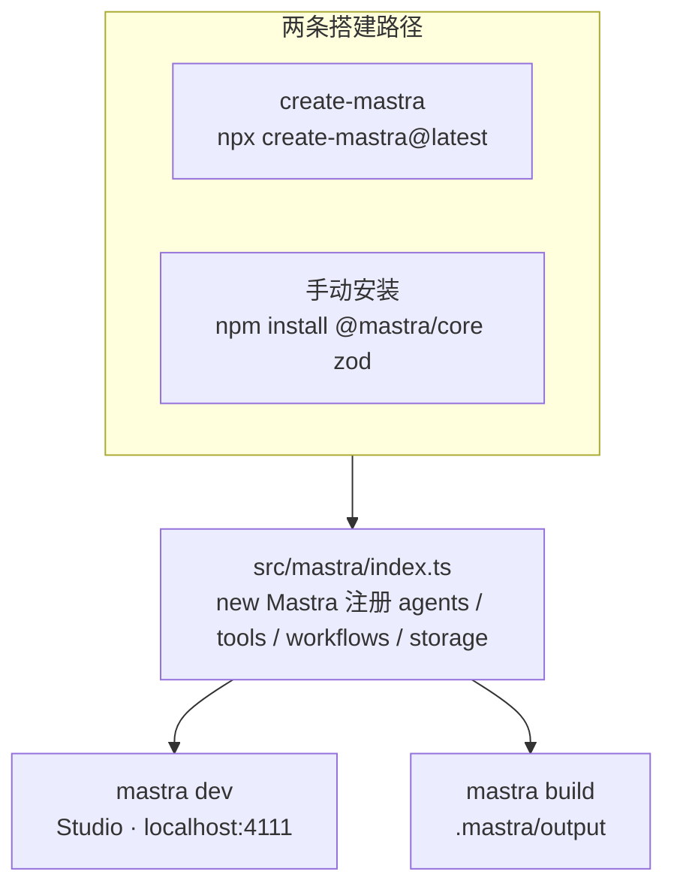

import { Canvas, Controls, Meta } from '@storybook/addon-docs/blocks';
import * as Installation from './installation.stories';

<Meta of={Installation} name="Docs" />

# 安装与项目结构

本课把一个空目录变成能跑 `mastra dev` 的 Mastra 项目。搭建有两条路径：脚手架 `npx create-mastra@latest` 一条命令完成依赖、skills 与 git 初始化；或手动安装 `@mastra/core` 加 `zod`，自己控制每一个文件。两条路径汇入同一套约定：框架代码放在 `src/mastra/`，入口 `index.ts` 用 `new Mastra` 注册一切；`mastra dev` 在 4111 端口打开 Studio，`mastra build` 把项目打包进 `.mastra/output/`。

读完本课，你能判断该选哪条路径、认出项目里每个文件的职责，并让 AI 编码助手拿到当前版本的 Mastra 知识。



| 项 | 值（回查用） |
| --- | --- |
| Node.js | 22.18+（22.18 起可直接运行 `.ts` 文件） |
| package.json | 必须有 `"type": "module"` |
| 生产依赖 | `@mastra/core` + `zod`；`mastra`（CLI）、`typescript`、`@types/node` 装在 devDependencies |
| 框架代码目录 | `src/mastra/`（CLI 公共参数 `--dir` 的默认值） |
| 注册入口 | `src/mastra/index.ts` |
| `mastra dev` | Studio 默认 `http://localhost:4111` |
| `mastra build` | 产物输出到 `.mastra/output/` |
| 模型 API key | `.env`（如 `OPENAI_API_KEY`），脚手架生成 `.env.example` |
| 存储 | 默认内存存储；要持久化时加装 `@mastra/libsql` 等存储包 |

## 脚手架：create-mastra

最小闭环只有一条命令：

```bash
npx create-mastra@latest my-mastra-project
```

交互式依次询问项目名、模型 provider（OpenAI / Anthropic / Google / xAI，可选填 API key）、是否接入 Mastra Platform；随后自动装依赖、检测 PATH 上的编码助手并安装 Mastra skills、若项目不在 git 仓库内则创建初始 commit。要跳过交互，用标志直给：

```bash
npx create-mastra@latest my-agent --llm openai        # 默认 starter，预选 provider
npx create-mastra@latest my-empty-project --empty     # 最小空脚手架
```

产物有三种形态：**默认 starter** 是 Agent Harness 起步项目，自带 workspace 工具、记忆、任务跟踪、定时任务、存储与可观测性；`--template` 用指定模板（slug 或 GitHub URL）生成，依赖与示例由模板作者管理；`--empty` 只留最小骨架，没有 provider、示例与 `.env`。下面的实例画出了三种形态的真实目录树，可对照 Controls 逐项查看：

<Canvas of={Installation.Interactive} />
<Controls of={Installation.Interactive} />

| 读者操作 | 可观察证据 |
| --- | --- |
| 切换「安装路径」 | 目录树在默认 starter、空脚手架、手动安装三套产物间切换，「生成文件」读数随之变化 |
| 切换「安装 skills」 | 绿色高亮的 `.agents/skills/mastra/` 与 `skills-lock.json` 行出现或消失 |
| 点击树中的任意行 | 读数显示该文件的用途说明；`src/mastra/index.ts` 在三条路径中都高亮 |

常用标志回查：

| 标志 | 作用 |
| --- | --- |
| `[project-name]` | 目录与包名；省略时交互输入，须是尚不存在的单层小写目录名 |
| `-l, --llm <provider>` | `openai` / `anthropic` / `google` / `xai`，provider 名写入生成的 `.env` |
| `-k, --llm-api-key` | API key，provider 设置成功时写入 `.env` |
| `--empty` | 最小空脚手架；与 `--template` 互斥 |
| `-t, --template [template]` | 模板 slug 或 GitHub URL；省略值则交互选择 |
| `--no-skills` | 跳过 skills 安装（之后可随时用 `npx skills add` 补装） |
| `--no-git` | 跳过 git 初始化与初始 commit |
| `--no-install` | 跳过依赖安装 |
| `--timeout <ms>` | 依赖安装超时，默认 60000 毫秒 |

边界：`--llm` 与 `--llm-api-key` 只对默认 starter 生效，对模板无效；`--empty` 与 `--template` 不可同用。给**已有项目**接入 Mastra 不用脚手架重建，用 `mastra init` 初始化（`--components` 默认生成 `agents` / `tools` / `workflows`，`--mcp` 可顺手配置编辑器）。

## 手动安装

适合想精确控制依赖、或在最小集上理解每个包角色的时候。先建项目并拿到 `"type": "module"`，再装两组依赖：

```bash
npm init -y
npm install -D typescript @types/node mastra@latest
npm install @mastra/core@latest zod@^4
```

注意分工：`mastra` 是 CLI 工具包，只服务 `dev` / `build`，装在 devDependencies；`@mastra/core` 与 `zod` 才是运行时依赖。模型通过 model router 的 `provider/model` 字符串使用，不需要安装任何厂商 SDK 包。

package.json 至少要有：

```json
{
  "type": "module",
  "scripts": {
    "dev": "mastra dev",
    "build": "mastra build"
  }
}
```

tsconfig.json 按官方参考配置（完整字段如下）：

```json
{
  "compilerOptions": {
    "target": "ES2022",
    "module": "ES2022",
    "moduleResolution": "bundler",
    "esModuleInterop": true,
    "forceConsistentCasingInFileNames": true,
    "strict": true,
    "skipLibCheck": true,
    "noEmit": true,
    "outDir": "dist"
  },
  "include": ["src/**/*"]
}
```

边界：官方明确警告，`module` / `moduleResolution` 改用 CommonJS 或 `node` 设置会导致模块解析错误。

然后创建入口 `src/mastra/index.ts`，用 `new Mastra` 注册 agent：

```ts
import { Mastra } from '@mastra/core';
import { weatherAgent } from './agents/weather-agent.ts';

export const mastra = new Mastra({
  agents: { weatherAgent },
});
```

相对导入要带 `.ts` 扩展名——这是 Node 22.18+ 直接运行 TypeScript 文件的要求。模型 key 放进 `.env`：

```bash
OPENAI_API_KEY=sk-...
```

key 名与 provider 一一对应（`GOOGLE_API_KEY` / `OPENAI_API_KEY` / `ANTHROPIC_API_KEY` 等）；`provider/model` 字符串与环境变量对照见「模型接入」一课（`?path=/docs/model-access--docs`）。

不装任何存储包也能跑：Mastra 自带内存存储，适合测试与短期本地实验，进程退出数据即失。要让记忆、工作流快照等真正落盘，再加装存储包：

```bash
npm install @mastra/libsql
```

存储后端选型与 9 个数据域见「存储与持久化」一课（`?path=/docs/storage--docs`）。

## 目录约定：src/mastra

Mastra 对文件组织 mostly unopinionated：CLI 给出默认结构，你可以自由调整，甚至把整个项目写进一个文件；建议只是按原语分组、保持一致。官方参考结构是：

```text
src/
└── mastra/
    ├── agents/
    │   └── weather-agent.ts
    ├── tools/
    │   └── weather-tool.ts
    ├── workflows/
    │   └── weather-workflow.ts
    ├── scorers/
    │   └── weather-scorer.ts
    └── index.ts
```

各位置的职责：

| 位置 | 职责 |
| --- | --- |
| `src/mastra/index.ts` | 中央入口：`new Mastra` 注册 agents、tools、workflows、storage 等 |
| `src/mastra/agents/` | Agent 定义；`agents/<name>/` 目录支持文件式约定（Beta） |
| `src/mastra/tools/` | `createTool` 定义的可复用工具 |
| `src/mastra/workflows/` | 多步工作流编排 |
| `src/mastra/scorers/` | 评分器，持续评估 agent 表现 |
| `src/mastra/mcp/` | 自定义 MCP 服务器，向外部 agent 分享工具 |
| `src/mastra/public/` | 构建时原样复制进产物，供运行时服务 |

两条特殊约定值得单独记住。其一，**文件式 agent（Beta）**：在 `src/mastra/agents/<name>/` 下放 `config.ts`（用 `agentConfig` 声明模型等选项）与 `instructions.md`（始终生效的提示词），目录名就是 agent 的默认 id 和 name。它的边界是：文件发现只在 `mastra dev` / `mastra build` 时运行，应用直接 import `mastra` 实例（如挂进 Next.js）时不会注册这些 agent。其二，**热重启**：`src/mastra/` 下的任何改动都会自动重启开发服务器。

所有原语最终都回到入口实例上——`agents` 只是 `new Mastra` 里与 `workflows`、`storage` 并列的注册槽位之一：

```ts
export const mastra = new Mastra({
  agents: { weatherAgent },
  workflows: { weatherWorkflow },
  storage: new LibSQLStore({ url: 'file:./mastra.db' }),
});
```

## 运行：mastra dev 与 mastra build

开发期从项目根目录执行：

```bash
npm run dev
```

`mastra dev` 同时启动 Studio 与本地开发服务器：Studio 在 `http://localhost:4111`，用来测试 agent、工具与工作流并查看运行记录；同一端口还暴露 REST API（`http://localhost:4111/api`，端点列表见 `/swagger-ui`），可用 Mastra Client 从前端连接。Studio 界面的操作细节见「用 Studio 调试」一课（`?path=/docs/studio--docs`）。

交付期执行：

```bash
npm run build     # 即 mastra build
npx mastra start  # 以生产模式运行 .mastra/output
```

`mastra build` 把项目打包成生产级 Hono 服务器，做 tree-shaking 并生成 source maps，输出到 `.mastra/output/`；`mastra start` 默认就从该目录运行并启用 OTEL tracing。部署形态的细节见「部署概览与自托管」一课（`?path=/docs/deployment--docs`），这里只需记住产物位置。

CLI 公共参数（dev / build / lint 等共用）回查：

| 参数 | 默认值 | 说明 |
| --- | --- | --- |
| `--dir` | `src/mastra` | Mastra 代码目录位置 |
| `--env` | `.env.development`、`.env.local`、`.env` | 自定义 env 文件 |
| `--root` | 当前目录 | 项目根目录 |
| `--debug` | false | 输出详细日志 |

## 面向 AI 编码助手

模型训练数据对 Mastra API 的认知容易过时，官方的做法是给编码代理两样东西：仓库内技能与 CLI 反馈回路。

技能（skills）装进项目仓库：

```bash
npx skills add mastra-ai/skills
npx skills update mastra
```

`create-mastra` 创建项目时会自动检测 PATH 上的编码助手并安装（`--no-skills` 跳过），写入 `.agents/skills/mastra/`（`SKILL.md` 加 `references/` 分主题参考）与 `skills-lock.json`——上面的实例切换「安装 skills」即可看到这些行。手动安装的项目随时可以用第一条命令补装。此外每个 Mastra 包在 `node_modules` 的 `dist/docs` 内也自带嵌入文档（`SKILL.md`、`references/` 与导出源映射），供代理按需读取。

CLI 回路需要 dev 服务器在跑，给编码代理当测试出口，可访问 agents、workflows、tools、memory、evals、traces 与 logs：

```bash
npx mastra api --url http://localhost:4111 agent run agent '{"messages":"Hello"}'
npx mastra api --url http://localhost:4111 trace list
```

还有一条备用路：MCP 文档服务器 `@mastra/mcp-docs-server`（stdio 本地运行，或远程 `https://mastra.mcp.kapa.ai`）。官方不推荐把它用于日常开发——skills 更新更快、效果更好；且 `create-mastra` 不会配置它，需要时手动加进编辑器的 MCP 配置。

## 最佳实践

- **选路径**：新项目一条 `create-mastra` 起步，默认 starter 已带存储、记忆与可观测性；只有要从零自己拼最小集时才手动安装；给已有项目接入 Mastra 用 `mastra init`。
- **验证方式**：写脚本验证时直接调 `agent.generate()` 并打印结果，配合 `tsc --noEmit` 做类型检查；不要为了打印控制台而启动 Studio——那是给人用的常驻界面。
- **依赖边界**：模型接入不需要厂商 SDK 包，存储包等到确需持久化时再装，保持项目依赖最小。

## 常见问题

- 直接 import `mastra` 实例（如挂在 Next.js / Express 里）时，`agents/<name>/` 下的文件式 agent 没有出现在实例中。
  文件发现只在 `mastra dev` / `mastra build` 时运行；改为在 `index.ts` 显式注册这些 agent，或把 Mastra 作为独立服务运行。
- 装完依赖一 import 就报模块解析错误。
  检查 tsconfig 的 `module` / `moduleResolution`：官方要求 `ES2022` + `bundler`，用 CommonJS 或 `node` 设置会解析失败。
- `mastra dev` 正常启动，一对话就报 provider 鉴权错误。
  `.env` 缺失或 key 与 provider 不匹配：把 `.env.example` 复制为 `.env` 并填对应 key；CLI 默认依次加载 `.env.development`、`.env.local`、`.env`。
- `node` 直接运行 `.ts` 脚本报语法错误。
  升级 Node 到 22.18+（22.18 起才支持直接运行 TypeScript），用 `node -v` 核对版本。

## 总结回顾

摘要：

本课给出两条把空目录变成可运行 Mastra 项目的路径：`create-mastra` 一条命令完成依赖安装、skills 配置与 git 初始化，默认产出 Agent Harness 起步项目，`--empty` 只留最小骨架；手动安装则自己装 `@mastra/core` 与 `zod`，配 `"type": "module"` 与 ES2022 tsconfig。无论哪条路，框架代码都放在 `src/mastra/`，由 `index.ts` 的 `new Mastra` 实例注册一切；`mastra dev` 在 4111 端口打开 Studio，`mastra build` 产出 `.mastra/output/`；模型 API key 走 `.env`；AI 编码助手靠 skills 与 `mastra api` 回路拿到当前版本的框架知识。

一句话：

> 两条安装路径通向同一套约定：`src/mastra/index.ts` 注册一切，`mastra dev` 调试，`mastra build` 交付。

知识要点：

- create-mastra 的三种产物（默认 starter、`--template`、`--empty`）分别适合什么场景？哪些标志互斥？
- 手动安装时哪些包是生产依赖、哪些是开发依赖？为什么不需要安装各厂商 SDK？
- `mastra dev` 的默认端口与 `mastra build` 的输出目录分别是什么？
- 怎么给编码助手安装和更新 Mastra skills？MCP 文档服务器适合什么场合？

## 参考资料

- [Manual Install 参考](https://mastra.ai/reference/manual-install)
- [create-mastra CLI 参考](https://mastra.ai/reference/cli/create-mastra)
- [Project Structure 参考](https://mastra.ai/reference/project-structure)
- [Develop：本地运行与 Build with AI](https://mastra.ai/docs/develop)
- [Mastra CLI 参考（dev / build / api）](https://mastra.ai/reference/cli/mastra)
- [Build with AI 参考](https://mastra.ai/reference/build-with-ai)
- [Storage 概览](https://mastra.ai/docs/storage)
