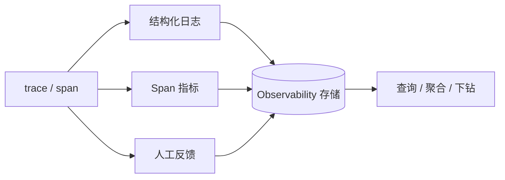

import { Canvas, Controls, Meta } from '@storybook/addon-docs/blocks';
import * as Stories from './logging-metrics.stories';

<Meta of={Stories} name="Docs" />

# 日志、指标与反馈

[追踪](?path=/docs/tracing--docs)把一次 Agent 运行拆成 trace 与 span，本课的三类信号都在它之上生长：
结构化日志是代码里主动写入的文本与字段；Span 指标是 span 完成时零插桩自动聚合的时长、token 与费用；
人工反馈是人挂在某条 trace 上的打分与评论。三类信号共享 trace_id，可互相跳转：指标发现聚合异常，
日志给出文本证据，反馈补上人的判断。下方对照实例可切换三类信号，查看各自的查询方式、存储要求与定位路径。



| 信号 | 产生方式 | 查询入口 | 存储要求 |
| --- | --- | --- | --- |
| 结构化日志 | 日志调用自动转发入库 | `client.listLogsVNext` / `npx mastra api log list` | Observability 存储，`logging.enabled` 默认 `true` |
| Span 指标 | span 完成时自动聚合，零插桩 | Studio 仪表盘 / 指标查询接口 | 分析型存储：DuckDB / ClickHouse（LibSQL、Mongo 不支持） |
| 人工反馈 | `mastra.observability.addFeedback()` | `getFeedbackAggregate` 等聚合接口 | observability 域存储；开源部署配保留期才物理清除 |

## 三种信号对照

<Canvas of={Stories.Interactive} />
<Controls of={Stories.Interactive} />

| 读者操作 | 可观察证据 |
| --- | --- |
| 切换「当前信号」 | 高亮行与读数区同步显示该信号的来源、查询、存储与定位路径 |
| 打开「按 trace 下钻」 | 当前信号与底部 trace 条之间画出关联线，对应三类信号可沿线跳回 trace |

实例为离线示意，只呈现机制对照，不连接真实存储或 LLM。

## 结构化日志

### 写入与 trace 关联

`PinoLogger` 是 CLI 初始化的默认日志器（另有 `ConsoleLogger` 直接走 console）。`prettyPrint` 默认
开启、输出人类可读文本，设为 `false` 时输出机器可解析的 JSON。`loggerOptions` 控制日志与追踪的关系：

```ts
export const mastra = new Mastra({
  logger: new PinoLogger({ name: 'Mastra', level: 'info' }),
  loggerOptions: {
    correlation: true, // 被追踪操作内注入 trace_id / span_id（W3C 格式，默认 true）
    export: true,      // 日志转发到 observability 存储（默认 true）
  },
});
```

业务代码用 `mastra.getLogger()` 写日志，第二个参数是结构化数据，入库后可按字段过滤：

```ts
const step1 = createStep({
  execute: async ({ mastra }) => {
    mastra.getLogger().info('workflow info log', { agent: 'support' });
    return { output: '' };
  },
});
```

被追踪的操作（agent 运行、workflow step、tool 调用）内，日志自动带上 `trace_id` / `span_id`，与
Studio 的 trace 视图对应；trace 之外省略这两个字段。自定义 pino `mixin` 字段会保留，冲突时 trace 字段优先。

### 入库与查询

配置 Observability 后，`debug` / `info` / `warn` / `error` / `trackException` 的日志自动写入
observability 存储，无需改代码；持久后端（DuckDB、ClickHouse）重启后仍可回查。入库门槛由 observability
配置的 `logging` 控制（默认 `enabled: true`、`level: 'debug'`，可选 debug 到 fatal），控制台输出仍按
logger 自己的 `level` 走：控制台看到 `debug`、存储里只留 `info` 及以上是常见组合。

用 `@mastra/client-js` 的 `MastraClient` 查询：

```ts
const logs = await client.listLogsVNext({
  filters: { level: 'error' },
  pagination: { page: 1, perPage: 50 },
  orderBy: { field: 'timestamp', direction: 'desc' },
});
```

CLI（面向 AI agent）需要运行中的 server：`npx mastra api log list '{"level":"error","page":0,"perPage":50}'`；
构造过滤器前先跑 `npx mastra api log list --schema`。

## Span 指标

### 零插桩生成

指标在 span 完成时从追踪数据自动生成，不需要单独埋点：时长覆盖 agent 运行、workflow、tool、模型调用与
processor；token 用量来自模型输入输出（provider 报告时含细分 token 类别）；费用按 token、provider、model
与内嵌定价注册表估算。指标保留 trace 关联，图表里的异常可以直接下钻到对应 span。

### 存储要求

指标需要支持分析的存储：`@mastra/duckdb` 推荐本地开发，`@mastra/clickhouse` 推荐高写入量生产；
`PostgresStoreVNext` 在 observability 域开启时支持；内存存储支持但进程重启即丢；LibSQL、MSSQL、MongoDB
不支持指标；Google Cloud Spanner 默认禁用（`disableMetrics: false` 仅建议轻负载）。主存储不满足时，
用 `MastraCompositeStore` 按域路由：默认域继续用 LibSQL，observability 域交给 DuckDB，`MastraStorageExporter`
负责写入并供 Studio 读取。生产查询始终带时间范围，让分区后端跳过无关分区。

```ts
export const mastra = new Mastra({
  storage: new MastraCompositeStore({
    id: 'composite-storage',
    default: new LibSQLStore({ id: 'mastra-storage', url: 'file:./mastra.db' }),
    domains: {
      observability: await new DuckDBStore().getStore('observability'),
    },
  }),
  observability: new Observability({
    configs: {
      default: {
        serviceName: 'mastra',
        exporters: [new MastraStorageExporter()],
      },
    },
  }),
});
```

## 人工反馈

### 写入与定位

`mastra.observability.addFeedback()` 把评分、评论等人工信号挂到 trace 或 span 上。助手消息的
`content.metadata.traceId` 记录了产生该消息的 trace（与运行结果报告的 traceId 一致），用它定位目标：

```ts
if (!mastra.observability.addFeedback) {
  throw new Error('Feedback is not supported by the active observability implementation');
}
await mastra.observability.addFeedback({
  traceId, // 来自 message.content.metadata.traceId
  feedback: { feedbackSource: 'user', feedbackType: 'rating', value: 1 },
});
```

只传 `traceId` 时，目标会先从 observability 存储还原；执行结束后补反馈需要 `MastraStorageExporter`，
trace 进行中则传 `correlationContext` 免还原。tracing 关闭时产生的消息没有 `traceId`。

### 查询、聚合与删除

经 `mastra.getStorage()?.getStore('observability')` 拿到存储域后，可做 `createFeedback` /
`listFeedback` / `deleteFeedback`：list 支持按 `traceId`、`feedbackType`、`feedbackSource`、`tags`
等过滤与分页；delete 按 `feedbackIds` 删除（单次上限 1,000）且幂等，重复调用不报错。
数值型 `value`（thumbs 编码为 `1` / `-1`）可做聚合分析：

```ts
const avg = await observability.getFeedbackAggregate({
  feedbackType: 'rating', feedbackSource: 'user',
  aggregation: 'avg', comparePeriod: 'previous_day',
});
const byAgent = await observability.getFeedbackBreakdown({
  feedbackType: 'rating', groupBy: ['entityName'], aggregation: 'avg',
});
const overTime = await observability.getFeedbackTimeSeries({
  feedbackType: 'rating', aggregation: 'avg', interval: '1h',
});
```

删除是软删除：记录从查询与聚合中消失，但 ClickHouse 只做轻量删除，物理清除不保证即时；开源部署没有
后台对账器，必须配置 observability 保留期才会真正清除。

## 最佳实践

- 先指标、再日志、后反馈：指标定位异常时段与维度，日志要文本证据，反馈校准人的判断；三条路都以回到 trace 收尾。
- 存储按域分层：主存储可以继续用 LibSQL / MongoDB，用 `MastraCompositeStore` 只把 observability 域交给
  分析型存储，避免为了指标整体换库。
- 透传 traceId 到前端：把消息 `content.metadata.traceId` 一路带到产品界面，才能支撑「差评 → 回看 trace」闭环。

## 常见问题

- 控制台日志有 trace_id，存储里却查不到？
  检查 `loggerOptions.export` 是否被改成 `false`，以及 observability 配置的 `logging.level` 是否高于该条
  日志级别（默认 `debug`，`error` 一般不会被挡）。
- 配了 LibSQL / MongoDB，Studio 仪表盘没有指标？
  这两类存储不支持指标，只存其他信号；按上文为 observability 域接入 DuckDB 或 ClickHouse。
- 删除反馈后数据库里还能看到行？
  软删除只隐藏记录；开源部署要配置保留期触发物理清除，ClickHouse 的物理删除也不保证即时。

## 总结回顾

摘要：

追踪提供 trace 与 span 的骨架后，三类信号分别回答不同问题：结构化日志由 `PinoLogger` / `ConsoleLogger`
承载，`loggerOptions.correlation` 注入 trace 字段、`export` 转发入库，查询走 `listLogsVNext` 或
`npx mastra api log list`；Span 指标零插桩地从 span 聚合出时长、token 与费用，但要求 DuckDB /
ClickHouse 等分析型存储，可用 `MastraCompositeStore` 按域接入；人工反馈通过 `addFeedback` 挂到 trace 上，
凭消息里的 `content.metadata.traceId` 定位，支持聚合分析与幂等软删除，开源部署需配保留期。

一句话：

> 三类信号同源于 trace：指标指出哪里异常，日志给出文本证据，反馈补上人的判断，trace_id 是它们之间的跳转键。

知识要点：

- `loggerOptions.correlation` 与 `export` 的默认值分别是什么？
- 哪些存储支持指标？主存储不支持时如何按域拆分？
- 从一条差评消息如何定位到产生它的 trace？
- 日志入库的级别由哪个配置控制、默认值是什么？
- 反馈删除为什么是幂等的？物理清除依赖什么配置？

## 参考资料

- [Logging](https://mastra.ai/docs/observability/logging)
- [Metrics Overview](https://mastra.ai/docs/observability/metrics/overview)
- [Feedback](https://mastra.ai/docs/observability/feedback)
