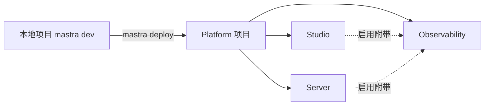

import { Canvas, Controls, Meta } from '@storybook/addon-docs/blocks';
import * as Stories from './mastra-platform.stories';

<Meta of={Stories} name="Docs" />

# Mastra Platform 入门

Mastra Platform（projects.mastra.ai）是官方托管平台：把本地 `mastra dev` 调好的 agents、tools 与 workflows 用一条 `mastra deploy` 推上云端，由平台负责运行、观测与管理。三大产品中 Observability 是基础，Studio 与 Server 在其上叠加；项目内部再按 Environment（production / staging 等）分环境管理变量与部署。本课讲清「Platform 是什么、怎么部署、环境怎么管」；Trace Intelligence、告警、托管数据库运维与平台 API 配置见 [平台观测与运维](?path=/docs/platform-ops--docs)，自托管运行见 [部署概览与自托管](?path=/docs/deployment--docs)。



开场参考表（默认值与关键边界回查）：

| 对象 / 命令 | 是什么 | 默认值 / 关键边界 |
| --- | --- | --- |
| Observability | 可检索的 traces、logs、metrics | 每个项目的基础产品 |
| Studio | 云端可视化测试 agents / workflows | 启用即附带 Observability |
| Server | 把应用作为生产 API 运行 | 启用即附带 Observability |
| `mastra deploy` | 构建 + 预检 + 部署一条命令 | `--env` 默认 `production` |
| `@mastra/core` | 部署管线最低版本要求 | >= 1.44，过低报 `MASTRA_CORE_TOO_OLD` |
| Environments | 一项目多环境 | 区域在环境创建时固定 |
| `--region` | 部署区域 | `us` 或 `eu`，可跳过选择提示 |

## 三大产品

Platform 的公共父级是 **Project**：一次部署对应一个项目，一个项目可同时开启三个产品；Project 归属于 **Organization**（多租户容器），组织级 Alerts 在此配置，可覆盖全部或指定项目与环境。应用由 Agents、Tools、Workflows 三类构件组成，Platform 托管的正是它们的运行与观测。切换下方视角，对照产品构成、部署流程与环境分层三张示意图；读数给出各视角的关键要点。

<Canvas of={Stories.Interactive} />
<Controls of={Stories.Interactive} />

| 读者操作 | 可观察证据 |
| --- | --- |
| 切换「视角」 | 画布在产品构成 / 部署流程 / 环境分层间重绘 |
| 切换「当前环境」 | 环境分层视角下高亮的环境与读数同步变化 |

### Observability

每个平台项目的基础产品：traces、logs 与 metrics 可跨项目与部署检索查询。只开启它即获得云端观测；不托管应用也能用（见「与自托管混用」）。

### Studio

托管版 Studio：在云端测试 agents、运行 workflows、检查 traces，与本地 `mastra dev` 的 Studio 同源，数据来自部署到平台的运行。启用 Studio 的项目自动附带 Observability。

### Server

生产部署目标：把 Mastra 应用作为 API server 运行，部署成功后平台输出公开 URL。启用 Server 同样附带 Observability。上线前务必给 API 端点配置认证。

## 部署

### mastra deploy

一条命令完成构建、预检、部署并输出 URL；旧的 `mastra server deploy` 与 `mastra studio deploy` 已废弃、下一主版本移除，统一替换为 `mastra deploy`。

```bash
mastra deploy                                  # 默认部署到 production
mastra deploy --env staging --region eu --yes  # 指定环境与区域，跳过确认
mastra deploy --env-file .env.staging --project my-agent
mastra lint --preflight                        # 只跑预检不部署（只能读本地 env）
```

| 参数 | 作用 | 边界 |
| --- | --- | --- |
| `--yes` | 接受默认值跳过确认 | CI 必配 |
| `--env` | 指定环境 | 默认 `production`；不存在时提示创建 |
| `--region` | `us` 或 `eu` | 区域在环境创建时固定 |
| `--env-file` | 叠加本地 env 文件 | 叠在托管与平台存储之上 |
| `--project` | 指定目标项目 | 名称 / slug / id |
| `--skip-preflight` | 跳过预检 | 不推荐 |

### 首次部署与预检

首次 `mastra deploy` 提示创建平台项目（名称取自 `package.json`）和 `production` 环境，并写入 `.mastra-project.json` 把当前目录绑定到该项目；应提交入库，后续部署、CI 与 `mastra env` 命令无需再传参。完整部署约 30 秒到几分钟，仅在新版本承接流量后才打印成功；验证时在 URL 后追加 `/api/agents` 应返回 agent 列表 JSON。

预检硬性拦截本地存储路径：`file:./mastra.db` 这类文件存储落在平台临时文件系统上，每次部署都会清空。CLI 可内联修复（提示 `Create a managed turso database now and attach it? (Y/n)`），接受后托管数据库连接变量自动注入、无需写入 `.env`；拒绝或在非交互 shell（CI、`--yes`）中改用：

```bash
mastra env db create production --kind turso
```

指向 `localhost` 的数据库 URL 同样被拦截。硬编码本地路径无法内联修复，需改用环境变量守卫，让本地开发与平台共用一份代码：

```ts
new LibSQLStore({
  id: 'mastra-storage',
  url: process.env.TURSO_DATABASE_URL ?? 'file:./mastra.db',
  authToken: process.env.TURSO_AUTH_TOKEN,
})
```

### CI 与项目绑定

CI 中用环境变量与 `--yes` 无人值守部署，项目解析顺序为 `MASTRA_PROJECT_ID` → `--project` 参数 → `.mastra-project.json`：

```bash
export MASTRA_PROJECT_ID=... MASTRA_API_TOKEN=...
mastra deploy --env production --yes
```

私有 npm 依赖在 dashboard 保存只读 token 为 `NPM_TOKEN`，仓库放不含 token 的 `.npmrc`（保留 `${NPM_TOKEN}` 字面量）。注意 token 也会作为普通环境变量注入运行服务，要按可读密钥对待。

## 环境与变量

每个项目可运行多个 Environment（如 `production` 与 `staging`），区域在创建时固定；每个环境自动获得一个托管 Workspace，为 agents 提供文件系统与沙箱，无需手动配置。改运行中环境的服务变量：在 dashboard 更新后执行 `mastra env restart` 生效，无需重新部署。

部署时环境变量按三层叠加，上层优先：

| 层 | 来源 | 边界 |
| --- | --- | --- |
| 托管变量 | 平台资源注入（如托管数据库的 `TURSO_DATABASE_URL`） | 平台定义不可编辑，优先于本地 .env |
| 平台存储变量 | dashboard 保存在项目 / 环境上 | 每次部署原样使用 |
| 本地 env 文件 | `--env-file` 或默认 `.env` / `.env.local` | 叠加在底层之上，本地开发仍用它 |

## 与自托管混用

Platform 与自托管不互斥：应用托管在自己的基础设施上时，仍可用 `MastraPlatformExporter` 把观测数据上报到平台，共享 traces、logs 与 metrics 的检索能力。部署选型（自托管 / Vercel 等 / Platform）见 [部署概览与自托管](?path=/docs/deployment--docs) 与 [云平台部署](?path=/docs/cloud-deployment--docs)。

## 常见问题

- 部署后存储数据消失，本地却正常？
  用了 `file:./mastra.db` 等本地路径：平台临时文件系统每次部署清空。创建托管数据库（接受预检内联修复，或 `mastra env db create production --kind turso`），并让存储 URL 走环境变量守卫。
- CI 里 `mastra deploy` 报 `MASTRA_CORE_TOO_OLD`？
  部署管线要求 `@mastra/core` >= 1.44。升级依赖 `npm install @mastra/core@latest` 与 CLI `npm install -g mastra@latest`。
- 脚本里的 `mastra server deploy` / `mastra studio deploy` 还能用吗？
  已废弃、下一主版本移除。升级 `@mastra/core` 后换成 `mastra deploy`，部署一次即自动迁移到环境管线并创建 production，再把项目级变量在 dashboard 的 Environments → 环境名 → Variables 移到对应环境。
- 每次部署会打断正在流式输出的回合吗？
  会：部署替换进程可能中断流式回合，不要依赖调大 `server.drainTimeout`，改用持久化 agent（durable agents）。

## 总结回顾

摘要：

Mastra Platform 把 Mastra 应用的运行、观测与管理托管到云端：Project 是三大产品的公共父级，Observability 提供可检索的 traces、logs 与 metrics，Studio 负责云端测试，Server 承载生产 API，两者启用即附带 Observability。`mastra deploy` 一条命令完成构建、预检与部署，首次运行自动建项目与 production 环境并写入 `.mastra-project.json` 绑定文件；预检硬性拦截本地存储路径，改用托管数据库与环境变量守卫。环境变量按托管、平台存储、本地 env 三层叠加，CI 用 `MASTRA_PROJECT_ID` 与 `MASTRA_API_TOKEN` 无人值守部署，旧拆分命令已废弃。自托管应用也能用 `MastraPlatformExporter` 上报观测数据与平台混用。

一句话：

> 一条 `mastra deploy` 把项目、环境与观测一起搬上云：存储别落本地路径，变量分三层来源，旧命令尽早替换。

知识要点：

- 三大产品各管什么？谁启用时附带 Observability？
- 首次 `mastra deploy` 自动做哪几件事？绑定文件是什么？
- 预检为什么拦截 `file:./mastra.db`？两种修复方式是什么？
- 环境变量三层来源的叠加顺序是什么？
- CI 部署需要哪两个环境变量、哪个参数？
- 两条废弃命令是什么？如何迁移到环境管线？

## 参考资料

- [Mastra Platform Overview](https://mastra.ai/docs/mastra-platform/overview)
- [Deploying to Mastra Platform](https://mastra.ai/docs/mastra-platform/deploy)
