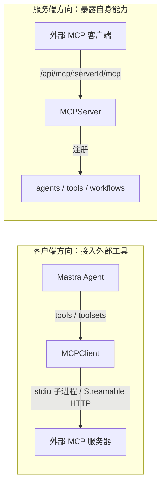

import { Canvas, Controls, Meta } from '@storybook/addon-docs/blocks';
import * as Stories from './mcp.stories';

<Meta of={Stories} name="Docs" />

# MCP

MCP（Model Context Protocol）是连接 AI 应用与外部工具的开放协议，在 Mastra 中是双向的：用 `MCPClient` 连接外部 MCP 服务器，把现成工具挂给 Agent；用 `MCPServer` 把自己的 agents / tools / workflows 暴露为 MCP 服务，供任意外部 MCP 客户端调用。两向能力同属 `@mastra/mcp` 一个包，`npm install @mastra/mcp` 后即可使用。



| 输入 / API | 作用 | 关键值或默认行为 |
| --- | --- | --- |
| `servers.*.command` + `args` | stdio 本地连接 | 以子进程启动本地 MCP 服务器 |
| `servers.*.url` + `requestInit` | 远程连接 | Streamable HTTP，headers 可带认证 |
| `inheritDefaultEnv` | 子进程环境继承 | 默认仅继承精选白名单（`PATH`、`HOME` 等） |
| `servers.*.env` | 传给子进程的变量 | 设 `inheritDefaultEnv: false` 时只传这里列出的 |
| `allowedHosts` | 限制出站主机 | URL 来自不可信配置时必须设置 |
| `requireToolApproval` | 工具审批门控 | `false` 不审批；`true` 全部；函数按工具决定 |
| `listTools()` | 静态工具 | 配置固定，写入 Agent 构造的 `tools` |
| `listToolsets()` | 运行时工具集 | 按请求凭据生成，传给 `generate` 的 `toolsets` |
| `new Mastra({ mcpServers })` | 注册 MCPServer | HTTP 端点 `/api/mcp/:serverId/mcp` |
| `startStdio()` | stdio 发布 | 入口脚本调用，发布为命令行程序 |

## 作为客户端：接入外部 MCP 服务器

一个 `MCPClient` 管理一组命名服务器，每台服务器二选一：本地用 `command` 启动 stdio 子进程，远程用 `url` 走 Streamable HTTP；OAuth 服务器用 `authenticate()` 完成浏览器授权。当前支持 MCP `2026-07-28` 修订版。

```ts
import { MCPClient } from '@mastra/mcp';

const mcpClient = new MCPClient({
  id: 'my-mcp-client',
  servers: {
    wiki: {
      command: 'npx',
      args: ['-y', 'wikipedia-mcp'],
    },
    cloud: {
      url: new URL('https://mcp.example.com/mcp'),
      requestInit: {
        headers: { Authorization: `Bearer ${process.env.MCP_TOKEN}` },
      },
    },
  },
});
```

可观察证据：`await mcpClient.listTools()` 返回两台服务器的全部工具；把结果交给 Agent 后，`agent.generate()` 的回复中会出现这些外部工具的调用。常用注册表（Klavis AI、mcp.run、Composio、Smithery、Apify、Ampersand）提供的托管 URL 或 stdio 条目，都按上面两种连接方式接入。

### 静态工具与运行时工具集

工具挂给 Agent 有两条路径，按「配置何时固定」选择：

| | 静态工具 | 运行时工具集 |
| --- | --- | --- |
| 获取方法 | `await mcpClient.listTools()` | `await mcpClient.listToolsets()` |
| 适用场景 | 服务器与凭据全局共享 | 凭据或服务器按用户 / 请求变化 |
| 传入位置 | Agent 构造函数的 `tools` | `generate()` / `stream()` 的 `toolsets` |

```ts
// 静态：启动时固定一次
const agent = new Agent({
  name: 'assistant',
  instructions: '回答时可用外部工具',
  model: 'openai/gpt-5-mini',
  tools: await mcpClient.listTools(),
});

// 运行时：按请求凭据新建客户端，用后断开
const userMcpClient = new MCPClient({ servers: buildServersFor(user) });
const toolsets = await userMcpClient.listToolsets();
await agent.generate(prompt, { toolsets });
await userMcpClient.disconnect();
```

边界：静态工具在 Agent 生命周期内不变；凭据需要按请求切换时必须走 `listToolsets()`，并为每个请求新建 `MCPClient`。

### 工具审批 requireToolApproval

审批门控写在 `servers.*` 配置上，决定哪些工具调用要先经人工确认才执行：

```ts
const mcpClient = new MCPClient({
  servers: {
    fs: {
      command: 'npx',
      args: ['-y', 'fs-mcp'],
      // 布尔 true 会对该服务器所有工具要求审批；函数按工具名、参数或注解决定
      requireToolApproval: ({ toolName }) => toolName.startsWith('delete_'),
    },
  },
});
```

- `requireToolApproval: true` —— 该服务器全部工具都要审批；省略（即 `false`）则全部直接放行。
- 函数形式按 `toolName` 等条件收窄，适合「只拦删除类等敏感操作」。

<Canvas of={Stories.Interactive} />
<Controls of={Stories.Interactive} />

| 读者操作 | 可观察证据 |
| --- | --- |
| 方向切「作为客户端」 | 画出 Agent → MCPClient → 外部服务器的工具流向 |
| 连接方式切「stdio / URL 远程」 | 右侧服务器框与流向读数同步切换 |
| 审批策略选「按工具名审批」 | 只有 `delete_file` 被门控拦截，其余放行 |
| 审批策略选「全部审批」 | 三个工具全部进入读数「审批拦截」 |

边界：来自不受控服务器的工具注解只是「不可信提示」，函数审批条件不要盲目采信注解。

## 作为服务端：把 Mastra 能力暴露为 MCP 服务

`MCPServer` 把已有的 agents、tools、workflows（还可配 prompts、resources、transports）打包成标准 MCP 服务，外部客户端无需了解 Mastra 即可调用。

```ts
import { Mastra } from '@mastra/core';
import { MCPServer } from '@mastra/mcp';

const mcpServer = new MCPServer({
  id: 'my-mcp-server',
  name: 'My Mastra Server',
  version: '1.0.0',
  agents: { weatherAgent },
  tools: { weatherTool },
  workflows: { weatherWorkflow },
});

export const mastra = new Mastra({
  agents: { weatherAgent },
  mcpServers: { mcpServer },
});
```

- HTTP 暴露：`mastra dev` 或部署后的 `/api/mcp/:serverId/mcp` 端点，Streamable HTTP 每个请求自包含、兼容 serverless，可挂 OAuth 中间件保护。
- stdio 发布：入口脚本调用 `mcpServer.startStdio()`，`package.json` 的 `bin` 指向构建产物，即可作为命令行 MCP 服务器分发。
- 工具内需人工补充信息：`context.suspend()` 携带 payload 并声明 `resumeSchema`，服务端产生 `input_required` 回合，客户端用 `inputRequests` 处理器作答，答案经 `context.resumeData` 续跑工具。
- MCP Apps：工具可用 `ui://` 资源携带交互式 HTML，Studio 在沙箱 iframe 中渲染；`mcpClient.toMCPServerProxies()` 还能把外部服务器的代理与 App 资源注册进 `Mastra`。

## 安全边界

MCP 引入的外部代码与外部数据都不可信，默认有三道防线：

- **stdio 环境白名单**：子进程默认只继承精选环境变量（POSIX 上的 `PATH`、`HOME` 等），宿主机密钥不会漏进第三方服务器；补充变量写进 `servers.*.env`，设 `inheritDefaultEnv: false` 则只传 `env` 列出的内容。
- **出站主机限制**：`url` 来自不可信配置时设置 `allowedHosts`；默认 fetch 路径会在发送前阻断重定向跳转，自定义 `fetch` 只在响应后校验最终 URL。
- **工具输出视为不可信输入**：工具结果会进入模型上下文，可能携带注入内容；用输入 / 输出处理器清洗，并配合 `requireToolApproval` 门控敏感工具。

## 最佳实践

- 凭据因人而异的服务器（如用户各自的 GitHub）走运行时工具集：每请求新建 `MCPClient` → `listToolsets()` → `generate({ toolsets })` → `disconnect()`，不把某个用户的静态工具挂进共享 Agent。
- 审批优先用函数形式按 `toolName` 收窄范围，`true` 只留给整台都不受信的服务器。
- 远程服务器同时做两件事：`requestInit` 携带认证头，`allowedHosts` 收紧出站范围。

## 常见问题

- stdio 服务器启动后报「找不到命令」或读不到环境变量
  子进程默认只继承白名单环境变量，不是完整宿主环境。把必需变量写进 `servers.*.env`，确需更宽环境时再调整 `inheritDefaultEnv`。
- Agent 调用了不该调的删除类工具
  给该服务器加函数形式 `requireToolApproval`，按 `toolName` 前缀拦截，并检查工具注解是否来自可信方。
- 自定义 fetch 后出现非预期出站请求
  自定义 `fetch` 只在响应后校验最终 URL，重定向可能在发送前就跳到别的主机；改用默认 fetch 路径，或自行实现重定向策略并配置 `allowedHosts`。

## 总结回顾

摘要：

MCP 在 Mastra 中是 `@mastra/mcp` 包提供的双向桥。客户端方向，`MCPClient` 用 stdio（`command` + `args`）或 Streamable HTTP（`url` + `requestInit`）连接外部服务器，工具以静态 `listTools()` 进 Agent 构造的 `tools`，或以运行时 `listToolsets()` 按请求进 `generate()` 的 `toolsets`，`requireToolApproval` 以布尔或函数在调用前门控。服务端方向，`MCPServer` 把 agents / tools / workflows 暴露为标准 MCP 服务，注册进 `Mastra` 后经 `/api/mcp/:serverId/mcp` 端点或 `startStdio()` 供外部调用。安全上默认收紧：stdio 子进程只继承白名单环境，远程可配 `allowedHosts`，工具输出一律按不可信输入处理。

一句话：

> `MCPClient` 把外部工具接进来，`MCPServer` 把 Mastra 能力送出去，两个方向共用同一套不可信输入的安全边界。

知识要点：

- stdio 与 URL 两种连接分别配置哪些字段？
- 静态工具与运行时工具集的获取方法和传入位置分别是什么？
- `requireToolApproval` 的布尔与函数写法各拦截什么范围？
- MCPServer 经哪个 HTTP 端点暴露？如何发布为 stdio 命令？
- stdio 子进程默认继承哪些环境变量？如何收紧或补充？

## 参考资料

- [Connections: MCP（mastra.ai 官方文档）](https://mastra.ai/docs/connections/mcp)
- [1.2 安装与项目结构](?path=/docs/installation--docs)：官方文档站自身也提供 MCP server（`@mastra/mcp-docs-server`），可在支持 MCP 的客户端中直接查询文档
- [工具](?path=/docs/tools--docs)：`createTool` 与 `toolsets` 的工具机制基础
