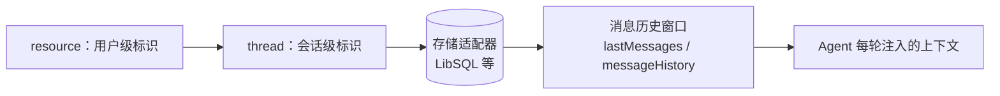

import { Canvas, Controls, Meta } from '@storybook/addon-docs/blocks';
import * as Stories from './memory-basics.stories';

<Meta of={Stories} name="Docs" />

# 记忆基础与线程

Mastra 的记忆由 `Memory` 类（来自 `@mastra/memory`）承载，挂到 Agent 的 `memory` 属性后，Agent 每轮对话前会自动从存储加载上下文。定位记忆数据靠两个标识：`resource` 是用户级稳定标识（一个人、一个账号），`thread` 是会话级标识（一次对话）。本课覆盖接入与存储前置、双标识模型、消息历史窗口、查询管理 API 与多用户共享线程入口；工作记忆、语义召回、观察式记忆各自独立成课，这里只给总览定位。



Mastra 记忆有四个能力轴。本课把「消息历史」讲透，其余三者只定位入口：

| 能力 | 一句话定位 | 详细入口 |
| --- | --- | --- |
| 消息历史 | 把最近若干条对话按顺序注入上下文 | 本课主体 |
| 工作记忆 | 跨线程记住用户画像等结构化事实 | [工作记忆](?path=/docs/working-memory--docs) |
| 语义召回 | 按含义检索更早的历史消息 | [语义召回](?path=/docs/semantic-recall--docs) |
| 观察式记忆 | 后台把旧消息压缩成观察日志 | [观察式记忆](?path=/docs/observational-memory--docs) |

回查用关键项（默认值已与官方文档核对）：

| 关键项 | 默认 / 取值 | 说明 |
| --- | --- | --- |
| `lastMessages` | 10 | 注入最近消息的条数，工具调用与结果同样计数 |
| `messageHistory` | 未启用 | 按 token 预算裁剪；单独设置会取消 10 条上限 |
| `atMaxRemoveTokens` | `maxTokens` 的 25% | `messageHistory` 触顶后单次至少移除的量 |
| `generateTitle` | 未启用 | 回合结束后异步生成线程标题 |
| `observationalMemory` | 关闭 | 以 `observationalMemory: true` 启用 |
| 存储适配器 | 必需 | 挂在 Mastra 实例的 `storage` 上 |

## 接入 Memory 与存储前置

`Memory` 只负责「选什么进上下文」，数据持久化交给存储适配器：先在 Mastra 实例上挂 `storage`，再把 `Memory` 挂到 Agent 的 `memory` 属性。存储后端选型与按域路由见[存储与持久化](?path=/docs/storage--docs)。

```ts
import { Memory } from '@mastra/memory';
import { Agent } from '@mastra/core/agent';
import { Mastra } from '@mastra/core';
import { LibSQLStore } from '@mastra/libsql';

export const mastra = new Mastra({
  storage: new LibSQLStore({ id: 'mastra-storage', url: 'file:./mastra.db' }),
  agents: {
    supportAgent: new Agent({
      id: 'support-agent',
      name: 'Support Agent',
      instructions: '你是客服助手。',
      memory: new Memory({ options: { lastMessages: 20 } }),
    }),
  },
});
```

调用时通过 `memory` 参数带上双标识，`.generate()` 与 `.stream()` 形状相同；线程与消息会自动创建，也可以用 `createThread()` / `saveMessages()` 手动建：

```ts
await agent.stream('帮我看看上周的订单', {
  memory: {
    thread: {
      id: 'thread-123',
      title: '支持会话',
      metadata: { category: 'billing' },
    },
    resource: 'user-456',
  },
});
```

边界：`memory` 也可以是接收 `RequestContext` 的函数，按请求返回不同的 `Memory` 实例（例如按用户等级切换记忆配置）。

## resource 与 thread 双标识

两个标识各管一层：`resource` 回答「这是谁」，`thread` 回答「这是哪次对话」，查询历史时两者必须同时匹配。线程创建后归属的 `resourceId` 不可更改；跨用户复用同一个 thread ID 会导致查询错误。

共享范围也由标识决定：同一 `resource` 的不同 `thread` 默认共享工作记忆与语义召回（`scope: 'resource'`）；同一 `resource` 加同一 `thread` 才共享完整对话历史。

下面的离线实例模拟存储里的三条线程：切换 `resource` / `thread` 观察被定位的会话，拖动 `lastMessages` 观察注入窗口滑动。

<Canvas of={Stories.Interactive} />
<Controls of={Stories.Interactive} />

| 读者操作 | 可观察证据 |
| --- | --- |
| 把 `resource` 切到 `user-bob` | 同名线程 `thread-support-1` 显示的是另一个人的会话 |
| 把 `thread` 切到 `thread-billing-2` | 定位到同一用户名下的另一条线程 |
| 拖动 `lastMessages` | 蓝色窗口内行数变化，最旧消息先出窗 |

## 消息历史与注入窗口

消息历史默认开启：每轮把线程内最近 `lastMessages` 条消息按时间顺序注入提示，新消息排在最后。默认 10 条，计数包含所有已存储的消息类型——工具调用、工具结果、信号都算，所以一个回合可能让窗口滑过好几条。

### lastMessages 滑动窗口

```ts
memory: new Memory({ options: { lastMessages: 10 } }) // 官方默认值
```

窗口每轮回滑：超过上限时最旧消息出窗，同时会使提示级的模型缓存失效。出窗消息仍留在存储里，只是不再注入后续回合。

### messageHistory token 预算

`messageHistory` 按 token 预算裁剪整个提示（历史、系统指令、上下文与当前回合一起计数），适合长对话或大系统提示：

```ts
memory: new Memory({
  options: {
    messageHistory: { maxTokens: 8_000, atMaxRemoveTokens: 2_000 },
  },
})
```

- `atMaxRemoveTokens` 默认为 `maxTokens` 的 25%；裁剪持续到提示装进 `maxTokens - atMaxRemoveTokens` 为止。
- 只裁最旧的历史消息：系统消息、上下文、当前输入与 Agent 回复永不裁剪；关联的工具调用与结果成对移除。
- 单独设置 `messageHistory`（不给 `lastMessages`）会取消默认 10 条上限，两者也可组合；`maxTokens: 0` 关闭历史注入。更细的过滤交给[记忆处理器](?path=/docs/memory-processors--docs)。

### generateTitle 自动会话标题

`generateTitle: true` 在回合结束后异步生成线程标题，不阻塞响应；配合 `listThreads()` 让会话列表可读。支持事件化与定制：

```ts
memory: new Memory({
  options: {
    generateTitle: {
      emitEvent: true, // stream() 在 finish 前发出 data-thread-title 事件
      model: 'openai/gpt-5-mini', // 换用更便宜的标题模型
      instructions: '用两到四个字起标题。',
    },
  },
})
```

`emitEvent: true` 会延迟该回合的 `finish`，且只对 `stream()` 生效，`generate()` 不支持；标题生成是线程级关注点，不会应用到子代理的继承线程。

## 查询与管理已存记忆

通过 `agent.getMemory()` 拿到 Memory 实例，即可查询和管理已持久化的线程与消息：

```ts
const memory = await agent.getMemory();

const result = await memory.listThreads({
  filter: { resourceId: 'user-123' },
  orderBy: { field: 'createdAt', direction: 'DESC' },
  perPage: false, // 取全部；或用 page / perPage 分页
});
// result.threads、result.hasMore

const { messages } = await memory.recall({ threadId: 'thread-123', perPage: false });
```

- `listThreads()`：按 `resourceId` 列线程，支持元数据过滤、`orderBy` 与 `page` / `perPage` 分页；单条线程用 `getThreadById()`。
- `recall()`：拉取某线程消息，支持 `filter.dateRange`（`start` / `end`）、`filter.metadata`（浅层标量值、AND 语义）、`include`（指定消息 ID 并可带前后相邻消息）、`vectorSearchString`（配合语义召回做字符串检索）与 `hideSignals`（默认隐藏提醒类信号）。
- 复制与清理：`cloneThread()` 克隆线程并返回克隆消息，适合从某处分叉；`copyThread()` 在库内整体复制、不返回消息体；`deleteMessages()` 按消息 ID 删除或清空线程。
- 边界：Memory 不做访问控制，`resourceId` 的授权校验要放在应用层。

## 多用户共享线程

一个 `thread` 通常只属于一个 `resource`，但也可以让多个用户读写同一条线程（协作会话、群聊场景）：各用户用自己的 `resourceId` 指向同一个 `thread`，消息按发言人区分，Agent 收到的历史里会以 `<turn>` 标记包住每位发言人的内容。这是高级场景：除双标识与授权校验外，还要自行处理「谁能看谁的发言」，本课只给入口，细节按官方文档展开。

## 最佳实践

- 窗口策略：短对话只调 `lastMessages`；长对话或大系统提示改用 `messageHistory` 的 token 预算，两者可组合成「先按条数、再按预算」的双层裁剪。注意只设 `messageHistory` 会取消 `lastMessages` 的默认 10 条。
- 标识设计：`resource` 用不可变的用户 ID，不要用昵称等可变字段；一个会话一个 `thread` ID，归属创建后不可改，跨用户复用旧 ID 会读到别人的上下文或报查询错误。
- 标题成本：`generateTitle` 每个线程多一次 LLM 调用，只在需要向用户展示会话列表的 Agent 上开启。

## 常见问题

- 换了 `resource` 或 `thread` 之后，历史「全没了」
  先核对调用时的双标识与写入时是否逐字符一致：`thread` 名相同但 `resource` 不同，就是另一条线程——实例里 `user-bob` 的 `thread-support-1` 就是这个效果。
- 窗口设了 10 条，一轮对话后历史却「少」了几条
  `lastMessages` 计数包含工具调用、工具结果与信号，一个回合可能占用多条配额，这是正常行为而不是丢消息。
- 客户端把完整历史又发了一遍，上下文出现重复消息
  只发送本轮新消息：Mastra 会加载存储历史并过滤客户端回显；确需原样保留输入时，在 `memory.options` 里设 `retainFullInput: true`。

## 总结回顾

摘要：

Mastra 用 `Memory` 类给 Agent 提供持久记忆：存储适配器负责落库，`resource` 与 `thread` 双标识共同定位一条线程，归属创建后不可更改。消息历史默认注入最近 10 条（`lastMessages`，工具消息同样计数），长对话可改用 `messageHistory` 的 token 预算裁剪，`generateTitle` 可为线程自动起标题。已持久化的线程与消息可用 `listThreads()` / `recall()` 分页、按日期与元数据过滤地查询，用 `cloneThread()` / `copyThread()` / `deleteMessages()` 管理生命周期；多用户共享同一线程属于高级场景，访问控制放在应用层。

一句话：

> `resource` 定人、`thread` 定会话，双标识一致才能读到同一份记忆；注入多少由 `lastMessages` 与 `messageHistory` 决定。

知识要点：

- 挂载记忆需要哪两件事？（Mastra 实例挂存储适配器，Agent 挂 `Memory` 实例）
- 为什么换了一个 `resource` 就读不到原线程？
- `lastMessages` 的默认值是多少？哪些消息会被计入？
- `messageHistory` 触顶后裁什么、不裁什么？
- 查询线程列表和历史消息分别用哪个 API？

## 参考资料

- [Memory Overview](https://mastra.ai/docs/memory/overview)
- [Message History](https://mastra.ai/docs/memory/message-history)
