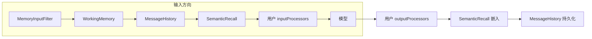

import { Canvas, Controls, Meta } from '@storybook/addon-docs/blocks';
import * as Stories from './memory-processors.stories';

<Meta of={Stories} name="Docs" />

# 记忆处理器

启用 Memory 后，Agent 的消息管道里会自动挂载一组记忆处理器：输入方向把历史消息、语义召回结果和工作记忆装进上下文，输出方向把本轮新消息持久化回存储。它们与你声明的 inputProcessors / outputProcessors 共用同一条管道，相对顺序由框架固定。本课讲清三个内置记忆处理器各做什么、顺序如何排、如何自定义扩展，以及与 guardrails 的协作边界（线程与 Memory 的基础见[记忆基础与线程](?path=/docs/memory-basics--docs)）。



| 处理器 | 方向 | 触发配置 | 职责 |
| --- | --- | --- | --- |
| MemoryInputFilter | 输入 | 启用 memory 即内置 | 裁剪客户端回传的历史，只留本轮新输入；空线程保留完整首条输入并剥离 provider 元数据 |
| WorkingMemory | 仅输入 | `workingMemory.enabled` | 取当前线程的工作记忆，前置到消息列表 |
| MessageHistory | 输入 + 输出 | `lastMessages` | 输入拉取最近 N 条历史；输出把新消息写回存储 |
| SemanticRecall | 输入 + 输出 | `semanticRecall.enabled` | 输入向量召回相关历史；输出嵌入新消息入向量库 |

## 管道顺序

记忆处理器不是独立旁路，而是挂在消息管道上的普通处理器，只是位置由框架固定：

- 输入方向：内置记忆处理器先跑（MemoryInputFilter → WorkingMemory → MessageHistory → SemanticRecall），你的 inputProcessors 后跑——先装满上下文，再做校验与过滤。
- 输出方向：你的 outputProcessors 先跑，记忆处理器后跑——先审核改写，再把最终消息持久化。

<Canvas of={Stories.Interactive} />
<Controls of={Stories.Interactive} />

| 读者操作 | 可观察证据 |
| --- | --- |
| 关闭 SemanticRecall | 输入方向读数少一站，输出方向只剩 MessageHistory 持久化 |
| 关闭 WorkingMemory | 模型看到读数从「工作记忆 + 最近 10 条历史 + ...」退化为「最近 10 条历史 + ...」 |
| 打开「添加自定义 pii-guard」 | 该站出现在记忆处理器之后；命中手机号即 tripwire 中止，写入记忆为 0 条 |

边界：MemoryInputFilter 始终第一个，服务「客户端会把整段历史回传」的场景，避免下游重复装载旧消息。

## MessageHistory

最近消息处理器由 `lastMessages` 触发：输入方向从存储拉取最近 N 条消息前置到上下文，输出方向在模型响应后把新消息写回存储——一进一出维持历史窗口。

```ts
import { Agent } from '@mastra/core/agent';
import { Memory } from '@mastra/core/memory';
import { LibSQLStore } from '@mastra/libsql';

new Agent({
  name: 'assistant',
  instructions: '你是一个记账助手',
  model: 'openai/gpt-4o',
  memory: new Memory({
    storage: new LibSQLStore({ url: 'file:memory.db' }),
    lastMessages: 10, // 该值原样成为 MessageHistory 处理器的 limit
  }),
});
```

可观察证据：第二轮对话时模型上下文里已包含上一轮消息；新开会话时历史从存储重新装回。

## SemanticRecall

语义召回处理器由 `semanticRecall.enabled` 触发，且必须同时提供 vector 向量库与 embedder 嵌入模型：输入方向按相似度检索相关历史消息前置，输出方向把本轮新消息生成嵌入并存入向量库。

```ts
import { PineconeVector } from '@mastra/pinecone';

memory: new Memory({
  storage,
  vector: new PineconeVector(), // 向量库，必填
  embedder: new OpenAIEmbedder({ model: 'text-embedding-3-small' }), // 嵌入模型，必填
  semanticRecall: { enabled: true },
}),
```

边界：召回消息与最近消息可能重叠，由两套配置独立控制；topK 与召回范围的调参见[语义召回](?path=/docs/semantic-recall--docs)。

## WorkingMemory

工作记忆处理器只存在于输入方向：取出当前线程的工作记忆块并前置到消息列表，输出方向没有对应处理器。它依赖 storage adapter 保存工作记忆状态；模板与 schema 两种写法见[工作记忆](?path=/docs/working-memory--docs)。

```ts
memory: new Memory({
  storage, // 工作记忆依赖存储适配器
  workingMemory: { enabled: true },
}),
```

## 自定义记忆处理器

自定义处理器实现 Processor 接口，钩子机制详见[输入输出处理器](?path=/docs/processors--docs)。下面是一个输入方向的自定义处理器示意：

```ts
import type { MastraDBMessage } from '@mastra/core/memory';
import type { Processor } from '@mastra/core/processors';

const piiGuard: Processor = {
  id: 'pii-guard',
  async processInput({ messages }: { messages: MastraDBMessage[] }) {
    // 示意：打码手机号。实现时返回新数组，不要原地修改传入的 messages
    return maskPhoneNumbers(messages);
  },
};
```

手动把内置记忆处理器加进 inputProcessors / outputProcessors 时，Mastra 不会重复自动添加同名处理器，顺序完全由你控制——常用它把 MessageHistory 与 TokenLimiter 组合起来控制 token 预算：

```ts
import { MessageHistory, TokenLimiter } from '@mastra/core/processors';

new Agent({
  // ...
  inputProcessors: [
    new MessageHistory({ lastMessages: 20 }), // 手动接管，memory 里的 lastMessages 不再自动挂载
    new TokenLimiter({ limit: 4000 }),
  ],
});
```

## 与 guardrails 的交互

- 输出方向（推荐）：outputProcessors（含 guardrails，见[安全防护](?path=/docs/guardrails--docs)）先于记忆处理器运行。处理器触发 tripwire 中止时，记忆处理器被跳过，本轮消息不会写入存储。
- 输入方向：inputProcessors 在记忆装载完成后运行。中止时模型不会被调用，输出处理器全部跳过，同样什么都不保存。

两条路径默认都安全：中止即放弃本轮，不会产生半写状态。

## 常见问题

- 手动往 inputProcessors 加了 MessageHistory，还会再自动加一份吗？
  不会。Mastra 检测到你手动添加了记忆处理器后就不再自动添加；此时 memory 配置里的 lastMessages 不生效，顺序以你的声明为准。
- 为什么输出 guardrail 中止后，这轮对话在历史里"消失"了？
  设计如此：tripwire 之后记忆处理器被跳过，本轮消息不持久化，下一轮模型自然看不到这轮内容。

## 总结回顾

摘要：

启用 Memory 后管道自动挂载内置记忆处理器：输入方向按 MemoryInputFilter → WorkingMemory → MessageHistory → SemanticRecall 的固定顺序先于用户 inputProcessors 装载上下文，输出方向在用户 outputProcessors 之后先嵌入再持久化。自定义处理器实现 Processor 接口的 processInput 钩子且不原地改写消息；手动接管内置处理器可组合 TokenLimiter 并完全控制顺序；任何方向的 tripwire 中止都会让本轮消息不写入记忆。

一句话：

> 输入方向记忆先装、用户后审；输出方向用户先审、记忆后存——任何一环中止，本轮消息都不会落库。

知识要点：

- 三个内置记忆处理器分别由哪个配置触发，各覆盖哪个方向？
- 输入与输出方向上，记忆处理器与用户处理器的先后顺序分别是什么？
- 手动添加 MessageHistory 后，自动添加行为如何变化？
- 自定义记忆处理器需要实现哪个钩子？实现时要注意什么？
- 输出 guardrail 中止时，记忆写入会发生什么？

## 参考资料

- [Memory Processors - Mastra Docs](https://mastra.ai/docs/memory/memory-processors)

