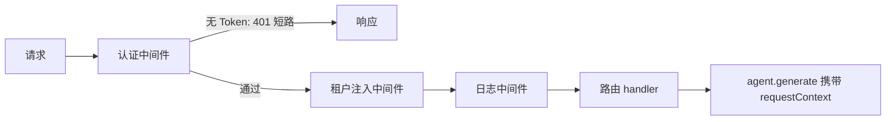

import { Canvas, Controls, Meta } from '@storybook/addon-docs/blocks';
import * as Stories from './middleware.stories';

<Meta of={Stories} name="Docs" />

# 中间件与请求上下文

Mastra 内置服务器（`mastra dev`、`mastra build` 与基于 Hono 的适配器）支持两类请求级能力：中间件在请求进入路由前处理横切关注点（认证、日志、CORS、屏蔽内置路由）；`RequestContext` 在同一请求内携带请求级数据（用户身份、地区、租户），一路传给 agent、tool 与 workflow。两者配合即完成多租户隔离：认证中间件解析用户，`mapUserToResourceId` 把用户映射成 `resourceId`，记忆读写自动按资源隔离。下方实例把这两条链串成一条请求管道，可切换中间件开关并观察 `requestContext` 键值与记忆隔离结果的变化。



| 回查项 | 值 |
| --- | --- |
| 全局注册 | `server.middleware`（`handler` + 可选 `path`，或裸函数） |
| 路由级注册 | `registerApiRoute(path, { method, middleware, handler })` |
| 中间件签名 | Hono 风格 `async (c, next)`；`await next()` 放行，`return new Response(...)` 短路 |
| 保留键 | `MASTRA_RESOURCE_ID_KEY`、`MASTRA_THREAD_ID_KEY`、`MASTRA_MESSAGE_AUTHOR_KEY` |
| 校验 | agent / tool / workflow 配置 `requestContextSchema`（Zod 等 Standard JSON Schema） |
| Studio 调试 | `mastra dev --request-context-presets ./presets.json` |
| 适配器范围 | 仅 Hono 系生效；Express / Fastify / Koa 启动时告警，需用框架自身中间件 |

## 注册中间件

中间件与 Hono handler 同构：拿到请求上下文 `c` 与 `next`；调用 `await next()` 继续管道，直接 `return new Response(...)` 则短路。注册顺序即执行顺序，短路后排在后面的中间件与路由都不会运行。

### server.middleware 全局管道

在 `Mastra` 构造时全局注册，作用于所有内置路由与自定义路由：

```ts
import { Mastra } from '@mastra/core';

new Mastra({
  // ...
  server: {
    middleware: [
      // 对象形式：用 path 限定作用范围
      {
        path: '/api/*',
        handler: async (c, next) => {
          console.log(`${c.req.method} ${c.req.url}`);
          await next();
        },
      },
      // 裸函数形式：全局生效
      async (c, next) => {
        const start = Date.now();
        await next();
        console.log(`${c.req.method} ${c.req.url} - ${Date.now() - start}ms`);
      },
    ],
  },
});
```

中间件内可用 `c.req.header('Authorization')` 读请求头、`c.get('mastra')` 取 Mastra 实例、`c.get('requestContext')` 取本请求的 `RequestContext`。

### 路由级 middleware 与屏蔽内置路由

单条路由用 `registerApiRoute` 的 `middleware` 选项注册；内置路由没有 allowlist 选项，要屏蔽某组路由就短路返回 404：

```ts
import { registerApiRoute } from '@mastra/core/server';

const notFound = async () => new Response('Not Found', { status: 404 });

// 仅此路由生效
registerApiRoute('/reports/summary', {
  method: 'GET',
  middleware: [async (c, next) => {
    /* ... */
    await next();
  }],
  handler: async c => c.json({ ok: true }),
});

// 屏蔽内置记忆 / 日志路由（通配符覆盖嵌套路径）
server: {
  middleware: [
    { path: '/api/memory/*', handler: notFound },
    { path: '/api/logs/*', handler: notFound },
  ],
},
```

边界：内置路由会加上 `server.apiPrefix` 前缀，但中间件的 `path` 原样匹配——`apiPrefix: '/api/v2'` 时要写 `/api/v2/memory/*`；自定义路由必须放在前缀之外；`requiresAuth: false` 的公开路由不受短路影响。

## 请求上下文 RequestContext

`RequestContext` 存放一次请求内的运行时数据，随调用传入 agent、tool、workflow；它与 memory 分工不同——memory 管跨请求的对话历史与持久状态，requestContext 管本次请求的条件（用户档位、地区、实验分组）。导入自 `@mastra/core/request-context`。

### set / get 与 requestContextSchema

```ts
import { RequestContext } from '@mastra/core/request-context';
import { z } from 'zod';

const requestContext = new RequestContext();
requestContext.set('user-tier', 'enterprise');
requestContext.setRaw('session.cache', { hits: 0 }); // schema 外的原始键

const supportAgent = new Agent({
  requestContextSchema: z.object({ 'user-tier': z.string().optional() }),
  // 动态 instructions：按 requestContext 生成每请求的系统提示词
  instructions: async ({ requestContext }) =>
    requestContext?.get('user-tier') === 'enterprise'
      ? '你是企业级支持专家，回答详细深入。'
      : '你是简洁友好的助手。',
});

await supportAgent.generate('帮我看看账单', { requestContext });
```

- 键值方法：`.set` / `.get` / `.has` / `.delete`，schema 外的键走 `.setRaw` / `.getRaw`，`.all` 一次取全部（定义 schema 后类型化）。
- agent 的 `instructions`、`model`、`tools`、`memory` 等配置都接受函数形式，签名里能拿到 `requestContext`，实现每请求不同的提示词、模型或工具集。
- prompt registry 模式：提示词存外部服务，按 requestContext 取变体——`promptRegistry.getPrompt({ promptId: 'support', variant: requestContext?.get('experiment-variant') })`。
- 校验失败的表现：agent 在 `generate()` 开头抛 `MastraError`；tool 在 `execute()` 前返回错误对象而不抛出；workflow 在 `run.start()` 时抛错。

### 中间件注入请求头

中间件是往 requestContext 写入请求信息的天然位置，服务端在路由运行前就能取到它：

```ts
server: {
  middleware: [
    async (context, next) => {
      const country = context.req.header('CF-IPCountry');
      const requestContext = context.get('requestContext');
      requestContext.set('temperature-unit', country === 'US' ? 'fahrenheit' : 'celsius');
      await next();
    },
  ],
},
```

Studio 里用 `mastra dev --request-context-presets ./presets.json` 预置多组预设值，在请求上下文编辑器下拉切换调试；手动改 JSON 会切回 Custom。

## 用户隔离与多租户

### mapUserToResourceId

`server.auth` 里给 `mapUserToResourceId` 返回一个非空字符串，服务器自动把它设为本请求的 `MASTRA_RESOURCE_ID_KEY`。此后线程列表按资源过滤、跨资源访问返回 403、建线程强制使用该 resourceId、客户端自报的 `?resourceId=` 被覆盖：

```ts
server: {
  auth: {
    authenticateToken: async token => verifyToken(token),
    mapUserToResourceId: user => `${user.orgId}:${user.id}`, // 得到 org-7:u-42
  },
},
```

<Canvas of={Stories.Interactive} />
<Controls of={Stories.Interactive} />

| 读者操作 | 可观察证据 |
| --- | --- |
| 关闭「请求携带 Token」 | 管道在认证站 401 短路，后面的中间件与路由不再点亮 |
| 关闭「启用认证中间件」 | 路由仍 200，但 resourceId 落到客户端自报值，隔离失效 |
| 关闭「启用租户注入中间件」 | requestContext 里不再出现 CF-IPCountry 与 temperature-unit |

`server.middleware` 在 Mastra 每路由鉴权之前运行；只想在中间件里解析用户而不改变鉴权行为时，用 `getAuthenticatedUser({ mastra, token, request })`。

### 保留键覆盖

高级场景可在中间件直接写保留键（来自 `@mastra/core/request-context`），优先级高于客户端传值：`MASTRA_RESOURCE_ID_KEY` 强制记忆归属（如按数据库查询结果指定）、`MASTRA_THREAD_ID_KEY` 把操作钉到已验证的线程、`MASTRA_MESSAGE_AUTHOR_KEY` 以 id、name、avatarUrl 命名消息作者。

## 最佳实践

- 中间件按「认证 → 注入 → 日志」排序：认证最先短路最便宜；日志放最后才能在 `next()` 后拿到完整耗时，也避免给将被拒绝的请求做无用注入。
- `mapUserToResourceId` 必须对每个已认证用户返回非空字符串，抛错或返回空值会让所有路由（不只 memory）在进入前 500；常见映射如 `user.tenantId` 或 org 与 id 的组合串。
- 中间件写入的键要同步声明进 `requestContextSchema`，条件注入的键用 `.optional()`，否则校验会在 generate 前失败。

## 常见问题

- 中间件写了 `path: '/api/memory/*'` 却没生效？
  先确认适配器是 Hono 系——Express / Fastify / Koa 适配器不能运行 Hono 中间件，启动时会告警；再确认 `apiPrefix`：中间件 path 不自动加前缀，需写成 `/api/v2/memory/*`。
- 认证已通过，但所有请求都 500？
  `mapUserToResourceId` 抛错或返回了 null、空串、非字符串；该失败发生在路由运行前，逐个检查映射函数对每个用户的返回值。
- tool 里拿不到 userId，也没有异常栈？
  tool 的 requestContext 校验失败不抛异常，而是返回带 `error: true` 的错误对象；关键路径上要检查该对象，而不是只依赖 try-catch。

## 总结回顾

摘要：

Mastra 的请求级能力由两条链组成：Hono 风格中间件（全局 `server.middleware` 或路由级 `middleware`）负责认证、日志、CORS 与屏蔽内置路由，短路即返回、后续不再执行；`RequestContext` 用 `.set` / `.get`（schema 外走 Raw 系列）把请求级数据带给 agent、tool、workflow，由 `requestContextSchema` 校验，驱动动态 instructions 与 prompt 变体。多租户链路则是认证 → `mapUserToResourceId` → 保留键 `MASTRA_RESOURCE_ID_KEY`，记忆读写据此按资源隔离，跨资源访问返回 403。

一句话：

> 中间件决定「谁能进、带什么」，RequestContext 决定「这次调用怎么变」，两者用保留键衔接即完成多租户隔离。

知识要点：

- 全局与路由级中间件分别在哪里注册？短路语义是什么？
- `mapUserToResourceId` 的返回值如何影响记忆隔离与错误行为？
- `requestContextSchema` 校验失败时 agent、tool、workflow 各是什么表现？
- 哪些适配器支持 Mastra 中间件？`apiPrefix` 对 path 匹配有什么影响？

## 参考资料

- [Mastra Server Middleware 文档](https://mastra.ai/docs/server/middleware)
- [Mastra RequestContext 文档](https://mastra.ai/docs/server/request-context)

