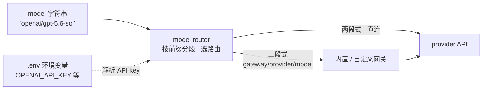

import { Canvas, Controls, Meta } from '@storybook/addon-docs/blocks';
import * as ModelAccess from './model-access.stories';

<Meta of={ModelAccess} name="Docs" />

# 模型接入

给 Agent 配模型只需要一个字符串：`model: 'openai/gpt-5.6-sol'`。这套字符串由 Mastra 内建的 model router 解析——它认识注册表里两百多个 provider，自动读取对应的环境变量并发起请求，因此不需要为每个厂商安装 SDK 包。本课讲清这个字符串的三种形态（两段式直连、三段式走网关、对象式自定义端点）、环境变量的命名规律、7 个内置网关与自定义网关的写法，以及嵌入模型的同款字符串。

读完本课，你能看着任意一个 model 字符串说出它走哪条路由、需要哪个环境变量，并在更换 provider 时只改一处。



| 项 | 值（回查用） |
| --- | --- |
| model 字符串 | 直连两段式 `provider/model`；走网关三段式 `gateway/provider/model` |
| 需要安装的 provider 包 | 无——model router 内置 provider 注册表，只装 `@mastra/core` |
| API key | 走环境变量，惯例 `<PROVIDER>_API_KEY`（如 `OPENAI_API_KEY`）；缺失时运行时报错并指名变量 |
| 内置网关（7 个） | `azure-openai`、`mastra`、`merge-gateway`、`neon`、`netlify`、`openrouter`、`vercel` |
| models.dev | 默认 provider 注册表（ModelsDevGateway），两段式、无网关前缀 |
| 自定义网关 | 实现 `MastraModelGatewayInterface` 或继承 `MastraModelGateway`，用 `mastra.addGateway()` 注册 |
| 嵌入模型 | 同款字符串，如 `openai/text-embedding-3-small`（1536 维） |
| 模型列表刷新 | 开发环境每小时自动同步；`MASTRA_AUTO_REFRESH_PROVIDERS=false` 可关闭 |

## model router：一个字符串接所有模型

Agent 的 `model` 字段接受 `provider/model` 字符串：

```ts
import { Agent } from '@mastra/core/agent';

const agent = new Agent({
  id: 'my-agent',
  name: 'My Agent',
  instructions: 'You are a helpful assistant',
  model: 'openai/gpt-5.6-sol',
});
```

换厂商只改字符串：`anthropic/claude-sonnet-4-6`、`google/gemini-2.5-flash`、`xai/grok-4.3`。model router 负责剩下的事：按 `/` 分段解析字符串、从环境变量取出对应 provider 的 API key、把请求路由到正确端点。所以依赖里不需要出现厂商 SDK 包——这是与「每个 provider 装一个 SDK」模式最大的区别。缺 key 也不会静默失败：运行时抛错并明确指出该设置哪个变量。

一个字符串怎么分段、走哪条路由、要配哪个变量——下面的解析器把这些拆给你看。切换「网关前缀」，观察两段式与三段式的切换：

<Canvas of={ModelAccess.Interactive} />
<Controls of={ModelAccess.Interactive} />

| 读者操作 | 可观察证据 |
| --- | --- |
| 切换「网关前缀」 | 分段胶囊在两段与三段间切换，「路由」读数与右侧分支高亮同步 |
| 切换「provider 段」 | 「所需环境变量」读数跟着 provider 变化 |
| 打开 Show code | 看到 Canvas 实际执行的 `model-string-parser.ts`，`resolveModelString` 就是这套路由判断 |

边界：环境变量跟随字符串的第一段——直连时是 provider 段，走网关时换成网关自己的变量；它与模型名无关，provider 段是 `anthropic`，无论模型名是什么，要配的都是 `ANTHROPIC_API_KEY`。把 model 接进对话循环（generate / stream）见「第一个 Agent」（`?path=/docs/first-agent--docs`）。

### model 字段的四种形态

| 形态 | 示例 | 用途 |
| --- | --- | --- |
| 字符串 | `model: 'openai/gpt-5.6-sol'` | 默认写法，本课主线 |
| 数组 | `model: [{ model: 'google/gemini-2.5-flash', maxRetries: 2 }, { model: 'openai/gpt-5-mini' }]` | fallbacks：前一个模型失败自动切换到下一个 |
| 函数 | `model: ({ requestContext }) => 'openai/gpt-5.6-sol'` | 按请求上下文动态选型 |
| 对象 | `model: { id: 'lmstudio/qwen/qwen3-30b-a3b-2507', url: 'http://localhost:1234/v1' }` | 自定义 OpenAI 兼容端点 |

对象形态把字符串换成「端点 + 字符串」：`url` 指向任何 OpenAI 兼容端点（LMStudio、私有网关等），`id` 仍按分段规则解析——远端像裸 provider（只认 `llama3.2` 这类裸模型名）就用两段式；远端本身是网关（模型名自带 `google/gemini-2.5-flash` 这样的命名空间）就用三段式。可选 `api: 'responses'` 切到 OpenAI Responses API，缺省为 `'chat'`。

另外两个回查点：`model` 也可以直接传 AI SDK 的 provider 实例（如 `@ai-sdk/groq` 的 `groq('gemma2-9b-it')`），便于复用既有代码；provider 专属参数放在 `providerOptions`（如 `openai: { reasoningEffort: 'low' }`、`google: { thinkingConfig: { thinkingBudget: 0 } }`），可在 agent 级或消息级设置。

## 环境变量

命名规律一句话：变量名与字符串第一段对应，惯例是大写的 `PROVIDER_API_KEY`。把 key 写进项目根目录的 `.env`（`.env` 的加载顺序见「安装与项目结构」，`?path=/docs/installation--docs`）：

```bash
OPENAI_API_KEY=sk-...
ANTHROPIC_API_KEY=sk-ant-...
GOOGLE_API_KEY=...
```

多数 provider 严格遵循该规律，但不少变量沿用业界惯用名，配置前按 provider 回查这张节选表（完整对照见参考资料）：

| provider | 环境变量 |
| --- | --- |
| `openai/*` | `OPENAI_API_KEY` |
| `anthropic/*` | `ANTHROPIC_API_KEY` |
| `google/*` | `GOOGLE_API_KEY` 或 `GOOGLE_GENERATIVE_AI_API_KEY`（二选一） |
| `xai/*` | `XAI_API_KEY` |
| `deepseek/*` | `DEEPSEEK_API_KEY` |
| Alibaba（含 `alibaba-cn/*`） | `DASHSCOPE_API_KEY` |
| 智谱（Z.AI / Zhipu AI） | `ZHIPU_API_KEY` |
| Volcengine（火山引擎） | `ARK_API_KEY` |
| Hugging Face | `HF_TOKEN` |
| Cloudflare Workers AI | `CLOUDFLARE_ACCOUNT_ID` + `CLOUDFLARE_API_KEY`（两个都要） |
| Databricks | `DATABRICKS_HOST` + `DATABRICKS_TOKEN` |

边界：这张表只回答「变量叫什么」；key 本身要到各 provider 的控制台申请。走网关时 provider 变量可能根本用不上——鉴权换用网关自己的变量，见下一节。

## 模型网关

网关（gateway）是架在多个 provider 之前的聚合层：一个入口接所有模型，并附加缓存、限流、用量分析与自动故障转移。适合需要统一计费与可观测性、或多 provider 混用的场景；单一 provider 直连够用时不必引入。

走网关时字符串变三段，第一段是网关 id，model router 依据它自动选中网关：

```ts
const agent = new Agent({
  // ...
  model: 'openrouter/anthropic/claude-haiku-4.5',
});
```

### 内置网关

Mastra 内置 7 个网关，免注册即可用，各自的鉴权变量如下：

| 网关 id | 环境变量 |
| --- | --- |
| `openrouter` | `OPENROUTER_API_KEY` |
| `vercel` | `AI_GATEWAY_API_KEY` |
| `mastra` | `MASTRA_GATEWAY_API_KEY` |
| `merge-gateway` | `MERGE_GATEWAY_API_KEY` |
| `neon` | `NEON_AI_GATEWAY_BASE_URL` + `NEON_AI_GATEWAY_TOKEN` |
| `netlify` | `NETLIFY_TOKEN` + `NETLIFY_SITE_ID` |
| `azure-openai` | `AZURE_API_KEY` 等 5 项（另含 tenant / client / subscription id） |

走哪个网关、配哪些变量、字符串长什么样——回到解析器实例逐个选「网关前缀」即可核对（Canvas 与 Controls 在「model router」一节）。

### models.dev 例外

默认的 `provider/model` 两段式背后也有一个内置网关：ModelsDevGateway——models.dev 上 OpenAI 兼容 provider 的公开注册表（开发环境每小时同步一次新模型）。它的特殊之处是表现为「无前缀」：直连写两段式即可，不存在 `models.dev/...` 这样的字符串前缀。

于是三种「第一段」含义不同：是 7 个网关 id 之一则走对应网关；是 provider 名则经 models.dev 注册表直连；自定义网关优先于内置网关被匹配。model router 按第一段自动选路，无需显式指定。

## 自定义网关

私有 LLM 部署、企业内部代理、特殊鉴权方案——内置网关覆盖不了时自己写一个。有两种形态：实现 `MastraModelGatewayInterface` 的普通对象，或继承 `MastraModelGateway` 基类（需要基类默认行为时），都从 `@mastra/core/llm` 导入。

网关必须声明 `id`（唯一标识，即模型字符串里的网关前缀）与 `name`，并回答四个问题：

| 方法 | 职责 |
| --- | --- |
| `fetchProviders()` | 返回该网关提供的 provider 配置（`Record<string, ProviderConfig>`） |
| `buildUrl(modelId, envVars?)` | 拼出模型对应的 API 端点 URL |
| `getApiKey(modelId)` | 取鉴权 key（可选钩子 `resolveAuth()` 会先于它被调用） |
| `resolveLanguageModel({ modelId, providerId, apiKey })` | 创建最终的语言模型实例（`LanguageModelV2`） |

`ProviderConfig` 的字段：`name`、`models`（可用模型 ID 列表）、`apiKeyEnvVar`、`gateway`，以及可选的 `url`、`apiKeyHeader`、`docUrl`。对象形态的最小实现（摘自官方文档）：

```ts
import { createOpenAICompatible } from '@ai-sdk/openai-compatible-v5';
import { type MastraModelGatewayInterface } from '@mastra/core/llm';

const myPrivateGateway: MastraModelGatewayInterface = {
  id: 'private',
  name: 'My Private Gateway',
  async fetchProviders() {
    return {
      'my-provider': {
        name: 'My Provider',
        models: ['openai/gpt-5.6-sol'],
        apiKeyEnvVar: 'MY_API_KEY',
        gateway: 'private',
        url: 'https://api.myprovider.com/v1',
      },
    };
  },
  buildUrl() {
    return 'https://api.myprovider.com/v1';
  },
  async getApiKey() {
    return process.env.MY_API_KEY ?? '';
  },
  async resolveLanguageModel({ modelId, providerId, apiKey }) {
    return createOpenAICompatible({
      name: providerId,
      apiKey,
      baseURL: 'https://api.myprovider.com/v1',
    }).chatModel(modelId);
  },
};
```

注册两步走——初始化时放进 `new Mastra`，或初始化后用 `addGateway` 追加（省略第二个参数时以网关 id 作注册 key）：

```ts
import { Mastra } from '@mastra/core';

export const mastra = new Mastra({
  gateways: { myGateway: new MyPrivateGateway() },
});

mastra.addGateway(new MyPrivateGateway(), 'myGateway');
```

注册后给模型字符串加上网关前缀即可命中：

```ts
model: 'private/my-provider/openai/gpt-5.6-sol',
```

管理回查：`mastra.getGateway(key)` 按注册 key 取、`mastra.getGatewayById(id)` 按唯一 id 取（适用于 `my-gateway-v2` 这类版本化网关 id）、`mastra.listGateways()` 列出全部。

边界：自定义网关的模型 ID 默认不在类型补全里。设 `MASTRA_DEV=true` 让 Mastra 把 `fetchProviders()` 结果写成类型缓存；急用时 `model: '...' as any`，或通过扩展 `ProviderModelsMap` 接口补上全局类型。

## 嵌入模型

嵌入（embeddings）走同一套字符串规则，只是模型名换成嵌入模型——语义召回与 RAG 用它把文本变成向量：

```ts
import { ModelRouterEmbeddingModel } from '@mastra/core/llm';
import { embedMany } from 'ai';

const { embeddings } = await embedMany({
  model: new ModelRouterEmbeddingModel('openai/text-embedding-3-small'),
  values: ['Hello world', 'Semantic search is powerful'],
});
```

| provider | 常用嵌入模型 | 输出维度 |
| --- | --- | --- |
| `openai/` | `text-embedding-3-small` / `text-embedding-3-large` / `text-embedding-ada-002` | 1536 / 3072 / 1536 |
| `google/` | `gemini-embedding-001` | 768 |
| VoyageAI | `voyage-4-large`、`voyage-code-3` 等系列 | 默认 1024（部分可调 256–2048） |

边界与落点：

- VoyageAI 需要单独安装 `@mastra/voyageai`，key 用 `VOYAGE_API_KEY`；`voyageEmbedding()` 可设 `inputType`（`'query'` 或 `'document'`）与 `outputDimension`。
- 构造时就校验：provider 不认识（Unknown provider）或 key 缺失会立即抛错，不用等到真正调用。
- 自定义嵌入端点：任何 OpenAI 兼容端点用对象形式接入，如 `new ModelRouterEmbeddingModel({ providerId: 'ollama', modelId: 'nomic-embed-text', url: 'http://localhost:11434/v1', apiKey: 'not-needed' })`。
- 维度要一致：向量库建索引时的 dimension 必须等于嵌入模型的输出维度（如 `text-embedding-3-small` 建 1536 维索引）。

使用位置：Memory 的语义召回把 `embedder` 配成 `new Memory({ embedder: new ModelRouterEmbeddingModel('openai/text-embedding-3-small') })`；RAG 流水线里用 `embedMany` 嵌入分块后 upsert 进向量库。深入用法见「RAG 流水线」（`?path=/docs/rag-pipeline--docs`）与「记忆基础与线程」（`?path=/docs/memory-basics--docs`）。

## 最佳实践

- **选接入路径**：默认两段式直连（models.dev 注册表），零额外配置；需要统一账单、缓存、限流或故障转移时改走网关——改字符串第一段并换用网关环境变量；私有部署或企业代理才写自定义网关。
- **key 按第一段对号入座**：报错指名哪个变量就配哪个；从直连迁到网关时，字符串加网关前缀与替换环境变量必须同步改，漏一处就会鉴权失败。
- **嵌入模型先定维度**：选定嵌入模型即确定向量维度，建索引、查询、Memory 的 embedder 三处使用同一模型；中途换嵌入模型意味着重建向量索引。

## 常见问题

- 一跑对话就报缺环境变量，可变量名在字符串里根本没出现。
  按报错指名的名称配置环境变量；它由字符串第一段决定，与模型名无关。走网关时换用网关自己的变量（如 `openrouter` 用 `OPENROUTER_API_KEY`），而不是 provider 的变量。
- 以为要先安装 `@ai-sdk/openai` 等厂商包才能用对应模型。
  不用装。model router 内置 provider 注册表，字符串加环境变量即可；只有直接传 AI SDK provider 实例（如 `groq(...)`）或使用 VoyageAI 嵌入（`@mastra/voyageai`）这类场景才需要装包。
- 想走网关却写了两段式 `provider/model`，请求没有经过网关。
  三段式是网关的准入条件：第一段必须是网关 id（如 `openrouter/anthropic/claude-haiku-4.5`）；两段式一律按直连 provider 解析。
- 新发布的模型在 model 字符串的类型补全里搜不到。
  本地模型列表每小时自动同步（`MASTRA_AUTO_REFRESH_PROVIDERS=false` 可关闭），确认网络可达后重试；急用可 `model: '...' as any` 或扩展 `ProviderModelsMap`，详见自定义网关一节的类型边界。

## 总结回顾

摘要：

本课围绕 model router 的字符串规则展开：Agent 的 `model` 接受 `provider/model` 两段式字符串，router 按第一段选路并从环境变量取 key，因此不需要安装任何厂商 SDK 包；走网关时字符串变三段 `gateway/provider/model`，内置 7 个网关各有自己的鉴权变量，而 models.dev 注册表是「无前缀」的默认直连路径。环境变量惯例为 `<PROVIDER>_API_KEY` 但存在惯用名例外；覆盖不了的接入场景用 `MastraModelGatewayInterface` 或 `MastraModelGateway` 写自定义网关并以 `mastra.addGateway()` 注册；嵌入模型复用同款字符串（`openai/text-embedding-3-small` 等），维度决定了向量索引的建法。

一句话：

> model 字符串的第一段决定一切：provider 名直连、网关 id 走三段式，环境变量跟着第一段走。

知识要点：

- `provider/model` 与 `gateway/provider/model` 各自怎么分段？model router 如何按第一段自动选路？
- 为什么不需要为每个 provider 安装 SDK 包？哪两种场景才需要装包？
- 常用 provider 与 7 个内置网关各自需要哪个环境变量？
- 自定义网关必须声明什么、实现哪些方法？如何注册并在字符串中引用？
- 嵌入模型字符串与语言模型有何异同？换嵌入模型为什么要求重建索引？

## 参考资料

- [模型接入总览（Models）](https://mastra.ai/models)
- [模型网关（Gateways）](https://mastra.ai/models/gateways)
- [环境变量对照表（Environment Variables）](https://mastra.ai/models/environment-variables)
- [嵌入模型（Embeddings）](https://mastra.ai/models/embeddings)
- [自定义网关（Custom Gateways）](https://mastra.ai/models/gateways/custom-gateways)
