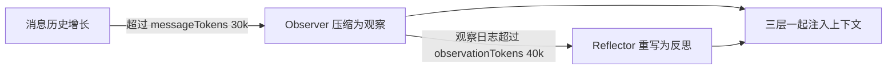

import { Canvas, Controls, Meta } from '@storybook/addon-docs/blocks';
import * as Stories from './observational-memory.stories';

<Meta of={Stories} name="Docs" />

# 观察式记忆

观察式记忆（Observational Memory，OM）是 `@mastra/memory` ≥ 1.1.0 提供的官方推荐记忆方式：两个后台代理——Observer 观察对话、Reflector 压缩观察——把不断增长的消息历史改写为一本「观察日志」。上下文因此始终由三层构成：近期消息（当前任务的原始对话）、观察（Observer 写下的带时间戳条目）、反思（Reflector 对观察日志的整体重写）。读完本课你能判断 OM 何时触发、token 预算怎么配、需要什么存储，以及它与工作记忆、语义召回的分工。



| 配置 | 默认值 | 回查要点 |
| --- | --- | --- |
| `observationalMemory` | `false` | `true` 用默认模型 `google/gemini-2.5-flash`；或传 `{ model: 'openai/gpt-5-mini' }` |
| `observation.messageTokens` | `30000` | Observer 触发阈值，超过即把旧历史压缩为观察 |
| `observation.bufferTokens` | `0.2` | 每次后台缓冲约 20% 阈值（约 6k）；`false` 关闭异步缓冲 |
| `observation.bufferActivation` | `0.8` | 触发后近期消息保留约 20% 阈值（约 6k） |
| `observation.blockAfter` | `1.2` | 超过 1.2 倍阈值（约 36k）转为同步阻塞执行 |
| `reflection.observationTokens` | `40000` | Reflector 触发阈值，观察日志超限即整体重写 |
| `reflection.bufferActivation` | `0.5` | 后台反思从阈值的 50%（约 20k）就开始 |
| `observation.maxRetries` | `8` | 失败重试次数；`failurePolicy` 默认 `'abort'` |
| `scope` | `'thread'` | 必须有有效 `threadId`；`'resource'` 已废弃 |
| `temporalMarkers` | `false` | 空闲 ≥ 10 分钟时插入时间间隔标记 |

## 三层记忆构成

OM 不是在历史后面追加摘要，而是让上下文在两层之间振荡：近期消息随对话增长逼近 `messageTokens` 阈值，Observer 把超出部分压缩成观察条目后，近期消息回落到约 6k 重新积累；观察日志同样增长到 `observationTokens` 阈值后，Reflector 整体重写它，旧信息并入反思层。压缩比通常在 5x–40x 之间，因此同样长度的对话，注入上下文的 token 远小于原始历史。

拖动「对话轮数」回放这个过程（离线示意：每轮固定新增约 9600 token，Observer 压缩比取 5x）：

<Canvas of={Stories.Interactive} />
<Controls of={Stories.Interactive} />

| 读者操作 | 可观察证据 |
| --- | --- |
| 拖动「对话轮数」 | 近期消息到 30k 触发观察后回落到约 6k；观察日志到 40k 触发反思后回落到 12k |
| 看底部时间轴 | 蓝点是观察触发的轮次，橙菱形是反思触发的轮次，随轮次累积 |
| 打开 Show code | 查看 Canvas 实际执行的 `three-layers.ts` 离线模拟 |

最小启用只需要在 `Memory` 的 `options` 里打开开关：

```ts
import { Memory } from '@mastra/memory';
import { LibSQLStore } from '@mastra/libsql';

const memory = new Memory({
  storage: new LibSQLStore({ id: 'memory-storage', url: 'file:./memory.db' }), // OM 必须配受支持的存储
  options: {
    // true 使用默认模型 google/gemini-2.5-flash；也可传 { model: 'openai/gpt-5-mini' }
    observationalMemory: true,
  },
});

const agent = new Agent({ name: 'assistant', model: 'openai/gpt-5-mini', memory });

await agent.generate('记住我最喜欢的颜色是蓝色。', {
  memory: { resource: 'user-123', thread: 'conversation-123' }, // scope 默认 'thread'，thread 必填
});
```

边界：Canvas 是确定性离线模拟；真实运行中触发时机由模型计量、异步缓冲（`bufferTokens`）与 `blockAfter` 共同决定。接入 OM 后客户端只需发送新消息，不必回传完整历史。

## token 预算与选模型

### 调预算

`messageTokens` 决定「多快丢原文」：预算越小，观察触发越频繁，能保留下来的原始对话越少；`observationTokens` 决定观察日志多长时被整体重写。`shareTokenBudget: true` 可把两个预算合并为一个池使用。`observation.bufferOnIdle`（默认 `false`）开启后在一轮对话结束时就开始缓冲，不必等到后台空闲。

### 按输入规模分层选模型

`@mastra/memory` ≥ 1.10.0 的 `ModelByInputTokens` 按「本次要处理的消息量」自动选模型，键是包含上界，超过最大档会抛错：

```ts
import { ModelByInputTokens } from '@mastra/memory';

options: {
  observationalMemory: {
    observation: {
      model: new ModelByInputTokens({
        upTo: {
          5_000: 'openrouter/mistralai/ministral-8b-2512',
          40_000: 'openai/gpt-5-mini',
          1_000_000: 'google/gemini-3.1-flash-lite-preview',
        },
      }),
    },
  },
}
```

模型只需能被 model router 路由，建议选长上下文（128K+）且响应快的模型。

## hooks 与提取器

`observationalMemory.hooks` 分两类：`onObservationStart / onObservationEnd / onReflectionStart / onReflectionEnd` 只做遥测（拿到 `threadId`、`resourceId`、`usage` 等）；`beforeObservation / afterObservation / beforeReflection / afterReflection` 是转换钩子，可以替换 Observer / Reflector 看到与持久化的内容，返回空消息会跳过本次调用但仍把消息标记为已观察。官方在 `@mastra/memory/hooks` 提供 `skillResultRedactor()`，是现成的 `beforeObservation` 钩子，把 skill 工具结果替换为占位符。

`observation.extract` 接受 `Extractor` 列表，在写观察的同时抽取结构化值（内置：当前任务、建议回复、线程标题），结果出现在流事件 `data-om-observation-end` 与 `data-om-buffering-end` 中。

## 存储前置条件

OM 只支持这些存储适配器：`@mastra/pg`、`@mastra/libsql`、`@mastra/mysql`、`@mastra/mongodb`、`@mastra/convex`、`@mastra/oracledb`。存储要配置在 Mastra 实例上，或传给 Agent / Memory 构造器；换其他存储 OM 无法工作。

## 与工作记忆、语义召回的分工

一句话分工：工作记忆靠手动模板维护小块结构化状态，语义召回按向量检索原文片段，OM 则由后台代理自动把历史压缩成观察日志并替换消息历史——官方实践中 OM 同时替代工作记忆和消息历史；需要检索原文时再开 `retrieval: true`（会加一个 `recall` 工具）。详见[工作记忆](?path=/docs/working-memory--docs)与[语义召回](?path=/docs/semantic-recall--docs)。

## 常见问题

- 开启 OM 后运行报错
  先核对两件事：存储是否在上文「存储前置条件」的支持列表里；`scope` 为默认 `'thread'` 时调用是否带了有效 `threadId`。
- 用 `google/gemini-2.5-flash` 时观察日志压不下去
  该模型保留细节太好，Reflector 可能达不到压缩目标；给 `reflection` 单独换一个更倾向压缩的模型。
- 原始消息不见了、历史被「改写」
  这是 OM 的设计行为：超过阈值的历史被压缩为观察。要保留浏览原文的能力，配置 `retrieval: true` 或 `retrieval: { vector: true }` 加回检索工具。

## 总结回顾

摘要：

观察式记忆用后台的 Observer 和 Reflector 两个代理，把增长的消息历史压缩成带时间戳的观察日志，并在日志超限时整体重写为反思，上下文因此稳定在「近期消息 / 观察 / 反思」三层。触发由 `observation.messageTokens`（默认 30000）与 `reflection.observationTokens`（默认 40000）两个预算控制，异步缓冲、`blockAfter` 和 `maxRetries` 决定执行节奏，`ModelByInputTokens` 可按输入规模分层选模型。它要求 pg / libsql / mysql / mongodb / convex / oracledb 之一作为存储；hooks 与 Extractor 提供遥测、内容替换和结构化抽取入口。

一句话：

> 观察式记忆把历史压缩从「你手写模板」变成「后台代理自动写观察」，token 预算就是它的压缩政策。

知识要点：

- 三层分别是什么，Observer 和 Reflector 各在什么阈值触发？
- `messageTokens` 与 `observationTokens` 的默认值和含义是什么？
- OM 支持哪些存储，`scope` 的默认值是什么？
- hooks 的生命周期钩子与转换钩子差别是什么？
- 与工作记忆、语义召回如何分工？

## 参考资料

- [Observational Memory - Mastra Docs](https://mastra.ai/docs/memory/observational-memory)
