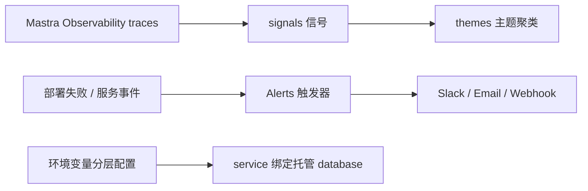

import { Canvas, Controls, Meta } from '@storybook/addon-docs/blocks';
import * as Stories from './platform-ops.stories';

<Meta of={Stories} name="Docs" />

# 平台观测与运维

服务部署到 Mastra Platform 之后，运维对象从业务代码转向三块：**Trace Intelligence** 把 Observability 捕获的 traces 聚类成主题，回答「agent 在做什么」；**Alerts** 在部署失败或服务停止时把事件推给团队，回答「平台哪里坏了」；**托管数据库与平台配置** 决定服务依赖什么数据层与运行参数。本课实例「运维信号面板」可在三个视角间切换，面板内注释与读数行给出配置要点和定位路径。平台三大产品与部署流程见「Platform 入门」（`?path=/docs/mastra-platform--docs`）。

| 对象 | 入口 / 关键值 | 回查要点 |
| --- | --- | --- |
| Trace Intelligence | Studio 侧边栏 Intelligence | 约 100 条 completed traces 后出现 themes；Private beta，仅 deployed Studio |
| 内置信号 | Goal / Outcome / Behavior / Sentiment | 每条可分析 trace 各产生一条 signal；按信号类型独立聚类 |
| Alerts | projects.mastra.ai → organization settings → Alerts | organization 级配置，再选 scope；仅 Organization admins 可管理 |
| 告警触发器 | Deploy failed / Service crashed / Service out of memory | 详见「告警触发器与范围」 |
| 重复频率 Repeat | every event / every 5 minutes / every 15 minutes / every hour | 首条、恢复与升级通知始终立即发送 |
| 托管数据库 | 控制台 service 的 Database 绑定 | 凭据经环境变量注入，先绑定后切换 |

## Trace Intelligence：traces 如何聚成主题

这是 Mastra Platform 的 **Private beta** 功能：基于 Observability 捕获的 traces，先为每条可分析的 completed trace 生成 **signals**（信号），再把相似 signals 聚类成 **themes**（主题）。Studio 用 **relationship flow** 流图展示结果：**node** 是一个 theme（计数为该快照中分配到它的 distinct traces 数），**ribbon** 连接相邻列中同一批 traces 出现的 themes，宽度代表共享 traces 数。流图只表示关联，不是因果或执行顺序。

小主题会并入 **Other**；未稳定匹配主题的归入 **Noise**——它不代表错误或低质量交互，可能只是罕见请求或新模式。主题跨快照会 persist / disappear / split / merge / return；快照是可重叠的滑动窗口，计数不可相加，要同时看计数与份额。

### 四类内置信号与自定义信号

| 信号 | 刻画什么 |
| --- | --- |
| Goal | 用户想完成什么 |
| Outcome | 最终状态：completed / partial / blocked / failed / unresolved / unclear |
| Behavior | agent 的可观察动作：工具使用、遗漏、重试、失败与恢复 |
| Sentiment | 用户的情绪与态度 |

每条可分析的 completed trace 对四类信号各产生一条 signal（外加已启用的 custom signals）；聚类按信号类型独立进行，所以同一条 trace 可以在不同维度属于不同 theme。

自定义信号在 Studio 的 Intelligence → **Signal settings → Create signal** 创建，需提供稳定的 signal name、display label、description 和 signal instructions。定义组织级共享，在 Current project 下启用后只影响该项目及新处理的 traces；修改 instructions 会产生新版本，仅作用于新 traces，定义可 archive / restore。

### 使用门槛与操作路径

- **数量门槛：** 一个 agent 需要约 **100 条 completed traces** 被处理后才会出现初始 themes。不可分析的 trace 不计入；处理是异步的，Traces 计数到 100 后可能还需几分钟。至少 **两个** 信号类型出现 themes 后才显示流图。
- **环境门槛：** Private beta 仅限 enrolled projects 在 **deployed Studio** 中使用，不支持 local Studio 和 server-only 部署；版本至少 `@mastra/core@1.53.0` 与 `mastra@1.20.2`，并重新部署 Studio。加入申请走官方 trace-intelligence 页表单。
- **操作路径：** 侧边栏打开 Intelligence，entity index 显示 analyzed trace count、各信号就绪状态与最近更新；选择 theme 可看描述、快照份额（如 28 of 70 traces (40%)）、示例摘要与趋势，选择会过滤所有列（快照超过 2,000 traces 时过滤不可用，Clear filter 恢复）。Timeline 切快照，Play 播放变化，Compare 对比两个时间点，Lifelines 看主题份额全程走势。

<Canvas of={Stories.Interactive} />
<Controls of={Stories.Interactive} />

| 读者操作 | 可观察证据 |
| --- | --- |
| 视角切到「Trace 聚类」 | 阈值进度条与四类信号列出现；把 completed traces 数调到 100 以上，读数「主题就绪」变为达成 |
| 视角切到「告警规则」并勾选触发器 | 已勾选触发器到 Destinations 的连线出现，读数「已选触发器」同步变化 |
| 打开 Show code | 看到该 Canvas 实际执行的 `ops-signals.ts` |

## Alerts：部署与服务的故障通知

Alerts 在 **organization 级别**配置（仅 Organization admins 可创建和管理，其他角色只读），再选择覆盖哪些 projects 与 environments。入口是 Mastra Platform dashboard（projects.mastra.ai）→ organization settings → **Alerts**，页面分三个 tab：**Alerts** 列出每条告警的 scope、destinations、状态与启用/暂停开关；**Destinations** 管理通知渠道；**Activity** 记录 incidents 与通知尝试。条件持续期间 incident 为 Open，恢复后变为 Resolved。

### 告警触发器与范围

| 触发器 | 触发条件 |
| --- | --- |
| Deploy failed | 构建（build）或部署（deploy）未达到 running 状态 |
| Service crashed | service 耗尽重启策略后停止 |
| Service out of memory | service 因内存耗尽被停止 |

创建告警：Alerts tab → **Create Alert**，表单分四组——**Name**、**Trigger**（可多选）、**Scope**、**Destinations**。Scope 选 **All projects** 或 **Specific projects**；后者可再限定单个 environment，留空则包含该 project 所有环境。Repeat 间隔（every event / 5 / 15 分钟 / 每小时）作用于该告警内所有 triggers 与 projects；第一条通知、恢复通知与严重程度升级始终立即发送。

### 通知渠道 destinations

| 渠道 | 配置与限制 |
| --- | --- |
| Slack | 连接 workspace 后选 channel，每个选中频道是独立 destination；公开频道 app 自动加入，私有频道需先邀请 `@Mastra Alerts` |
| Email | 可选 All organization members、组织角色、单个成员，或最多 **10 个** 外部 email 地址；按角色组建的收件组随成员变动自动更新 |
| Webhook | HTTPS endpoint（必须以 `https://` 开头）；请求带签名，signing secret 仅在创建时显示一次，Rotate secret 立即替换 |

在 Destinations tab → Add destination 建好后可在告警里复用，也可在 Create Alert 表单内直接新建。告警操作菜单提供 **Edit / Test / Delete**，Test 会向所有已分配 destinations 发测试通知。暂停（pausing）一个 destination 只停止通知，不会把它从已有告警中移除；删除告警后历史 incidents 与投递记录仍可查看。

在实例里把视角切到「告警规则」并勾选不同触发器，观察连线与读数变化。

## 托管数据库与平台配置

服务的数据层与运行参数都从控制台配置进入部署，两者共享同一条链路：平台按层下发配置，service 启动时读取。

### 数据库绑定

Platform 提供托管数据库：在控制台的 service 数据库页创建绑定后，平台把连接凭据（如 `DATABASE_URL`）作为**环境变量**注入 service，业务代码只读 env 引用、不硬编码连接串。迁移到托管库按「先绑定、后切换」：先创建托管数据库并完成凭据绑定，再发布新版本改用 env 引用，保留旧连接串作为回滚路径。具体字段与入口以控制台和 configuration 文档页为准。

### 配置分层与入口

平台配置按 **平台 → 项目 → 环境** 分层：组织与项目级设置在 dashboard 完成，环境变量随 environment 注入部署，同一部署在不同环境可拿到不同凭据。其余平台页面在此点名入口：**configuration**（平台配置项）、**regions**（部署区域）、**api**（Platform API），见 mastra.ai/docs/mastra-platform 下对应页面。

## 最佳实践

- 先让 Observability 跑起来、traces 出现在 Traces 页，再进入 Intelligence；不要用重复的测试 prompts 凑数量，会形成不代表真实使用的分布（常表现为几乎全是 Noise）。
- Webhook secret 只显示一次，创建 destination 时先复制保存；要轮换时先更新接收端再 Rotate，否则下一封告警验签失败。
- 告警上线前先用 Test 验证 destinations；scope 从 Specific projects 起步，避免实验项目噪音发到全员频道。
- 切换托管库时回滚只改回旧 env 引用，不动业务代码。

## 常见问题

- 侧边栏没有 Intelligence 入口
  依次检查：项目是否已 enrolled（Private beta）、`@mastra/core` / `mastra` 版本是否达标、Studio 是否已重新部署、Traces 页里是否已有该 agent 的 completed traces。
- 主题几乎全是 Noise
  采集更多代表性流量再观察；重复测试 prompts 会形成不代表真实使用的分布。
- Webhook 收不到通知
  打开 Activity 查投递尝试状态：Scheduled / Sent / Suppressed / Retrying / Exhausted / Config error；出现 Config error 时核对 endpoint 是否 `https://`、signing secret 是否与接收端一致。

## 总结回顾

摘要：

Trace Intelligence 基于 Observability 的 traces 生成 signals 并聚类成 themes：四类内置信号（Goal / Outcome / Behavior / Sentiment）按信号类型独立聚类，流图用 node 与 ribbon 展示主题及其共享 traces 的关联；它要求约 100 条 completed traces、至少两个信号维度有 themes，当前仅对 deployed Studio 的 enrolled projects 开放。Alerts 在 organization 级配置三类触发器（Deploy failed / Service crashed / Service out of memory），经 Slack、Email 或 Webhook destinations 通知，Repeat 间隔之外的首条、恢复与升级通知始终立即发送。托管数据库通过环境变量把凭据注入 service，切换时先绑定后发布；平台配置按平台 → 项目 → 环境分层，configuration / regions / api 页面承载其余入口。

一句话：

> Trace Intelligence 回答「agent 在做什么」，Alerts 回答「平台哪里坏了」，数据库绑定与环境变量分层回答「服务依赖什么」——三者都在平台控制台内完成，不改业务代码。

知识要点：

- Trace Intelligence 出现 themes 需要满足哪些数量与环境条件？
- 四类内置信号分别刻画什么？自定义信号如何创建与生效？
- Alerts 的三类触发器是什么？三类通知渠道各有什么限制？
- incident 的生命周期与 Activity 里的投递状态有哪些？
- 托管数据库的绑定方式与迁移顺序是什么？

## 参考资料

- [Trace Intelligence - Mastra Platform Docs](https://mastra.ai/docs/mastra-platform/trace-intelligence)
- [Alerts - Mastra Platform Docs](https://mastra.ai/docs/mastra-platform/alerts)
