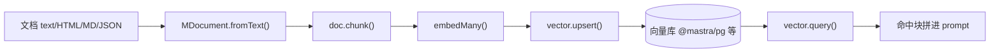

import { Canvas, Controls, Meta } from '@storybook/addon-docs/blocks';
import * as Stories from './rag-pipeline.stories';

<Meta of={Stories} name="Docs" />

# RAG 流水线

RAG（检索增强生成）回答的是「模型不知道私有文档」的问题：先把文档切块、嵌入成向量存进向量库；提问时把问题也嵌成向量，从库里取最相关的几块，拼进 prompt 再交给 Agent。本课给出 Mastra 中这条管道的端到端骨架——加载、切块、嵌入、入库、检索五步，每步一个 API；切块策略、检索过滤等细节由独立课程展开，本课只搭骨架并给最小可复制代码。



五步速查（安装：`npm install @mastra/rag @mastra/pg ai`，换向量库时替换对应适配包）：

| 步骤 | API | 包 | 输入 → 输出 |
| --- | --- | --- | --- |
| 1 加载 | `MDocument.fromText()` | `@mastra/rag` | 原始文本 → 文档对象 |
| 2 切块 | `doc.chunk()` | `@mastra/rag` | 文档对象 → chunk 数组 |
| 3 嵌入 | `embedMany()` | `ai` | chunk 文本 → 向量数组 |
| 4 入库 | `vector.upsert()` | `@mastra/pg` 等 | 向量 + 元数据 → 库中行 |
| 5 检索 | `vector.query()` | `@mastra/pg` 等 | 查询向量 → topK 命中 |

## 快速上手

装好依赖后，一个脚本即可跑通五步。前置条件：Postgres 连接串与 embedding 模型的 API key 走环境变量。

```ts
import { embedMany } from 'ai';
import { MDocument } from '@mastra/rag';
import { PgVector } from '@mastra/pg';
import { ModelRouterEmbeddingModel } from '@mastra/core/llm';

// 1. 加载：也支持 fromHTML / fromMarkdown / fromJSON
const doc = MDocument.fromText(`Mastra 是一个 TypeScript AI agent 框架……`);

// 2. 切块：官方示例取值 recursive / 512 / 50
const chunks = await doc.chunk({ strategy: 'recursive', size: 512, overlap: 50 });
console.log('chunks:', chunks.length);

// 3. 嵌入：每块 text 变成一个定长向量
const { embeddings } = await embedMany({
  model: new ModelRouterEmbeddingModel('openai/text-embedding-3-small'),
  values: chunks.map((chunk) => chunk.text),
});

// 4. 入库：metadata 必须带上块原文，否则检索后拿不回文本
const pg = new PgVector({
  id: 'pg-vector',
  connectionString: process.env.POSTGRES_CONNECTION_STRING,
});
await pg.upsert({
  indexName: 'embeddings',
  vectors: embeddings,
  metadata: chunks.map((chunk) => ({ text: chunk.text })),
});

// 5. 检索：问题文本先做与入库相同的嵌入
const { embeddings: queryVector } = await embedMany({
  model: new ModelRouterEmbeddingModel('openai/text-embedding-3-small'),
  values: ['如何部署到生产环境？'],
});
const results = await pg.query({ indexName: 'embeddings', queryVector: queryVector[0], topK: 3 });

// 6. 增强：命中块的原文拼进 prompt
const context = results.map((r) => r.metadata.text).join('\n');
```

可观察证据：`chunks.length` 打出块数；`results` 按相似度从高到低返回 topK 条，`r.metadata.text` 就是命中块原文。换源内容、调 `size` 或调 `topK`，块数与命中集都会随之变化。

## 管道五站

下面的实例把同一条管道做成离线示意：一份样例文档依次经过五站，每站展示该步产物的形态变化。用「站点」控件步进，对照读数与画面。

<Canvas of={Stories.Interactive} />
<Controls of={Stories.Interactive} />

| 读者操作 | 可观察证据 |
| --- | --- |
| 站点从「加载」切到「检索」 | 五站依次点亮；数据从段落条变成块卡片，再变成向量行，最后出现命中与相似度 |
| 调大「文档段数」 | 站 2 起块数读数增加（段长与块长共同决定块数） |
| 调大「topK」 | 站 5 命中数增加，多出的命中相似度更低 |
| 打开 Show code | 看到 Canvas 实际执行的 `example.ts`（离线模拟，维度压到 8 维便于绘制） |

### 加载 MDocument

`MDocument` 是管道的入口包装：把任意来源的原始内容统一成可切块的文档对象。`fromText` 之外还有 `fromHTML`、`fromMarkdown`、`fromJSON`，按源内容选。加载本身不改内容，只建立后续切块需要的结构。

```ts
import { MDocument } from '@mastra/rag';
const doc = MDocument.fromMarkdown('# 标题\n正文……');
```

### 切块 doc.chunk()

`doc.chunk()` 把长文档切成带元数据的块，是检索质量的第一决定因素：块太大语义稀释，太小上下文不足。官方示例用 `strategy: 'recursive'`、`size: 512`、`overlap: 50`——递归切分、每块约 512、相邻块重叠 50。切块策略与嵌入模型选择详见「切块与嵌入」（?path=/docs/chunking-and-embedding--docs）。

```ts
const chunks = await doc.chunk({ strategy: 'recursive', size: 512, overlap: 50 });
```

### 嵌入 embedMany

`embedMany` 来自 `ai` 包，把每块文本变成一个定长向量；模型用 `ModelRouterEmbeddingModel` 包一个 `provider/model` 字符串。向量维度由模型决定（`text-embedding-3-small` 为 1536），库索引维度必须与之匹配。

```ts
const { embeddings } = await embedMany({
  model: new ModelRouterEmbeddingModel('openai/text-embedding-3-small'),
  values: chunks.map((chunk) => chunk.text),
});
```

### 入库 vector.upsert()

`upsert` 把向量写进索引：不存在则插入，存在则更新，大批量自动分批。`metadata` 按向量一一对应存放块原文——官方明确警告：不存原文，检索后就只剩数值向量、无法还原文本。索引维度建好后不可改，换嵌入模型时需换新索引（用 `createIndex` 指定 `dimension`）。

```ts
await pg.upsert({
  indexName: 'embeddings',
  vectors: embeddings,
  metadata: chunks.map((chunk) => ({ text: chunk.text })),
});
```

向量库不止 pgvector：官方 `@mastra/*` 适配 Pinecone、Qdrant、MongoDB、OracleDB、Chroma、libSQL、Upstash、Weaviate、OpenSearch、Elasticsearch、Azure AI Search、Couchbase、Lance、S3 Vectors 等，API 同为 `upsert / query`。

### 检索 vector.query()

`query` 用查询向量在索引里取最近的 topK 条；结果按相似度从高到低，`metadata` 里取回块原文。问题文本要先走一遍与入库相同的嵌入（同模型、同维度）。部分向量库支持 `queryText` 由库端自动嵌入；元数据过滤与重排详见「检索与重排」（?path=/docs/retrieval-and-rerank--docs）。

```ts
const results = await pg.query({ indexName: 'embeddings', queryVector: queryVector[0], topK: 3 });
```

## 两种用法

- **手动编排**：像上面那样在自己代码里顺序调用五步，适合入库离线跑、检索在业务代码里调用的固定管道。
- **封装成工具**：用 `createVectorQueryTool` 把向量检索包成 agent 工具，让 Agent 自己决定何时检索；官方另有 document-chunker-tool、vector-query-tool、graph-rag-tool 等现成 RAG 工具。工具封装的参数与用法详见「检索与重排」（?path=/docs/retrieval-and-rerank--docs）。

## 常见问题

- 检索报维度不匹配，或换了嵌入模型后旧索引报错
  换一个新 `indexName` 重建索引。向量库索引维度创建时固定且不可修改，必须与嵌入模型维度一致（如 `text-embedding-3-small` 为 1536）。
- 检索拿到的结果没有原文可用
  入库时漏传 `metadata`。`upsert` 的 `metadata` 数组要与向量一一对应，至少包含块原文（如 `{ text: chunk.text }`）。

## 总结回顾

摘要：

Mastra 的 RAG 管道由五步组成：`MDocument.fromText/fromHTML/fromMarkdown/fromJSON` 加载文档，`doc.chunk()` 切块，`ai` 的 `embedMany` 嵌入，向量库 `upsert()` 连同 metadata 入库，`query()` 按 topK 取回最相关块并拼进 prompt。向量库在 `@mastra/pg`、`@mastra/pinecone`、`@mastra/qdrant` 等适配包间可替换，API 一致。用法上有手动编排与 `createVectorQueryTool` 工具封装两条路。

一句话：

> RAG 管道的关键不变量是「同模型同维度」——入库和检索用同一个嵌入模型，索引维度建好后不可改。

知识要点：

- 五步各用什么 API、来自哪个包？
- 为什么 `upsert` 必须带 `metadata` 存块原文？
- 索引维度为什么创建后不可改？换嵌入模型该怎么办？
- 手动编排和工具封装分别适合什么场景？

## 参考资料

- [RAG Overview — Mastra Reference](https://mastra.ai/reference/rag/overview)
- [Vector Databases — Mastra Reference](https://mastra.ai/reference/rag/vector-databases)
