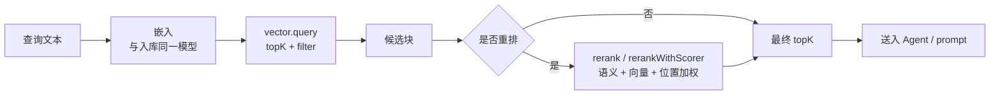

import { Canvas, Controls, Meta } from '@storybook/addon-docs/blocks';
import * as Stories from './retrieval-and-rerank.stories';

<Meta of={Stories} name="Docs" />

# 检索与重排

向量查询负责"快而广"地拿回候选：`vector.query` 按相似度返回 topK 条块记录，`filter` 用统一的 MongoDB 风格语法缩小范围，`createVectorQueryTool()` 再把整套检索封装成 Agent 工具；重排负责"慢而准"地决定最终顺序：`rerank()` 或 `rerankWithScorer()` 用语义、向量、位置三种打分给候选重新排序，再按 topK 截断。本课承接 [5.1 RAG 流水线](?path=/docs/rag-pipeline--docs) 与 [5.2 切块与嵌入](?path=/docs/chunking-and-embedding--docs) 的入库产物，跨文档关联场景见 [5.4 GraphRAG](?path=/docs/graph-rag--docs)。

在下方实例中切换「仅向量序 / 重排加权」并拖动三路权重滑杆：语义相关但向量靠后的候选会前移，进入虚线以上的 topK 名单。



| 对象 / 参数 | 默认值 / 关键取值 | 回查要点 |
| --- | --- | --- |
| `vector.query({ indexName, queryVector, topK, filter })` | `topK` 为返回结果数量上限 | 返回 `text` / `score` / `metadata` 数组 |
| `filter` 操作符 | `$eq` `$ne` `$gt` `$gte` `$lt` `$lte` `$in` `$nin` `$and` `$or` | MongoDB 风格，各 vector store 统一 |
| `createVectorQueryTool({ vectorStoreName, indexName, model })` | `model` 用嵌入模型 | 查询与入库必须同一嵌入模型 |
| `rerank()` 默认权重 | `semantic` 0.4 / `vector` 0.4 / `position` 0.2 | 权重之和必须为 1 |
| `rerankWithScorer` 的 `options.topK` | 官方示例取 10 | 重排之后再截断 |
| 重排前提 | 候选需带 `metadata.text` | 缺失时语义打分不生效 |

## 向量查询

`vector.query` 用查询向量在索引里找最相似的块，是整条检索链的入口。`topK` 指定返回的最相似结果数量上限，每条返回记录都带 `text`（块文本）、`score`（相似度分数）与 `metadata`（入库时写入的元数据）。

```ts
import { PGVectorStore } from '@mastra/pg';
import { ModelRouterEmbeddingModel } from '@mastra/core/llm';
import { embed } from 'ai';

const pgVector = new PGVectorStore({ connectionString: process.env.DATABASE_URL });
const model = new ModelRouterEmbeddingModel('openai/text-embedding-3-small');

// 查询嵌入必须与入库用同一模型，否则相似度分数没有意义
const { embedding } = await embed({ model, value: '如何部署到生产环境？' });

const results = await pgVector.query({
  indexName: 'embeddings',
  queryVector: embedding,
  topK: 10,
  filter: { source: { $in: ['handbook.md', 'faq.md'] } },
});
// results: [{ text, score, metadata }, ...]
```

边界：`topK` 只是上限，实际返回可能更少；`score` 是所选向量库的相似度分，不同库取值含义不完全相同；查询向量与索引维度必须一致（`text-embedding-3-small` 为 1536 维）。

## 元数据过滤

`filter` 用 MongoDB 风格的查询语法写在 `vector.query` 里，各 vector store 统一支持；语义召回（[4.3 语义召回](?path=/docs/semantic-recall--docs)）用的是同一套规范。

| 操作符 | 作用 | 示例 |
| --- | --- | --- |
| 等值 / `$eq` / `$ne` | 等于 / 不等于 | `{ source: 'faq.md' }` |
| `$gt` / `$gte` / `$lt` / `$lte` | 数值比较 | `{ price: { $gt: 100 } }` |
| `$in` / `$nin` | 在 / 不在一组值中 | `{ tags: { $in: ['sale', 'new'] } }` |
| `$and` / `$or` | 逻辑组合 | `{ $or: [{ source: 'a.md' }, { source: 'b.md' }] }` |

代价因库而异：

- **pgVector**：过滤是"先按相似度取回、再逐行过滤"的暴力扫描，HNSW / IVFFlat 索引无法按条件裁剪搜索；结果精确，但命中行越多越慢，给 metadata 列建索引可以加速取回。
- **MongoDB**：只有当 filter 的所有字段都在 `createIndex()` 的 `filterFields` 里声明、且操作符属于上表十种时，filter 才下推到索引；否则回退为"先查 ID 再向量搜索"，ID 集超过 16 MB BSON 限制时大集合查询会失败。

## 检索工具封装

### createVectorQueryTool

`createVectorQueryTool()`（来自 `@mastra/rag`）把「嵌入查询文本 → `vector.query` → 组装结果」封装成一个 Agent 工具，由 Agent 自主决定何时检索。`model` 只负责把查询文本变成向量，连接凭据在实例化 vector store 时配置。

```ts
import { createVectorQueryTool, PGVECTOR_PROMPT } from '@mastra/rag';
import { ModelRouterEmbeddingModel } from '@mastra/core/llm';
import { Agent } from '@mastra/core';

const vectorQueryTool = createVectorQueryTool({
  vectorStoreName: 'pgVector',
  indexName: 'embeddings',
  model: new ModelRouterEmbeddingModel('openai/text-embedding-3-small'),
});

const agent = new Agent({
  name: 'kb-agent',
  model: 'openai/gpt-4o-mini',
  instructions: '回答前先用 vectorQueryTool 检索知识库再作答。' + PGVECTOR_PROMPT,
  tools: { vectorQueryTool },
});
```

两点实践：给工具起业务化的 `name` 与 `description`（如 "SearchKnowledgeBase"），Agent 才能判断何时该检索；各 vector store 包导出的 prompt 常量（`PGVECTOR_PROMPT`、`MONGODB_PROMPT`、`PINECONE_PROMPT` 等）要拼进 `instructions`，教 Agent 该库的过滤语法。

查询时配置通过 `databaseConfig` 按库传入，也可在运行时用 `RequestContext` 的 `databaseConfig` 键覆盖：

| vector store | `databaseConfig` 字段 |
| --- | --- |
| pinecone | `namespace` |
| pgvector | `minScore`、`ef`（HNSW）、`probes`（IVFFlat） |
| chroma | `where`、`whereDocument`（如 `{ $contains: 'API' }`） |
| lance | `tableName`、`includeAllColumns` |

## 相关性重排

向量召回只按相似度排：topK 一大，前面常混入"字面像、主题偏"的候选。重排用比向量搜索更精细的打分（计算开销也更大）给候选重新排序，再按 topK 截断，因此 topK 大、候选噪声多时收益最明显。三路打分共用两个前提：每个候选的 `metadata.text` 必须有文本，否则语义分不生效；权重之和必须为 1。

- **semantic**：语义相关性，用 LLM 或专用重排模型判断"答不答得上这个问题"。
- **vector**：原始向量相似度，召回时已经算出的分数。
- **position**：原始排序位置，权重越大越偏向保住召回顺序。

选择入口：轻量封装用 `rerank()`；需要更换专用打分器（Voyage / Cohere / ZeroEntropy）时用 `rerankWithScorer()`。

<Canvas of={Stories.Interactive} />
<Controls of={Stories.Interactive} />

| 读者操作 | 可观察证据 |
| --- | --- |
| 切换「排序模式」 | 条形顺序与「首位候选」「重排新进 topK」读数变化 |
| 调低「语义权重」、调高「位置权重」 | 顺序回到接近原始向量序，新进候选减少 |
| 调整「topK 截断」 | 虚线上下移动，入选候选数随之变化 |

### rerank()

`rerank(results, query, model, options)` 用一个语言模型给每条候选打语义分，再按权重合成 0~1 的综合分。传入 Cohere 的 `rerank-v3.5` 模型时自动走 Cohere 原生重排，不再逐条调 LLM。

```ts
import { rerank } from '@mastra/rag';

const reranked = await rerank(results, '如何部署到生产环境？', 'openai/gpt-4o-mini', {
  weights: { semantic: 0.5, vector: 0.3, position: 0.2 }, // 不传时默认 0.4 / 0.4 / 0.2
  topK: 3,
});
// 每项：{ result, score, details: { semantic, vector, position } }
```

`details` 把三路分值摊开，便于核对"是谁把某条候选抬进 topK"，其中的 `queryAnalysis.magnitude` 描述查询本身的幅值；`options.queryEmbedding` 可显式传入查询向量，避免重复嵌入。

### rerankWithScorer()

`rerankWithScorer({ results, query, scorer, options })` 把"语义分由谁产生"抽成可替换的打分器：默认选择是 `MastraAgentRelevanceScorer`，生产可换各家专用重排 API；`options.weights` 与 `options.topK` 含义与 `rerank()` 一致。

```ts
import { rerankWithScorer, MastraAgentRelevanceScorer } from '@mastra/rag';

const scorer = new MastraAgentRelevanceScorer('relevance-scorer', 'openai/gpt-4o-mini');
const reranked = await rerankWithScorer({
  results,
  query: '如何部署到生产环境？',
  scorer,
  options: { weights: { semantic: 0.5, vector: 0.3, position: 0.2 }, topK: 10 },
});
```

| 打分器 | 语义分来源 |
| --- | --- |
| `MastraAgentRelevanceScorer(name, model)` | 指定 LLM 当裁判 |
| `VoyageRelevanceScorer({ model: 'rerank-2.5' })` | Voyage 重排 API；query 与单文档合计不超过 32000 tokens |
| `CohereRelevanceScorer('rerank-v3.5')` | Cohere 重排 API |
| `ZeroEntropyRelevanceScorer('zerank-1')` | ZeroEntropy 重排 API |

打分器与 `rerankWithScorer` 一同从 `@mastra/rag` 导入；API key 从环境变量读取（如 `VOYAGE_API_KEY`），也可显式传 `apiKey`。

## 最佳实践

- **先放大召回，再重排收紧。** 向量查询用较大的 `topK`（如 100）保证候选不漏，重排 `options.topK` 取小值（如 3~10）——截断线画在重排分上，被顶出去的才是真正不相关的候选。
- **权重按"信谁"分配。** 从默认 0.4 / 0.4 / 0.2 起步；语义分可信时向 semantic 倾斜（如 0.5 / 0.3 / 0.2）；担心重排结果抖动时保留 position 权重保序。
- **小 topK、干净候选不必重排。** 重排的 LLM / 重排 API 调用是额外开销，topK 只有几条且来源单一时直接用向量序更划算。

## 常见问题

- 重排后顺序纹丝不动，`details.semantic` 缺失或不生效
  检查每条候选的 `metadata.text` 是否带文本；缺失时语义打分会跳过，只剩向量分与位置分。
- 查询结果与预期完全对不上
  确认查询嵌入与入库用的是同一个模型（`ModelRouterEmbeddingModel` 的 `provider/model` 字符串一致、维度一致）。
- 加了 `filter` 之后查询明显变慢
  pgVector 是取回后过滤的暴力扫描，缩小条件帮助有限；MongoDB 把字段声明进 `filterFields` 让 filter 下推到索引。

## 总结回顾

摘要：

向量查询 `vector.query` 用查询向量（与入库同一嵌入模型生成）按相似度取回 topK 条候选，`filter` 以 MongoDB 风格语法在各向量库统一缩小范围，代价因库的下推能力而异；`createVectorQueryTool()` 把整套检索封装成 Agent 工具，配合按库的 `databaseConfig` 与 prompt 常量工作。重排在召回之后用语义、向量、位置三种打分加权重排：`rerank()` 一步到位、传 Cohere `rerank-v3.5` 自动走原生重排，`rerankWithScorer()` 可换 Voyage / Cohere / ZeroEntropy 等专用打分器。重排的收益在大 topK、多噪声候选时最明显，小 topK、干净候选直接用向量序即可。

一句话：

> 向量查询负责快而广地召回，重排负责慢而准地决定最终顺序：先放大 topK 召回，再按权重重排收紧。

知识要点：

- `vector.query` 的四个关键参数是什么？返回记录包含哪些字段？
- `filter` 支持哪些操作符？pgVector 与 MongoDB 上各自的代价差异是什么？
- `createVectorQueryTool` 需要哪些参数？如何挂到 Agent、如何按库传查询时配置？
- `rerank()` 与 `rerankWithScorer()` 怎么选？三种打分的默认权重各是多少？
- 重排语义分生效的前提是什么？

## 参考资料

- [Retrieval Reference - Mastra Docs](https://mastra.ai/reference/rag/retrieval)
- [Rerank Reference - Mastra Docs](https://mastra.ai/reference/rag/rerank)
