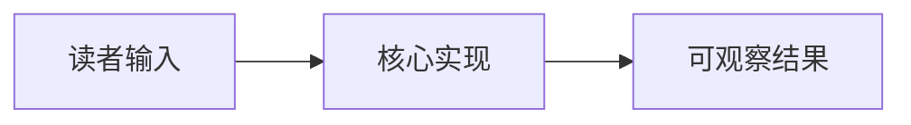

import { Canvas, Controls, Meta } from '@storybook/addon-docs/blocks';
import * as SampleCourse from './sample-course.stories';

<Meta of={SampleCourse} name="Docs" />

# 课程标题

用简短导读讲清本课是什么、做什么，并让读者能够预测调节实例输入后会看到什么结果。

需要图示时，从架构、层级、流程或调用关系等维度中，选择最能帮助读者理解本课“是什么、做什么”的一种，用 Mermaid 辅助导读；文字已经足够清楚时省略图示。

## 主题小节

先解释这个输入代表的主题概念，再通过实例操作和读数核对结论。

<Canvas of={SampleCourse.Interactive} />
<Controls of={SampleCourse.Interactive} />

| 读者操作 | 可观察证据 |
| --- | --- |
| 调整「示例输入」 | 条形长度和左下角两项读数同步变化 |
| 打开 Show code | 看到该 Canvas 实际执行的 `example.ts` |

## 总结回顾

摘要：

用一段话串起正文已经讲清的内容。

一句话：

> 写出本课最重要的判断句。

知识要点：

- 哪个输入会改变实例结果？
- 读数怎样证明正文结论？

## 参考资料

- [替换为本课使用的权威资料](https://example.com)
