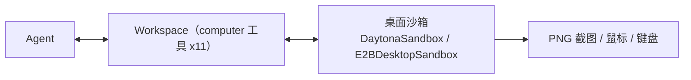

import { Canvas, Controls, Meta } from '@storybook/addon-docs/blocks';
import * as Stories from './sandbox-computer.stories';

<Meta of={Stories} name="Docs" />

# 桌面沙箱

桌面沙箱给 Agent 一个带屏幕、鼠标和键盘的完整桌面 GUI：agent 用 `computer_screenshot` 拿到整桌 PNG 截图来「看」，再用 `computer_click`、`computer_type`、`computer_press_key` 等工具「动手」，形成观察-行动循环。它不是浏览器自动化——只操作网页时走浏览器能力（见 [浏览器自动化](?path=/docs/browser--docs)）；要操作桌面应用、文件管理器或遗留软件时，才用本课的 computer 工具。



关键配置回查（computer 工具经 `WORKSPACE_TOOLS.COMPUTER.*` 配置）：

| 配置项 | 默认值 | 说明 |
| --- | --- | --- |
| `screenshotAfterAction` | `true`（动作类工具） | 每次动作后自动回传一张截图，agent 无需手动补一张 |
| `screenshotDelayMs` | 无（按需设置，如 `1000`） | 回看截图前的等待毫秒数，给界面留出反应时间 |
| `requireApproval` | `false` | 置 `true` 时该工具先暂停等人类审批，再执行 |
| `enabled` | `true` | 与其他 workspace 工具一致的启停开关 |

## 哪些沙箱有桌面能力

只有两个沙箱后端会注册 computer 工具：

- `DaytonaSandbox` —— 支持 computer 能力；
- `E2BDesktopSandbox`（`@mastra/e2b-desktop`）—— 支持 computer 能力。

其余沙箱后端不注册这组工具；resolver 型沙箱（运行时才解析出沙箱实例）也不注册——Workspace 在创建工具列表时无法检查「解析后沙箱」是否具备桌面能力。需要桌面能力时，把沙箱写成静态配置。

## computer 工具族

11 个工具分两类：感知类返回截图或屏幕信息，行动类改变桌面状态。截图以 PNG 原生媒体直接回传给模型，坐标单位是像素。

| 工具 | 类别 | 作用 |
| --- | --- | --- |
| `computer_screenshot` | 感知 | 截取整个桌面，返回 PNG 给模型 |
| `computer_get_screen_info` | 感知 | 读取屏幕尺寸与光标位置 |
| `computer_click` / `computer_double_click` / `computer_right_click` | 行动 | 在像素坐标左键点击 / 双击 / 右键点击 |
| `computer_move_mouse` | 行动 | 移动光标但不按键 |
| `computer_drag` | 行动 | 从一点按住拖到另一点再松开 |
| `computer_type` | 行动 | 向焦点元素键入文本 |
| `computer_press_key` | 行动 | 按键或组合键，如 `Enter`、`ctrl+s` |
| `computer_scroll` | 行动 | 向上 / 向下滚动 |
| `computer_wait` | 行动 | 等待界面稳定 |

最小配置：在 `Workspace` 里按工具键逐项设置。

```ts
import { Workspace, WORKSPACE_TOOLS } from '@mastra/core/workspace';
import { E2BDesktopSandbox } from '@mastra/e2b-desktop';

const workspace = new Workspace({
  sandbox: new E2BDesktopSandbox(),
  tools: {
    [WORKSPACE_TOOLS.COMPUTER.CLICK]: { screenshotAfterAction: true, screenshotDelayMs: 1000 },
    [WORKSPACE_TOOLS.COMPUTER.TYPE]: { requireApproval: true },
  },
});
```

把 `workspace` 挂到 agent 后，这 11 个工具自动进入 agent 工具列表，无需手写工具定义；文档页只给到 Workspace 构造，挂接方式与普通 workspace 一致（见 [Sandbox 与文件系统](?path=/docs/sandbox--docs)）。

## 观察与行动循环

agent 操控桌面不是「一条命令完成任务」，而是循环：先 `computer_screenshot` 观察，根据画面决定坐标与动作，执行后（动作类工具默认自动带回新截图）再确认结果。下面的离线示意演示这条闭环：拖动「循环步进」看 agent 如何从截图走到点击、键入，再回看确认。

<Canvas of={Stories.Interactive} />
<Controls of={Stories.Interactive} />

| 读者操作 | 可观察证据 |
| --- | --- |
| 拖动「循环步进」0→4 | 左侧桌面依次出现菜单展开、光标移动、文本键入；右侧管线高亮当前阶段 |
| 关掉「动作后自动截图」 | 读数「动作后截图」从「是（默认）」变「否」 |
| 保持「键入需审批」开启 | 步进到 `computer_type` 时桌面挂「待审批」，文本不出现；关闭后直接键入 |

两个开关对应真实配置：`screenshotAfterAction: false` 让 agent 只行动不回看，适合已知界面状态的连续操作，代价是动作错了不会立刻被发现；`requireApproval: true` 常配在 `computer_type`、`computer_click` 这类有副作用的工具上，把敏感操作拦在人这里。

`computer_screenshot` 与 `computer_get_screen_info` 是纯感知工具，不走「动作后截图」逻辑——它们本身就是截图或读数。界面有动画、窗口加载慢时，给动作工具配 `screenshotDelayMs`（如 `1000`）再回看，否则截到的是过渡帧。

## 常见问题

- 沙箱跑起来了，agent 却没有 computer 工具？
  确认用的是 `DaytonaSandbox` 或 `E2BDesktopSandbox`；其他后端及 resolver 型沙箱不注册这组工具，resolver 换成静态沙箱配置即可。
- 动作执行了，但回看截图里界面还是旧的？
  这是回看过快截到过渡帧，给该工具加 `screenshotDelayMs`（如 `1000`），或让 agent 显式调用 `computer_wait` 后再截图。

## 总结回顾

摘要：

桌面沙箱把整个桌面 GUI 交给 agent：只有 `DaytonaSandbox` 与 `E2BDesktopSandbox` 会在 Workspace 里自动注册 11 个 computer 工具，`computer_screenshot` 与 `computer_get_screen_info` 负责感知，click/type/press_key/scroll/drag 等负责行动。工具行为经 `WORKSPACE_TOOLS.COMPUTER.*` 配置：动作类默认 `screenshotAfterAction: true` 自动回看，`screenshotDelayMs` 控制回看时机，`requireApproval` 把有副作用的操作拦给人类审批。resolver 型沙箱因能力不可预检而不注册这组工具，需要桌面能力时改用静态配置。

一句话：

> 桌面沙箱的 computer 工具以「截图感知 + 坐标行动」闭环工作，只有静态配置的 Daytona/E2B 桌面沙箱才会注册它们。

知识要点：

- 哪两个沙箱注册 computer 工具，resolver 型为什么不注册？
- 11 个 computer 工具各自做什么，哪两个是纯感知？
- `screenshotAfterAction` 与 `screenshotDelayMs` 如何配合？
- 什么场景该给工具开 `requireApproval`？
- 何时用桌面沙箱而不是浏览器自动化？

## 参考资料

- [Sandbox: Computer Use（桌面沙箱与 computer 工具）](https://mastra.ai/docs/sandbox/computer)
