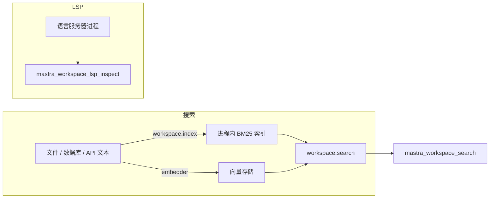

import { Canvas, Controls, Meta } from '@storybook/addon-docs/blocks';
import * as Stories from './sandbox-search.stories';

<Meta of={Stories} name="Docs" />

# 沙箱搜索与 LSP

Workspace 的搜索与 LSP 都在扩展 agent 的「读」能力：搜索把工作区内容（文件、数据库记录、API 响应等任意文本）预先建成分词与向量索引，agent 用一次查询代替逐文件翻找；LSP 接入语言服务器进程，提供类型感知的符号级理解——hover 类型、实时诊断、定义与实现跳转，这些是 read_file / grep 拿不到的信息。两者配置后都以工具形式自动挂到 agent 上，与文件工具互补。



开场参考表（默认值回查）：

| 项 | 默认值 / 规则 | 回查要点 |
| --- | --- | --- |
| search 的 mode | 未传时选当前配置下最佳可用 | bm25 与 vector 都配置 → hybrid |
| search 的 topK | 直连 API 为 10；agent 搜索工具为 5 | minScore 按模式单独调 |
| bm25 参数 | k1 1.5、b 0.75 | 词频饱和 / 文档长度归一化 |
| vectorWeight | hybrid 中 0 全 BM25、1 全向量 | 合成分不裁剪到 0–1 |
| autoIndexPaths | 目录 / glob 最多 10 层 | 不支持 resolver；init 只扫一次 |
| lsp: true | 使用全部内置服务器默认值 | 对象形式可逐项覆盖 |
| maxOpenClients | 省略 = 无上限；Mastra Code 默认 4 | 超限按 LRU 关闭空闲客户端 |
| 内置 LSP 语言 | TS/JS、Python、Go、Rust | 服务器二进制仍需自行安装 |

## 搜索与索引

索引完全独立于文件系统：`index()` 的第一个参数只是文档 ID（写成像路径的样子，Mastra 不读也不创建该文件），索引内容必须手动传入，所以数据库记录、API 响应都能进索引。反过来，写文件也不会更新索引——「写入并可搜索」永远是 `filesystem.writeFile()` 加 `workspace.index()` 两步。

### 三种检索模式

| 模式 | 适合的查询 | 示例 |
| --- | --- | --- |
| bm25 | 精确词、技术词、代码 | useState hook |
| vector | 概念、自然语言问题 | 如何处理用户登录鉴权 |
| hybrid | 混合场景，大多数 agent 搜索 | 两者都配置时的默认值 |

<Canvas of={Stories.Interactive} />
<Controls of={Stories.Interactive} />

| 读者操作 | 可观察证据 |
| --- | --- |
| 切换「检索模式」 | 对应列高亮，读数列出三种模式各自的 Top1 与分数 |
| 切换「查询词」 | 语义查询在 bm25 下几乎没有命中，vector / hybrid 仍能排序 |
| 调整「向量权重」 | hybrid 列的排序在关键词命中与语义命中之间移动 |

边界：三种模式的分数不可互相比较——bm25 返回原始分（不限于 0–1），向量分取决于所选 vector store；hybrid 只在内部对 BM25 做 min-max 归一化后加权，`scoreDetails` 里保留原始分量。`minScore` 要按模式、provider 和内容单独调，不要跨索引复用同一阈值。

### index 与 search

```ts
import { LocalFilesystem, Workspace } from '@mastra/core/workspace';

const workspace = new Workspace({
  filesystem: new LocalFilesystem({ basePath: './workspace' }),
  bm25: true, // 关键词索引，无需外部服务；可调 k1 / b
});

// 文档 ID 任意，内容手动传入；metadata 供向量存储过滤
await workspace.index('docs/auth.md', '登录鉴权设计……', {
  metadata: { category: 'docs' },
});

const results = await workspace.search('authentication flow', {
  topK: 10, // 直连 API 默认 10
  mode: 'hybrid',
  vectorWeight: 0.5,
});
```

vector 模式需要 `vectorStore` 与单文本 embedder；语料大时改用批量 embedder——函数挂上 `batch: true` 与可选 `maxBatchSize`，按同序返回向量（OpenAI 上限 2048、Cohere 96、Voyage 128）：

```ts
const embedder = Object.assign(async (texts: string[]) => embedBatch(texts), { batch: true as const, maxBatchSize: 2048 });
```

结果项 `SearchResult` 含 `id`、`content`、`score`、`lineRange`、`metadata` 与 `scoreDetails`（hybrid 的原始分量分）。

`new Mastra({ workspace })` 只注册不初始化；`await workspace.init()` 触发 autoIndexPaths 扫描并重建进程内 BM25 索引。每次 init 都会重扫与清空重建，不要放进 agent 调用、tool、workflow step 或请求处理器。

### agent 搜索工具

配置搜索后，agent 自动获得 `mastra_workspace_search` 与 `mastra_workspace_index`。索引工具可单独收紧——它每次调用都可能触发 embedding 与向量库写入：

```ts
import { WORKSPACE_TOOLS } from '@mastra/core/workspace';

tools: {
  [WORKSPACE_TOOLS.SEARCH.INDEX]: { requireApproval: true }, // 或 enabled: false
}
```

`requireReadBeforeWrite` 只作用于文件写工具，管不到索引；静态文件系统为只读时，index 工具会被直接排除。

### autoIndexPaths 自动索引

```ts
const workspace = new Workspace({
  filesystem: new LocalFilesystem({ basePath: './workspace' }),
  bm25: true,
  autoIndexPaths: ['docs/**/*.md', 'support/**/*.txt'], // 文件、目录或 glob
});
```

- 目录与 glob 递归最多 10 层；支持 mounts，路径需带挂载前缀（如 `'/docs/**/*.md'`）；不支持 filesystem resolver——init 时还没选定 provider，resolver 内容要手动 index
- init() 只扫描一次，不监听后续变更；大文件先分块，vector 模式同时生成 embedding
- 进程内 BM25 索引不跨进程存活；持久向量索引中，自动索引只替换它读到的文件，可能残留已删除文件的旧文档——向量需跨进程复用时配稳定 workspace id 或 `searchIndexName`（字母或下划线开头，仅字母数字下划线，最长 63 字符；默认是工作区 id 净化后加 `_search`）

删掉文件后索引里的文档仍在，目前没有公开的单条删除 API；要查文件系统的实时状态，用 grep 文件工具而不是索引搜索。

## LSP 符号级理解

语言服务器给 agent 类型感知的符号级理解：hover 出类型与文档、拿实时诊断、跳定义与实现——与 read_file / grep / 索引搜索互补。启用前置缺一不可：

- 静态 sandbox，且进程管理器的进程句柄提供可读输出与可写输入的双向流；不支持 sandbox resolver
- `npm install vscode-jsonrpc vscode-languageserver-protocol`
- 在 sandbox 进程运行处安装语言服务器二进制（内置 TS/JS、Python、Go、Rust 定义，二进制自装，例如 `npm install typescript typescript-language-server`）
- 绝对路径的项目根，且 Mastra 应用与 sandbox 两侧路径一致；只有 filesystem 跑不了语言服务器

### 配置 Workspace.lsp

```ts
import { resolve } from 'node:path';
import { LocalFilesystem, LocalSandbox, Workspace } from '@mastra/core/workspace';

const projectPath = resolve('./workspace');

export const workspace = new Workspace({
  filesystem: new LocalFilesystem({ basePath: projectPath }),
  sandbox: new LocalSandbox({ workingDirectory: projectPath }),
  lsp: { root: projectPath },
});
```

| 配置 | 默认 | 作用 |
| --- | --- | --- |
| root | 无（示例设绝对路径） | 每个文件向上找 project marker 定根目录，失败时回退到 root |
| diagnosticTimeout | agent 检查工具最多等 5 秒 | getDiagnostics() 的等待时长（示例 4000ms） |
| initTimeout | 示例 8000ms | 初始化握手超时 |
| maxOpenClients | 省略 = 无上限；Mastra Code 默认 4 | 超限关闭最近最少使用且无活跃 lease 的客户端 |
| binaryOverrides | 无 | 内置服务器 ID 映射到完整启动命令，如 `typescript: '/opt/... --stdio'` |
| disableServers / searchPaths | 无 | 关闭某服务器 / 追加查找二进制的包根 |
| packageRunner | 默认禁用 | pnpm dlx 类回退，可能装软件或挂起，最后手段 |

其他语言用 `lsp.servers` 注册自定义服务器：必填 `id`（重复内置 ID 即替换）、`name`、`languageIds`、`extensions`（含点）、`markers`（定位项目根）、`command`，可选 `initializationOptions`；文档示例是 phpactor（marker 为 composer.json）。

### agent 工具与直接 API

agent 获得 `mastra_workspace_lsp_inspect`，输入绝对路径 `path`、1 起始的 `line` 与 `match`——复制该行原文，并在要查的符号前恰好插入一个 `<<<` 标记（标记不属于源文件）：

```json
{
  "path": "/absolute/path/to/workspace/src/orders.ts",
  "line": 10,
  "match": "const order = await <<<findOrder(orderId)"
}
```

返回 `hover`、`diagnostics`、`definition`、`implementation`，不可用的字段直接省略。

直接 API 里 `prepareQuery(filePath)` 打开文档并返回 lease；直接客户端的行列是 0 起始，且必须在 finally 里释放：

```ts
const query = await workspace.lsp?.prepareQuery(filePath);
if (!query) return null;
try {
  return await query.client.queryHover(query.uri, { line, character });
} finally {
  query.client.notifyClose(filePath);
  query.release();
}
```

`getDiagnostics()` / `getDiagnosticsMulti()` 则自行管理 lease 与文档开关通知。

边界：LocalFilesystem 的 containment 与 allowedPaths 不约束 LSP——把 `lsp.root` 限定在可信项目，不要对不可信路径暴露 LSP 工具；外部包检查可能解析到 .d.ts；服务器可能省略不支持的结果。远程 sandbox 下 LSP 并非全透明：命令经远程进程管理器运行，但二进制发现与文件读取仍在主机侧，远程项目先靠 grep 与索引搜索。

## 最佳实践

- 实时状态找 grep，概念检索找索引：文件当前内容、精确字符串用 grep 工具；跨文档概念问题用搜索，且写入后补一步 index()。
- 索引有成本：autoIndexPaths 路径收窄、避开依赖与二进制目录，大语料配批量 embedder；不放心 agent 改索引就 enabled: false 或 requireApproval: true。
- LSP 资源有限：maxOpenClients 限流，lease 一律在 finally 释放——泄漏会阻止空闲客户端被驱逐。

## 常见问题

- 写完文件立刻 search 搜不到新内容
  索引不随写文件自动更新：writeFile 后再 index() 完整新内容；删除文件后索引残留且无单条删除 API；要实时结果改用 grep。
- 不同模式或不同索引的分数对不上
  bm25 原始分不限于 0–1，向量分取决于 vector store，跨模式比较没有意义；minScore 按 mode / provider / 内容单独调。
- prepareQuery() 或 getDiagnostics() 返回 null
  maxOpenClients 限制下所有客户端都有活跃 lease 并等满 5 秒；检查是否有 lease 忘记 release。
- agent 没有 lsp 工具，或返回缺少某些字段
  逐项核对前置：双向流进程管理器、两个协议包、语言服务器二进制、两侧路径一致、文件类型有匹配服务器；服务器也可能主动省略不支持的结果。

## 总结回顾

摘要：

Workspace 搜索在文件系统之外维护索引，可用 index() 手动喂入任意文本来源，也可用 autoIndexPaths 自动扫描（最多 10 层、不支持 resolver）；bm25 / vector / hybrid 三种模式分数语义不同，hybrid 通过 min-max 归一化加权合成。agent 侧自动获得搜索与索引工具，可按需禁用或审批。LSP 需要静态 sandbox、双向流进程管理器与语言服务器二进制，配置 Workspace.lsp 后 agent 用 mastra_workspace_lsp_inspect 拿 hover、诊断、定义与实现，也可走 prepareQuery / getDiagnostics 直接 API。

一句话：

> 索引与 LSP 都独立于文件系统状态：写入不会自动进索引，语言服务器不会自己跑起来——前置步骤漏一步，能力就静默缺席。

知识要点：

- 三种检索模式各适合什么查询？hybrid 如何合成分数、为什么分数不能跨模式比较？
- index() / search() 的关键参数与默认值是什么？init() 为什么不能放进请求处理路径？
- agent 侧获得哪些搜索工具？如何禁用或要求审批索引工具？
- autoIndexPaths 有哪些深度与 resolver 限制？向量索引跨进程存活要注意什么？
- 启用 LSP 需要哪些前置？root / maxOpenClients / binaryOverrides 各管什么？
- mastra_workspace_lsp_inspect 的 match 字段怎么写？prepareQuery 为什么必须在 finally 里 notifyClose 加 release？

## 参考资料

- [Workspace 搜索与索引 - Mastra Docs](https://mastra.ai/docs/sandbox/search)
- [Workspace LSP - Mastra Docs](https://mastra.ai/docs/sandbox/lsp)
