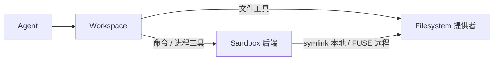

import { Canvas, Controls, Meta } from '@storybook/addon-docs/blocks';
import * as Stories from './sandbox.stories';

<Meta of={Stories} name="Docs" />

# Sandbox 与文件系统

Sandbox 是 agent 的隔离执行环境：运行 shell 命令、执行代码、安装依赖、管理后台进程，适合让 agent 克隆仓库跑构建与测试、批量处理文件、执行长期或并行任务；沙箱通常是临时的，停止、重启或空闲超时后不保证文件与进程仍然存活。`Workspace`（来自 `@mastra/core/workspace`）把沙箱与文件系统包在一起并解析成 agent 的工具；文件系统也可脱离沙箱单独使用，让文件比沙箱活得更久。本课覆盖命令执行与文件挂载；沙箱内的搜索索引与 LSP 见 [6.2.2 沙箱搜索与 LSP](?path=/docs/sandbox-search--docs)，用截图与鼠标操控桌面见 [6.2.3 桌面沙箱](?path=/docs/sandbox-computer--docs)。



| 配置 | 默认值 / 取值 | 回查要点 |
| --- | --- | --- |
| `sandbox` | 不传则无命令工具 | 静态实例或 resolver 函数 |
| `LocalSandbox.isolation` | 默认无原生隔离 | `'seatbelt'`（macOS）/ `'bwrap'`（Linux） |
| `nativeSandbox.allowNetwork` | `false` | 开启原生隔离后默认断网 |
| `networkBlockAll` | 远程后端默认允许出站 | 配合 `domainAllowList` 白名单放行 |
| `filesystem` / `mounts` | 二选一 | 同配抛 `WorkspaceError`，码 `INVALID_CONFIG` |
| `LocalFilesystem.contained` | `true` | 默认限制在 `basePath` 内 |

## Sandbox：隔离执行环境

Workspace 把 `sandbox` 配置（静态实例或 resolver）解析成带进程管理器的沙箱，并生成命令工具挂给 agent；隔离发生在沙箱内部，agent 只能通过工具触达。下面的实例把后端与挂载两个维度并排预览，细节见后续小节。

<Canvas of={Stories.Interactive} />
<Controls of={Stories.Interactive} />

| 读者操作 | 可观察证据 |
| --- | --- |
| 切换「沙箱后端」 | 隔离方式在 Seatbelt/Bubblewrap 与云端沙箱间切换，挂载机制随本地 / 远程变化 |
| 切换「挂载配置」 | agent 可见文件树从单 provider 根变为 `/data`、`/reports`、`/workspace` 多前缀 |
| 打开 networkBlockAll | 中栏网络行变红，读数显示「出站封锁」 |

### LocalSandbox 与原生隔离

`LocalSandbox` 与 `Workspace` 同在 `@mastra/core/workspace`，默认直接在应用宿主机上以应用进程权限执行命令——不隔离、不安全；跑不可信代码前应开启原生隔离。

```ts
import { LocalSandbox, Workspace } from '@mastra/core/workspace';

const workspace = new Workspace({
  sandbox: new LocalSandbox({
    workingDirectory: './workspace',
    isolation: 'seatbelt', // Linux 用 'bwrap'（Bubblewrap）
    nativeSandbox: { allowNetwork: false, readOnlyPaths: ['./reference-data'] },
  }),
});
```

- `isolation: 'seatbelt'` 用 macOS Seatbelt（`sandbox-exec`），Linux 用 `'bwrap'`（Bubblewrap）；`LocalSandbox.detectIsolation()` 可检测当前 OS 是否支持。
- `nativeSandbox` 控制网络、只读 / 可写路径、工作目录写权限与系统二进制，也可传入自定义 Seatbelt profile 或 Bubblewrap 参数。
- 生命周期钩子 `onStart` / `onStop` / `onDestroy`（签名 `({ sandbox }) => ...`）在启动、停止、销毁时执行预热与清理。
- 边界：原生隔离下网络默认阻断；端口入站暴露用 `await sandbox.networking?.getPortUrl(8000)`，与出站访问是两回事。

### 远程后端与 resolver

远程后端把沙箱放进云端隔离环境，可选：AgentCore、Apple Container、Blaxel、Cloudflare Sandbox、Daytona、Docker、E2B、E2B Desktop、Mastra Platform、Modal、Railway、Vercel；都不合适时可自行实现 sandbox provider interface。多用户场景用 resolver 按请求上下文解析沙箱，用 `sandboxCacheKey` 决定复用粒度。

```ts
import { Workspace } from '@mastra/core/workspace';
import { DaytonaSandbox } from '@mastra/daytona';

const workspace = new Workspace({
  sandboxCacheKey: ({ requestContext }) => requestContext.get('user-id') as string,
  sandbox: async ({ requestContext }) => {
    const sandbox = new DaytonaSandbox({
      id: `user-${requestContext.get('user-id')}`,
      networkBlockAll: true,
      domainAllowList: 'registry.npmjs.org,api.github.com',
    });
    return sandbox; // 返回的沙箱由应用负责销毁
  },
});
```

- 共享范围：Mastra 级配置被所有 agent 共用，Agent 级在该实例内共享，resolver 可按 resource 或 thread（`requestContext.get(MASTRA_THREAD_ID_KEY)`）缓存。
- 返回的沙箱由应用销毁：自行调用其 `destroy()` 并 `workspace.clearSandboxCache(cacheKey)`；`workspace.destroy()` 不会销毁它们，`workspace.init()` 也不启动 resolver 沙箱。
- 静态 `mounts` 不能与 sandbox resolver 组合，应在 resolver 内 `await sandbox.mount(filesystem, '/workspace')`。
- 解析前 Mastra 先暴露全部沙箱工具；后端不支持的能力在调用时抛 `SandboxFeatureNotSupportedError`。

### 命令工具与审批

沙箱生成 3 个命令工具；`tools.requireApproval` 让所有生成工具默认经过审批，也可用 `WORKSPACE_TOOLS.SANDBOX.*` 键整体开关或逐工具覆盖。

```ts
import { WORKSPACE_TOOLS } from '@mastra/core/workspace';

tools: {
  requireApproval: true, // 顶层对全部生成工具生效，per-tool 可覆盖
  [WORKSPACE_TOOLS.SANDBOX.EXECUTE_COMMAND]: { enabled: false },
}
```

| 工具 | 功能 |
| --- | --- |
| `execute_command` | 运行 shell 命令，返回 stdout / stderr / 退出码；`background: true` 转后台 |
| `get_process_output` | 读取后台进程输出与状态，支持 `tail` 与 `wait: true` |
| `kill_process` | 停止后台进程并返回最近输出 |

- `get_process_output` 仅在后端支持后台进程时注册；`execute_command` 可配 `backgroundProcesses` 回调（`onStdout(data, { pid })` / `onStderr` / `onExit`）。
- 后台进程默认继承 agent 的 abort signal；设自定义 signal、`null` 或 `false` 可让进程在请求结束后继续。
- 顶层 `enabled: false` 禁用全部生成工具，per-tool `{ enabled: true }` 再逐个放行。

## 文件系统挂载

`filesystem` 与 `mounts` 二选一，都为 agent 提供文件工具；同时配置会在启动时抛 `WorkspaceError`（错误码 `INVALID_CONFIG`）。`mounts` 是「路径前缀 → 提供者」映射，自动组成 `CompositeFilesystem`：按前缀路由、剥离前缀后转发给 provider，挂载路径不可嵌套（不能同时有 `/data` 与 `/data/archive`）。没有沙箱时也可用 `mounts`，此时 agent 只有文件工具。

```ts
import { Workspace } from '@mastra/core/workspace';
import { S3Filesystem } from '@mastra/s3';
import { GCSFilesystem } from '@mastra/gcs';

const workspace = new Workspace({
  mounts: {
    '/data': new S3Filesystem({ bucket: 'agent-data', region: 'us-east-1' }),
    '/reports': new GCSFilesystem({ bucket: 'agent-reports' }),
  },
});
// 单提供者等价写法：filesystem: new S3Filesystem({ bucket: 'agent-data', region: 'us-east-1' })
```

### 提供者与挂载机制

| 提供者 | 包 | 关键参数 |
| --- | --- | --- |
| `LocalFilesystem` | `@mastra/core/workspace` | `basePath`、`allowedPaths`、`readOnly`、`contained` |
| `S3Filesystem` | `@mastra/s3` | `bucket`、`region`、`prefix` |
| `GCSFilesystem` | `@mastra/gcs` | `bucket` |
| AgentFS、Azure Blob、Google Drive、Vercel Files 等 | 各自集成包 | 见官方对应页 |

- 远程沙箱用 FUSE 挂载（沙箱内可能需安装 `s3fs` / `gcsfuse` / `blobfuse2`）；`LocalSandbox` 退而在 `workingDirectory` 内创建 symlink。
- 支持矩阵：`LocalSandbox` 仅支持 `LocalFilesystem`；E2B、Daytona 支持 S3、GCS、Azure Blob；Blaxel 支持 S3、GCS。
- 挂载失败不拖垮 workspace：文件工具仍经 SDK 直连 provider，只是命令工具看不到该路径。
- `filesystem` 可用 resolver 构建 per-user provider（如 S3 `prefix: users/${userId}`）；`mounts` 不接受 resolver；手动 `CompositeFilesystem` 传给 `filesystem` 只做路由、不自动挂载进沙箱。

### 文件工具与安全策略

文件工具共 9 个：`read_file`、`write_file`、`edit_file`（替换匹配文本）、`list_files`、`delete`、`file_stat`、`mkdir`、`grep`（正则搜索）、`ast_edit`（结构化代码编辑，需安装 `@ast-grep/napi`）。策略键在 `WORKSPACE_TOOLS.FILESYSTEM.*` 下（如 `WORKSPACE_TOOLS.FILESYSTEM.WRITE_FILE`），可配审批、read-before-write 与输出限制。

- 文件工具与命令工具策略相互独立：对 `write_file` 要求审批挡不住 `execute_command` 写同一挂载；要限制就只能禁用命令工具。
- `readOnly: true` 时静态 provider 直接移除写入类工具；resolver 场景写入工具仍注册，provider 在运行时拒绝写入。
- composite 里的 `LocalFilesystem` 保持 `contained: true`（默认），仅在有意的无限制主机访问时设 `false`；basePath 之外的目录用 `allowedPaths`。
- 凭据最小权限：没有后端中立的凭据代理，按命令传最小 env，如 `executeCommand('node', ['scripts/download-reports.js'], { env: { REPORTS_READ_TOKEN: ... } })`。

## 最佳实践

- 跑不可信代码必开隔离：本地用 `isolation` + `nativeSandbox`，或直接选远程后端。
- 出站最小化：远程后端 `networkBlockAll: true` + `domainAllowList`；本地原生隔离保持 `allowNetwork: false`。
- 多租户按用户 / 线程隔离：sandbox resolver + `sandboxCacheKey`，用完记得 `destroy()` 与 `clearSandboxCache()`。
- 长期数据放 filesystem 提供者（S3 / GCS 等），不要把临时沙箱当存储。

## 常见问题

- 启动抛 `WorkspaceError`，错误码 `INVALID_CONFIG`
  同时配置了 `filesystem` 与 `mounts`；二选一，多前缀需求并入 `mounts`。
- `workspace.destroy()` 后云端沙箱仍在运行
  resolver 返回的沙箱由应用销毁：自行调用沙箱 `destroy()` 并 `workspace.clearSandboxCache(cacheKey)`。
- 给 `write_file` 设了审批，文件还是被改了
  agent 用 `execute_command` 绕过了文件工具审批；两套工具策略独立，需同时禁用或审批命令工具。
- 命令里 `ls /data` 找不到目录，`read_file` 却正常
  挂载失败或该后端不支持此 provider；文件工具走 SDK 不经挂载，对照支持矩阵并确认沙箱内已装 `s3fs` / `gcsfuse`。
- 重启沙箱后上次的文件与进程没了
  沙箱是临时的，停止 / 空闲超时不保证存活；持久化交给 filesystem 提供者，进程结果及时用 `get_process_output` 收走。

## 总结回顾

摘要：

Sandbox 是 agent 的隔离执行环境，`Workspace` 把静态实例或 resolver 解析成沙箱并生成 `execute_command`、`get_process_output`、`kill_process` 三个命令工具，审批与开关由 `WORKSPACE_TOOLS.SANDBOX.*` 控制。`LocalSandbox` 默认在宿主机直接执行，可开 Seatbelt / Bubblewrap 原生隔离；E2B、Daytona 等远程后端提供云端隔离与 `getPortUrl` 入站暴露，resolver + `sandboxCacheKey` 实现按用户 / 线程复用，但返回的沙箱由应用销毁。文件系统用 `filesystem`（单提供者）或 `mounts`（前缀映射，自动 CompositeFilesystem）二选一，提供 9 个文件工具；远程靠 FUSE、本地靠 symlink 让沙箱看到挂载；文件工具与命令工具的策略相互独立，凭据按命令最小化传入。

一句话：

> 沙箱管命令与进程、文件系统管持久数据；Workspace 把两者解析成 agent 的命令与文件工具，隔离、网络与凭据都按最小权限配置。

知识要点：

- `LocalSandbox` 默认为什么不安全？怎么开启 Seatbelt / Bubblewrap 原生隔离？
- resolver 返回的沙箱由谁销毁？`workspace.destroy()` 会替你销毁吗？
- `filesystem` 与 `mounts` 的区别与互斥约束是什么？
- 远程与本地沙箱分别靠什么机制看到挂载？各支持哪些 provider？
- 对 `write_file` 审批能否拦住命令工具写同一文件？

## 参考资料

- [Sandbox Overview](https://mastra.ai/docs/sandbox/overview)
- [Workspace Filesystem](https://mastra.ai/docs/sandbox/filesystem)
