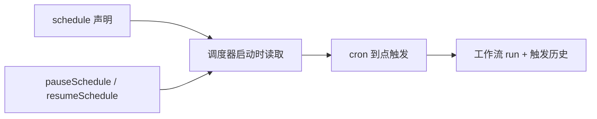

import { Canvas, Controls, Meta } from '@storybook/addon-docs/blocks';
import * as Stories from './scheduled-workflows.stories';

<Meta of={Stories} name="Docs" />

# 定时触发

给 `createWorkflow` 加一个 `schedule` 字段，工作流就交给 Mastra 内建调度器按 cron 自动触发：不需要外部 crontab 或定时任务框架，声明即生效，还能在运行时暂停、恢复，并在 Studio 里查看每次触发历史。本课讲的是**工作流**的定时入口；Agent 级的定时与信号属于 Harness 调度，见 [Harness 调度与信号](?path=/docs/signals-schedules--docs)，两者互不替代。工作流本身的组装方式见 [工作流基础](?path=/docs/workflow-basics--docs)。



`schedule` 可以是单个对象，也可以是对象数组——一个工作流挂多条计划，数组每项必须有唯一稳定的 `id`。

| 字段 | 必填 | 作用 | 缺省行为 |
| --- | --- | --- | --- |
| `cron` | 是 | 触发时刻，5/6/7 段 cron 表达式，构造工作流时即校验 | 无 |
| `timezone` | 否 | IANA 时区，决定「9 点」是哪里的 9 点 | 主机本地时区，生产环境建议显式指定 |
| `inputData` | 否 | 每次触发注入的工作流输入 | 工作流收到空输入 |
| `initialState` | 否 | 本次运行的初始 state | 无 |
| `requestContext` | 否 | 随本次运行附带的请求上下文 | 无 |
| `metadata` | 否 | 随计划行持久化的任意元数据 | 无 |

## schedule 字段

声明 `schedule` 不需要额外的注册调用，调度器在启动时读取它。官方文档的最小例子：

```ts
export const dailyReport = createWorkflow({
  id: 'daily-report',
  inputSchema: z.object({ userId: z.string() }),
  outputSchema: z.object({ ok: z.boolean() }),
  schedule: {
    cron: '0 9 * * *',
    timezone: 'America/New_York',
    inputData: { userId: 'system' },
  },
})
  .then(sendReport)
  .commit();
```

一个工作流要按多条节奏触发时，把 `schedule` 写成数组，每项用 `id` 区分：

```ts
schedule: [
  { id: 'morning', cron: '0 9 * * *', inputData: { window: 'morning' } },
  { id: 'evening', cron: '0 18 * * *', inputData: { window: 'evening' } },
],
```

调度器给每条计划派生一个稳定 id：单对象是 `wf_<workflowId>`，数组是 `wf_<workflowId>__<scheduleId>`。暂停、恢复与 Studio 详情页都认这个 id。

### cron 表达式

5 段格式，从左到右：

| 段位 | 含义 | 示例 |
| --- | --- | --- |
| 1 | 分钟 0-59 | `0`、`*/15` |
| 2 | 小时 0-23 | `9`、`*/6` |
| 3 | 日（月内）1-31 | `*`、`1` |
| 4 | 月 1-12 | `*` |
| 5 | 星期 0-6（0 与 7 都是周日） | `1-5` |

段内支持 `*`（任意值）、`,`（列表）、`-`（区间）、`*/n`（步进）；完整语义还接受 6 段（首位补秒）与 7 段（末位补年）。下面的时间轴把「cron + 时区」换算成未来几次触发时刻，切换预设与时区，对照读数验证理解：

<Canvas of={Stories.Interactive} />
<Controls of={Stories.Interactive} />

| 读者操作 | 可观察证据 |
| --- | --- |
| 切换「schedule.cron」预设 | 时间轴触发点与「cron 解读」读数同步变化 |
| 切换「schedule.timezone」 | 同一 cron 的触发时刻随时区平移，如工作日 10:00 在上海与纽约相差 12 小时 |
| 调整「展望次数」 | 时间轴与列表展示的未来触发个数变化 |
| 打开 Show code | 看到该 Canvas 实际执行的 `example.ts` |

### 声明即注册：事件化执行引擎

声明 `schedule` 后，工作流自动切到 evented 执行引擎，对外的 `start()` / `startAsync()` / `resume()` 等公共 API 保持不变。代价是：evented 运行要求存储适配器支持并发更新（如 `@mastra/libsql`），否则 `createRun()` 会直接抛错——给已有工作流补定时前，先确认存储层满足条件。

## 暂停、恢复与触发历史

运行时管理走 `MastraClient`（`@mastra/client-js`），认的是上一节派生的计划 id：

```ts
import { MastraClient } from '@mastra/client-js';

const client = new MastraClient({ baseUrl: 'http://localhost:4111' });

// 单对象计划：wf_<workflowId>
await client.pauseSchedule('wf_daily-report');
await client.resumeSchedule('wf_daily-report');

// 数组计划：wf_<workflowId>__<scheduleId>
await client.pauseSchedule('wf_daily-report__morning');
```

两个调用都幂等，但语义不对称，用之前先分清：

- **pause 是持久状态**：写进存储、重启后仍生效；重新部署时的声明式 upsert 不会覆盖用户手动设置的状态。
- **resume 从现在起算**：重算 `nextFireAt`，不补跑暂停期间错过的次数（无积压）；需要「追进度」要在工作流逻辑里自己处理。
- 也可以直接调用 HTTP 路由 `POST /api/schedules/:scheduleId/pause` 与 `POST /api/schedules/:scheduleId/resume`，需要 `schedules:write` 权限。

触发历史在 Studio（`mastra dev` 启动后访问 `/workflows/schedules`）查看：

- 列表页展示每条计划的 workflow id、cron、下次触发与最近运行状态，可用 `?workflowId=<id>` 过滤；存在计划的工作流详情页头部会出现 Schedules 入口。
- 计划详情页 `/workflows/schedules/:scheduleId` 提供 Pause / Resume 按钮，并记录每次触发：run id、计划触发 vs 实际触发时间、发布状态；异常时显示 `pending`（触发与 run 快照的竞态）或 `publish failed` 徽标，非终态触发每 5 秒轮询刷新。

重新部署时对 `schedule` 的改动方式也影响结果：改 `cron` 或 `timezone` 会重算下次触发时间；只改 `inputData` / `initialState` / `metadata` 则原地更新、下次触发时间不变；从数组里删除某项，对应计划行会在下次启动时删除。

## 部署约束

内建调度器靠 `setInterval` 心跳循环和进程内 pubsub 驱动，因此要求**长期运行的主机进程**：Fly Machines、Railway、Render、ECS、GKE 等常驻平台可以直接用，生产环境还可以把调度拆到独立 worker 进程。

Serverless 平台（Vercel、Netlify、Lambda、Cloudflare Workers）没有常驻进程，内建调度器不会触发，改用 `@mastra/inngest`：在 Inngest 的 `createFunction` 上配它自己的 `cron`，运行器方案见 [运行器、Workers 与 PubSub](?path=/docs/workflow-runners--docs)。注意 Inngest 承载的计划不出现在 Studio，也不受 `pauseSchedule` / `resumeSchedule` 控制。

## 常见问题

- 部署到 Vercel 或 Cloudflare 后定时任务从不触发
  内建调度器依赖常驻进程的心跳，serverless 上必然失效；换 `@mastra/inngest` 并在 `createFunction` 上配 cron。
- 重新部署只改了 `inputData`，下次触发时间却变了
  只有 `cron` / `timezone` 变更才会重算 `nextFireAt`；先核对这两项是否真的没动，再查计划 id 是否因数组结构变化而指向了另一行。
- 触发历史出现 `publish failed`，或 `createRun()` 直接抛错
  声明 `schedule` 的工作流跑在 evented 引擎上，先确认存储适配器支持并发更新（如 `@mastra/libsql`），不满足时更换存储层而不是调度方式。

## 总结回顾

摘要：

`schedule` 让 `createWorkflow` 定义的工作流由 Mastra 内建调度器按 cron 自动触发：字段支持单对象或多条计划数组，`cron` 必填（5/6/7 段）、`timezone` 用 IANA 名、`inputData` 与 `initialState` 决定每次运行拿到什么。声明即注册，工作流自动切到 evented 引擎，公共 API 不变，但要求存储支持并发更新。运行时用 `MastraClient` 的 `pauseSchedule` / `resumeSchedule` 管理——暂停持久、恢复不补跑，触发历史在 Studio 的 `/workflows/schedules` 查看。部署上内建调度器需要常驻主机进程，serverless 场景用 `@mastra/inngest` 承接。

一句话：

> 给工作流加 `schedule` 就是给它一个 cron 闹钟：声明即注册、暂停持久、恢复不补跑、历史在 Studio。

知识要点：

- `schedule` 单对象与数组两种写法下，计划 id 的派生规则分别是什么？
- `cron` 的 5 段各代表什么？`timezone` 缺省时用的是谁的时区？
- `pauseSchedule` 与 `resumeSchedule` 的持久语义有什么不对称？
- 为什么 serverless 平台上内建调度器不触发？替代方案与它的限制是什么？

## 参考资料

- [Scheduled Workflows - Mastra Docs](https://mastra.ai/docs/workflows/scheduled-workflows)
