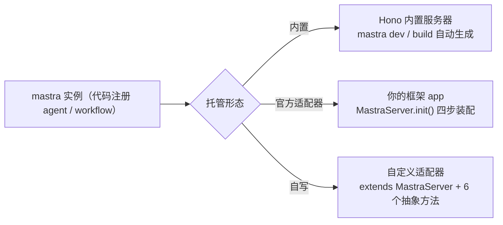

import { Canvas, Controls, Meta } from '@storybook/addon-docs/blocks';
import * as Stories from './server-adapters.stories';

<Meta of={Stories} name="Docs" />

# 服务器适配器

`mastra dev` 与 `mastra build` 会自动生成一台 Hono 内置服务器托管全部 API 路由；服务器适配器让你把同一套路由跑进既有 HTTP 框架。核心对象只有一层：把框架的 `app` 和 `mastra` 实例交给适配器包导出的 `MastraServer`，`await server.init()` 按固定顺序装配 context → auth → 用户中间件 → 路由，Agent 与 Workflow 的执行语义完全不变。官方提供 8 个适配器；框架不在名单时，继承 `MastraServer` 抽象类实现 6 个抽象方法自写一个，再用官方一致性测试套件验证。



8 个官方适配器（`npm install` 对应包即可）：

| 框架 | 适配器包 | 额外依赖 |
| --- | --- | --- |
| Express | `@mastra/express` | — |
| Fastify | `@mastra/fastify` | — |
| Hono | `@mastra/hono` | `@hono/node-server` |
| Koa | `@mastra/koa` | `koa-bodyparser` |
| Elysia | `@mastra/elysia` | `elysia` |
| NestJS | `@mastra/nestjs` | — |
| Next.js | `@mastra/next` | `hono` |
| TanStack Start | `@mastra/tanstack-start` | `hono` |

## 三种托管形态

托管 Mastra 服务有三条路：内置服务器（零代码）、框架适配器（`new MastraServer({ app, mastra })` + `init()`）、自定义适配器（继承抽象类自实现翻译层）。三者最终暴露的 API 路由一致，区别在进程归属、装配方式与可配置面。切换下方控件对比三种形态的进程模型、初始化步骤与适用场景。

<Canvas of={Stories.Interactive} />
<Controls of={Stories.Interactive} />

| 读者操作 | 可观察证据 |
| --- | --- |
| 切换「托管模式」 | 右侧宿主框的装配步骤随之切换，左下角读数给出进程模型、初始化与适用场景 |
| 打开 Show code | 查看 `example.ts` 中三种模式的装配步骤清单 |

边界：与 [9.1 Web 框架集成](?path=/docs/web-frameworks--docs) 的分工——那边讲应用代码里如何调用 agent / workflow（集成模式），本课讲服务托管本体，即把 Mastra 的 API 服务器装进框架进程。

### 内置服务器

`mastra dev` 与 `mastra build` 产物自带一台 Hono 服务器：路由、OpenAPI 文档与 `registerApiRoute()` 自定义路由全部自动装配，`port`、`host`、`cors`、`timeout`、`bodySizeLimit` 直接写在 server config 里。文件式 agent（目录约定）只有这条形态支持，适配器一律要求代码注册。内置服务器与自定义路由的细节见 [8.1.1 Mastra Server 与 API 路由](?path=/docs/server-api--docs)。

```bash
npx mastra dev                   # 默认 127.0.0.1:4111，路由前缀 /api
curl localhost:4111/api/agents   # 可观察证据：返回已注册 agent 列表
```

边界：换用适配器后，`port` / `host` / `cors` / `timeout` / `apiRoutes` 这些 server config 字段不再被读取——端口、CORS 与自定义路由全部由你的框架自己接管。

### 框架适配器

每个官方适配器包导出自己的 `MastraServer` 子类，构造时传入框架 `app` 与 `mastra` 实例。以 Express 为例（Koa 需先挂 `koa-bodyparser`，Hono 用 `@hono/node-server` 启动，NestJS 用 `MastraModule.register({ mastra })` 以模块方式接入）：

```ts
import express from 'express';
import { MastraServer } from '@mastra/express';
import { mastra } from './mastra';

const app = express();
app.use(express.json());
const server = new MastraServer({ app, mastra });
await server.init();
app.listen(4111);
```

`init()` 按固定顺序装配，四个步骤各有对应方法，可拆开手动调用，在步骤之间插入自己的中间件：

| 顺序 | 方法 | 做什么 |
| --- | --- | --- |
| ① | `registerContextMiddleware()` | 给每个请求挂 mastra 实例、requestContext、tools、abortSignal 等上下文 |
| ② | `registerAuthMiddleware()` | 执行 adapter auth hook；内置路由与 `registerApiRoute()` 路由内联鉴权 |
| ③ | `registerUserMiddleware()` | 注册 `server.middleware` 用户中间件（Hono 签名；仅 Hono 系适配器挂载，其余打告警跳过） |
| ④ | `registerRoutes()` | 注册全部 Mastra API 路由；配置了 MCP 时一并注册 MCP 路由 |

```ts
// 手动分步：在 context 与 routes 之间插入请求日志
const server = new MastraServer({ app, mastra });
server.registerContextMiddleware();
app.use((req, res, next) => {
  console.log(req.method, req.url);
  next();
});
server.registerAuthMiddleware();
server.registerUserMiddleware();
await server.registerRoutes();
```

构造参数里的适配器专属配置（server config 的 `auth`、`bodySizeLimit`、`onError`、`middleware` 仍会被读取）：

| 选项 | 默认 | 作用 |
| --- | --- | --- |
| `prefix` | `'/api'` | 路由前缀，如 `'/api/v2'` 时 agent 列表变 `/api/v2/agents`；不影响直接挂在 app 上的自定义路由 |
| `openapiPath` | 不设置则不暴露 | 指定后暴露由路由 Zod schema 与 `createRoute()` 生成的 OpenAPI 文档端点（如 `/openapi.json`） |
| `bodyLimitOptions` | 读 server config 的 `bodySizeLimit` | 覆盖请求体大小限制，可配自定义错误处理 |
| `streamOptions.redact` | `true` | 在 HTTP 边界抹除系统提示词、工具定义、API key 与内部配置；`onStepFinish` 等内部回调仍见全量数据 |
| `customRouteAuthConfig` | — | `Map<METHOD:PATH, boolean>`，`false` 公开、`true` 强制鉴权；方法支持 `GET` / `POST` / `PUT` / `DELETE` / `ALL`，路径支持 `*` 通配 |
| `mcpOptions` | — | MCP 传输选项，如 `setRequestAuth` 从 requestContext 注入认证信息；MCP 路由挂在 `/api/mcp/:serverId/mcp`（Streamable HTTP），无状态，可直接跑在 serverless 环境 |

自定义路由的挂载时机决定能力：`init()` 之前挂拿不到 Mastra context；之后挂可通过 context 拿 mastra 实例、requestContext 与已认证用户。需要 Mastra 托管鉴权（`requiresAuth`）就用 `registerApiRoute()`；直接挂在框架上的原生路由用适配器导出的 `createAuthMiddleware()` 保护。`server.getApp()` 与 `mastra.getServerApp()` 返回同一个 app 实例。

### 自定义适配器

官方 8 个之外的小众框架，从 `@mastra/server/server-adapter` 导入抽象类，带三个类型参数（框架 app / 请求 / 响应类型），实现 6 个抽象方法——本质是把 Mastra 的 `ServerRoute`（path、method、handler、Zod schema）翻译到你的路由系统：

```ts
import { MastraServer } from '@mastra/server/server-adapter';

export class MyServer extends MastraServer<MyApp, MyReq, MyRes> {
  // ① 上下文：挂 mastra / requestContext / tools / abortSignal（A2A 场景含 taskStore）
  registerContextMiddleware(): void {}
  // ② 鉴权：mastra.getServer()?.auth 不存在时跳过；认证失败 401、无权限 403
  registerAuthMiddleware(): void {}
  // ③ 每条 Mastra 路由调用一次：getParams 取参 → parseQueryParams / parseBody 校验
  //    → 组装 handlerParams（url 参数、query、body + mastra、requestContext、tools、abortSignal）
  //    → route.handler → sendResponse；错误状态取 error.status ?? error.details?.status ?? 500
  async registerRoute(app: MyApp, route: ServerRoute, opts: { prefix: string }) {}
  // ④ 归一化提取 URL 参数、query 与 body（框架各自实现，如 req.params / req.query / req.body）
  async getParams(route: ServerRoute, req: MyReq) {}
  // ⑤ 按 route.responseType 分发：json / stream / datastream-response / mcp-http / mcp-sse
  async sendResponse(route: ServerRoute, res: MyRes, result: unknown) {}
  // ⑥ 流式：SSE（data: {...}\n\n，结尾 data: [DONE]）或 NDJSON（\x1E 记录分隔）；
  //    逐块应用 streamOptions.redact，出错时 cancel reader
  async stream(route: ServerRoute, res: MyRes, result: unknown) {}
}
```

用官方一致性测试套件验证适配器行为与内置服务器一致：

```bash
npm install --save-dev @mastra/server-adapters-test-suite @mastra/core @mastra/mcp @mastra/server vitest zod
```

```ts
import { createRouteAdapterTestSuite } from '@mastra/server-adapters-test-suite';
import { executeHttpRequest, setupAdapter } from './adapter-test-helpers';

createRouteAdapterTestSuite({
  suiteName: 'My framework adapter',
  setupAdapter,
  executeHttpRequest,
});
```

该包还导出 MCP、multipart、HTTP 日志与 body limit 等专项测试组；参考实现推荐对照官方 Hono 与 Express 适配器源码。要在自定义适配器旁使用 Studio，运行 `mastra studio` 单独启动 Studio UI。

## 最佳实践

- 配置分层想清楚：`prefix`、`openapiPath`、`streamOptions`、`customRouteAuthConfig` 只写在适配器构造参数；`port`、`cors`、`timeout` 交给框架自身配置——适配器不读后者，两边各管各的不会互相覆盖。
- 需要在装配序列插桩时用手动分步：把日志、限流、租户解析插在 context 之后、routes 之前，自定义中间件即可读到 requestContext。
- streaming 脱敏保持默认 `redact: true`：只对纯内部服务或调试临时关掉，避免系统提示词与工具定义经 HTTP 边界外泄。
- 自写适配器别只靠手工 curl 验证：先对照官方 Hono / Express 适配器源码，再跑 `createRouteAdapterTestSuite` 全量一致性测试，用到 MCP 或文件上传时补对应专项测试组。

## 常见问题

- 适配器起来后 `/api/agents` 404 或 agent 列表为空？
  先确认 `mastra` 实例上是否用代码注册了 agent——适配器不做文件式发现，文件式 agent 只在 `mastra dev` / `mastra build` 下生效；再核对 `prefix` 与请求路径是否一致（默认 `/api`）。
- Express / Fastify / Koa 里 `server.middleware` 配置的中间件没执行？
  用户中间件是 Hono 签名，只有 Hono 系适配器会挂载，其余适配器打告警跳过——把等价逻辑写成框架原生中间件，用手动分步插进装配序列。
- 直接挂在框架上的路由鉴权行为和 `registerApiRoute()` 不一致？
  原生路由不经过 Mastra 托管鉴权：用适配器导出的 `createAuthMiddleware()` 手动保护，或改用 `registerApiRoute()` 交给 Mastra 管；「部分公开、部分强制」的组合用 `customRouteAuthConfig` 声明。

## 总结回顾

摘要：

服务器适配器把 `mastra build` 自动生成的内置 Hono 服务器替换为跑在你自己框架进程里的服务。官方 8 个适配器都以 `new MastraServer({ app, mastra })` 加 `init()` 的固定四步（context → auth → 用户中间件 → 路由）装配，支持手动分步插桩；`prefix`、`openapiPath`、`streamOptions.redact`、`customRouteAuthConfig`、`mcpOptions` 在构造参数层生效，而 `port`、`cors` 等交回框架自管。自定义路由按挂载时机决定能否拿到 Mastra context，鉴权优先交给 `registerApiRoute()`。框架不在名单时继承抽象类实现 6 个抽象方法，并用 `@mastra/server-adapters-test-suite` 验证与内置行为一致。

一句话：

> 适配器只换「谁托管 HTTP」，不换 Mastra 的路由与执行语义——app 与 mastra 实例交给 MastraServer，init() 四步装配即等价内置服务器。

知识要点：

- 8 个官方适配器分别是什么包名，哪几个需要额外依赖？
- `init()` 的四步顺序是什么，什么场景需要手动分步调用？
- `prefix` 与 `streamOptions.redact` 的默认值是什么，分别在哪儿配置？
- 自定义路由挂在 `init()` 前后有什么差别，`registerApiRoute()` 与 `createAuthMiddleware()` 各管什么？
- 自写适配器要实现哪 6 个抽象方法，用什么测试套件验证一致性？

## 参考资料

- [Server Adapters — Mastra Docs](https://mastra.ai/docs/server/server-adapters)
- [Custom Adapters — Mastra Docs](https://mastra.ai/docs/server/custom-adapters)
