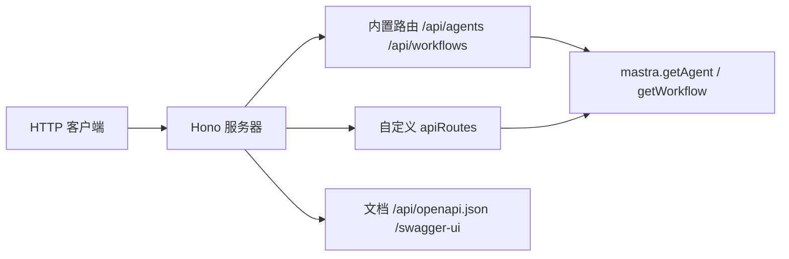

import { Canvas, Controls, Meta } from '@storybook/addon-docs/blocks';
import * as Stories from './server-api.stories';

<Meta of={Stories} name="Docs" />

# Mastra Server 与 API 路由

Mastra 不要求你手写 HTTP 层：`new Mastra({ server })` 中的 agents、workflows 与自定义路由，会被打包成一个基于 Hono 的 HTTP 服务器，本地用 `mastra dev` 启动，`mastra build` 产出可部署的服务器构建。本课覆盖这条 API 面的三类路由——内置 agent/workflow 路由、`registerApiRoute` 自定义路由、OpenAPI 文档路由——以及它们共享的认证与流式默认行为。读完你能预测：一个请求进来会被哪条路由接住、要不要登录、客户端断连后流式生成会怎样。



## 开场参考表

| 配置 | 默认值 | 回查要点 |
| --- | --- | --- |
| `server.port` | `PORT` 环境变量，否则 `4111` | `new Mastra({ server: { port } })` |
| `server.host` | `MASTRA_HOST` 环境变量，否则 `'localhost'` | 对外暴露用 `'0.0.0.0'` |
| `server.auth` | 未配置 | 未配置时所有路由公开 |
| `requiresAuth` | 配置 auth 后默认要求登录 | `requiresAuth: false` 放行单条路由 |
| `server.build.openAPIDocs` / `swaggerUI` | 生产环境默认关闭 | 设为 `true` 在生产开启 |
| 流式数据脱敏 | 默认开启 | system prompt、工具定义、API key 出站前被 redact |

## API 路由总览

服务器把注册的所有 agents 和 workflows 自动暴露为内置 API 路由（形如 `/api/agents/*` 等），无需逐个写 endpoint；你声明的自定义路由挂在同一台服务器上。全部路由（含内置与自定义）汇总在 `GET /api/openapi.json`，浏览器交互探索用 `/swagger-ui`——文档端点生产环境默认关闭，需在 `server.build` 中显式开启。

<Canvas of={Stories.Interactive} />
<Controls of={Stories.Interactive} />

| 读者操作 | 可观察证据 |
| --- | --- |
| 切换「路由类别」 | 表格在三类路由间切换，读数同步显示路由条数 |
| 勾选「配置 server.auth」 | 认证列由「公开」变为「需登录」，仅 `requiresAuth: false` 路由保持「公开」 |

最小服务器配置与验证：

```typescript
import { Mastra } from '@mastra/core';

export const mastra = new Mastra({
  server: {
    port: 3000, // 默认 PORT 环境变量或 4111
    host: '0.0.0.0', // 默认 MASTRA_HOST 环境变量或 'localhost'
  },
});
```

启动后 `curl http://localhost:4111/api/openapi.json` 可见全部路由；`/swagger-ui` 在开发模式或显式开启时可用。

三条边界：

- OpenAI 兼容路由（Responses / Conversations，运行在 Mastra agents、memory 与 storage 之上）目前是实验性能力：用 `agent_id` 选 agent，`previous_response_id` 续接多轮，本课不展开。
- 流式响应在 HTTP 层默认脱敏（redact）：发给客户端前从每个 chunk 移除 system prompt、工具定义、API key 等数据；该行为默认开启，仅可通过 server adapters 配置。
- 服务器如何构建、以什么进程形态启动（build 产物、Server Adapters、平台部署）属于部署主题，见 [部署概览与自托管](?path=/docs/deployment--docs)。

## 自定义路由：registerApiRoute

`registerApiRoute(path, options)` 来自 `@mastra/core/server`，放进 `server.apiRoutes` 数组即注册。handler 收到 Hono Context `c`，用 `c.get('mastra')` 取出 Mastra 实例，直接调用 agents、workflows 或 storage：

```typescript
import { Mastra } from '@mastra/core';
import { registerApiRoute } from '@mastra/core/server';

const inventoryRoute = registerApiRoute('/inventory/:itemId', {
  method: 'GET',
  handler: async (c) => {
    const mastra = c.get('mastra');
    const agent = mastra.getAgent('inventory-agent');
    const itemId = c.req.param('itemId');
    return c.json({ itemId, summary: await agent.generate('总结库存状态') });
  },
});

export const mastra = new Mastra({
  agents: { 'inventory-agent': agent },
  server: { apiRoutes: [inventoryRoute] },
});
```

注册后从服务器根路径直接访问，如 `curl http://localhost:4111/inventory/wd-40`。注意与 `createRoute` 不同：handler 不会自动解构请求体，取 body 用 `await c.req.json()`。单条路由还可以传 `middleware` 数组（Hono 中间件签名 `(c, next)`），做日志、鉴权等前置处理。

## 校验与 OpenAPI 元数据：createRoute + Zod

`createRoute()`（来自 `@mastra/server/server-adapter`）用 Zod schema 声明请求与响应：schema 推断 handler 参数类型，校验失败默认返回 `400`（可用 `onValidationError` 覆盖），并自动生成 OpenAPI 元数据。

```typescript
import { z } from 'zod';
import { createRoute } from '@mastra/server/server-adapter';

const createItem = createRoute({
  method: 'POST',
  path: '/items',
  responseType: 'json',
  bodySchema: z.object({ name: z.string().min(1) }),
  responseSchema: z.object({ id: z.string(), name: z.string() }),
  handler: async ({ name }) => ({ id: crypto.randomUUID(), name }),
});
```

handler 直接拿到校验并解构后的值（`{ name }`），不经过 Hono Context。要让路由带说明地出现在 `/api/openapi.json`，用路由的 `openapi` 字段（`summary`、`tags`、`parameters`、`requestBody`、`responses`），Zod schema 会自动转成 JSON Schema。

## 认证与放行

配置 `server.auth` 后，内置路由与自定义路由默认都要求登录；外部回调（如 GitHub webhook）这类无法带凭据的路由用 `requiresAuth: false` 单独放行，并自行校验签名：

```typescript
import { MastraJwtAuth } from '@mastra/auth';

export const mastra = new Mastra({
  server: {
    auth: new MastraJwtAuth({ secret: process.env.MASTRA_JWT_SECRET }),
    apiRoutes: [
      registerApiRoute('/webhook/github', {
        method: 'POST',
        requiresAuth: false,
        handler: async (c) => c.json({ ok: true }),
      }),
      registerApiRoute('/me', {
        method: 'GET',
        handler: async (c) => c.json({ user: c.get('requestContext').get('user') }),
      }),
    ],
  },
});
```

登录用户信息在 handler 里通过 `c.get('requestContext').get('user')` 读取。未配置 `server.auth` 时所有路由公开，与生产表现不同，联调时注意环境差异。

## 流式路由与断连

流式自定义路由直接返回 agent 的流式响应；把 `c.req.raw.signal` 传给 agent，客户端断开会同步取消生成：

```typescript
registerApiRoute('/stream/:agentId', {
  method: 'POST',
  handler: async (c) => {
    const mastra = c.get('mastra');
    const agent = mastra.getAgent(c.req.param('agentId'));
    const stream = await agent.stream('总结本周变更', { abortSignal: c.req.raw.signal });
    return stream.toTextStreamResponse();
  },
});
```

要让生成在客户端断开后仍完成并持久化（如补写记忆、落库），则不传 signal，改用 `void stream.consumeStream()` 在后台消费完整个流：

```typescript
const stream = await agent.stream(prompt);
void stream.consumeStream().catch((error) =>
  mastra.getLogger()?.error('后台流失败', { error }),
);
```

内置的 `chatRoute()` 默认转发断连 signal。`consumeStream` 是「有意后台继续」的模式，不要默认套在所有流式路由上，否则断开的请求仍会消耗模型调用。

## 最佳实践

- 外部 webhook 一律 `requiresAuth: false` 并自行验签，不要为图省事关掉整个 `server.auth`。
- 自定义路由要进 OpenAPI 文档时，优先用 `createRoute` 的 Zod schema；`registerApiRoute` 则补 `openapi` 字段。
- 断连语义二选一：跟随客户端取消就传 `c.req.raw.signal`；必须跑完就 `consumeStream`，不要在同一条路由里混用。

## 常见问题

- 自定义路由请求返回 401
  配置了 `server.auth` 后默认要求登录：带凭据调用，或确认该路由是否应加 `requiresAuth: false`。
- `/swagger-ui` 打不开
  生产环境默认关闭：开发模式 `mastra dev` 直接可用；生产需设 `server.build.swaggerUI: true`，`openAPIDocs` 同理控制 `/api/openapi.json`。
- 校验失败想返回自定义错误
  在 `createRoute` 上用 `onValidationError` 回调覆盖默认的 `400` 响应。
- 客户端已断开，生成却还在继续
  路由用了 `consumeStream` 且未传 abort signal，属于有意后台消费；想跟随断连取消就传 `abortSignal: c.req.raw.signal`。

## 总结回顾

摘要：

Mastra 把 API 面收敛为一个基于 Hono 的服务器：`new Mastra({ server })` 配置端口与主机，agents 与 workflows 自动暴露为内置路由；`registerApiRoute` 挂载直接拿 Hono Context 的自定义路由，`createRoute` 用 Zod 完成校验与 OpenAPI 元数据。配置 `server.auth` 后所有路由默认需登录，`requiresAuth: false` 放行例外；流式路由在「断连取消」与「`consumeStream` 后台持久化」之间二选一；`/api/openapi.json` 与 `/swagger-ui` 生产默认关闭。

一句话：

> 内置路由开箱即得、自定义路由用 `registerApiRoute` / `createRoute` 挂载，路由清单的唯一可信来源是 `/api/openapi.json`。

知识要点：

- 默认端口与主机是什么？分别从哪个环境变量读取？
- 配置 auth 后，哪类路由仍能保持公开，靠哪个参数？
- `registerApiRoute` 与 `createRoute` 的 handler 各自拿到什么？
- 流式路由如何实现断连取消与后台持久化两种语义？
- 生产环境为什么看不到 Swagger UI，如何打开？

## 参考资料

- [Server Overview](https://mastra.ai/docs/server/overview)
- [Custom API Routes](https://mastra.ai/docs/server/custom-api-routes)
