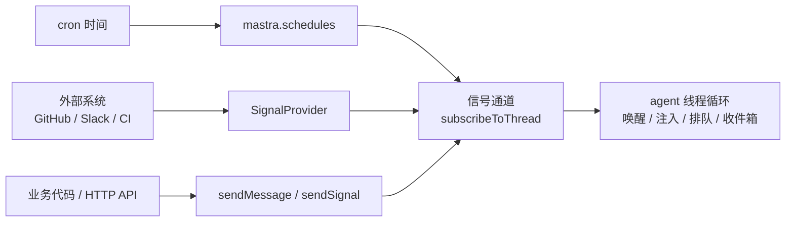

import { Canvas, Controls, Meta } from '@storybook/addon-docs/blocks';
import * as Stories from './signals-schedules.stories';

<Meta of={Stories} name="Docs" />

# 调度与信号

长时运行的 agent 不能只靠用户在对话里输入：巡检报告要按 cron 定时发起，外部系统的事件要主动送进对话。本课覆盖 Mastra 的两套机制——**Schedules**（Beta，`@mastra/core@1.50.0` 起）用 cron 定时触发 agent，**Signals**（Beta，`@mastra/core@1.39.0` 起）向已订阅的线程投递消息与信号；两者在 Threaded 模式共用同一条信号通道，定时触发的 prompt 就是作为信号注入线程的。外部事件源（GitHub、Slack、CI 等）则由 **Signal Providers** 监控后推送信号。

配文实例是一块离线 Canvas：切换 agent 状态与投递类型，读数直接给出注入时机与排队行为，不需要跑真实 agent。



## 核心 API 一览

| API | 归属 | 用途 | 关键边界 |
| --- | --- | --- | --- |
| `mastra.schedules.create / pause / resume / run / update / delete` | Schedules | cron 定时触发与运维 | 需支持 schedules 域的存储；`run` 手动触发一次，不影响节奏 |
| `agent.subscribeToThread(thread)` | Signals | 订阅线程，读 `.stream` | 先订阅后投递；长连接用 `reconnect: true` |
| `agent.sendMessage(input, thread)` | Signals | 用户输入立即投递 | 运行中注入当前循环，空闲时唤醒开流 |
| `agent.queueMessage(input, thread)` | Signals | 保轮次顺序的投递 | 当前 run 结束后再开新 run |
| `agent.sendSignal(signal, thread)` | Signals | 系统级低层上下文 | `type` 取 `notification` 或 `reactive` |
| `agent.sendStateSignal(signal, thread)` | Signals | 线程级状态通道 | `mode` 取 `snapshot` 或 `delta`，`cacheKey` 去重 |
| `agent.sendNotificationSignal(n, thread)` | Signals | 持久通知收件箱 | ingress 到 dispatch 两阶段；需支持 notifications 的存储 |
| `class MyProvider extends SignalProvider` | Providers | 监控外部系统推信号 | 轮询 `poll` 或 Webhook `handleWebhook`；用 `dedupeKey` 去重 |

## Schedules：cron 定时触发 agent

（Beta，`@mastra/core@1.50.0` 起，API 稳定前可能有破坏性变更。）调度器把 agent 的运行交给 cron：每次触发（fire）按模式投递一个 prompt。调度与元数据持久化在存储里，重启、重新部署后依然生效；要求存储适配器支持 schedules 域（如 `LibSQLStore`）。调度器在第一次 `mastra.schedules.create()` 时自动启动。

`cron` 接受 5、6 或 7 段标准表达式（创建与更新时校验），也支持 croner 昵称（`@hourly`、`@daily`、`@weekly`、`@monthly`、`@midnight`）；`timezone` 用 IANA 时区（如 `America/New_York`），省略时按宿主机本地时区解析。

### Threadless：无线程的独立运行

不带 `threadId` 时，每次触发是一次隔离的 `agent.generate()`：结果不写入任何线程，适合巡检、状态报告这类"结果拿走就走"的任务。

```typescript
import { Agent } from '@mastra/core/agent';
import { Mastra } from '@mastra/core';
import { LibSQLStore } from '@mastra/libsql';

const pinger = new Agent({
  id: 'pinger',
  name: 'Pinger',
  instructions: 'Report the current system status in one sentence.',
  model: 'openai/gpt-5.6-sol',
});

const mastra = new Mastra({
  agents: { pinger },
  storage: new LibSQLStore({ id: 'mastra-storage', url: 'file:./mastra.db' }),
});

// 每小时一次；首次 create 后调度器自动启动
await mastra.schedules.create({
  agentId: 'pinger',
  cron: '0 * * * *',
  prompt: 'Give me a status update.',
});
```

### Threaded：经信号机制注入对话

带 `threadId`（及必填的 `resourceId`）时，每次触发变成一次 `sendSignal()`：prompt 以信号进入线程、加入对话上下文。额外字段与信号 API 同构——`tagName` 渲染成 `<check-in>` 这类 XML 标签，`attributes` 变成标签属性；`ifActive: { behavior: 'discard' }` 在线程正在输出时跳过本次触发，`ifIdle: { behavior: 'wake' }` 唤醒空闲线程并可带 `streamOptions`；两种模式都可用 `providerOptions` 向信号负载合并字段。

```typescript
await mastra.schedules.create({
  agentId: 'pinger',
  cron: '0 9 * * 1-5', // 工作日每天 9 点
  prompt: 'Summarize anything new since yesterday.',
  threadId: 'thread-123',
  resourceId: 'user-456',
  tagName: 'check-in',
  attributes: { source: 'cron' },
  ifActive: { behavior: 'discard' }, // 正在输出就跳过，不打断
  ifIdle: {
    behavior: 'wake',
    streamOptions: { requestContext: { locale: 'en-US' } },
  },
});
```

注意边界：`mastra.schedules` 也能调度 workflow（传 `workflowId` + `inputData` 替代 `agentId` + `prompt`），与 `createWorkflow` 上的声明式 `schedule` 字段相互独立；后者见 [scheduled-workflows](?path=/docs/scheduled-workflows--docs)。

### 管理与钩子：mastra.schedules

`mastra.schedules` 是所有调度的统一入口（含 workflow 调度，并暴露为 `/api/schedules` 路由）：

| 方法 | 作用 |
| --- | --- |
| `create` / `update` / `delete` | 增改删；自定义 `id` 可得到可预测的句柄 |
| `pause` / `resume` | 暂停与恢复，持久化，重启不丢 |
| `run` | 立即手动触发一次，不改变 cron 节奏 |

生命周期钩子配在 `Mastra` 构造器的 `schedules` 字段，对所有 agent 调度共用一份，每个钩子上下文都带 `agentId`（及 `schedule`、`trigger`）。钩子抛出的异常会被捕获并记录，不会中断调度器。

```typescript
const mastra = new Mastra({
  agents: { pinger },
  storage: new LibSQLStore({ id: 'mastra-storage', url: 'file:./mastra.db' }),
  schedules: {
    prepare: async ({ agentId, schedule, trigger }) => {
      // 返回覆盖项（如 prompt）；返回 null 跳过本次；返回 undefined 用存储默认值
      return { prompt: `Status as of ${trigger.firedAt.toISOString()}` };
    },
    onFinish: async ({ agentId, outcome, runId }) => {},
    onError: async ({ agentId, phase, error }) => {},
    onAbort: async ({ agentId, runId }) => {},
  },
});
```

钩子时机：`prepare` 在触发前；`onFinish` 在到达非错误、非中止的终态后；`onError` 覆盖 prepare 失败、信号失败与 agent 运行失败；`onAbort` 在运行被中途放弃时。

## Signals：向线程投递消息与信号

（Beta，`@mastra/core@1.39.0` 起。）Signals 让你通过线程与 agent 交互，而不必每次自己调用 `agent.stream()`：唤醒空闲的 agent、把输入送进正在运行的循环，或排队到下一轮。分工原则：**用户输入用消息 API（`sendMessage` / `queueMessage`）**；**系统级低层上下文（后台任务通知、策略提醒、processor 生成的上下文）用 `sendSignal()`**。

入口姿势固定：先 `subscribeToThread(thread)` 拿订阅（`.stream` 异步迭代器，配 `.abort()`），再调投递 API。四种投递 API 在两种线程状态下的落点不同——用下面的离线示意验证（信号空闲侧取 `ifIdle.persist` 示例取值）：

<Canvas of={Stories.Interactive} />

<Controls of={Stories.Interactive} />

### 消息投递：sendMessage 与 queueMessage

`sendMessage` 立即投递：线程运行中，消息成为当前循环的新输入；线程空闲，Mastra 用它直接开一个新流。输入可以是字符串，也可以带 `attributes`——它渲染为 `<user>` 标签的 XML 属性，让模型知道消息从哪来。

```typescript
const thread = { resourceId: 'user_123', threadId: 'thread_456' };
const subscription = await agent.subscribeToThread(thread);

await agent.sendMessage(
  { contents: 'Use the latest customer note too.', attributes: { name: 'Jane', sentFrom: 'slack' } },
  thread,
); // 模型收到 <user name="Jane" sentFrom="slack">…</user>

for await (const chunk of subscription.stream) {
  console.log(chunk);
}
```

`queueMessage` 不打断当前 run：排队等它结束后，在同一线程上开一个新 run，保住轮次顺序（空闲时同样立即开始）。返回句柄带 `.accepted` 与 `.signal.id`，排队中的消息可取消：

```typescript
const queued = agent.queueMessage('Also check whether the tests need updates.', thread);
await queued.accepted;

const { cancelledSignalIds } = agent.cancelQueuedMessages({
  ...thread,
  signalIds: [queued.signal.id],
});
```

### 系统信号：sendSignal 与 sendStateSignal

`sendSignal` 投递系统级上下文，`type` 是语义类型：保留值 `notification`（外部事件）与 `reactive`（processor / 运行时生成）。`reactive` 默认 `tagName: 'system-reminder'`，渲染成 `<system-reminder …>` 标签；通知型渲染成 `<notification source="github" pr="123">…</notification>`。标签与属性名必须 XML 安全：字母、数字、点、连字符、下划线，且以字母或下划线开头。

```typescript
const result = agent.sendSignal(
  { type: 'notification', contents: 'GitHub CI failed on PR #123: 3 tests failed.' },
  { resourceId: 'user_123', threadId: 'thread_456', ifIdle: { behavior: 'persist' } },
);
await result.persisted; // 空闲线程：先持久化，随下一次运行注入
```

`sendStateSignal` 维护线程级状态通道（lane）：`id` 标识通道，`mode` 取 `snapshot` 或 `delta`，生产方持有 `cacheKey`——相同 `cacheKey` 加 `mode` 且仍是最新的重复投递会被跳过。processor 可通过 `stateId` 加 `computeStateSignal()` 认领通道，在每个模型输入步之后自动计算（内置的 browser 上下文 processor 就运行在 `browser` 通道上）。

### 通知收件箱：sendNotificationSignal

`sendNotificationSignal` 写一条持久收件箱记录，字段：`source`、`kind`、`priority`、`summary`、`payload`、`dedupeKey`。投递分两阶段：**ingress** 先入库并结算投递策略；**dispatch** 消费到期记录，发出完整通知或摘要（摘要渲染为 `<notification-summary pending="10">…</notification-summary>`）。默认策略按优先级：urgent 立即投递，低优先级可能合并成摘要或等空闲。记录会打上 `deliveredSignalId` / `summarySignalId` 等标记；收件箱工具若先读走，可注入完整信号并标记 `seen`，避免重复投递。

```typescript
await agent.sendNotificationSignal(
  {
    source: 'github',
    kind: 'ci-status',
    priority: 'high',
    summary: 'CI failed on main: 3 tests failed.',
    payload: { repository: 'acme/app', branch: 'main' },
    dedupeKey: 'github:acme/app:main:ci',
  },
  thread,
);
```

边界：通知收件箱要求存储支持 notifications 域（libSQL、PostgreSQL、MongoDB 适配器已支持，经 `getStore('notifications')` 访问）；投递策略在 Agent 上配 `notifications.deliveryPolicy`，调度式 dispatch 配在 `Mastra` 类上；`createNotificationInboxTool()` 可给 agent 一个收件箱工具。

## Signal Providers：外部事件源

Signal Providers（Beta）把"监控外部系统并推送信号"封装成独立组件：继承 `SignalProvider` 基类，监控 GitHub、Slack、CI 等，按需向线程调 `sendNotificationSignal()`。基类支持两种模式——**轮询**（设 `pollInterval`，实现 `poll()`，适合 GitHub API 这类可查询源）与 **Webhook**（实现 `handleWebhook()`，由回调驱动）。通知记录自带 `dedupeKey` 去重，轮询重复拉到同一事件不会重复入箱。只想一次性推一条通知时不必写 Provider，直接调 `sendNotificationSignal()` 即可。

## 最佳实践

- **先选消息还是信号。** 用户说的话走 `sendMessage` / `queueMessage`（渲染为 `<user>`，带发言者属性）；系统提醒、后台结果、processor 上下文走 `sendSignal`（渲染为 `<notification>` / `<system-reminder>`）。混用会让模型分不清"谁在说话"。
- **定时注入对话要防打断。** Threaded schedule 配 `ifActive: { behavior: 'discard' }`，避免 cron 触发打断正在进行的输出；巡检类任务用 Threadless，别为了"留痕"硬塞进对话线程。
- **多实例部署必须换掉默认 pub/sub。** 内存实现不能跨实例；serverless 上一次追加输入可能开第二个 run，线程被处理两次。用 `@mastra/redis-streams` 的 `RedisStreamsPubSub`（同时负责事件投递与分布式租约），所有实例共用同一 `keyPrefix`。
- **外部事件先想 dedupeKey。** 轮询与 webhook 并存时，稳定的 `dedupeKey` 是防止同一事件重复入箱的唯一防线。

## 常见问题

- **Serverless / 多实例下，同一线程被处理两次？**
  默认内存 pub/sub 不跨实例，投递可能落到另一个实例并开第二个 run。部署 `RedisStreamsPubSub` 并统一 `keyPrefix`。
- **通知收到摘要后想读全文，或担心重复投递？**
  入箱时写稳定 `dedupeKey`；摘要只置 `summaryAt` / `summarySignalId`，记录仍待读。用 `createNotificationInboxTool()` 的 `read` 读全文，记录标记 `seen` 后不再重复投递。
- **信号没有以 XML 标签呈现给模型？**
  检查 `tagName` 与属性名是否 XML 安全（字母或下划线开头，仅含字母、数字、点、连字符、下划线）。
- **调度钩子里的报错去哪了？**
  钩子异常会被捕获并记录日志，不会重触发也不会中断调度器；不要在钩子里重新投递或路由到其他钩子。

## 总结回顾

摘要：

Schedules 用 cron 让 agent 定时运行：Threadless 模式每次触发是一次独立的 `agent.generate()`，Threaded 模式把 prompt 作为信号注入线程，复用 `sendMessage` 同一套投递语义（`ifActive` / `ifIdle`）；所有调度经 `mastra.schedules` 统一管理，`pause` / `resume` 持久化，`run` 手动触发一次而不影响节奏，钩子在 `Mastra` 构造器统一配置。Signals 负责向线程投递：消息 API 承接用户输入（运行中注入、空闲唤醒、`queueMessage` 保轮次），`sendSignal` 承接系统级上下文并渲染为 XML 标签，`sendStateSignal` 维护快照与增量状态通道，`sendNotificationSignal` 提供两阶段持久通知收件箱。外部事件源由 Signal Providers 轮询或 Webhook 监控后推送，靠 `dedupeKey` 去重；跨实例部署要换上 Redis pub/sub。

一句话：

> 用户输入走消息 API，系统上下文走 `sendSignal()`；Threaded 调度只是把同一套信号投递交给 cron。

知识要点：

- Schedules 两种触发模式各适合什么场景，`ifActive` / `ifIdle` 各控制什么。
- 四种投递 API 在空闲 / 运行中线程上的落点差异。
- `sendSignal`、`sendStateSignal`、`sendNotificationSignal` 各自的字段、去重与渲染标签。
- 通知收件箱的两阶段投递，以及需要的存储域支持。
- 信号以什么 XML 标签呈现给模型，标签命名有什么约束。
- 多实例部署时为什么要配 `RedisStreamsPubSub`。

## 参考资料

- [Signals](https://mastra.ai/docs/harness/signals)
- [Schedules](https://mastra.ai/docs/harness/schedules)
