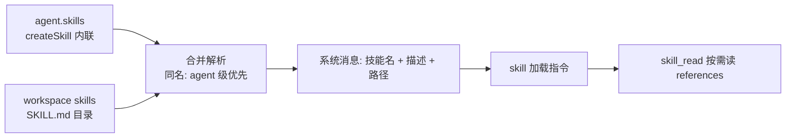

import { Canvas, Controls, Meta } from '@storybook/addon-docs/blocks';
import * as Stories from './skills.stories';

<Meta of={Stories} name="Docs" />

# Skills 技能包

技能包（Skills）是遵循 [agentskills.io](https://agentskills.io) 规范的可复用任务指令包：一段「什么时候用、按什么流程做」的方法论，外加按需读取的参考材料。挂载后 Agent 自动获得 `skill` / `skill_read` / `skill_search` 三个工具，模型在对话中按需发现并加载指令，而不是把所有方法论预先塞进系统提示词。定义位置有两种且互补：agent 级用 `createSkill` 内联（单 agent 私有、纯代码、可按请求动态解析）；workspace 级在文件系统上放 `SKILL.md` 目录（自动发现、所有用该 workspace 的 agent 共享）。



| 关键项 | 值 / 规则 |
| --- | --- |
| `createSkill` 参数 | `name` / `description` / `instructions` / `references`（页未标注默认值） |
| `skills` 三种写法 | 内联对象数组 / 文件路径数组 / 动态解析函数 |
| 注入工具 | `skill` / `skill_read` / `skill_search` |
| 同名优先级 | agent 级 > 本地项目路径 > `.mastra/skills` > node_modules |
| glob 深度 | 最多向下 4 层目录 |
| 编程访问 | `agent.getSkill(name)` / `agent.listSkills()` |

## agent 级技能：createSkill

`createSkill` 从 `@mastra/core/skills` 导入，用代码把一条任务方法论打包给单个 Agent，不依赖 workspace、可直接随库分发。`instructions` 是主流程指令（支持 Markdown），`references` 是附带参考文档对象，相当于文件系统技能的 `references/` 目录，agent 用 `skill_read` 按需读取。

```ts
import { Agent } from '@mastra/core/agent';
import { createSkill } from '@mastra/core/skills';

const codeReview = createSkill({
  name: 'code-review',
  description: 'Use when reviewing code changes.',
  instructions: '审查主流程：先跑 lint，再逐文件检查……',
  references: {
    'style-guide': '评审标准细则……', // 由 skill_read 按需读取
  },
});

export const reviewer = new Agent({
  id: 'reviewer',
  model: 'openai/gpt-5.6-sol',
  instructions: 'You are a code review assistant.',
  skills: [codeReview],
});
```

挂载后模型看到的系统消息中会出现技能名、描述、路径与来源类型，这是「可发现性」的来源：模型靠 description 判断何时调用 `skill` 工具加载完整指令。

### skills 配置的三种写法

`skills` 除了内联对象，还能直接给文件路径（底层用 `LocalSkillSource` 读 `SKILL.md`，无需 workspace），或给一个按请求解析的函数：

```ts
// 混合写法：路径 + 内联
skills: ['./skills/code-review', './skills/testing', createSkill({})]

// 动态解析：每个 RequestContext 运行一次
skills: ({ requestContext, tracingContext }) => {
  const role = requestContext.get('userRole');
  return role === 'developer' ? [devSkill] : [supportSkill];
}
```

动态 resolver 的边界：agent 执行期它在 `resolve-skills` span 内运行，可用 `tracingContext.currentSpan.createChildSpan()` 建子 span；但 `agent.listSkills()` 与服务端元数据端点也会触发 resolver，此时没有 span（`currentSpan` 为 undefined），对 span 的操作要加 `?.` 防护，并保持 resolver 快速。

### 编程访问

```ts
const skill = await reviewer.getSkill('code-review');
if (skill) console.log(skill.instructions);

const all = await reviewer.listSkills(); // 含 name / description 的元数据列表
for (const meta of all) console.log(`${meta.name}: ${meta.description}`);
```

## workspace 级技能：SKILL.md 目录

按 agentskills.io 规范把技能放到文件系统目录，`Workspace` 自动发现它们，并共享给所有使用该 workspace 的 agent。Workspace 与文件系统的完整机制见 [6.2.1 Sandbox 与文件系统](?path=/docs/sandbox--docs)。

```ts
import { LocalFilesystem, Workspace } from '@mastra/core/workspace';

export const workspace = new Workspace({
  filesystem: new LocalFilesystem({ basePath: './workspace' }),
  skills: ['skills'], // 相对 filesystem 根；无 filesystem 时从进程 cwd 读取
});
```

每个技能是一个目录，必须含 `SKILL.md`，可含支持文件：

```plaintext
code-review/
  SKILL.md          # YAML frontmatter（name/description）+ 主流程指令
  references/       # 详细材料，skill_read 按需读取
    style-guide.md
  scripts/
    lint.ts
  assets/
    review-template.md
```

frontmatter 规则：`name` 与 `description` 必需；`name` 必须与目录名一致，最多 64 个小写字母/数字/连字符，不以连字符开头结尾、无连续连字符。可选字段：`license`、`compatibility`、`user-invocable`、`metadata`。

`skills` 路径支持目录、glob 与动态函数：

| skills 路径 | 行为 |
| --- | --- |
| `skills` | 扫描各子目录找 `SKILL.md` |
| `skills/code-review` | 直接加载单个技能目录 |
| `skills/code-review/SKILL.md` | 直接加载单个文件 |
| `./**/skills` | glob 找目录后发现技能 |
| `./**/SKILL.md` | glob 找文件加载 |

glob 最多向下遍历 4 层目录。路径也可以是每次执行时解析的函数（如按 `requestContext` 追加 `developer-skills`），或换成自定义 `skillSource`（如 `CompositeVersionedSkillSource`，此时缺失路径不会回退到 filesystem 或本地磁盘）。

## 发现与加载：优先级与合并

agent 级与 workspace 级技能会合并到同一个 Agent 上，但同名时不是报错而是按来源分层解析。在实例里切换技能存放位置，观察发现顺序、同名冲突的最终生效者与注入工具的变化。

<Canvas of={Stories.Interactive} />
<Controls of={Stories.Interactive} />

| 读者操作 | 可观察证据 |
| --- | --- |
| 「agent 级技能」切到「内联同名 code-review」 | 项目与全局目录里的同名技能被划掉，读数显示 agent 级内联生效 |
| 「workspace 来源」切「两者并存（同名冲突）」 | 项目目录技能排在全局之前，同名时项目目录生效 |
| 三个来源全部「不挂载」 | 读数显示未挂载任何技能、不注入技能工具 |

完整规则：agent 级与 workspace 级同名时 agent 级优先；workspace 级内部按「本地项目路径 > `.mastra/skills` 托管路径 > `node_modules` 外部路径」解析，同优先级出现多个候选会直接抛错——此时可用系统消息里显示的精确路径绕过按名解析；同一规范目录的多个路径视为别名，只列出一次。

## 注入的工具与搜索

只要挂载了任意技能，Agent 就自动获得三个工具，无需手动注册：

| 工具 | 作用 | 边界 |
| --- | --- | --- |
| `skill` | 加载 SKILL.md 指令并列出 references / scripts / assets 文件 | 无状态，上下文被压缩后可重新调用 |
| `skill_read` | 按需读取技能目录下任意文件的部分或全部内容 | 供 `references` 与内联 `references` 复用 |
| `skill_search` | 搜索指令与引用文件内容 | 配 BM25 / 向量搜索时自动索引 SKILL.md 与 references（scripts、assets 不索引）；否则退化为大小写不敏感的文本匹配 |

## 最佳实践

- **按共享范围分工。** 单 agent 私有流程用内联 `createSkill`（可打包进库、可按 `requestContext` 动态解析）；跨 agent 共享的方法论放 workspace 的 SKILL.md 目录（改 Markdown 即生效，所有 agent 同步可见）。
- **instructions 只放主流程。** 详细材料移入 `references/`，靠 `skill_read` 按需读取，避免把整套方法论预注入上下文。
- **写入 SKILL.md 前先校验。** 应用若会通过工具、上传或 shell 命令产生 SKILL.md，先用 `validateSkillContent({ content, directoryName })` 校验（含 `name` 与目录名一致），它返回 `{ valid, errors, warnings }` 结构化结果而不抛异常；已有解析后的 frontmatter 对象用 `validateSkillMetadata`。

## 常见问题

- 两个来源出现同名技能，最终用哪个？
  按来源分层：agent 级 > 本地项目 > `.mastra/skills` > node_modules；同一优先级内有多个候选会直接抛错，改用系统消息里的精确路径即可绕过按名解析。
- 动态 skills 函数里 `tracingContext.currentSpan` 是 undefined？
  `agent.listSkills()` 与服务端元数据端点也会运行 resolver，此时没有执行 span；对 span 调用加 `span?.` 防护，并保持 resolver 快速，避免拖慢元数据读取。
- `skill_search` 搜不到 references 里的内容？
  未配置 BM25 / 向量索引时只做大小写不敏感文本匹配，且 scripts 与 assets 不参与索引；需要语义检索就为 workspace 配置搜索索引。

## 总结回顾

摘要：

技能包把「何时做什么」的方法论从系统提示词搬进可发现、可按需加载的单元。agent 级用 `createSkill` 内联定义，支持路径与动态函数两种 `skills` 写法之外的纯代码形态；workspace 级按 agentskills.io 规范以 SKILL.md 目录存放，由 `Workspace` 自动发现并共享给所有使用它的 agent。挂载后自动注入 `skill` / `skill_read` / `skill_search` 三个工具，模型靠系统消息中的名称与描述发现技能，按需加载指令与参考资料；同名冲突按 agent 级 > 本地项目 > `.mastra/skills` > node_modules 的顺序解析。

一句话：

> 单 agent 私有方法论用内联 createSkill，跨 agent 共享方法论放 workspace 的 SKILL.md 目录，注入的三工具让模型按需取用而不是全文预载。

知识要点：

- `createSkill` 的 `name` / `description` / `instructions` / `references` 各承担什么？
- `skills` 配置有哪三种写法，动态函数在什么时机运行、要注意什么？
- 同名技能按什么顺序决定最终生效者？
- 三个注入工具分别解决什么问题，`skill_search` 的索引条件是什么？
- SKILL.md 的 frontmatter 有哪些硬性规则，写入前用什么校验？

## 参考资料

- [Mastra Docs — Skills（agent 级）](https://mastra.ai/docs/skills)
- [Mastra Docs — Sandbox：文件系统技能](https://mastra.ai/docs/sandbox/skills)

