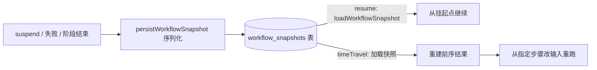

import { Canvas, Controls, Meta } from '@storybook/addon-docs/blocks';
import * as Stories from './snapshots-and-time-travel.stories';

<Meta of={Stories} name="Docs" />

# 快照与时间旅行

工作流一旦挂起、失败或进程重启，内存里的执行状态就没了；快照把一次 run 的完整执行状态序列化后存进 `workflow_snapshots` 表，让状态可以落盘、取回、重建。时间旅行（`run.timeTravel()` / `timeTravelStream()`）则建立在快照之上：不从头重跑，而是指定任意步骤，复用快照中之前步骤的结果，只从该步骤起带着新输入重新执行——调试失败步骤、重试瞬态故障都靠它。下面的实例用一次「外部 API 临时故障 → 修正输入重跑」的动画展示这条分叉轨迹。



开场参考表（回查默认值与关键入口）：

| 关键项 | 值 / 入口 | 说明 |
| --- | --- | --- |
| 存储表 | `workflow_snapshots` | 以工作流名 + `runId` 定位一条快照记录 |
| 默认存储 | libSQL | 在 `new Mastra({ storage })` 配置；另支持 PostgreSQL、Upstash、MongoDB 等 |
| 手动读取快照 | `mastra.getStorage()` → `getStore('workflows')` → `loadWorkflowSnapshot({ runId, workflowName })` | 挂起、恢复自动触发，一般无需手动调用 |
| 时间旅行入口 | `run.timeTravel()` / `run.timeTravelStream()` | 参数一致，后者返回流 |
| 硬前置 | 必须配置 storage | time travel 依赖持久化快照；快照缺失时只能靠自定义 `context` 重建 |

## 快照：执行状态的持久化

快照是工作流在某一时刻完整执行状态的可序列化表示。步骤内调用 `await suspend()` 时自动触发：记录挂起状态 → `persistWorkflowSnapshot()` 序列化 → 写入 `workflow_snapshots` 表，步骤标记为 `suspended`；之后 `run.resume()` 时通过 `loadWorkflowSnapshot()` 取回快照，重建执行现场，从挂起的那一步继续。进程重启后能恢复挂起的 run，靠的正是这条落盘链路。长时运行场景（如 Agent 生命周期中的运行恢复）也以它为底层支撑。

配置存储即启用，无需额外代码：

```typescript
import { Mastra } from '@mastra/core';
import { LibSQLStore } from '@mastra/libsql';

export const mastra = new Mastra({
  storage: new LibSQLStore({ id: 'mastra-storage', url: ':memory:' }),
  workflows: { approvalWorkflow },
});
```

需要排查时可以手动读一条快照：

```typescript
const storage = mastra.getStorage();
const workflowStore = await storage?.getStore('workflows');
const snapshot = await workflowStore?.loadWorkflowSnapshot({
  runId: '<run-id>',
  workflowName: '<workflow-id>',
});
```

一条快照记录的核心字段（字段名可直接在表中核对）：

| 字段 | 内容 |
| --- | --- |
| `runId` / `status` | 这次 run 的唯一标识与整体状态（如 `success`、`suspended`） |
| `context` | 按步骤 ID 组织的每步详情：`payload`、`status`、`output`、`startedAt`、`endedAt`、`suspendPayload`、`resumePayload` 等 |
| `activePaths` / `suspendedPaths` / `waitingPaths` | 执行路径状态：正在跑、挂起、等待的分支各在哪 |
| `serializedStepGraph` | 序列化后的步骤图，恢复时据此重建执行结构 |
| `requestContext` / `timestamp` | 请求级上下文与落盘时间 |

边界：快照必须能 JSON 序列化，不要把大对象塞进上下文，存 ID 等引用即可；长期挂起的 run 要有监控与恢复手段，否则快照只是躺在表里。

## 时间旅行：从任意步骤重跑

`run.timeTravel()` 从指定的目标步骤开始重新执行：目标步骤之前的结果从快照（或自定义 `context`）重建，目标步骤改用传入的 `inputData` 执行，之后照常走到完成。原 run 不需要是挂起态——失败、已完成的 run 都可以作为时间旅行的起点，这也是它与 `resume()`（只能从挂起点继续）的关键区别。

<Canvas of={Stories.Interactive} />
<Controls of={Stories.Interactive} />

| 读者操作 | 可观察证据 |
| --- | --- |
| 切换「timeTravel 目标步骤」 | 下排新轨迹的分叉箭头移到对应节点，前序节点变为「重建」虚线框 |
| 切换「inputData 覆盖」 | 修正输入时 step-api 重跑成功、后续步骤继续；原输入则再次 failed |
| 切换「context 来源」 | 左下角 `workflow_snapshots` 表与自定义 `context` 卡片轮流高亮 |
| 打开 Show code | 看到该 Canvas 实际执行的 `example.ts` |

参数一览（与官方文档核对）：

| 参数 | 作用 |
| --- | --- |
| `step` | 目标步骤：步骤引用、ID 字符串、数组，嵌套步骤用点号如 `'nestedWorkflow.step3'` |
| `inputData` | 传给目标步骤的输入数据，覆盖原值 |
| `context` | 以步骤 ID 为键的前序结果对象（含 `status`、`payload`、`output` 等），替代快照重建现场 |
| `resumeData` | 目标步骤处于挂起态时，等价于 `resume()` 提交的数据 |
| `initialState` | 设置工作流级初始状态 |
| `nestedStepsContext` | 嵌套工作流的步骤 context，先按工作流 ID、再按步骤 ID 组织 |

瞬态故障恢复的最小闭环：外部 API 临时失败后，修好外部问题，从故障步骤重跑，不必从头执行：

```typescript
const failed = await run.start({ inputData: { value: 1 } });
if (failed.status === 'failed') {
  const recovered = await run.timeTravel({
    step: 'step-api',
    inputData: { step1Result: 5 }, // 修正后的输入
  });
}
```

需要观察重跑过程时用流式版本，参数完全一致：

```typescript
const stream = run.timeTravelStream({ step: 'step2', inputData: { value: 10 } });
for await (const event of stream.fullStream) {
  console.log(event.type, event.payload);
}
const result = await stream.result;
if (result.status === 'success') {
  console.log(result.result);
}
```

## 最佳实践

- **按目的选重跑方式**：挂起的 run 想继续，用 `resume()` + `resumeData`；失败的 run 想从故障步骤重试，或想拿旧现场换输入做调试、测试，用 `timeTravel()`；要看重跑过程，用 `timeTravelStream()`。
- **优先复用快照，仅在快照不可用时给 `context`**：快照由框架自动维护，最可靠；自定义 `context` 适合工作流定义已变更、或想手动构造前序结果的测试场景。
- **目标步骤之前的路径必须真的执行过**：如果原 run 从未到达目标之前的某步骤，或工作流定义已变更（如步骤被重命名），time travel 会在执行前抛出描述性错误，快照保持不变——先确认 run 的执行路径再选目标。
- **调试与测试分离**：调试用原始快照现场重跑失败步骤；测试单步逻辑则在新 run 上用特定 `inputData` / `context` 执行该步骤，不必从头搭数据。

## 常见问题

- 调用 `timeTravel()` 报 "This workflow run is still running, cannot time travel"
  先等 run 结束（成功、失败或挂起）再调用；运行中的 run 不允许时间旅行。
- 报 "Time travel target step not found in execution graph: 'xxx'"
  检查 `step` 的拼写与嵌套路径写法（嵌套步骤用 `'nestedWorkflow.step3'` 点号形式）；工作流定义变更导致步骤被重命名后，旧快照里的 ID 也可能对不上。
- 开启 `validateInputs` 后报 "Invalid inputData"
  传入的 `inputData` 不符合目标步骤的输入 schema，按报错列出的字段补齐（如 `step1Result: Required`）。
- 换了机器或清了库之后无法时间旅行 / 无法恢复挂起的 run
  快照存在 `workflow_snapshots` 表里，必须配置同一个持久化存储（默认 libSQL，可换 PostgreSQL、Upstash、MongoDB 等）才能跨进程取回；内存库重启即失。

## 总结回顾

摘要：

快照把一次 run 的完整执行状态（`runId`、各步骤 `context`、`activePaths` / `suspendedPaths`、序列化步骤图等）序列化进 `workflow_snapshots` 表，挂起与恢复、进程重启后的恢复都依赖它，默认用 libSQL 存储并支持 PostgreSQL 等后端。时间旅行 `run.timeTravel()` / `timeTravelStream()` 以快照为底座：指定目标步骤，用快照或自定义 `context` 重建之前的结果，从该步骤起用新 `inputData` 重跑到完成，配合 `resumeData`、`initialState`、`nestedStepsContext` 覆盖挂起恢复与嵌套场景。它适用于调试失败步骤、单步测试与瞬态故障恢复，硬前置是配置存储，且运行中的 run 不能时间旅行。

一句话：

> 快照让执行状态可以落盘重建，时间旅行让重建后的现场能从任意步骤、换着输入重跑。

知识要点：

- 快照存在哪张表、由谁在什么时机写入与读取？
- `run.timeTravel()` 的 `step`、`inputData`、`context`、`resumeData`、`initialState`、`nestedStepsContext` 各管什么？
- 时间旅行与 `resume()` 的适用条件有什么不同？
- 哪些错误信息分别对应运行中、步骤 ID 无效、输入校验失败？
- 没有配置存储时，快照与时间旅行会发生什么？

## 参考资料

- [Workflow Snapshots - Mastra Docs](https://mastra.ai/docs/workflows/snapshots)
- [Time Travel - Mastra Docs](https://mastra.ai/docs/workflows/time-travel)
