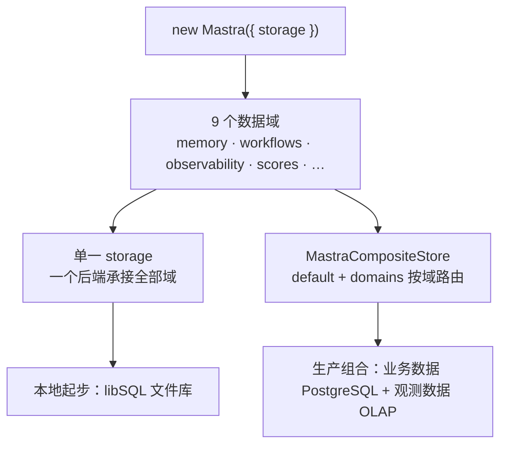

import { Canvas, Controls, Meta } from '@storybook/addon-docs/blocks';

import * as Stories from './storage.stories';

<Meta of={Stories} name="Docs" />

# 存储与持久化

Mastra 运行时会产生多类需要跨进程存活的数据：记忆的线程与消息、工作流的运行快照、追踪与日志、评分记录等。存储层（storage）在 `new Mastra({ storage })` 处配置一次，所有功能共用；不配置时默认使用内置的内存存储，进程退出数据即丢失——这也是「恢复工作流报 snapshot not found」的根源。本课讲清存储层的组织方式（9 个数据域）、后端选型与按域路由的复合存储，是工作流挂起恢复（`?path=/docs/suspend-and-resume--docs`）与记忆课程（`?path=/docs/memory-basics--docs`）的持久化前置。



| 数据域 | 存什么 |
| --- | --- |
| `memory` | 线程、消息、资源与工作记忆 |
| `workflows` | 工作流运行快照（挂起 / 恢复、快照调试依赖它） |
| `observability` | 追踪 span、日志、指标与反馈 |
| `scores` | scorer 对输出的评分记录 |
| `datasets` | 评估数据集 |
| `experiments` | 评估实验 |
| `backgroundTasks` | 后台任务 |
| `schedules` | 定时触发计划 |
| `threadState` | 线程级状态 |

## 快速上手

本地起步推荐 libSQL：一个文件就是一个数据库，不用安装数据库服务。

```bash
npm install @mastra/libsql
```

```ts
import { Mastra } from '@mastra/core';
import { LibSQLStore } from '@mastra/libsql';

export const mastra = new Mastra({
  storage: new LibSQLStore({ id: 'mastra-storage', url: 'file:./mastra.db' }),
});
```

首次用到存储的功能会自动初始化所需的表结构；运行后项目目录出现 `mastra.db`，即持久化生效。换生产后端只需替换这一处构造，例如 PostgreSQL：

```ts
import { PostgresStore } from '@mastra/pg';

const storage = new PostgresStore({
  id: 'mastra-storage',
  connectionString: process.env.DATABASE_URL,
});
```

与 `mastra dev` 共享同一个 libSQL 文件库时用绝对路径（如 `file:/absolute/path/to/your/project/mastra.db`）：相对路径按各进程的工作目录解析，两个进程可能连到不同文件。

## 数据域

存储层按「域（domain）」组织：上表 9 个域各自有独立的表结构，各功能模块只读写自己域内的数据。这不只是分类——它决定两件事：选型时要按域核对适配器支持（并非每个后端都实现全部 9 个域）；需要隔离时可以按域把数据路由到不同后端。

<Canvas of={Stories.Interactive} />
<Controls of={Stories.Interactive} />

| 读者操作 | 可观察证据 |
| --- | --- |
| 切换「数据域」 | 高亮芯片移动，面板与读数显示该域存什么、建议后端 |
| 开关「复合存储」 | 路由在「统一后端」与「default + 专用后端」之间切换，读数同步变化 |

记忆数据还可以只在单个 Agent 上覆盖：给 `Memory` 传 `storage` 后，仅该 Agent 的记忆数据走这份存储，其余数据仍走实例级 storage。

```ts
import { Agent } from '@mastra/core/agent';
import { Memory } from '@mastra/memory';
import { PostgresStore } from '@mastra/pg';

const supportAgent = new Agent({
  id: 'support-agent',
  name: 'support',
  instructions: '客服助手',
  model: 'openai/gpt-4o',
  memory: new Memory({
    storage: new PostgresStore({
      id: 'support-agent-storage',
      connectionString: process.env.SUPPORT_AGENT_DATABASE_URL,
    }),
  }),
});
```

## 后端选型

官方提供 20+ 种存储适配器：Aurora DSQL、ClickHouse、Cloudflare D1、Cloudflare KV、Convex、DuckDB、DynamoDB、Elasticsearch、Google Cloud Spanner、LanceDB、libSQL、Mastra Platform 托管数据库、MongoDB、MySQL、MSSQL、Neon Postgres、OracleDB、PostgreSQL、Redis、Valkey、Upstash，多数以 `@mastra/*` 适配器包提供（如 `@mastra/libsql`、`@mastra/pg`、`@mastra/mongodb`）。选型入口是「场景 × 数据域」：

| 场景 | 建议 | 原因 |
| --- | --- | --- |
| 本地开发、单机起步 | libSQL 文件库 | 零部署，`file:./mastra.db` 即建即用 |
| 生产默认 | PostgreSQL 或托管 PG（Neon 等） | 事务可靠，memory / workflows 等业务域的默认推荐 |
| 文档型偏好 | MongoDB | `MongoDBStore` 提供 uri + dbName 接入 |
| 高流量观测数据 | ClickHouse、DuckDB 等 OLAP | 追踪与指标是追加型大数据，事务型库不划算 |

域对后端能力有要求：`memory` 域适合事务型数据库（libSQL / PostgreSQL / MongoDB）；`observability` 域是高流量遥测，适合 OLAP 后端；`schedules` 域要求适配器实现了该域，选型时确认。部分记忆特性（如观察式记忆）对存储还有额外要求，接入前回查 `?path=/docs/observational-memory--docs`。

## 复合存储

一个后端不必包揽全部域。`MastraCompositeStore`（来自 `@mastra/core/storage`）用 `default` 承接未指定的域，用 `domains` 把特定域路由到专用后端：

```ts
import { MastraCompositeStore } from '@mastra/core/storage';
import { LibSQLStore } from '@mastra/libsql';
import { WorkflowsPG } from '@mastra/pg';

export const mastra = new Mastra({
  storage: new MastraCompositeStore({
    id: 'composite-storage',
    default: new LibSQLStore({ id: 'default-storage', url: 'file:./mastra.db' }),
    domains: {
      workflows: new WorkflowsPG({
        connectionString: process.env.DATABASE_URL,
      }),
    },
  }),
});
```

上面的组合把工作流快照单独放进 PostgreSQL，其余 8 个域留在 libSQL 文件库。典型拆法是按读写特征分流：`observability` 域的高流量遥测路由到 ClickHouse / DuckDB 这类 OLAP 后端，`memory`、`workflows` 等业务域留在 PostgreSQL。工作流快照何时值得独立后端，取决于挂起恢复与生产库的负载判断，见 `?path=/docs/suspend-and-resume--docs`。

## 数据保留与清理

追踪、评分、日志这类数据只增不减，需要保留策略：先在适配器或复合存储上配置各域的 retention 策略，再由调度器或维护脚本周期调用 `storage.prune()` 执行清理。不配置策略前数据会持续累积，生产上把 `prune()` 挂进 cron 一类的定时任务即可。

## 最佳实践

- 按域选后端，而不是找一个「万能库」：业务域（memory / workflows）要事务可靠，观测域要 OLAP 吞吐，两者分开用复合存储各得其所。
- 生产使用托管数据库：备份、监控、连接池与高可用由平台负责；这是存储选型里杠杆最大的一项。
- serverless 平台没有持久文件系统，`file:` 的 LibSQLStore 不可用——改用 Neon、Upstash、Cloudflare D1 等网络后端，或按域路由到托管服务。
- 单元测试与小实验可以不配 storage，直接用默认内存存储；但只要验证涉及挂起恢复或记忆，就必须配真实存储。

## 常见问题

- 恢复工作流时报 snapshot not found，或进程重启后运行记录消失
  显式配置 `storage`。未配置时默认是内存存储，工作流快照不落盘，重启即丢。
- serverless 部署 LibSQLStore 后找不到数据库文件
  平台无持久文件系统，`file:` 路径不可用。换托管网络后端（Neon、Upstash、Cloudflare D1 等）。
- `mastra dev`（Studio）与业务脚本看到的 libSQL 数据不一致
  两个进程把 `file:./mastra.db` 的相对路径解析到了各自的工作目录。改用绝对路径，让两边连到同一个文件。
- 启用定时触发（schedules）时不可用
  当前适配器未实现 `schedules` 域。换支持该域的后端，或用复合存储把 `schedules` 域路由到支持的适配器。

## 总结回顾

摘要：

存储层在 `new Mastra({ storage })` 处配置一次，按 9 个数据域（memory、workflows、observability、scores、datasets、experiments、backgroundTasks、schedules、threadState）组织持久化数据；不配置时默认内存存储，进程退出即丢。后端有 20+ 种适配器，本地起步用 libSQL 文件库，生产默认 PostgreSQL 等托管数据库；需要分流时用 `MastraCompositeStore` 的 `default` + `domains` 按域路由，把观测数据交给 OLAP。保留策略配合定时调用 `storage.prune()` 完成清理。记忆数据还可通过 `Memory({ storage })` 在单个 Agent 上覆盖。

一句话：

> 存储配一次、按域组织、按域选型：默认内存不留数据，本地起步用 libSQL，生产用托管 PostgreSQL，大流量观测域用复合存储路由到 OLAP。

知识要点：

- 不配置 storage 会发生什么？哪类功能最先出问题？
- 9 个数据域各存什么？挂起 / 恢复依赖哪个域？
- 本地起步与生产分别推荐什么后端？serverless 平台的限制是什么？
- `MastraCompositeStore` 的 `default` 与 `domains` 各管什么？
- 保留策略在哪配置、`prune()` 由谁调用？

## 参考资料

- [Storage — Mastra Docs](https://mastra.ai/docs/storage)
