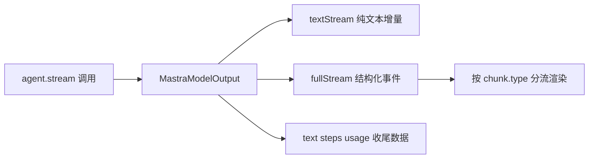

import { Canvas, Controls, Meta } from '@storybook/addon-docs/blocks';
import * as Stories from './streaming.stories';

<Meta of={Stories} name="Docs" />

# 流式输出

调用 generate() 时，Agent 要跑完整个循环才一次性返回结果；换成 agent.stream()，同一次运行会立刻返回一个 MastraModelOutput 对象，文本、工具调用、步骤与用量都以增量 chunk 的形式从它上面流出来。它解决的是「用户要等多久才能看到第一个字」以及「工具跑到哪一步能不能实时上屏」两个问题。

本课以 agent.stream() 为主线：先讲 textStream 与 fullStream 两种消费方式，再讲工具与工作流步骤里用 writer 写自定义事件，然后是 smoothStream 平滑输出与 toAISdkStream 格式转换，最后带出工作流的流式入口。工作流编排细节见 [工作流基础](?path=/docs/workflow-basics--docs)，前端聊天接线见 [前端接入与聊天 UI](?path=/docs/chat-ui--docs)。



返回值速查（均为 MastraModelOutput 的成员）：

| 成员 | 形态 | 用途 |
| --- | --- | --- |
| textStream | AsyncIterable | 只有文本增量，逐字上屏 |
| fullStream | AsyncIterable | 全部结构化事件，含工具与自定义事件 |
| text | Promise | 流结束后的完整文本 |
| steps | Promise | 每次模型调用的步骤明细 |
| usage | Promise | token 用量 |
| finishReason | Promise | 停止生成的原因 |
| objectStream / object | 流 / Promise | structuredOutput 时的部分与最终结构化结果，见 [结构化输出](?path=/docs/structured-output--docs) |

## 快速上手

```ts
const stream = await weatherAgent.stream('北京今天天气怎么样？');

for await (const chunk of stream.textStream) {
  process.stdout.write(chunk);   // 文本增量逐字上屏
}

console.log(await stream.text);  // 流结束后：完整文本
console.log(await stream.usage); // 流结束后：token 用量
```

stream() 返回后，消费循环立刻开始产出 chunk；text、usage、steps、finishReason 是 Promise，在流结束时 resolve，不会阻塞循环。

## textStream 与 fullStream

两种消费方式是分工关系：textStream 是 fullStream 里文本增量的「只读视图」，只展示回答就选它；要看工具调用、自定义事件、步骤边界，必须消费 fullStream。每个 chunk 用 type 标识事件类型，Agent 自身事件的 from 为 'AGENT'，子工作流事件的 from 为 'WORKFLOW'。

### textStream：只要文本增量

```ts
for await (const chunk of stream.textStream) {
  process.stdout.write(chunk);
}
```

- 最省心的消费路径，等价于只取 fullStream 中的文本增量。
- 工具调用与自定义事件不会出现在这里；需要它们时换 fullStream。

### fullStream：结构化事件流

<Canvas of={Stories.Interactive} />
<Controls of={Stories.Interactive} />

| 读者操作 | 可观察证据 |
| --- | --- |
| 拖动「步进进度」 | chunk 按真实顺序依次点亮，详情卡跟随当前 chunk，读数同步 |
| 关闭「显示工具事件」 | tool-call / tool-result 从时间轴消失，# 编号出现跳号 |
| 关闭「显示自定义事件」 | 两个紫色事件消失，虚线框那个是 transient 只发不存 |

时间轴对应一次「查天气再作答」的运行：第 1 步模型发起 tool-call，工具内 writer 写入两个自定义事件，tool-result 回传后进入第 2 步生成文本，finish 收尾。常见 chunk.type 一览：

| chunk.type | 出现时机 | 说明 |
| --- | --- | --- |
| start / finish | 运行开始 / 结束 | finish 后 usage、finishReason 就绪 |
| step-start / step-finish | 每次模型调用前后 | 多步循环中成对出现 |
| text-start / text-delta / text-end | 文本块边界与增量 | 增量文本在 payload.text |
| reasoning-start / reasoning-delta / reasoning-end | 推理内容边界与增量 | 支持推理的模型才有 |
| tool-call / tool-result | 工具发起与返回 | 载荷含 toolName、toolCallId |
| workflow-start 等 workflow 系列 | 子工作流执行期间 | chunk.from 为 'WORKFLOW' |

消费 fullStream 时按 chunk.type 分流：

```ts
for await (const chunk of stream.fullStream) {
  switch (chunk.type) {
    case 'text-delta':
      process.stdout.write(chunk.payload.text);
      break;
    case 'tool-call':
      console.log(`→ 调用工具：${chunk.payload.toolName}`);
      break;
    case 'tool-result':
      console.log(`← 工具返回：${JSON.stringify(chunk.payload)}`);
      break;
  }
}
```

需要在流经的 chunk 上做拦截或改写时，用输出处理器处理 output 流，见 [输入输出处理器](?path=/docs/processors--docs)。

## 工具与步骤的自定义事件

工具的 execute 与工作流步骤的 execute 都会收到一个 writer，往当前活动流写入自定义事件——这是把「工具跑到哪一步」「步骤内部日志」实时推给前端的正规通道。两个方法的分工：writer.custom 发顶层 data-* chunk（对 AI SDK UI 的数据部件友好），writer.write 发任意自定义事件对象。

### writer.custom：data-* 顶层 chunk

工具 execute 里经 context.writer 访问：

```ts
import { createTool } from '@mastra/core/tools';
import { z } from 'zod';

export const weatherTool = createTool({
  id: 'weather',
  inputSchema: z.object({ city: z.string() }),
  execute: async ({ context, writer }) => {
    await writer?.custom({
      type: 'data-tool-progress',
      status: 'pending',
    });
    return lookupWeather(context.city);
  },
});
```

### writer.write：任意自定义事件

工作流步骤 execute 解构 writer 参数：

```ts
export const fetchStatusStep = createStep({
  id: 'fetch-status',
  inputSchema: z.object({ url: z.url() }),
  outputSchema: z.object({ status: z.number() }),
  execute: async ({ inputData, writer }) => {
    await writer.write({ type: 'custom-event', status: 'pending' });
    const response = await fetch(inputData.url);
    await writer.write({ type: 'custom-event', status: 'success' });
    return { status: response.status };
  },
});
```

两条硬边界：

- writer.write / writer.custom 必须 await。漏 await 会锁住流，抛 WritableStream is locked 错误。
- data-* chunk 默认持久化进消息历史；刷新页面后仍能从存储加载。

### transient：只发不存

高频、大体积、只在直播会话里有意义的进度日志，加 transient: true：

```ts
await context?.writer?.custom({
  type: 'data-build-log',
  data: { line: 'Compiling module 3 of 12...' },
  transient: true, // 实时发给客户端，但不写入存储
});
```

边界：刷新后 transient chunk 不可恢复，只有工具返回值与非 transient chunk 会从存储加载。需要回放或审计的写普通事件，纯进度提示才 transient。

## 平滑输出 smoothStream

模型出字节奏不均匀时，用 smoothStream 把增量缓冲成均匀小块再发出：

```ts
import { smoothStream } from '@mastra/core/stream';

const result = await agent.stream('解释一下彩虹是怎么形成的');

const smooth = result.fullStream.pipeThrough(
  smoothStream({ delayInMs: 20, chunking: 'word' }),
);

for await (const chunk of smooth) {
  if (chunk.type === 'text-delta') {
    process.stdout.write(chunk.payload.text);
  }
}
```

| 参数 | 取值 | 说明 |
| --- | --- | --- |
| chunking | 'word' / 'line' / RegExp / Intl.Segmenter / 自定义函数 | 分块方式；中文等无空格语言建议 Intl.Segmenter |
| delayInMs | number / null | 每块发出后的延迟毫秒，null 关闭延迟 |

也可以直接作为 stream 选项传入：在 agent.stream 的选项对象里设置 experimentalTransform 为 smoothStream(...)，效果与 pipeThrough 相同。注意 transform 只影响管道后的流——result.text、onChunk 等仍按模型原始分块时机。

## 转成 AI SDK 流

给 useChat 等 AI SDK 前端消费时，用 @mastra/ai-sdk 做格式转换：

```ts
import { toAISdkStream } from '@mastra/ai-sdk';

const aiSDKStream = toAISdkStream(stream, {
  from: 'agent',
  version: 'v5', // 与前端安装的 AI SDK 大版本保持一致
});
```

已存储的历史消息用 toAISdkMessages（来自 @mastra/ai-sdk/ui）转成 useChat 的 initialMessages，version 规则相同。路由处理与聊天组件的完整接线见 [前端接入与聊天 UI](?path=/docs/chat-ui--docs)。

## 工作流流式与后台运行

工作流有对等的流式入口：createRun 之后调用 run.stream() 并传入 inputData，在返回对象上消费 fullStream（事件类型为 workflow-start、workflow-step-start、workflow-finish 等），并从 status、result、usage 取收尾数据；对已在运行的实例可用 observeStream 接上观察。编排侧细节见 [工作流基础](?path=/docs/workflow-basics--docs)。

Agent 把工具派到后台执行时，stream() 传 untilIdle: true 让流保持开启，直到后台任务完成且 Agent 消化了结果再收尾；该选项要求 Agent 启用 memory，默认 5 分钟空闲超时。用法见 [Durable Agents 与后台任务](?path=/docs/durable-agents--docs)。

## 最佳实践

- 前端只展示正文时订阅 textStream；要呈现工具进度或自定义事件才消费 fullStream，并按 chunk.type 分流渲染。
- 进度、日志类自定义事件加 transient: true，避免消息历史被高频 chunk 撑大；需要回放的数据放进工具返回值。
- smoothStream 只加在发给用户的那条流上（pipeThrough 或 experimentalTransform），统计与回调保持原始节奏。
- toAISdkStream 的 version 与前端 AI SDK 大版本对齐，转换后再交给 UI 数据部件消费。

## 常见问题

- 工具里调用 writer 报 WritableStream is locked
  给每个 writer.write / writer.custom 补上 await；未 await 的写入会把流锁死。execute 本就是 async 函数，直接 await 即可。
- 刷新页面后自定义进度事件不见了
  这些 chunk 是 transient，只实时发送不落存储，刷新后无法从存储恢复；需要回放就去掉 transient: true，或把关键数据放进工具返回值。
- await stream.text 拿到的完整文本，节奏与逐字上屏对不上
  smoothStream 只作用于管道后的流；result.text、onChunk 等收尾数据与回调仍按模型原始分块时机，二者本就不保证一致。

## 总结回顾

摘要：

agent.stream() 把一次 Agent 运行变成 MastraModelOutput 上的事件流：textStream 提供纯文本增量供逐字上屏；fullStream 按 chunk.type 产出 start、step、text、reasoning、tool-call 与 tool-result，直到 finish 的全部事件，子工作流事件的 from 为 'WORKFLOW'。工具与工作流步骤内的 writer.custom / writer.write 往当前流写自定义事件，data-* chunk 默认持久化，加 transient: true 则只实时发送不落存储。smoothStream 平滑出字节奏，toAISdkStream / toAISdkMessages 负责转成 AI SDK 格式交给前端。工作流的 run.stream 与 Agent 后台任务的 untilIdle 是相邻的两个流式入口。

一句话：

> 只要文本用 textStream，要看过程用 fullStream；自定义事件用 writer 写，用 transient 决定是否落盘。

知识要点：

- textStream 与 fullStream 各适合什么场景？工具调用出现在哪一个里？
- fullStream 的关键 chunk.type 有哪些？chunk.from 用来区分什么？
- 工具 execute 与工作流步骤 execute 分别怎么拿到 writer？write 与 custom 的分工是什么？
- transient: true 改变了什么行为？哪些数据不应该 transient？
- smoothStream 的两个参数是什么？它会影响 result.text 吗？
- 转 AI SDK 用哪个 API？version 需要与什么对齐？

## 参考资料

- [Streaming 指南](https://mastra.ai/docs/guides/streaming)
- [agent.stream() API 参考](https://mastra.ai/reference/streaming/agents/stream)
- [smoothStream() API 参考](https://mastra.ai/reference/streaming/smoothStream)
