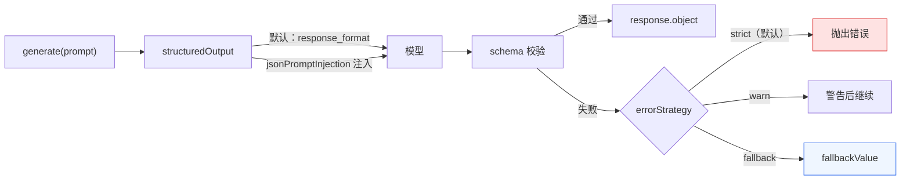

import { Canvas, Controls, Meta } from '@storybook/addon-docs/blocks';
import * as StructuredOutput from './structured-output.stories';

<Meta of={StructuredOutput} name="Docs" />

# 结构化输出

Agent 默认返回自由文本，下游代码只能对字符串做解析。`structuredOutput` 把一次 `generate` / `stream` 的终点从「一段话」换成「一个对象」：传入 schema，返回值里就有通过校验、可直接使用的 `response.object`。同一句 prompt，校验通过与失败是两种结局——结局由 `errorStrategy` 决定，这是本课的主线。

各对象按一条链路配合：`schema` 定义结果形状（支持 Zod / Valibot / ArkType / 原生 JSON Schema）；`jsonPromptInjection` 决定 schema 走原生 `response_format` 还是提示注入送到模型；`instructions` 在注入模式下用一段短说明替代冗长的序列化 schema；失败时 `errorStrategy` 配合 `fallbackValue` 给出三种结局；`model` 可指定第二个 LLM 专职提取结构；`prepareStep` 让工具调用与结构化输出在同一请求里分步共存。



| 选项 | 写法 | 默认 | 回查要点 |
| --- | --- | --- | --- |
| 结果 schema | `structuredOutput: { schema }` | 必填 | Zod / Valibot / ArkType / JSON Schema |
| 取结果 | `response.object` / `await stream.object` | —— | 已通过 schema 校验的类型化对象 |
| schema 送达 | `jsonPromptInjection` | 原生 `response_format` | `'inline'`、`true`（即 `'system'`）、`'auto'` |
| 失败策略 | `errorStrategy` | `'strict'` | `warn` / `fallback`（后者需配 `fallbackValue`） |
| 兜底值 | `fallbackValue` | —— | 仅 `errorStrategy: 'fallback'` 时生效 |
| 精简指令 | `instructions` | —— | 只在注入模式下生效，输出仍按 schema 校验 |
| 提取模型 | `structuredOutput: { model }` | —— | 第二个 LLM 从主模型的文本回复中提取结构 |
| 记忆上下文 | `useAgent` | 不启用 | 与 `model` 同用，让提取模型读到只读记忆 |

## 基本用法：schema 与 response.object

给 `generate` 传 `structuredOutput` 选项包，`schema` 说明「要什么形状」，返回值的 `object` 字段就是校验后的对象：

```ts
import { Agent } from '@mastra/core/agent';
import { z } from 'zod';

const planAgent = new Agent({
  id: 'plan-agent',
  name: 'plan-agent',
  instructions: '你是日程助手，按用户输入安排当天计划。',
  model: 'openai/gpt-5.6-sol',
});

const schema = z.object({
  summary: z.string().describe('一天计划的一句话摘要'),
  priority: z.enum(['low', 'high']).describe('整体优先级'),
});

const response = await planAgent.generate('帮我排今天的计划', {
  structuredOutput: { schema },
});

console.log(response.object); // { summary: '…', priority: 'high' }
```

`response.object` 已通过 schema 校验，TypeScript 类型直接从 Zod 推断——字段缺失、类型写错在编译期与运行期各有闸门。schema 不限于 Zod：

| schema 格式 | 写法 | 边界 |
| --- | --- | --- |
| Zod（推荐） | `z.object({ ... })` | 类型推断 + 运行时校验一步到位 |
| Valibot | 经 `@valibot/to-json-schema` 的 `toStandardJsonSchema` 转换 | 需要额外安装转换包 |
| ArkType | `type({ summary: 'string' })` | 用简洁的类型表达式书写 schema |
| JSON Schema | 原生对象（含 `type`、`properties`、`required`） | 语言无关，适合跨语言共享 |

Agent 的构造与 `generate` 基础见 [1.4 第一个 Agent](?path=/docs/first-agent--docs)；本课示例沿用 `provider/model` 字符串接模型。

## 送达方式：jsonPromptInjection 与 instructions

schema 要先让模型「知道」才谈得上遵守。两条路：默认走 provider 的原生 `response_format` 参数；不支持原生能力的模型走提示注入。`instructions` 是注入模式的配套优化。

### jsonPromptInjection 的取值

| 取值 | schema 去哪 | 适用 |
| --- | --- | --- |
| 省略 / `false` | provider 的 `response_format` 参数（原生） | 模型支持原生结构化输出时首选 |
| `'inline'` | 序列化后注入最新一条 user 消息 | provider 无原生支持时 |
| `true` / `'system'` | 注入 system 消息 | 同上；Gemini 2.5 带工具调用时必选 |
| `'auto'` | 查 Mastra 的能力数据：支持原生用原生，否则 inline | 不想逐模型记忆能力差异时 |

模型能力差异真实存在：Gemini 2.5 系列的 `response_format` 与 function calling 不能同请求共存，带工具时直接调用会报「Function calling with a response mime type: 'application/json' is unsupported」——此时把 `jsonPromptInjection` 设为 `true` 即可绕开。

### instructions：用短说明替代序列化 schema

注入模式下，完整 JSON Schema 序列化出来可能占数千 token；`instructions` 用一段紧凑文本替代它：

```ts
const response = await planAgent.generate('帮我排今天的计划', {
  structuredOutput: {
    schema,
    jsonPromptInjection: 'system',
    instructions:
      '以 JSON 对象回复："summary"（一句话摘要）、"priority"（"low" 或 "high"）。不要 markdown。',
  },
});
```

输出仍按 `schema` 校验，`instructions` 只是替代提示文本——描述越明确、字段清单越完整，模型遵守越好。原生 `response_format` 模式下它不生效。

## 失败结局：errorStrategy 与 fallbackValue

模型的输出并不总符合 schema（类型漂移、超出枚举、干脆不是 JSON）。`errorStrategy` 决定校验失败那一刻发生什么，三种策略对应三种结局：

| 策略 | 行为 | 调用侧表现 |
| --- | --- | --- |
| `'strict'`（默认） | 校验或结构化失败即抛错 | 调用 reject，需要 try/catch |
| `'warn'` | 记录警告并继续 | 调用不中断 |
| `'fallback'` | 返回兜底值 | `response.usedFallbackValue` 为 `true` |

下面的实例用同一句 prompt 离线复现这条分派链路：先打开「模拟校验失败」让模型输出变成坏 JSON，再切换 `errorStrategy` 看三种结局；关闭失败开关则一律返回 `response.object`。

<Canvas of={StructuredOutput.Interactive} />
<Controls of={StructuredOutput.Interactive} />

| 读者操作 | 可观察证据 |
| --- | --- |
| 保持「模拟校验失败」，切换 errorStrategy | 结局卡与「执行结果」读数在抛错 / 警告继续 / fallbackValue 之间切换 |
| 关闭「模拟校验失败」 | 一律返回 response.object，errorStrategy 不参与 |
| 打开 Show code | 看到 runStructuredPipeline 模拟的校验与分派过程 |

`fallback` 的用法：兜底值写成与 schema 同形的对象，事后用 `usedFallbackValue` 区分真实答案与替换数据：

```ts
const response = await planAgent.generate('帮我排今天的计划', {
  structuredOutput: {
    schema,
    errorStrategy: 'fallback',
    fallbackValue: {
      summary: '本次未能生成计划，请稍后重试。',
      priority: 'low',
    },
  },
});

if (response.usedFallbackValue) {
  // 兜底数据，不要当真实答案展示或入库
}
```

## 流式：object-result chunk 与 stream.object

`stream` 同样接受 `structuredOutput`。结构化结果在两个位置出现：`fullStream` 里类型为 `object-result` 的 chunk，以及流结束后 resolve 的 `stream.object`：

```ts
const stream = await planAgent.stream('帮我排今天的计划', {
  structuredOutput: { schema },
});

for await (const chunk of stream.fullStream) {
  if (chunk.type === 'object-result') {
    console.log('\n', JSON.stringify(chunk, null, 2)); // 结构化结果就在这个 chunk 上
  }
}

console.log(await stream.object); // 流结束后才 resolve 的最终对象

for await (const chunk of stream.textStream) {
  process.stdout.write(chunk); // 纯文本内容照常可迭代
}
```

文本 chunk 照常出现，装的是模型的自然语言内容；`stream.object` 是 Promise，流结束时才有值。

## 结构化 agent：第二个 LLM 提取结构

主模型自由回答，`structuredOutput` 里再给一个 `model`，由它把主模型的自然语言回复提取成符合 schema 的对象。两次 LLM 调用带来额外延迟与成本，换取的是不依赖主模型的原生结构化能力，对能力不足或表现不稳定的模型更稳：

```ts
const response = await planAgent.generate('帮我排今天的计划', {
  structuredOutput: {
    schema,
    model: 'google/gemini-2.5-pro', // 提取器可与主模型不同 provider
  },
});
```

会话接了 Memory 时，`useAgent: true` 让提取模型以只读方式看到当前 thread 的记忆上下文，提取结果更贴合对话历史；省略它则与历史隔离。

## prepareStep：让工具调用与结构化输出共存

部分模型 API 不允许同一请求既调工具又给 `response_format`——这是模型侧限制，不是 Mastra 限制。三条路：改用 `jsonPromptInjection` 注入、用上面的独立提取 `model`，以及最可控的 `prepareStep`：第 0 步先给工具并强制调用，之后的步骤收走工具、改为产出结构化结果：

```ts
const response = await weatherAgent.generate('上海今天适合跑步吗', {
  prepareStep: ({ stepNumber }) => {
    if (stepNumber === 0) {
      // 第 0 步：先让模型调用工具拿到数据
      return {
        model: 'openai/gpt-5.6-sol',
        tools: { weatherTool },
        toolChoice: 'required',
      };
    }
    // 之后的步骤：收走工具，改为结构化输出
    return {
      model: 'openai/gpt-5.6-sol',
      tools: undefined,
      structuredOutput: { schema },
    };
  },
});
```

工具定义与 `toolChoice` 的语义见 [1.5 工具](?path=/docs/tools--docs)。

## 常见问题

- strict 下同一 prompt 时好时坏，偶发校验抛错
  先怀疑 schema 过严：枚举、字面量、格式约束越具体，模型失手概率越高。给字段补 `.describe()` 说明取值格式，或放宽过细的约束（如先用 `z.string()` 收下再在应用侧归类）；关键路径配 `errorStrategy: 'fallback'` 加 `fallbackValue` 保底。
- 流式里 `await stream.object` 迟迟不返回
  `stream.object` 本来就在流结束后才 resolve，不是每个 chunk 给一个部分对象。要边流边处理就走 `fullStream`，等 `chunk.type === 'object-result'` 的 chunk 才有结构化结果；文本内容继续用 `stream.textStream`。
- 带 Gemini 2.5 的工具调用请求报 mime-type 不支持
  报错含「Function calling with a response mime type: 'application/json' is unsupported」——这些模型不允许 `response_format` 与 function calling 同请求共存。把 `jsonPromptInjection` 设为 `true`，或改用 `prepareStep` 分步。
- 拿到结果分不清是真实回答还是兜底值
  检查 `response.usedFallbackValue`：为 `true` 说明内容来自 `fallbackValue`，不要当真实答案展示或入库。

## 总结回顾

摘要：

`structuredOutput` 把 `generate` / `stream` 的返回从自由文本升级为通过 schema 校验的类型化对象，同步结果在 `response.object`，流式在 `object-result` chunk 与 `await stream.object`。schema 支持 Zod、Valibot、ArkType 与原生 JSON Schema；`jsonPromptInjection` 决定 schema 走原生 `response_format` 还是提示注入（`'inline'` / `'system'` / `'auto'`），注入模式下 `instructions` 用短说明替代序列化 schema 省下 token。校验失败时 `errorStrategy`（默认 `'strict'`）在抛错、警告后继续与返回 `fallbackValue` 三种结局之间做选择，`usedFallbackValue` 标记兜底替换。主模型能力不足或要与工具调用共存时，用第二个 `model` 做结构提取，或用 `prepareStep` 把「先调工具、再给结构」拆成两步。

一句话：

> schema 管结果长什么样，errorStrategy 管失败怎么办——同一句 prompt 的结局由这两个选项共同决定。

知识要点：

- 怎么让 Agent 返回类型安全的对象？结果从哪个字段取？支持哪几种 schema 格式？
- `jsonPromptInjection` 各取值把 schema 送到哪里？Gemini 2.5 带工具调用时为什么要注入？
- `errorStrategy` 三种取值在校验失败时各发生什么？怎么区分兜底值与真实结果？
- 流式下结构化结果何时就绪？`object-result` chunk 与 `stream.object` 分别怎么用？
- `model`（结构化 agent）与 `prepareStep` 分别解决什么问题？

## 参考资料

- [Agents / Structured Output（官方文档）](https://mastra.ai/docs/agents/structured-output)
