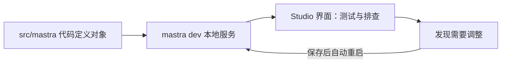

import { Canvas, Controls, Meta } from '@storybook/addon-docs/blocks';
import * as Stories from './studio.stories';

<Meta of={Stories} name="Docs" />

# 用 Studio 调试

Studio 是随 `mastra dev` 启动的本地可视化调试界面（默认 `http://localhost:4111`）：对象在代码里定义，测试与排查在界面里完成——直接对话测 Agent、图形化跑 Workflow、逐层看 Trace、管理评分与实验。旧文档中的 Playground 已统一改称 Studio。读完本课，你能启动 Studio、把每个面板对应到自己的调试问题，并建立「改代码 → 自动重启 → 回 Studio 验证」的调试回路。



## 启动与配置回查

| 入口 / 配置 | 默认值 | 说明 |
| --- | --- | --- |
| `mastra dev` | `http://localhost:4111` | 本地开发服务，同时托管 Studio 与 API |
| Swagger UI | `localhost:4111/swagger-ui` | 直接查看 dev server 暴露的 API |
| `server.host` / `server.port` | — | 在 `src/mastra/index.ts` 的 `Mastra` 配置里改监听地址 |
| API 路径前缀 | `/api` | 可在 Studio 的 Settings 界面修改 |
| `--https` | 关闭 | 本地 HTTPS，自动创建并管理证书 |
| `--dir` | `src/mastra` | Mastra 目录位置 |
| `--env` | `.env.development`、`.env.local`、`.env` | 加载的环境文件 |
| `--request-context-presets` | 无 | 指向包含 request context 预设的 JSON 文件 |
| `mastra studio`（独立启动） | `--port 3000` | 以静态服务打开 Studio，用 `--server-*` 指向后端 |

## 快速上手

前提：已有一个包含 Agent 的 Mastra 项目（环境搭建见 [工程环境](?path=/docs/installation--docs)，最小 Agent 见 [第一个 Agent](?path=/docs/first-agent--docs)）。

1. 在项目根目录启动开发服务：

```bash
npx mastra dev        # create mastra 脚手架项目也可用 npm run dev
```

2. 打开 `http://localhost:4111`，左侧导航进入 Agents，选中一个 Agent 直接发消息，观察回答、推理过程与工具调用输出。
3. 修改 `src/mastra/` 内的任何文件并保存——`src/mastra/` 目录的改动会自动重启 dev server，无需手动重启；回到 Studio 重发同一条消息，对比结果。

需要改监听地址或端口时，在 `src/mastra/index.ts` 配置 `server`：

```ts
import { Mastra } from '@mastra/core/mastra';

export const mastra = new Mastra({
  agents: { weatherAgent },
  server: {
    host: 'localhost',
    port: 4111,
  },
});
```

可观察证据：dev server 启动日志给出 4111 地址；`/swagger-ui` 能列出 Agent、Workflow 与工具的 API；改代码保存后，运行 `mastra dev` 的终端立即出现重启日志。

## 面板地图：每个分区回答什么问题

Studio 界面围绕一个共同模型组织：左侧导航按对象类型分区，右侧区域负责该类对象的测试与排查；所有分区读到的都是代码里定义的对象，Studio 本身不改定义。下面是各分区的离线地图，用「功能分区」切换查看：

<Canvas of={Stories.Interactive} />
<Controls of={Stories.Interactive} />

| 分区 | 能做什么 | 典型调试场景 |
| --- | --- | --- |
| Agents | 对话测试、切模型调参、看工具调用 | 验证 prompt 或工具改动后的行为 |
| Workflows | 图形化查看结构、自定义输入逐步运行 | 定位失败或挂起的步骤 |
| Traces / Logs | 过滤与查看每次调用的 span、导出 JSON | 追一次请求里每层的耗时与异常 |
| Scorers / Datasets / Experiments | 评分结果、数据集导入、批量实验对比 | 把「感觉变差」变成可对比的分数 |
| MCP | 列出 server、浏览发现的 tools | 排查工具没被 Agent 找到 |
| Workspaces | 文件浏览与编辑、Skills 管理 | 检查长时运行的文件产物 |
| Processors | 按名称与类型列出输入 / 输出处理器 | 确认 guardrails、限流器接线正确 |

### Agents：最常用的调试入口

这是验证 Agent 行为的第一落点：与代码里定义的 Agent 直接对话，可以临时切换模型、调整 temperature / top-p，实时查看推理过程与工具调用输出；表格类结果可一键复制为 markdown 或 CSV，流式输出过程中还能继续追加消息（确认前显示为待处理）。

可观察证据：回答下方出现工具调用块与推理文本；同一条消息切换模型后得到不同回答。

边界：界面临时切换的模型与参数只作用于本次测试，Agent 的 name、model、tools 始终由代码掌控，不会回写源码。

### Workflows：图形化运行与逐步追踪

图形视图展示步骤与连线；用自定义输入发起运行，实时看到当前活动的步骤；每一步的 trace 带工具调用、原始 JSON 与错误信息。Run Options 里可以设置 Resource ID（当服务端能从认证用户推导出该值时，以服务端为准）。

可观察证据：运行中图形节点逐个点亮；失败步骤在 trace 中携带错误 JSON。

边界：流程结构在代码里定义，Studio 只负责运行与观察，不能改连线。

### Traces 与 Logs：从回答追到内部调用

按对象与时间过滤调用记录；trace 展开到 span 级，能看到工具调用与原始 JSON，可以过滤框架内部细节，也能导出 JSON 留档；运行日志在 Logs 中查看。

可观察证据：一次 Agent 调用对应一棵 span 树，从请求入口逐层下钻到工具入参。

边界：采样率、导出器与敏感信息过滤在代码里配置，属于可观测性主题，入口见 [Tracing](?path=/docs/tracing--docs)。

### Scorers、Datasets 与 Experiments：把感觉变成分数

Scorers 标签页查看 scorer 对输出的异步评分结果，可按日期过滤时间段；Datasets 支持 CSV / JSON 导入，定义输入与 ground-truth 字段，版本可固定；Experiments 把数据集跑在 Agent、Workflow 或 Scorer 上，并排对比运行结果。

可观察证据：同一数据集在改 prompt 前后各跑一次实验，两列分数并排可见。

边界：scorer 的编写与挂载、gates 与 verdicts 的判定属于评估链路，Studio 只承担运行与查看，入口见 [评估基础](?path=/docs/evals-basics--docs)。

### MCP、Processors、Workspaces 与 Settings

其余分区行为简单，一张表回查：

| 分区 | 用途 | 调试问题 |
| --- | --- | --- |
| MCP | 列出已配置的 MCP server，浏览其工具 | server 连接与工具发现是否正常 |
| Processors | 按名称与类型列出输入 / 输出处理器 | guardrails、token limiter 是否接线正确 |
| Workspaces | 浏览挂载目录、查看或编辑文件，Skills 标签页可安装社区 skills | 长时运行或文件挂载的产物内容 |
| Settings | Mastra URL、API 前缀（默认 `/api`）、自定义 headers、主题 | 连接其他后端，或带认证头调试 |

与运行输入相关的还有 request context：Agents 与 Workflows 运行时的 request context 变量可在 Studio 里以 JSON 或 schema 表单编辑，值跨测试会话与实验保留；启动参数 `--request-context-presets` 可指向 JSON 文件载入预设。

## Studio 与代码的边界

- **代码掌控定义：** agents、workflows、tools、processors、guardrails、scorers 与 request context schema 都定义在代码里；Agent 的 id、name、model 始终由代码决定。
- **Studio 负责交互：** 测试、调试、监控与临时调参都在界面完成，界面上改的模型与参数是临时状态，不回写源码。
- **开发形态 vs 独立形态：** `mastra dev` 是日常开发入口，`mastra studio` 则把 Studio 作为静态服务启动（`--port` 默认 3000），用 `--server-host` / `--server-port`（默认 `localhost:4111`）指向一个运行中的 Mastra 后端。
- **对外的 Studio 必须配认证：** 本地 4111 只暴露给本机；一旦部署，Studio 与其暴露的 API 需要认证与访问控制，入口见 [认证基础](?path=/docs/auth-basics--docs)。

## 最佳实践

- **先看 Traces 再改代码：** 「回答不对」先在 Traces 里确认出错层次——工具参数、检索内容还是模型输出——再动手，避免凭感觉反复改 prompt。
- **批量验证用 Experiments：** 手动对话十次不如把同一数据集跑两次实验并排对比，结论可复现。
- **改动落在热重启范围内：** 只有 `--dir` 指向目录（默认 `src/mastra`）内的改动会自动重启 dev server；目录外的配置文件需手动重启。

## 常见问题

- 打不开 `http://localhost:4111`
  先确认 `mastra dev` 进程仍在运行、终端无端口占用报错；端口冲突时在 `server.port` 换端口重启；服务活着但页面异常时，用 `/swagger-ui` 区分是 API 正常而 Studio 资源异常。
- 改了代码但 Studio 里没变化
  确认改动位于 `--dir` 指向的目录（默认 `src/mastra`）内，目录外文件不会触发热重启；file-based agents 的发现只在 `mastra dev` / `mastra build` 下生效。
- 用 `mastra studio` 打开后界面连不上后端
  在 Settings 里核对 Mastra URL、API 前缀（默认 `/api`）与自定义 headers 是否指向一个运行中的 dev server。

## 总结回顾

摘要：

Studio 随 `mastra dev` 启动在 `localhost:4111`，围绕代码里定义的对象提供测试与排查界面：Agents 对话调参、Workflows 图形化运行、Traces 与 Logs 逐层追踪、Scorers / Datasets / Experiments 做量化对比，MCP、Workspaces 与 Processors 覆盖连接、文件与处理器检查。`src/mastra/` 内的改动自动重启 dev server，形成「改代码 → 回界面验证」的调试回路；对象定义始终由代码掌控，独立部署用 `mastra studio` 启动且必须配置认证。

一句话：

> 对象的答案在代码里，问题的线索在 Studio 里——先定位分区，再沿调用链下钻。

知识要点：

- `mastra dev` 的默认地址是什么，三个常用启动参数（`--https`、`--dir`、`--request-context-presets`）各管什么？
- 面板地图的六个分区各自回答什么调试问题？
- 哪些内容始终由代码掌控，界面临时改动为什么不回写？
- `mastra studio` 与 `mastra dev` 的差别是什么，部署到外网前必须补什么？
- 哪些改动会触发 dev server 自动重启，哪些不会？

## 参考资料

- [Studio Overview](https://mastra.ai/docs/studio/overview)
- [Local Development](https://mastra.ai/docs/develop)
- [Mastra CLI Reference](https://mastra.ai/reference/cli/mastra)
