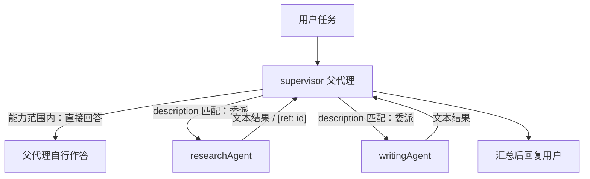

import { Canvas, Controls, Meta } from '@storybook/addon-docs/blocks';
import * as Stories from './subagents.stories';

<Meta of={Stories} name="Docs" />

# 子代理与监督者

父 Agent 通过 `agents` 属性挂载若干子代理（subagents），每个子代理用 `description` 说明自己的用途，父代理结合自身 `instructions` 决定「直接回答」还是「委派给谁」。这种父代理协调子代理的模式，官方称为 supervisor。委派发生在 `Agent.stream()` / `Agent.generate()` 调用内部，`delegation` 配置用 `onDelegationStart`、`onDelegationComplete`、`messageFilter` 等钩子控制每一次委派。



关键配置默认值回查（均在官方文档核对）：

| 配置 | 写在哪 | 作用 | 默认值 |
| --- | --- | --- | --- |
| `agents` | `new Agent({ ... })` | 以对象映射挂载子代理 | 不挂载则无委派能力 |
| `description` | 每个子代理 | 父代理决定何时委派给它的依据 | 必填 |
| `maxSteps` | `stream()` / `generate()` 选项 | 限制父代理委派循环步数 | 按调用设置（官方示例用 10） |
| `delegation.onDelegationStart` | `defaultOptions` 或单次调用 | 放行 / 改写 / 拒绝委派 | 未设置时直接放行 |
| `delegation.hookErrorStrategy` | 同上 | 钩子抛错是否中断委派 | 吞掉异常，按原样继续 |
| `delegation.enableResultReferences` | 同上 | 成功结果生成 `[ref: id]` 引用 | `false` |
| `delegation.includeSubAgentToolResultsInModelContext` | 同上 | 子代理嵌套工具结果进入父模型上下文 | `false`（只回传文本） |
| `delegation.messageFilter` | 同上 | 过滤传给子代理的消息 | 不过滤 |

## 挂载子代理

子代理就是普通 `Agent`，只是多了 `description`；父代理用 `agents` 属性把它们挂进来，委派在 `stream()` / `generate()` 内部以工具调用的形式发生（`@mastra/core@1.8.0` 起支持）：

```ts
import { Agent, Memory } from '@mastra/core';
import { LibSQLStore } from '@mastra/libsql';

const researchAgent = new Agent({
  id: 'research-agent',
  name: 'researchAgent',
  description: '检索资料并输出要点清单，适合需要查证背景信息的任务', // 父代理按它选人
  model: 'openai/gpt-5-mini',
});

const writingAgent = new Agent({
  id: 'writing-agent',
  name: 'writingAgent',
  description: '按目标读者把要点改写成文，适合成稿类任务',
  model: 'openai/gpt-5-mini',
});

const supervisor = new Agent({
  id: 'supervisor',
  name: 'Supervisor',
  model: 'openai/gpt-5-mini',
  instructions:
    '可用资源：researchAgent（查证）、writingAgent（成稿）。先判断任务类型，再决定直接回答或委派，最后汇总。',
  agents: { researchAgent, writingAgent }, // 挂载点：子代理在此对父代理可见
  memory: new Memory({ storage: new LibSQLStore({ url: 'file:mastra.db' }) }),
});

// 委派发生在 stream / generate 内部，maxSteps 限制父代理循环步数
const stream = await supervisor.stream('调研 Subagents 并写一段摘要', { maxSteps: 10 });
```

可观察证据：运行后父代理的流里会出现指向子代理的委派工具调用，最终 `text` 是汇总回复。切换下面的「任务类型」可以看到 supervisor 的两种决策路径：

<Canvas of={Stories.Interactive} />
<Controls of={Stories.Interactive} />

| 读者操作 | 可观察证据 |
| --- | --- |
| 任务类型切到「简单问答」 | 读数「委派路径」变为 直接回答（不委派），舞台无委派脉冲 |
| 切到「研究+写作流水线」 | 两次委派依次进行，第二条边带 `[ref: research-agent-1]` 标记 |
| onDelegationStart 切到「拒绝委派」 | 委派边变红，读数「最终回答」显示回退文案 |
| 关闭「结果引用 [ref: id]」 | 读数「结果引用」变回 无 |

旧的 networks（routing agent）机制已废弃，官方替代就是本课的 supervisor 模式：保留同一套 agent 配置（`agents`、`tools`、`memory`），补清楚父代理 instructions 与子代理 description 即可迁移，指引见文末参考资料。

### 挂工具还是挂子代理

- 单一能力直接挂 `tools`：无独立上下文、无独立权限，父代理一个循环内完成。
- 出现能力复用（多个任务都要同一专长）、上下文隔离（子代理只看到委派提示词与自己的记忆）、权限分离（子代理内工具单独审批）时，拆成子代理。
- 选中机制不同：工具靠 `name` + description 被模型选用，子代理靠 `description` 被父代理委派——粒度更粗，description 写得越准，委派越稳。

## 委派控制

`delegation` 配置可写在父代理 `defaultOptions` 里全局生效，也可在单次 `stream()` / `generate()` 中覆盖：

```ts
const stream = await supervisor.stream(prompt, {
  maxSteps: 10,
  delegation: {
    onDelegationStart(context) {
      // context: { primitiveId, prompt, iteration, requestContext }
      if (context.prompt.includes('内部数据')) {
        return { proceed: false, rejectionReason: '该委派涉及未授权数据源' };
      }
      return { proceed: true, modifiedPrompt: `面向初学者：${context.prompt}` };
    },
  },
});
```

### onDelegationStart

委派发出前触发，返回值决定走向：

| 返回值 | 效果 |
| --- | --- |
| `proceed: true` | 放行（未设置钩子时的默认行为） |
| `proceed: false` + `rejectionReason` | 拒绝本次委派，子代理不会被调用 |
| `modifiedPrompt` | 改写传给子代理的提示词 |
| `modifiedMaxSteps` | 改写本次委派的步数上限 |

`context.requestContext` 是父运行上下文的浅拷贝（去掉 run 级身份键）：子代理内的修改不会影响父；也可以在钩子里 `context.requestContext.set('audience', 'technical')` 主动注入，值必须可 JSON 序列化（durable agents 要求）。

### onDelegationComplete

委派返回后触发，负责善后：

```ts
delegation: {
  onDelegationComplete(context) {
    // context: { primitiveId, result, success, error, messages, bail }
    if (!context.success) {
      // 用可控文案替换父模型看到的失败结果（委派仍算失败，不会恢复）
      return { resultText: '研究子代理暂时不可用，请稍后重试' };
    }
    if (!context.result.text.includes('结论')) {
      return { feedback: '下次研究必须给出明确结论' }; // 存入父记忆，下一轮可用
    }
    if (context.result.text.length > 8000) {
      context.bail(); // 立即终止父代理循环
    }
  },
}
```

- `context.bail()`：立刻停止父代理循环；与 `feedback` 组合可「停止执行 + 留下指导」。
- `result.text` 附带 `usage`、`finishReason`、`subAgentToolResults`、`subAgentThreadId` 等字段（可用时），排查嵌套调用看这里。
- `resultText` 只替换当前这次工具结果的文本；它不是日志或 trace 的脱敏策略。

### messageFilter 与结果引用

`messageFilter` 决定父会话里哪些消息能传给子代理；`enableResultReferences: true` 给每次成功的非空委派结果发一个引用 ID，后续委派可以用它精确取回原文：

```ts
delegation: {
  messageFilter({ messages }) {
    // 返回过滤后的消息数组：去掉机密内容，只保留最近 10 条
    return messages.filter((m) => !(typeof m.content === 'string' && m.content.includes('机密'))).slice(-10);
  },
  enableResultReferences: true,
},
```

- 结果引用形如 `[ref: research-agent-1]`；委派工具会多出一个 `contextFromRefs` 入参，接受字符串数组 `["research-agent-1"]` 或对象数组 `[{ ref: 'research-agent-1', as: '调研结论', note: 'bug 位置' }]`。
- 被引用的文本会在本次委派提示词之前按标注块原文插入，`onDelegationStart` 与 `messageFilter` 看到的是展开后的提示词。
- 引用按单次运行保存在内存中：跨 run 无效；被拒绝、失败、空结果与后台委派不生成引用，未知 ID 跳过并告警。
- 默认父模型只看到子代理文本；确需嵌套工具结果进上下文时再开 `includeSubAgentToolResultsInModelContext: true`。子代理内容不可信时，在 `onDelegationStart` 或 processors 里加注入检查。

### hookErrorStrategy：钩子抛错怎么办

- 默认吞掉钩子异常：委派按原始提示词 / 未过滤上下文 / 原始结果继续进行。
- 设 `hookErrorStrategy: 'throw'` 让委派失败：`onDelegationStart` 抛错会整体阻断子代理；`messageFilter`、`onDelegationComplete` 抛错表现为一次失败的委派工具调用；处理失败委派时再抛错则透出原始错误。钩子不会因自身失败被重复调用。
- 全部钩子失败都记录在 request context 的 `__mastra_delegationHookErrors` 下，字段含 `hook`、`primitiveId`、`toolCallId`、`runId`、`name`、`message`。
- 后台委派带重试时，钩子每次尝试都会触发一次，副作用要做幂等。

## 记忆隔离、审批冒泡与取消

- **记忆隔离三要点：** 委派时子代理能看到父会话完整上下文；子代理记忆只保存本次委派的提示词与回复；每次委派使用全新 thread ID——子代理不会带着上一次委派的线程历史。
- **审批冒泡：** 子代理里 `requireApproval: true` 的工具会在父代理流中冒出 `tool-call-approval` chunk（`chunk.payload.toolName` 标明来源），父层即可把审批请求转给人；`suspend()` 挂起同样会冒泡。工具审批的完整机制见 [2.2 工具审批与挂起](?path=/docs/human-in-the-loop--docs)。
- **取消传播：** 传给父代理的 `abortSignal` 会转发给子代理，`controller.abort()` 让进行中的委派在下一步被取消。

## 进阶能力回查表

| 能力 | 关键配置 | 用途与时机 |
| --- | --- | --- |
| 任务完成评分 | `isTaskComplete: { scorers, strategy: 'all', onComplete }` | 每轮迭代后评分，不达标的反馈进入对话上下文，全部通过才结束 |
| Rubric 评分器 | `createRubricScorer({ model, criteria })`（`@mastra/evals/scorers/prebuilt`） | LLM-as-judge 按标准逐项审阅，适合验收标准明确的任务 |
| 自定义 Scorer | `createScorer({ id, name }).generateScore(...)`（`@mastra/core/evals`） | 自己写打分逻辑（如检查必含关键词） |
| 迭代监控 | `onIterationComplete(context)`，返回 `continue: false` + `feedback` | 中途叫停并给反馈，模型可能获得最后一轮修正机会 |
| 后台委派 | Mastra 实例启用 backgroundTasks，父代理配 `backgroundTasks.tools.<子代理>: { enabled: true, timeoutMs }` | 长任务移到后台执行 |
| 等待后台完成 | 用 `streamUntilIdle()` 替代 `stream()` | 流保持打开，直到子代理全部完成且父代理作出回复 |
| 子代理版本控制 | `versions: { agents: { 'research-agent': { versionId: 'draft-456' } } }` | 编辑器场景按调用覆盖存储版本，覆写自动沿委派传播 |

## 最佳实践

- 父代理 instructions 列清可用资源、委派策略与成功标准；子代理 description 写清用途、返回格式与适用时机——这是 supervisor 选人的唯一依据。
- 委派失败优先在 `onDelegationComplete` 里返回通用 `resultText`，不要把 `error.message` 原文转发给父模型：既可能误导模型，也可能泄漏 provider 敏感信息。
- 默认只让子代理文本进入父模型上下文，控制 token 与干扰；排查嵌套调用时看工具结果里的 `subAgentToolResults`，确有需要再开 `includeSubAgentToolResultsInModelContext`。
- 长任务用 backgroundTasks 加 `streamUntilIdle()`，避免父流在子代理完成前提前关闭；后台重试会重复触发钩子，副作用保持幂等。

## 常见问题

- 委派失败了，父代理为什么没有停下来？
  失败只是一条失败的委派工具结果，父代理会继续循环并自行组织回复。需要可控兜底时在 `onDelegationComplete` 用 `resultText` 换掉失败文案，或直接 `bail()` 终止循环。
- 两次运行之间 `[ref: id]` 为什么取不到内容？
  引用按单次运行保存在内存里，跨 run 无效；被拒绝、失败、空结果与后台委派不生成引用，未知 ID 会被跳过并告警。需要跨轮沉淀时改用 `feedback` 或自己的存储。
- 钩子里抛了异常，委派却照常进行？
  默认策略是吞掉钩子异常按原样继续。要 fail-fast 就设 `hookErrorStrategy: 'throw'`，事后在 request context 的 `__mastra_delegationHookErrors` 里查全部钩子失败记录。

## 总结回顾

摘要：

父代理用 `agents` 属性挂载子代理，靠子代理 `description` 与自身 `instructions` 在 `stream()` / `generate()` 中决定直接回答还是委派，这一模式即 supervisor，也取代了已废弃的 networks routing agent。`delegation` 配置提供全过程控制：`onDelegationStart` 放行、改写或拒绝委派，`onDelegationComplete` 用 `bail()`、`feedback`、`resultText` 善后，`messageFilter` 裁剪传给子代理的消息，`enableResultReferences` 让后续委派能按 `[ref: id]` 精确取回原文，`hookErrorStrategy` 决定钩子抛错是否中断。记忆按次隔离、审批与取消沿委派冒泡，进阶可用 `isTaskComplete` 评分、后台委派 `streamUntilIdle()` 与子代理版本控制。

一句话：

> supervisor 的协调能力来自三个支点：`agents` 挂载、`description` 选人、`delegation` 钩子控过程。

知识要点：

- 父代理靠什么决定委派给谁？不委派的条件是什么？
- `onDelegationStart` / `onDelegationComplete` 各能返回什么、分别控制哪个阶段？
- `[ref: id]` 怎么生成、如何在后续委派中使用、生命周期多长？
- 子代理的记忆隔离体现在哪三点？审批与取消如何传到子代理？
- 挂工具还是挂子代理的判断依据是什么？

## 参考资料

- [Subagents — Mastra Docs](https://mastra.ai/docs/subagents)
- [Migrating from Networks to Supervisor — Mastra Reference](https://mastra.ai/reference/migrations/network-to-supervisor)
