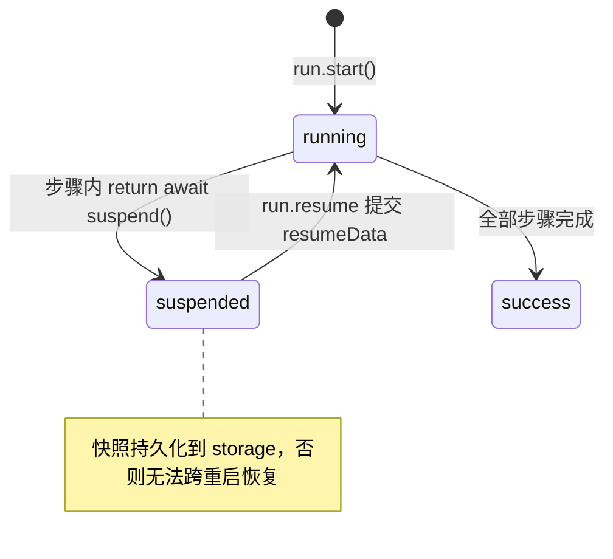

import { Canvas, Controls, Meta } from '@storybook/addon-docs/blocks';
import * as Stories from './suspend-and-resume.stories';

<Meta of={Stories} name="Docs" />

# 挂起与恢复

工作流不总是能一口气跑完：等审批、等外部回调、等人工输入，都会让流程中途停下。`suspend()` 把当前 run 挂起为 `suspended` 状态，同时把快照写入 storage；`run.resume()` 携带 `resumeData` 从存储恢复执行。两者配合，工作流就能跨越人工等待、时间跨度甚至进程重启继续跑。

> 边界：本课把挂起与恢复的机制讲透（挂起路径、恢复语义、快照存储）；人工审批与人工输入的端到端场景在 [2.2 人工介入](?path=/docs/workflow-human-in-the-loop--docs) 展开。



## 开场参考表

| API / 状态 | 作用 | 默认值 / 关键取值 |
| --- | --- | --- |
| `suspend(payload?)` | 在步骤 `execute` 内挂起当前 run | 固定写法 `return await suspend(...)` |
| `suspendSchema` | 校验挂起载荷 suspendPayload | 可选，Zod schema |
| `resumeSchema` | 校验恢复提交的 resumeData | 不匹配时 resume 无法继续 |
| `suspendData` | `execute` 内回读上一次挂起的载荷 | 恢复重跑时自动填充 |
| `run.resume({ step?, resumeData? })` | 恢复挂起的 run | 省略 `step` 时恢复最后一个挂起步骤 |
| run 状态 | 判断是否挂起 | `result.status === 'suspended'` |
| `result.suspended` | 挂起路径数组 | 如 `['step-approve']` |
| storage | 快照持久化前置 | 默认 LibSQL（`:memory:` 或文件） |

## 全景演示：挂起-恢复状态机

一次 run 的完整生命周期由三个变量决定：`suspend()` 调用落在哪个步骤、`resume()` 提交什么数据、快照有没有落进持久化存储。右上角状态角标实时显示当前 run 状态，时间线每个芯片是一个执行波次。

<Canvas of={Stories.Interactive} />
<Controls of={Stories.Interactive} />

| 读者操作 | 可观察证据 |
| --- | --- |
| 切换「挂起点位置」 | 挂起时刻沿步骤链移动，读数「挂起路径」随之变化 |
| 切换「恢复数据」 | `approved: true` 重跑后走到 success；`false` 条件不满足、再次挂起 |
| 切换「storage」 | 未配置存储时恢复尝试直接失败——快照没有落盘 |

## 挂起：suspend()

挂起是**步骤级**行为：在某个步骤的 `execute` 里调用 `suspend()` 并把返回值 `return`，run 状态变为 `suspended`，执行停在该步骤；已完成的步骤结果都保留在快照里。

```ts
import { createStep } from '@mastra/core/workflows';
import { z } from 'zod';

const confirmStep = createStep({
  id: 'confirm',
  inputSchema: z.object({ value: z.number() }),
  suspendSchema: z.object({ reason: z.string() }),   // 校验挂起载荷
  resumeSchema: z.object({ approved: z.boolean() }), // 校验恢复提交
  outputSchema: z.object({ value: z.number(), approved: z.boolean() }),
  execute: async ({ inputData, resumeData, suspend }) => {
    if (!resumeData?.approved) {
      // 挂起载荷进入快照，恢复重跑时经 suspendData 回读
      return await suspend({ reason: '等待人工确认' });
    }
    return { value: inputData.value, approved: true };
  },
});
```

- `suspendSchema` 描述挂起时带出的上下文（原因、请求详情等），外部 UI 据此渲染"为什么在等"。
- 恢复重跑时 `execute` 的 `suspendData` 自动填充上一次挂起载荷，用来还原挂起现场。
- 本轮 `suspend()` 之后的代码不会执行；恢复后 `execute` 从头重跑（见下一节）。

## 恢复：run.resume()

`run.resume()` 把挂起的 run 从快照里拉起来：`resumeData` 必须匹配该步骤的 `resumeSchema`，并合并进快照；然后该步骤的 `execute` **从头重跑**——本轮 `resumeData` 有值、条件满足就走完，否则会再次 `suspend()`。

```ts
const run = await workflow.createRun();
const result = await run.start({ inputData: { value: 100 } });

if (result.status === 'suspended') {
  const resumed = await run.resume({
    step: 'confirm',                 // 步骤对象 / ID 字符串 / 省略
    resumeData: { approved: true },
  });
}
```

`step` 有三种定位方式：

| 传法 | 适用场景 |
| --- | --- |
| 步骤对象 | `step: confirmStep`，`resumeData` 获得完整类型推断 |
| ID 字符串 | `step: 'confirm'`，步骤 ID 来自运行时输入或数据库时 |
| 省略 | 只挂起了一个步骤时，自动恢复最后一个挂起项 |

- `result.suspended` 数组给出的挂起路径可以直接作为 `step` 传入；嵌套工作流会给出完整路径，如 `['nested-flow', 'step-1']`。
- 换进程恢复：`workflow.createRun({ runId: '原 runId' })` 重建 run 句柄后再 `resume()`。
- `resume()` 可以从 HTTP 端点、事件回调、定时器等任何外部代码发起。

## 定位挂起的 run

恢复前先回答"谁挂在哪"。同进程看返回值，跨重启靠快照。

- **同进程**：`run.start()` 返回的 `result.status === 'suspended'` 即已挂起，挂起路径在 `result.suspended`。
- **跨重启**：快照已持久化，用 `workflow.getWorkflowRunById(runId)` 取回运行状态，再用 `createWorkflowStateReader()`（`@mastra/core/workflows`）解析挂起现场：

```ts
import { createWorkflowStateReader } from '@mastra/core/workflows';

const state = await workflow.getWorkflowRunById('run-123');
const reader = createWorkflowStateReader(state);
const stepPath = reader.getSuspendedStep();     // 挂起路径，嵌套工作流含完整恢复路径
const label = reader.getResumeLabel('approve'); // 恢复入口标签，foreach 场景带 foreachIndex
```

- 随后 `workflow.createRun({ runId: state.runId })` 重建句柄，带 `step`、`resumeData`（及 `forEachIndex`）调用 `resume()`。
- 也可直读存储：`mastra.getStorage()` → `storage.getStore('workflows')` → `loadWorkflowSnapshot({ runId, workflowName })`。

## 快照与 storage 前置

挂起能跨进程，靠的是快照：`suspend()` 触发时 Mastra 把完整执行状态经 `persistWorkflowSnapshot()` 写入存储的 `workflow_snapshots` 表（按 runId 键控），`resume()` 时重新加载并重建执行。

快照包含：runId 与整体状态、最终输出、每步上下文（含 suspendPayload / resumePayload 与 startedAt / suspendedAt / resumedAt / endedAt 时间戳）、activePaths / suspendedPaths / waitingPaths、序列化的步骤图、requestContext，以及每步剩余重试次数。

- `Mastra` 实例上配置的单个 `storage` 被所有注册工作流共享；默认 LibSQLStore（`:memory:` 或文件），可换 PostgreSQL、MongoDB、Upstash、D1、DynamoDB 等后端。
- **强前置**：快照必须落在持久化后端。`:memory:` 只适合开发期单进程内恢复；未配置存储或用内存库时，进程重启快照即丢，挂起的 run 无法恢复。
- 与 `sleep` 的边界：`.sleep(ms)` / `.sleepUntil(date)` 是工作流级定时等待，状态为 `waiting`，到点自动继续、无需人工输入；`suspend` 等的是外部 `resume()` 提交数据。

## 常见问题

- resume 之后步骤像"从头再来"，挂起前的逻辑又跑了一遍？
  这是恢复的固有语义：`resume()` 让该步骤的 `execute` 带着 `resumeData` 从头重跑，不是从挂起行继续。把挂起点之前的逻辑写成可重入，并用 `resumeData` 是否存在区分恢复轮。
- 重启后 `resume()` 恢复不了挂起的 run？
  先查 storage：确认 Mastra 配置了持久化后端（LibSQL 文件、PostgreSQL 等）且挂起发生在配置生效之后；`:memory:` 或未配置存储时快照不跨进程，换持久化后端即可。
- `suspend` 和 `sleep` 都是"等"，怎么选？
  等人、等外部系统用 `suspend()`：状态 `suspended`，直到 `resume()` 提交数据；纯延时用 `.sleep()` / `.sleepUntil()`：状态 `waiting`，到点自动继续。

## 总结回顾

摘要：

`suspend()` 在步骤 `execute` 内把 run 挂起为 `suspended`，挂起载荷经 `suspendSchema` 校验后随快照写入 storage 的 `workflow_snapshots` 表；`run.resume()` 以步骤对象、ID 字符串或省略方式定位挂起步骤，`resumeData` 经 `resumeSchema` 校验合并进快照，让 `execute` 从头重跑。同进程用 `result.suspended` 读挂起路径，跨重启用 `getWorkflowRunById` 加 `createWorkflowStateReader` 解析挂起现场。快照落在持久化 storage 是恢复的强前置；只需定时等待而非人工输入时，改用 `.sleep()` / `.sleepUntil()` 的 `waiting` 状态。

一句话：

> 挂起跨的是时间与进程，恢复靠的是快照——没有持久化 storage，挂起的 run 就回不来。

知识要点：

- 怎样在步骤里挂起 run？挂起状态与挂起路径从哪里读？
- `run.resume()` 的三种 `step` 定位方式与省略时的语义是什么？
- 恢复时 `execute` 从哪里执行？`resumeData` 与 `suspendData` 各自是什么？
- 快照包含什么、写在哪张表、为什么 storage 是强前置？
- `suspend` 与 `.sleep()` / `.sleepUntil()` 在状态与恢复方式上有什么差异？

## 参考资料

- [Workflows: Suspend and Resume](https://mastra.ai/docs/workflows/suspend-and-resume)
- [Workflows: Snapshots](https://mastra.ai/docs/workflows/snapshots)
