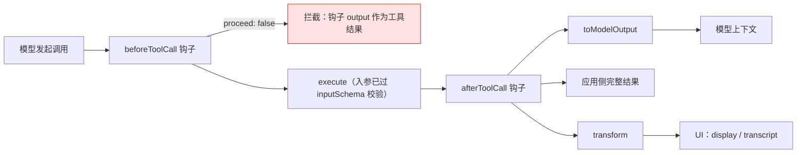

import { Canvas, Controls, Meta } from '@storybook/addon-docs/blocks';
import * as Tools from './tools.stories';

<Meta of={Tools} name="Docs" />

# 工具

工具让 Agent 越过「只会生成文字」的边界：用 `createTool` 把一段带 schema 的 TypeScript 函数交给模型，模型决定何时调用、填什么参数，Mastra 负责校验入参、执行函数并把结果送回模型上下文。工具写得好不好，直接决定 Agent 能不能查天气、下单、查库、操作系统。

本课的对象按一条链路配合：先**定义**工具（`createTool` 的五个属性），再**挂载**到 Agent 的 `tools` 属性；每次请求可用 `toolChoice` / `activeTools` 控制选不选、用哪个；执行前后有 `beforeToolCall` / `afterToolCall` 钩子做校验、审计与拦截；结果回传时 `toModelOutput` 决定模型看到什么、`transform` 决定 UI 看到什么。最后是官方内置的搜索、抓取与任务追踪工具，以及把 Agent 和工作流本身当工具复用的入口。



| 入口 | 写法 | 回查要点 |
| --- | --- | --- |
| 定义 | `createTool({ id, description, inputSchema, outputSchema, execute })` | `id` 是唯一标识；`description` 与字段描述决定模型何时选它、怎么填参 |
| 挂载 | `new Agent({ tools: { weatherTool } })` | stream 事件里的 `toolName` 取**对象键**，不是 `id` |
| 运行时控制 | `generate` / `stream` 选项 `toolChoice`、`activeTools` | 按请求强制、禁用或收窄工具，不改工具定义 |
| 调用钩子 | `new Agent({ hooks: { beforeToolCall, afterToolCall } })` | 返回 `{ proceed: false, output }` 可跳过一次调用 |
| 输出分流 | 工具属性 `toModelOutput`；流选项/载荷的 `transform` | 前者给模型瘦身，后者给 UI 脱敏，两层互不替代 |
| 内置工具 | `webSearchTool`、`webFetchTool`、任务四件套 | 从 `@mastra/core/tools` 导入 |

## 定义工具：createTool

一个工具 = 「写给模型看的说明书」+「写给机器跑的函数」。`id`、`description`、`inputSchema` 告诉模型什么场景该用它、参数怎么填；`execute` 是真正执行的函数；`outputSchema` 声明返回结构，让下游消费有类型可依。五个属性一个入口：

```ts
import { createTool } from '@mastra/core/tools';
import { z } from 'zod';

export const weatherTool = createTool({
  id: 'get-weather',
  description: '查询指定城市的当前天气，用户问到天气时使用。',
  inputSchema: z.object({
    location: z.string().describe('城市名，如 “北京” 或 “Shanghai”'),
  }),
  outputSchema: z.object({
    temperatureCelsius: z.number(),
    conditions: z.string(),
  }),
  execute: async ({ location }, { abortSignal }) => {
    const response = await fetch(
      `https://wttr.in/${encodeURIComponent(location)}?format=j1`,
      { signal: abortSignal },
    );
    const data = await response.json();
    return {
      temperatureCelsius: Number(data.current_condition[0].temp_C),
      conditions: data.current_condition[0].weatherDesc[0].value,
    };
  },
});
```

### inputSchema 与 execute

`execute` 只有一种签名：`execute(inputData, context)`。第一个参数已按 `inputSchema` 校验，函数内可以放心当普通对象用；第二个参数由运行时提供，包含 `requestContext`、`tracingContext`、`abortSignal` 等，可整个省略。把 `abortSignal` 传给内部的 `fetch` 等操作，用户中止请求时工具也会跟着中止。

schema 用任何兼容 Standard JSON Schema 的库都行：Zod 最常用；Valibot 经 `@valibot/to-json-schema` 的 `toStandardJsonSchema` 转换；ArkType 直接 `type({ location: 'string' })`。校验失败时入参不会进入 `execute`，所以 schema 就是工具的第一道防线——字段类型写具体、含义用 `.describe()` 说清，比事后在函数里判断可靠。

### description 决定模型何时选它

模型在决定「调不调、怎么调」时能看到的是 `description` 和 schema，看不到函数体。所以 description 要写「做什么、什么时候用」；参数取值约束写进 `.describe()`。在 Agent 的 `instructions` 里点名工具并给一个填参示例，能进一步减少误选与错填——这也是官方文档明确建议的做法。

## 挂载与运行时控制

工具定义好之后挂到 Agent 的 `tools` 属性；每次请求还可以用 `generate` / `stream` 的选项临时控制，不必改动工具或 Agent 本身。

### 挂载：tools 属性与对象键

```ts
import { Agent } from '@mastra/core/agent';
import { weatherTool } from './tools/weather';

export const weatherAgent = new Agent({
  id: 'weather-agent',
  name: 'weather-agent',
  instructions: '你是天气助手，用 weatherTool 查询实时天气。',
  model: 'openai/gpt-5.6-sol',
  tools: { weatherTool }, // 对象键 weatherTool 同时就是运行时的工具名
});
```

对象键就是工具在这次对话里的名字：`tools: { 'my-custom-name': weatherTool }` 改名后，stream 事件里的 `toolName` 也会跟着变。两个易混点：`toolName` 取对象键而不是工具的 `id`；共享工具首选直接 import（工具是普通对象，可任意传递），也可从 Mastra 实例上用 `getTool()` / `getToolById()` / `listTools()` 取用。接入外部工具生态走 MCP（见 [6.1.1 MCP](?path=/docs/mcp--docs)）。

### toolChoice：控制「要不要调、调哪个」

`toolChoice` 是 `generate` / `stream` 的选项，控制本轮工具选择策略：

| 取值 | 行为 |
| --- | --- |
| `'auto'` | 模型自行决定是否调用工具 |
| `'none'` | 本轮禁用所有工具，纯文字回答 |
| `'required'` | 强制本轮至少调用一次工具 |
| `{ type: 'tool', toolName: 'weatherTool' }` | 强制调用指定工具 |

选项是可选的，不设置时由模型自行决定是否调用。典型用法是测试与演示时强制走通工具：

```ts
const result = await agent.generate('看看上海天气怎么样', {
  toolChoice: 'required',
  activeTools: ['weatherTool'],
});
```

### activeTools：按请求收窄工具集

Agent 上可能挂了几十个工具，但某一轮只需要一两个。`activeTools` 传一个工具名数组，本轮只有名单内的工具可用，既减少模型误选，也避免无关工具的定义挤占上下文。名字同样用挂载时的对象键。

## 调用钩子与输出分流

执行侧的钩子和结果侧的分流解决同一类问题：**不改工具函数本身，控制「能不能调、模型看什么、用户看什么」**。`beforeToolCall` → `execute` → `afterToolCall` 是执行链；`toModelOutput` 决定工具结果回传给模型时保留多少；`transform` 决定流式载荷到达 UI 时展示什么。下面的流水线实例把四个环节连起来，可用三个控件逐项开关：

<Canvas of={Tools.Interactive} />
<Controls of={Tools.Interactive} />

| 读者操作 | 可观察证据 |
| --- | --- |
| 把「查询姓名」换成 eve | beforeToolCall 返回 `proceed: false`，execute 变灰未执行，钩子 output 成为工具结果 |
| 关闭「toModelOutput 瘦身」 | 「到达模型」读数从一行摘要涨为完整 JSON 字符数，底部长度条对比悬殊 |
| 关闭「transform 脱敏」 | UI 分支的手机号原文渲染，读数同步显示原文 |

### beforeToolCall / afterToolCall

钩子配在 Agent 构造器的 `hooks` 里，围绕**每一次**工具调用运行——无论工具来自 `tools` 挂载、memory、toolsets、client tools，还是 agent / workflow 工具：

```ts
export const supportAgent = new Agent({
  // ...
  hooks: {
    beforeToolCall: ({ toolName, input }) => {
      // 校验、改写入参，或按策略拦截
      const command = (input as { command?: string }).command ?? '';
      if (toolName === 'execute_command' && command.includes('rm -rf')) {
        return { proceed: false, output: '命令已被安全策略拦截。' };
      }
    },
    afterToolCall: ({ toolName, output, error }) => {
      // 审计日志：成功时拿 output，失败时拿 error
      console.log(`finished ${toolName}`, { output, error });
    },
  },
});
```

要点：`beforeToolCall` 返回 `{ proceed: false, output }` 会跳过本次执行，`output` 直接作为工具结果回给模型，模型并不知道这次调用被拦了；`afterToolCall` 在成功时收到 `output`、失败时收到 `error`，错误在钩子运行后仍会照常抛出，适合做审计、脱敏统计与告警。`generate` / `stream` 还能传按次钩子，按同名键覆盖 Agent 级钩子，便于单次请求临时换策略。

### toModelOutput 与 transform

两者名字相似，服务对象完全不同：

```ts
const weatherTool = createTool({
  // ...
  toModelOutput: output => ({
    type: 'content',
    value: [
      { type: 'text', text: `${output.location}: ${output.temperatureCelsius}°C` },
      { type: 'image-url', url: output.weatherIconUrl },
    ],
  }),
});
```

- `toModelOutput` 挂在工具上，面向**模型上下文**。`execute` 返回的完整结果（大 JSON、图片 URL、源数据）始终留在应用侧，模型只收到这里给出的一行文本或需要的图片项——上下文瘦身从这里做。`clientTools` 场景同样生效。
- `transform` 面向流式载荷的 **`display` 与 `transcript` 两个 UI 目标**，覆盖 `input`、`inputDelta`、`error`、`approval`、`suspend`、`resume` 等阶段。经典用法是脱敏：应用代码拿到原始值，UI 渲染 `***-**-****` 这样的遮罩。注意 transform 失败时**不会回退到原始载荷**，脱敏规则要写得保守。

| 属性 | 面向谁 | 典型用途 | 失败行为 |
| --- | --- | --- | --- |
| `toModelOutput` | 模型上下文 | 瘦身、挑选字段、附图 | —— |
| `transform` | UI 的 display / transcript | 脱敏、界面定制 | 无回退，不渲染原始载荷 |

## 内置工具

常用能力不必手写，`@mastra/core/tools` 直接导出。

### webSearchTool 与 webFetchTool

```ts
import { Agent } from '@mastra/core/agent';
import { webSearchTool, webFetchTool } from '@mastra/core/tools';

export const researchAgent = new Agent({
  // ...
  tools: { search: webSearchTool, fetch: webFetchTool },
});
```

`webSearchTool` 走模型 provider 的原生联网搜索，支持 OpenAI、Anthropic、Google Gemini、xAI；provider 无法推断时抛 `MastraError`，所以配它时先确认所用 `provider/model` 支持。`webFetchTool` 抓取一个 `url` 返回文本，结果字段有 `content`、`truncated`、`status`、`statusText`、`contentType`、`url`、`ok`；边界要记住：仅 http/https，禁 localhost 与内网地址，超 100,000 字符截断，最多 5 次重定向，15 秒超时，出错返回 `isError: true` 而不是抛异常。

### 任务追踪四件套

`taskWriteTool` / `taskUpdateTool` / `taskCompleteTool` / `taskCheckTool` 给 Agent 一份持久任务清单：写任务、改状态、标完成、查进度。使用前提：Agent 接了 Memory，并在 `signals` 数组注册 `TaskSignalProvider`（来自 `@mastra/core/signals`）；同一时刻只允许一个任务 `in_progress`，状态存在线程级 `threadState` 里，跨轮次不丢。适合长任务的进度管理，深入用法见 [7.2 调度与信号](?path=/docs/signals-schedules--docs)。

## 把 Agent 和工作流当工具用

Agent 构造器的 `agents` / `workflows` 属性能把其他原语包装成工具：`agents: { writer }` 产生名为 `agent-writer` 的工具，`workflows: { researchWorkflow }` 产生 `workflow-researchWorkflow`，工作流的输入输出 schema 直接成为工具的入参出参。给被包装的子代理写清 `description`，supervisor 才知道什么任务该委派给它。多 Agent 协作与工作流编排分别见 [6.1.2 子代理与监督者](?path=/docs/subagents--docs) 和 [3.1.3 工作流中的 Agent 与工具](?path=/docs/agents-and-tools-in-workflows--docs)。

## 常见问题

- 挂了一个对象字面量，模型从不调用它，也没有任何报错
  工具必须用 `createTool` 创建。普通对象当工具是**静默失败**（官方原话：Plain object tool definitions silently fail to execute），先检查 `tools` 里是不是忘了包 `createTool`。
- stream 事件里的 `toolName` 与工具的 `id` 对不上
  `toolName` 取挂载时的**对象键**，`id` 只是工具定义的唯一标识。按对象键去匹配事件与结果，改名场景（`tools: { 'my-custom-name': tool }`）尤其注意。
- 模型总是填错参数或传了不该传的值
  先收紧 `inputSchema`：字段类型写具体、用 `.describe()` 说明取值格式；`description` 写清适用时机；必要时在 `instructions` 里给填参示例，并在 `beforeToolCall` 里打印 `input` 做审计。入参通过校验才会进入 `execute`，与其在函数里防御，不如把 schema 当第一道闸门。

## 总结回顾

摘要：

工具用 `createTool` 的五个属性把「给模型的说明书」和「给机器的函数」写在一起，挂到 Agent 的 `tools` 后即可被模型按需调用；`toolChoice` 与 `activeTools` 在每次请求时控制选择策略与可用范围，`beforeToolCall` / `afterToolCall` 提供校验、拦截与审计能力，`toModelOutput` 与 `transform` 分别裁剪模型上下文和 UI 载荷。官方内置的搜索、抓取与任务追踪工具覆盖高频场景，`agents` / `workflows` 属性则把既有原语直接复用为工具。

一句话：

> 工具的 schema 与 description 写给模型选，`execute` 写给机器跑，钩子与分流让你不改函数就能控制「能不能调、模型看什么、用户看什么」。

知识要点：

- `createTool` 五个属性各管什么？`execute` 的签名是什么？
- stream 事件里的 `toolName` 为什么可能和工具 `id` 不一致？
- `toolChoice` 有哪些取值？`activeTools` 与它如何配合？
- `beforeToolCall` 怎样跳过一次工具调用，模型会看到什么？
- `toModelOutput` 与 `transform` 分别面向谁、失败行为有何不同？
- `webFetchTool` 有哪些网络边界？任务四件套需要哪些前置配置？

## 参考资料

- [Agents / Tools（官方文档）](https://mastra.ai/docs/agents/tools)
- [Agents / Overview（普通对象工具静默失败）](https://mastra.ai/docs/agents/overview)
- [mastra-ai/mastra · agent types（toolChoice / activeTools 类型定义）](https://github.com/mastra-ai/mastra/blob/main/packages/core/src/agent/types.ts)
