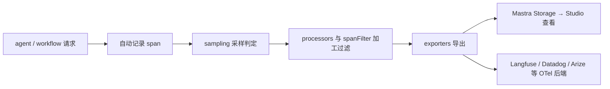

import { Canvas, Controls, Meta } from '@storybook/addon-docs/blocks';
import * as TracingStories from './tracing.stories';

<Meta of={TracingStories} name="Docs" />

# 追踪 Tracing

一次 `agent.generate()` 或 workflow 运行会被自动拆成一串 span：agent 运行、LLM 调用、工具执行、memory 操作各占一个，相关 span 组成一条 trace，还原请求的完整流转。本课讲四件事：装配 `Observability`、看懂 span 层级与四种采样策略、用处理器与过滤器控制导出内容、把 trace 送入 Mastra Storage 或 OpenTelemetry 生态并在 Studio 查看。下面的实例用离线示意数据展示一次 agent 调用的 trace：切换采样策略观察 trace 是否生成，切换视图展开 agent → LLM → tool 层级并读取耗时占比。



关键配置回查表（默认值以官方文档为准，正文小节给代码与边界）：

| 配置 | 取值 / 默认行为 | 说明 |
| --- | --- | --- |
| `sampling.type` | `always` / `never` / `ratio` / `custom` | `ratio` 配 `probability`（0–1） |
| `includeInternalSpans` | 默认丢弃 internal span | 置 `true` 才保留 |
| `hideInput` / `hideOutput` | 默认导出输入与输出 | 置 `true` 仅在导出时排除，执行期数据仍在 |
| `serializationOptions` | `maxStringLength: 131072`、`maxDepth: 8`、`maxArrayLength: 50`、`maxObjectKeys: 50` | 控制导出负载大小 |
| `environment` | `mastra dev` 下为 `development`，否则回退 `process.env.NODE_ENV` | 可被 per-call metadata 覆盖 |

## 装配 Observability

`Observability` 挂在 `Mastra` 实例上，是所有 span 的总线：采样判定、加工后交给导出器。装上它，agent、workflow、工具与模型交互即被自动追踪，无需在业务代码里埋点。

```bash
npm install @mastra/observability
```

```ts
import { Mastra } from '@mastra/core';
import { Observability } from '@mastra/observability';

export const mastra = new Mastra({
  agents: { weatherAgent },
  observability: new Observability({
    serviceName: 'mastra',                       // 附加到导出数据的服务标识
    exporters: [new MastraStorageExporter()],    // trace 目的地，可多个并存
    spanOutputProcessors: [new SensitiveDataFilter()], // 导出前统一加工（如脱敏）
    logging: { enabled: true, level: 'info' },   // 日志转发设置
  }),
});
```

多环境用 `configs` 写多份命名配置（如 `development` / `production`），由 `configSelector` 在运行时按 `process.env.NODE_ENV` 等条件选择。serverless 环境在响应返回或进程暂停前刷出缓冲，避免尾部 trace 丢失：

```ts
await mastra.observability.flush();
```

边界：serverless 建议配合外部存储而非本地文件存储；接入外部导出器时保留 `MastraStorageExporter` 或 `MastraPlatformExporter` 之一，Studio 里的 trace 视图才不会断。

## span 与 trace 层级

trace 是请求生命周期的层级时间线：root span 通常是 `AGENT_RUN` 或 workflow run，其下挂 `MODEL_STEP`（LLM 调用）、`TOOL_CALL`、memory 操作与 workflow step 等子 span，`MODEL_CHUNK` 这类内部碎片段默认不导出。span 结束时自动提取 duration、token counts 与 cost estimates；追踪上下文内的 `logger.info()` 自动附带 trace ID 与 span ID。`generate()` 返回的 `traceId` 可用于 Studio 与外部平台查询——tracing 关闭或该请求被采样排除时为 `undefined`。

<Canvas of={TracingStories.Interactive} />
<Controls of={TracingStories.Interactive} />

| 读者操作 | 可观察证据 |
| --- | --- |
| 采样策略切到 `never` | 画布显示“trace 未生成”，读数 `traceId = undefined` |
| 切到 `ratio` 并调低概率 | 每次调整重新掷骰，未命中的请求同样不留 trace |
| 视图切到“时间轴” | agent → LLM → tool 的 waterfall：root 820 ms 中 LLM 约 600 ms（73%） |

### 采样策略

采样在 `Observability` 的 `configs.<name>.sampling` 上配置，决定这条请求是否生成并导出 trace：

```ts
new Observability({
  configs: {
    default: {
      sampling: { type: 'ratio', probability: 0.1 }, // 10% 采集
      // custom: { type: 'custom', sampler: (options) => options?.metadata?.userTier === 'paid' }
    },
  },
});
```

- `always`：100% 采集，适合开发与低流量环境。
- `never`：完全关闭，被排除的请求照常执行，只是 `traceId` 为 `undefined`。
- `ratio`：按 `probability` 概率采集，适合高流量生产的成本控制。
- `custom`：`sampler` 回调读 `metadata` 等业务字段自行决定，如只采付费用户或命中实验的请求。

### 自定义埋点 createChildSpan

框架自动覆盖不到的内部操作（数据库查询、外部 HTTP、检索步骤）用 `createChildSpan()` 挂进当前 trace，子 span 自动继承父 trace 上下文：

```ts
const span = context?.tracingContext.currentSpan?.createChildSpan({
  type: 'generic',
  name: 'database-query',
  input: { query: inputData.query },
  metadata: { database: 'production' },
});

span?.end({ output: results.data, metadata: { rowsReturned: 12 } });
// 出错时改用：span?.error({ error, metadata: { retryable: true } })
```

当前 span 还能就地补充信息：`context?.tracingContext.currentSpan?.update({ metadata: {...} })`。边界：tracing 关闭或被采样排除时 `currentSpan` 为 `undefined`，所以全程用可选链，业务逻辑不能依赖 span 一定存在。

### 导出过滤与敏感数据

span 从生成到落盘要过四道关，任何一关都会减少导出内容：

1. internal span 默认丢弃，`includeInternalSpans: true` 才保留；
2. `excludeSpanTypes`（如 `[SpanType.MODEL_CHUNK, SpanType.MODEL_STEP]`）按类型整批剔除；
3. `spanOutputProcessors` 同步加工，作用于所有导出器；
4. `spanFilter: (span) => boolean` 决定单个 span 去留；filter 抛错时保留该 span 并记录日志。

`SpanOutputProcessor` 实现 `process(span): AnySpan` 与 `shutdown()`，硬约束：必须原地修改并返回同一个 span 对象，返回 `undefined` 表示丢弃该 span，返回副本会导致 span 无法导出。内置 `SensitiveDataFilter` 负责脱敏 password、token、key 等敏感字段。只影响单个导出器的改名变形用 `customSpanFormatter`（支持 async，可用 `chainFormatters([...])` 链式组合；async 会增加导出延迟，建议单次操作控制在 100ms 内）。大对象入 span 前先自行裁剪，序列化上限见开场回查表。

## 导出到 OpenTelemetry 生态

Mastra 的 trace 采用 OpenTelemetry 的标识模型：`traceId` 关联整条链路，`parentSpanId` 挂接父子关系。已有 OTel 埋点的应用可把 Mastra trace 并入同一分布式链路——取上游 `trace.getActiveSpan()?.spanContext()` 的 `traceId` 与 `spanId`，通过 `tracingOptions` 传入：

```ts
const result = await agent.generate('分析这份周报', {
  tracingOptions: {
    traceId: spanContext.traceId, // 1–32 位 hex，OTel 为 32 位
    parentSpanId: spanContext.spanId, // 1–16 位 hex，OTel 为 16 位
    tags: ['production', 'experiment-v2'], // 仅作用于 root span
    metadata: { userId: 'user-123' }, // 显式 metadata 优先于自动提取
    hideInput: true, // 导出时隐藏输入，执行期数据仍在
  },
});
```

非法 ID 不会崩溃：traceId 非法时重新生成，parentSpanId 非法时忽略父子关系。`tags` 在 OTel 后端映射为 `mastra.tags` 属性，Braintrust / Langfuse 原生展示。配置级 `requestContextKeys: ['userId', 'tenantId']`（支持 `user.id` 点号嵌套）可从 RequestContext 自动提取 metadata 到 root span。常用导出器与选用判断：

| 导出器 | 来源 | 选用时机 |
| --- | --- | --- |
| `MastraStorageExporter` | 内置 | 本地开发默认；trace 落 Mastra Storage，Studio 可查 |
| `MastraPlatformExporter` | 内置 | 用 Mastra 托管平台（需 `MASTRA_PLATFORM_ACCESS_TOKEN`） |
| `LangfuseExporter` | `@mastra/langfuse` | 已用 Langfuse 做 LLM 观测 |
| `ArizeExporter` | `@mastra/arize` | 接 Arize / Phoenix（配 `endpoint`、`apiKey`） |
| Datadog 等 OTel 后端 | OTel 兼容 | 已有 APM 体系，trace 并入现有面板 |

## 存储与 Studio 查看

trace 经 `MastraStorageExporter` 写入 `MastraCompositeStore`（`@mastra/core/storage`）。`domains` 字段可把 `observability` 域路由到独立后端，与主业务存储分离：本地开发常用 `DuckDBStore` 承接 observability 域，生产高流量推荐 `ClickHouse`（也支持 PostgreSQL、LibSQL 等）。验收方式：`mastra dev` 打开 Studio 的 trace 视图按 `traceId` 查询（Studio 用法见 [1.7 用 Studio 调试](?path=/docs/studio--docs)）；无界面时用 CLI 拉最近 trace：`npx mastra api trace list '{"page":0,"perPage":20}'`。

## 最佳实践

- 生产用 `ratio` + `custom` 组合：基线 10% 采样兜底成本，`sampler` 里对报错重试、付费用户等关键流量返回 `true` 全采。
- 观测存储与业务存储分离：`domains.observability` 指向独立 DuckDB / ClickHouse，避免 trace 写放大拖慢主库。
- 对接外部平台时保留一个内置导出器：外部导出器服务分析团队，Studio 排障仍依赖 `MastraStorageExporter` / `MastraPlatformExporter`。

## 常见问题

- 外部平台里 trace 缺 span 或字段是空的？
  先查 `spanOutputProcessors` 是否返回了副本（必须原地 mutate 并返回同一实例），再看 `spanFilter`、`excludeSpanTypes` 是否整批剔除了该类型，最后核对 `serializationOptions` 是否截断了长字符串。
- `traceId` 是 `undefined`，请求明明成功了？
  请求执行与追踪导出是解耦的：确认 `Observability` 已装配、采样策略不是 `never`（`ratio` 下未命中同样没有 `traceId`）。
- serverless 里 trace 总是缺最后一小段？
  进程可能在导出器 flush 前被冻结，在返回响应前 `await mastra.observability.flush()`，并改用外部存储。

## 总结回顾

摘要：

`@mastra/observability` 在 `Mastra` 实例上装配 `Observability`，把 agent、workflow、工具与模型交互自动记成 span 层级组成的 trace；`configs.sampling` 用 always / never / ratio / custom 控制哪些请求留下 trace，被排除的请求 `traceId` 为 `undefined` 但执行不受影响。导出前经过 internal span 剔除、`excludeSpanTypes`、`spanOutputProcessors`（原地 mutate，内置 `SensitiveDataFilter` 脱敏）与 `spanFilter` 四道加工，再交给 `MastraStorageExporter`、`MastraPlatformExporter` 或 Langfuse、Arize、Datadog 等 OTel 导出器；`tracingOptions` 支持 tags、metadata、hideInput/hideOutput 与上游 OTel 的 traceId/parentSpanId 传播；trace 落入 `MastraCompositeStore` 的 observability 域，在 Studio 按 `traceId` 查询。

一句话：

> 采样决定“记不记”，processors 与 filter 决定“记什么”，导出器决定“记到哪”——被丢弃的请求照常执行，只是查不到 trace。

知识要点：

- 四种采样策略各自适合什么场景？`ratio` 的 `probability` 取值范围是什么？
- `SpanOutputProcessor` 的返回值有什么硬约束？返回副本会怎样？
- `hideInput` / `hideOutput` 隐藏的是哪个阶段的数据？
- 如何把上游 OpenTelemetry span 的上下文传给 Mastra？非法 traceId 会怎样？
- trace 存在哪里？本地与生产分别推荐什么后端？

## 参考资料

- [Observability Overview](https://mastra.ai/docs/observability/overview)
- [Tracing Overview](https://mastra.ai/docs/observability/tracing/overview)
