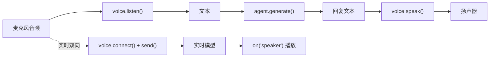

import { Canvas, Controls, Meta } from '@storybook/addon-docs/blocks';
import * as Stories from './voice.stories';

<Meta of={Stories} name="Docs" />

# 语音

Mastra 用统一的 Voice 接口把「音频 ↔ 文本」的 provider 差异封装起来：Agent 只面向三类能力——`voice.listen()`（语音转文字）、`voice.speak()`（文字转语音）和一条实时双向语音通道；换 provider 只换构造函数，方法族不变。本课给出三类能力的最小接法、已核对的默认值，以及「分体链路 vs 实时通道」的选型判断。



## 三类语音能力

一个 Voice 实例可以只实现三类能力中的一部分，选型前先看能力矩阵：

| 能力 | 方法 | 返回 | 场景 |
| --- | --- | --- | --- |
| 语音转文字 STT | `voice.listen(audioStream)` | `Promise<string>` 转写文本 | 听懂用户说的内容 |
| 文字转语音 TTS | `voice.speak(text, options?)` | `Promise<NodeJS.ReadableStream>` 音频流 | 把回复读出来 |
| 语音到语音 STS | `connect()` / `send()` / `on()` | 实时事件流 | 双向实时对话 |

方法族速查（细节以各 provider 参考页为准）：

| 方法 | 用途 |
| --- | --- |
| `listen` / `speak` | 分体链路两端点，provider 至少实现其一 |
| `connect` / `send` / `on` | 实时通道：建连、送麦克风流、订阅事件 |
| `getSpeakers()` | 列出可用音色，如 Deepgram 每项含 `voiceId` |
| `updateConfig` / `addInstructions` / `addTools` | 调整运行时配置、给语音会话注入指令与工具（按 provider 而异） |

### 文字转语音 speak()

`voice.speak()` 接收文本、返回音频流；`options.speaker` 可按次覆盖默认音色。官方集成 Deepgram 的最小接法：

```typescript
import { DeepgramVoice } from '@mastra/voice-deepgram';
import { playAudio } from '@mastra/node-audio';

const voice = new DeepgramVoice(); // 缺省读取环境变量 DEEPGRAM_API_KEY
const audioStream = await voice.speak('Hello, world!', { speaker: 'asteria-en' });
playAudio(audioStream); // Node 侧接播放器出声
```

可观察证据：`speak()` 返回 `NodeJS.ReadableStream`，接播放器即出声；`getSpeakers()` 返回音色列表可逐个试听。边界：Deepgram 默认 `speechModel` 为 `{ name: 'aura' }`、默认音色 `'asteria-en'`；`speak()` 也可接收流（内部先转文本再合成）。

### 语音转文字 listen()

`voice.listen()` 接收音频流、返回转写字符串，可直接交给 Agent 继续处理：

```typescript
import { createReadStream } from 'fs';

const transcript = await voice.listen(createReadStream('./speech.mp3'));
const { text } = await agent.generate(transcript);
```

可观察证据：`listen()` 返回 `Promise<string>`。边界：Deepgram 默认 `listeningModel` 为 `{ name: 'nova' }`；provider 的 STT / TTS 支持并不对称（例如 ElevenLabs 集成页对自身 STT 的说明与其方法列表存在出入），以各集成页当页标注为准。

### 实时语音对话

实时 STS 跳过「转文本 → 生成 → 再合成」的分段等待：`connect()` 建连后，`send()` 持续送入麦克风音频，`on()` 订阅回传事件：

```typescript
await voice.connect();
voice.on('speaker', ({ audio }) => playAudio(audio)); // 模型侧音频
voice.on('writing', ({ text, role }) => console.log(text)); // 双方转写
voice.speak('你好，我在听');
voice.send(getMicrophoneStream());
```

- 事件：`'speaker'`（部分 provider 为 `'speaking'`）携带 Agent 音频；`'writing'` 携带 `{ text, role }` 转写。
- 实时 provider 家族：OpenAI Realtime、Google Gemini Live、AWS Nova Sonic、Inworld Realtime、xAI Realtime。
- 其中 Gemini Live、Nova Sonic、Inworld Realtime、xAI Realtime 必须先 `await voice.connect()` 才能说话。
- 另有基于 LiveKit 的 Realtime voice：VAD、语义轮次检测、打断（barge-in）等音频循环交给 Mastra 委托，Agent 侧仍用自己的模型、工具与记忆生成回复。

## provider 选型与挂载

Provider 集成在 `@mastra/voice-<provider>` 系列包下（Deepgram、ElevenLabs、OpenAI、Azure、Google、Speechify、xAI 等）。以下默认值已与官方页核对：

| Provider | 默认 TTS 模型 | 默认 STT 模型 | 默认音色 | 环境变量 |
| --- | --- | --- | --- | --- |
| Deepgram（`@mastra/voice-deepgram`） | `aura` | `nova` | `'asteria-en'` | `DEEPGRAM_API_KEY` |
| ElevenLabs | `eleven_multilingual_v2` | 见集成页 | `'Aria'` | `ELEVENLABS_API_KEY` |
| OpenAI | 见集成页 | `whisper-1` | `'alloy'` | `OPENAI_API_KEY` |

### 挂到 Agent

`Agent` 构造函数的 `voice` 属性接收任意 Voice 实例，挂载后经 `agent.voice` 调用同一方法族：

```typescript
import { Agent } from '@mastra/core/agent';
import { OpenAIVoice } from '@mastra/voice-openai';

const voiceAgent = new Agent({
  id: 'voice-agent',
  name: 'Voice Agent',
  instructions: 'You are a voice assistant that can help users with their tasks.',
  model: 'openai/gpt-4o', // 任意 provider/model 字符串，与语音无关
  voice: new OpenAIVoice(),
});

const audio = await voiceAgent.voice.speak('你好'); // 与独立 Voice 实例同方法族
```

### CompositeVoice 分体组合

输入、输出各选最强的 provider，`CompositeVoice` 把两者合成一个 Voice，对调用方仍是同一方法族：

```typescript
const voice = new CompositeVoice({
  input: new OpenAIVoice({ listeningModel: { name: 'whisper-1', apiKey: process.env.OPENAI_API_KEY } }),
  output: new ElevenLabsVoice(),
});

const transcript = await voice.listen(audioStream);
const speech = await voice.speak('你好');
```

边界：`input` 只需 STT 能力、`output` 只需 TTS 能力——STT 缺失的 provider 可以只当 `output` 用。

### 链路选型示意

<Canvas of={Stories.Interactive} />
<Controls of={Stories.Interactive} />

延迟数值为教学示意（非官方实测），用于表达分段等待的相对构成；链路与标题随控件切换。

| 读者操作 | 可观察证据 |
| --- | --- |
| 接法切到「实时 STS」 | 链路从 listen → generate → speak 三段变为 connect + on 两段 |
| STT 与 TTS 选不同 provider | 标题变为 `CompositeVoice` 组合提示，读数列出各环节模型 |
| 打开 Show code | 查看该 Canvas 实际执行的 `example.ts` |

## 最佳实践

- 能力矩阵优先于品牌偏好：选型前先到该 provider 集成页确认它支持 `listen` / `speak` / 实时三者中的哪些；只支持单向时用 `CompositeVoice` 补另一端。
- 交互形态决定接法：一问一答的播报场景用 listen → generate → speak 分体链路，可逐段优化与排障；对话式低延迟场景上实时 STS，但 connect 时机与 provider 约束要先核对。
- 一家全包与跨家组合的取舍：Deepgram 一家可同时供 STT（nova）与 TTS（aura），配置最少；跨家组合（如 whisper-1 听 + ElevenLabs 说）换单项质量，代价是两份 API key 与账单。
- 语音只解决音频出入口；把 Agent 接入 Slack、Telegram 等文字消息通道，见 [Channels 消息渠道](?path=/docs/channels--docs)。

## 常见问题

- 调用 `speak()` 或 `listen()` 报方法不存在？
  先到该 provider 集成页查能力矩阵：provider 只实现部分方法（有的 TTS 强、STT 缺失）。分体补齐用 `CompositeVoice` 的 `input` / `output` 各配一个 provider。
- 实时模式下 `speak()` / `send()` 没有声音返回？
  确认是否已 `await voice.connect()`：Gemini Live、Nova Sonic、Inworld Realtime、xAI Realtime 必须先建连再说话，并用 `on('speaker')` 接收音频。
- 装了包却拿不到音频或 Voice 类？
  集成包名为 `@mastra/voice-<provider>`（如 `@mastra/voice-deepgram` 导出 `DeepgramVoice`）；`speak()` 返回的是音频流，需播放器（如 `@mastra/node-audio` 的 `playAudio`）才能听到。

## 总结回顾

摘要：

Mastra 把语音能力收敛为一个 Voice 接口：`listen()` 转写、`speak()` 合成、实时通道 connect / send / on。Voice 通过 `new Agent({ voice })` 挂到 Agent，之后 `agent.voice` 与独立实例共用同一方法族；provider 各自实现部分能力，分体链路用 `CompositeVoice` 组合 input / output，对话式低延迟场景选实时 STS provider。换 provider 只换构造函数，模型与音色默认值以各集成页为准。

一句话：

> 语音选型先查 provider 能力矩阵，再决定「分体组合」还是「实时通道」——方法族不变，换 provider 只换构造。

知识要点：

- 三类语音能力分别对应哪些方法与返回值？
- 怎样把 Voice 实例挂到 Agent，并用 `CompositeVoice` 组合不同 provider？
- 哪些实时 provider 必须先 `connect()` 才能说话？
- Deepgram 的默认模型、音色与环境变量是什么？

## 参考资料

- [Voice 参考总览](https://mastra.ai/reference/voice/overview)
- [Deepgram 语音集成](https://mastra.ai/integrations/voice/deepgram)
- [ElevenLabs 语音集成](https://mastra.ai/integrations/voice/elevenlabs)
