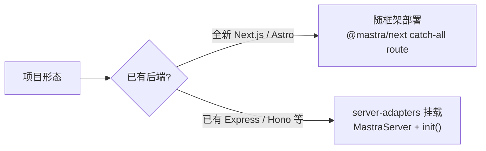

import { Canvas, Controls, Meta } from '@storybook/addon-docs/blocks';
import * as Stories from './web-frameworks.stories';

<Meta of={Stories} name="Docs" />

# Web 框架集成

Mastra 的 Agent 与 Workflow 跑进真实 Web 应用只有两条路：**随框架部署**——构建产物自带 Mastra 服务器（Next.js、Astro，部署侧细节见[部署概览与自托管](?path=/docs/deployment--docs)）；**server-adapters 挂载**——把同一套 API 路由装进既有 Express / Hono / Fastify / Koa / NestJS 等应用（适配器机制见[服务器适配器](?path=/docs/server-adapters--docs)）。本课是实战汇总：给出选型判断、共性接线模式与三个代表框架的最小接线代码，各框架完整细节见文末 integrations 页。切换下方控件，先看不同项目形态的推荐路径。



| 框架 | 适配器包 | 挂载方式 | 默认前缀 |
| --- | --- | --- | --- |
| Next.js | `@mastra/next` | `createNextRouteHandler` 接 catch-all route | `/api`，须与挂载路径一致 |
| Hono | `@mastra/hono` | `MastraServer` 构造 + `init()` | `/api` |
| Express | `@mastra/express` | 同 Hono 模式，先挂 `express.json()` | `/api` |

## 集成路径选择

两条路最终暴露**一致的 API 路由**（`/api/agents/:id/generate` 等），差别只在进程归属与装配方式：随框架部署由框架构建产物托管路由；适配器挂载由你的框架进程托管，`await server.init()` 按 context → auth → 用户中间件 → 路由四步装配。选型入口一句话：**全新项目走随框架部署，已有后端项目走适配器挂载**。

<Canvas of={Stories.Interactive} />
<Controls of={Stories.Interactive} />

| 读者操作 | 可观察证据 |
| --- | --- |
| 切换「项目形态」 | 推荐路径、适配器包、挂载点、默认前缀与接线步骤同步变化 |
| 打开 Show code | 看到 `example.ts` 中三种形态的路径数据与绘制逻辑 |

### Next.js：随框架部署

在 Next.js 里挂一个 catch-all API route，把整个 Mastra HTTP API 接进应用。挂载在 `src/app/api/mastra/[...mastra]/route.ts` 时，`prefix` 必须写成 `/api/mastra`（默认 `/api`，与文件路径一致）：

```ts
// src/app/api/mastra/[...mastra]/route.ts
import { mastra } from '@/mastra'
import { createNextRouteHandler } from '@mastra/next'

export const { GET, POST, PUT, DELETE, PATCH, OPTIONS, HEAD } = createNextRouteHandler({
  mastra,
  prefix: '/api/mastra',
})
```

验证（agent 名来自 `mastra init` 脚手架）：

```bash
curl -X POST http://localhost:3000/api/mastra/agents/weather-agent/generate \
  -H "Content-Type: application/json" \
  -d '{"messages":[{"role":"user","content":"What is the weather like in Seoul?"}]}'
```

自定义聊天路由不必暴露整台 Mastra 服务器，用 `@mastra/ai-sdk` 在普通 route.ts 里把 Agent 响应转成 AI SDK 流（version 目前为 `v7`），GET 侧用 `toAISdkMessages` 把记忆召回的消息转回 UI 消息：

```ts
import { handleChatStream } from '@mastra/ai-sdk'

const stream = await handleChatStream({ mastra, agentId: 'weather-agent', version: 'v7', params })
return createUIMessageStreamResponse({ stream })
```

必要边界：官方要求 Node.js ≥ 22.13.0；与 `mastra dev`（Studio）共享数据库时 storage 要写绝对路径（如 `file:/abs/path/mastra.db`），相对路径会因进程工作目录不同而错位；serverless 部署的存储与打包限制见部署课。对话前端组件的接入见[前端接入与聊天 UI](?path=/docs/chat-ui--docs)。

### Hono：适配器最小起步

把既有（或新建的）Hono app 与 mastra 实例一起交给 `@mastra/hono` 的 `MastraServer`，`init()` 会注册中间件并暴露全部端点：

```ts
import { serve } from '@hono/node-server'
import { Hono } from 'hono'
import { type HonoBindings, type HonoVariables, MastraServer } from '@mastra/hono'
import { mastra } from './mastra/index.js'

const app = new Hono<{ Bindings: HonoBindings; Variables: HonoVariables }>()
const server = new MastraServer({ app, mastra })
await server.init()

app.get('/', c => c.text('Hello Hono!'))   // 既有路由照常工作

serve({ fetch: app.fetch, port: 3000 })
```

端点默认挂在 `/api` 子路径下，按 agent / workflow 的 ID 寻址，如 `/api/agents/weather-agent`。必要边界：`init()` 必须调用，漏掉时中间件与路由都不会注册；类型参数 `HonoBindings` / `HonoVariables` 由适配器包导出，用于保证请求上下文类型正确。

### Express：挂进既有后端

Express 与 Hono 同一模式：先挂 `express.json()` 解析 JSON body，再把 app 与 mastra 交给 `@mastra/express` 的 `MastraServer`：

```ts
import express from 'express'
import { MastraServer } from '@mastra/express'
import { mastra } from './mastra/index.js'

const app = express()
app.use(express.json())

const server = new MastraServer({ app, mastra })
await server.init()

app.listen(3000)
```

既有业务路由、静态资源与 Mastra 的 `/api` 端点共存于同一进程。必要边界：JSON body 解析由你负责（适配器不自动挂 body parser，漏掉时 POST 拿不到请求体）；反向代理层需放行 POST / PUT / DELETE 等方法与 SSE 流式响应。

## 最佳实践

- **按项目形态选路，不按框架喜好：** 全新 Next.js 项目用 `@mastra/next` catch-all；已有后端项目用对应适配器包挂载；框架不在官方 8 个适配器名单（Fastify / Koa / NestJS / TanStack Start / Elysia 等）时，继承 `MastraServer` 抽象类自写适配器。
- **最小暴露面优先：** 前端只需要对话时，用 `@mastra/ai-sdk` 的 `handleChatStream` 写单个 route，不必挂整台 Mastra 服务器；需要工作流管理、MCP 等完整 API 时再上 catch-all 或适配器。
- **共享数据库用绝对路径：** Next.js 进程与 `mastra dev` 进程的工作目录不同，storage 路径写成绝对路径才能指向同一个库。

## 常见问题

- 请求 Mastra 端点返回 404？
  先查两处：Next.js 的 `prefix` 是否与 catch-all 文件路径一致；适配器是否调用了 `await server.init()`。两者任一缺失，路由都不会出现。
- serverless 部署后报数据库或打包错误？
  本地 `file:` 存储在 serverless 环境受限，改用托管存储；部署侧打包配置（如 `serverExternalPackages`）按部署课处理。

## 总结回顾

摘要：

Web 框架集成只有两条路：随框架部署把 Mastra 服务器装进框架构建产物（Next.js 用 `@mastra/next` 的 `createNextRouteHandler` 接 catch-all route，`prefix` 与挂载路径一致）；server-adapters 挂载把同一套路由装进既有应用（Hono 与 Express 均为「把 app 与 mastra 交给 `MastraServer`，`await init()` 四步装配」，Express 需先挂 `express.json()`）。两条路暴露一致的 `/api` 端点，选型只看项目形态：全新项目走部署，已有后端走挂载。

一句话：

> 全新项目随框架部署，已有后端用 server-adapters 挂载——路由一致，差别只在进程归属与装配方式。

知识要点：

- 两条集成路径分别适合什么项目形态？
- Next.js 的 `prefix` 与 catch-all 挂载路径是什么关系？
- Hono / Express 适配器的最小接线是哪几步？
- 请求 Mastra 端点 404 时先检查哪两处？

## 参考资料

- [Next.js integration](https://mastra.ai/integrations/frameworks/next-js)
- [Hono integration](https://mastra.ai/integrations/frameworks/hono)
