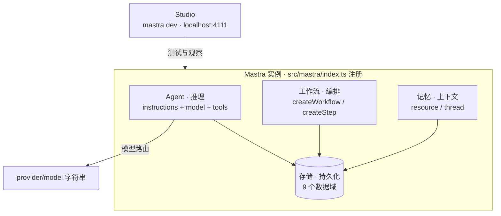

import { Canvas, Controls, Meta } from '@storybook/addon-docs/blocks';
import * as WhatIsMastra from './what-is-mastra.stories';

<Meta of={WhatIsMastra} name="Docs" />

# Mastra 是什么

Mastra 是一个 TypeScript 原生的开源 AI agent 框架，由 Gatsby 联合创始人 Sam Bhagwat 与前 Gatsby 团队成员在 2024 年创办。它把构建 agent 应用需要的部件打包在一起——Agent、工具、工作流、记忆、RAG、MCP、评估、可观测与部署，从一条 `npm install` 起步的原型，一路走到上生产的应用。

本课建立后续所有课程的全局框架：先认清每一层「是什么、负责什么」，后面的课程再逐层展开「怎么用」。读完本课，你应能指着一张架构图说出各层的名字、职责与核心 API。



## 框架定位

Mastra 的立足点是「为 TypeScript 开发者造 agent 应用」：

- **类型贯穿始终**：工具入参、步骤输入输出、结构化结果都靠 zod schema 约束，类型从定义一直流到运行结果。
- **一套部件覆盖全周期**：原型阶段用 Agent 加工具跑通对话；需要确定性执行时上工作流；需要记住用户时接记忆与存储；上线时用评估、可观测与部署工具收尾。
- **一个实例注册一切**：Agent、工作流、存储等都在 `new Mastra({ agents, workflows, storage })` 里登记（入口约定在 `src/mastra/index.ts`），Studio、调用 API 与共享服务都从这个实例取用。

## 分层架构：点选每一层

下面的实例画出了 Mastra 的五个核心层。点选画布中的层（或在 Controls 里切换），读数会显示该层的职责与核心 API：

<Canvas of={WhatIsMastra.Interactive} />
<Controls of={WhatIsMastra.Interactive} />

| 读者操作 | 可观察证据 |
| --- | --- |
| 调整「当前层」或点击画布中的层 | 高亮层切换，左下角读数同步显示该层职责与核心 API |
| 选中「Agent」层 | 读数显示 `Agent · generate / stream`，行内标注 `@mastra/core/agent` |
| 选中「存储」层 | 读数显示 9 个数据域与按域路由的复合存储 |
| 打开 Show code | 看到该 Canvas 实际执行的 `example.ts` |

从上到下读这张图：**Studio** 是调试入口，`mastra dev` 启动后打开 `localhost:4111`，在浏览器里测试 Agent、工具与工作流并查看调用详情；**Agent** 是推理单元，把 instructions（系统提示词）、model 与 tools 组合起来；**工作流** 用带 schema 的步骤链做确定性编排，适合顺序固定的多步任务；**记忆** 按 resource（用户）与 thread（会话）双标识保存历史，让 Agent 记住之前聊过什么；**存储** 是底座，把记忆、工作流快照、追踪等 9 个数据域持久化到可替换的后端（本地常用 LibSQL）。

## 模型接入：provider/model 字符串

Mastra 内建 model router（基于 Vercel AI SDK），模型用 `provider/model` 字符串声明，不必安装各厂商 SDK 包；API key 从环境变量自动读取（如 `OPENAI_API_KEY`）。所有 Agent 统一用 `generate`（拿完整结果）与 `stream`（逐字输出）对话：

```ts
import { Agent } from '@mastra/core/agent';

export const weatherAgent = new Agent({
  id: 'weather-agent',
  name: 'Weather Agent',
  instructions: '你是天气助手，回答简洁。',
  model: 'openai/gpt-5-mini',
});

const response = await weatherAgent.generate('上海今天适合骑车吗？');
console.log(response.text);
```

换成 `anthropic/claude-sonnet-4-6` 或 `google/gemini-2.5-flash` 只需改这一个字符串，这正是模型路由「provider 可替换」的意义。

## 生态与前置条件

- **Mastra Platform**：官方托管平台，承接部署、观测与托管数据库；自托管则用 `mastra build` 产物部署到任意云。
- **Templates 与 integrations**：官方模板画廊（文档问答、Slack agent、PR 评审等）；数据库后端（LibSQL、Postgres 等）、Web 框架（Next.js、Hono、Express 等）、消息渠道与语音均有官方集成。
- **前置要求**：Node 22.18+（可直接运行 TypeScript 文件）、`package.json` 里的 `"type": "module"`、zod（工具与步骤的 schema）。脚手架命令是 `npm create mastra@latest`，下一课展开。

## 总结回顾

摘要：

Mastra 用一个 TypeScript 实例把 agent 应用的五层部件收敛到统一框架：Studio 负责调试，Agent 负责推理，工作流负责编排，记忆负责上下文，存储负责持久化；模型经 provider/model 字符串接入，generate 与 stream 是统一的对话出口。后续课程将按这条分层线逐层展开。

一句话：

> Mastra 用一个 TypeScript 实例把 agent 应用的推理、编排、记忆与持久化收敛到统一框架，模型与存储后端皆可替换。

知识要点：

- 五层各自负责什么？画布点选后读数给出的职责与核心 API 是哪一条？
- Agent 的三个组成部分（instructions、model、tools）中，哪个决定换模型只改一个字符串？
- 存储的 9 个数据域为什么要独立分层？（工作流挂起恢复、记忆历史、追踪都依赖它持久化）

## 参考资料

- [Mastra 文档首页](https://mastra.ai/docs)
- [Learn：What is an agent](https://mastra.ai/learn/what-is-an-agent)
- [Agents Overview](https://mastra.ai/docs/agents/overview)
