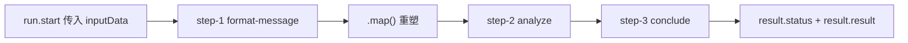

import { Canvas, Controls, Meta } from '@storybook/addon-docs/blocks';
import * as Stories from './workflow-basics.stories';

<Meta of={Stories} name="Docs" />

# 工作流基础

工作流（Workflow）把一件多步任务拆成若干步骤（Step），按确定顺序串联执行：每一步用 zod 声明输入/输出结构，上一步的输出就是下一步的输入。与 Agent 的自主推理不同，工作流的路径是确定的、结构是可校验的、每一步是可观察的，适合「先取数、再加工、后汇总」这类必须按流程走的任务。

本课建立最小链路：`createStep()` 定义步骤，`createWorkflow()` 加 `.then()` 串成链并用 `.commit()` 定型，`createRun()` / `run.start()` 跑一次，用 `result.status` 判断成败。内嵌实例离线重放这条链上的数据传递，不调用真实模型。



## 核心 API 参考表

| API / 属性 | 作用 | 关键点 |
| --- | --- | --- |
| `createStep({ id, inputSchema, outputSchema, execute })` | 定义单个步骤 | schema 用 zod；`execute` 返回值必须满足 `outputSchema` |
| `createWorkflow({ id, inputSchema, outputSchema })` | 创建工作流 | `inputSchema` 就是第一步的输入契约 |
| `.then(step)` | 串联步骤 | 上一步输出 = 下一步输入 |
| `.map(fn)` | 步骤间重塑数据 | 回调可用 `inputData`、`getStepResult()`、`getInitData()` |
| `.commit()` | 定型工作流 | 不调用就无法 `createRun()` |
| `workflow.createRun()` | 建立一次运行 | 之后 `run.start({ inputData })` 或 `run.stream()` |
| `result.status` | 结果判别联合 | `success` / `failed` / `suspended` / `paused` / `tripwire` |
| `new Mastra({ workflows: { ... } })` | 注册工作流 | 注册后用 `mastra.getWorkflow('键名')` 取回 |

## 定义步骤：createStep

一个步骤是一个带契约的执行单元：`id` 唯一标识步骤，`inputSchema` / `outputSchema` 用 zod 描述数据形状，`execute` 拿到上游输出 `inputData` 做加工并返回输出。

```ts
import { createStep } from '@mastra/core/workflows';
import { z } from 'zod';

const formatMessage = createStep({
  id: 'format-message',
  inputSchema: z.object({ message: z.string() }),
  outputSchema: z.object({ formatted: z.string() }),
  execute: async ({ inputData }) => {
    return { formatted: inputData.message.trim().toUpperCase() };
  },
});
```

`execute` 的返回值会被 `outputSchema` 校验，校验不过整条 run 走向 `failed`。schema 层面 Mastra 使用 Standard JSON Schema：zod 可直接写；Valibot / ArkType 需先经 `toStandardJsonSchema()` 等工具转换。

## 串联与提交：createWorkflow + .then() + .commit()

`createWorkflow()` 声明整条链的首尾契约，`.then()` 把步骤按顺序接上，`.commit()` 定型。没有 `.commit()` 的工作流不能 `createRun()`。

```ts
import { createWorkflow } from '@mastra/core/workflows';
// analyze、conclude 与 formatMessage 结构相同（schema + execute），此处省略

export const greetingWorkflow = createWorkflow({
  id: 'greeting-workflow',
  inputSchema: z.object({ message: z.string() }),
  outputSchema: z.object({ summary: z.string() }),
})
  .then(formatMessage)
  .then(analyze)
  .then(conclude)
  .commit();
```

工作流本身也能作为链条成员：`.then(childWorkflow)` 直接嵌入子工作流，像步骤一样参与串联。

## 数据在链上流动

默认传递规则：每一步 `execute` 收到的 `inputData` 就是上一步的输出。要对结构做整形，插一个 `.map()`，它的回调拿到三种数据源：

- `inputData`：上游（紧邻前一环节）的输出；
- `getStepResult(stepObject)`：传步骤对象，取任意上游步骤的完整输出；
- `getInitData()`：取工作流的初始输入。

```ts
// step-2 输出 { length, words }，但 step-3 只需要 { strength }
// .map() 把数据重塑成下一步 inputSchema 认可的形状
const strengthWorkflow = createWorkflow({
  id: 'strength-workflow',
  inputSchema: z.object({ message: z.string() }),
  outputSchema: z.object({ summary: z.string() }),
})
  .then(formatMessage)
  .then(analyze)
  .map(async ({ inputData, getStepResult }) => {
    const formatted = getStepResult(formatMessage); // 跨步取 step-1 的输出
    return {
      strength: Number((formatted.formatted.length * inputData.words).toFixed(1)),
    };
  })
  .then(conclude)
  .commit();
```

下面离线重放一次 run：数据沿「启动输入 → step-1 → step-2 → .map() → step-3」传递，读数与结果面板同步显示每步输出与 `result.status`。

<Canvas of={Stories.Interactive} />
<Controls of={Stories.Interactive} />

| 读者操作 | 可观察证据 |
| --- | --- |
| 修改「初始输入 message」 | step-1 输出随之变化，并沿链传给 step-2 |
| 拖动「.map() 系数 factor」 | 映射节点算出的 strength 变化，step-3 结论随之改变 |
| 打开「analyze 步骤抛错」 | 链条停在 step-2，下游变虚线「未执行」，状态变 `failed` |
| 打开 Show code | 看到 Canvas 实际重放数据流的 `chain-run.ts` |

## 运行一次 run

`createRun()` 建立一次运行实例，`run.start({ inputData })` 执行整条链并返回结果；需要过程数据时改用 `run.stream()`。

```ts
const run = await greetingWorkflow.createRun();
const result = await run.start({ inputData: { message: 'Hello workflow' } });

if (result.status === 'success') {
  console.log(result.result); // { summary: '...' }
} else if (result.status === 'failed') {
  console.error(result.error);
}
```

流式运行：`stream.fullStream` 逐块产出执行过程，`stream.result` 拿最终结果。

```ts
const stream = run.stream({ inputData: { message: 'Hello workflow' } });
for await (const chunk of stream.fullStream) {
  console.log(chunk);
}
const result = await stream.result;
```

`result` 是按 `status` 区分的判别联合；公共属性始终可用：`status`、`input`、`steps`（各步骤的状态与输出），可选 `state`。

| status | 含义 | 独有属性 |
| --- | --- | --- |
| `success` | 全部环节执行完成 | `result` |
| `failed` | 某步校验或执行失败 | `error` |
| `suspended` | 步骤挂起等待恢复 | `suspendPayload`、`suspended` |
| `paused` | 运行被暂停 | 无独有属性 |
| `tripwire` | 被护栏（tripwire）拦截 | `tripwire`（含 `reason` 等） |

`suspended` / `paused` 与「失败」不同，它们是运行中的中间状态；挂起与恢复见 [人机协同挂起](?path=/docs/human-in-the-loop--docs)。

## 注册与 Studio 可视化运行

工作流和 Agent 一样要注册进 Mastra 实例，才能被框架管理与检索：

```ts
export const mastra = new Mastra({
  workflows: { greetingWorkflow },
});

// 取回时优先用注册键：类型推断更完整
const wf = mastra.getWorkflow('greetingWorkflow');
```

注册键 `greetingWorkflow` 与 `id: 'greeting-workflow'` 分属两个命名空间：`getWorkflow()` 按注册键取（类型推断完整），`getWorkflowById()` 按 `id` 取（推断较弱），优先用前者。

跑 `npx mastra dev` 打开 Studio 的 Workflows 标签页：图视图展示链路结构，输入表单由 `inputSchema` 自动生成，运行时可看实时状态与日志，完成后还能逐步重放（Time travel）。本课的最小链可以直接粘进项目用 Studio 验证。

## 全局能力的边界

概览页还提级了三个跨步骤概念，这里只认入口：

- `stateSchema`：步骤级共享状态。给 `createStep()` 传 `stateSchema` 后，`execute` 里可读写 `state` 与 `setState({ ...state, counter: state.counter + 1 })`，跨步骤累计数据不必硬塞进输出。
- `RequestContext`：一次请求的上下文。`execute` 里的 `requestContext.get('user-tier')` 读取运行时注入的值，可做按租户/用户差异化。
- 重启：`run.restart()` 恢复单次运行，`workflow.restartAllActiveWorkflowRuns()` 重启全部活跃运行；本地服务器启动时会自动重启活跃运行，工作流 `options` 里设 `autoRestartActiveRuns: false` 可关闭。

分支、并行、循环等控制流见 [工作流控制流](?path=/docs/workflow-control-flow--docs)。

## 最佳实践

- schema 即契约：每步 `outputSchema` 只写下游真正需要的字段；结构对不齐时用 `.map()` 显式重塑，不要放宽 schema 迁就数据。
- 处理结果先判 `status`：`result` 是判别联合，先 `if (result.status === 'success')` 再取 `result.result`，TypeScript 会自动收窄独有属性。
- 步骤小而单一：一步只做一件事，链条结构本身就是任务文档；复杂逻辑下沉到工具或函数。

## 常见问题

- 调 `createRun()` 报工作流不可用，或运行时找不到工作流
  先检查两处：链条末尾是否调了 `.commit()`；工作流是否已注册进 `new Mastra({ workflows: {...} })`。
- 下一步 `execute` 里 `inputData` 缺字段或校验失败
  上一步实际输出与下一步 `inputSchema` 不一致。打印 `result.steps` 对齐两边结构，必要时插一个 `.map()` 显式映射。
- `result.status === 'failed'` 但看不出哪一步出错
  看 `result.error` 拿异常信息；`result.steps` 里每个步骤的状态能定位中断点。

## 总结回顾

摘要：

工作流用「步骤 + 契约」替代自主推理：`createStep()` 为每一步声明 zod 输入/输出契约与 `execute` 实现，`createWorkflow()` 用 `.then()` 串联、`.commit()` 定型；数据沿链流动，默认上一步输出即下一步输入，`.map()` 负责重塑结构或跨步取值（`getStepResult()` / `getInitData()`）。运行时先 `createRun()`，再 `run.start()` 或 `run.stream()`，用 `result.status`（`success` / `failed` / `suspended` / `paused` / `tripwire`）判别结果；工作流需注册进 Mastra 实例，`npx mastra dev` 的 Studio 提供图视图、自动表单与重放验证。

一句话：

> 工作流的本质是 schema 校验下的确定数据流：结构对得上才许流动，跑完看 status 判结果。

知识要点：

- 一个步骤由哪几部分组成？不调 `.commit()` 会发生什么？
- 上一步输出如何成为下一步输入？`.map()` 回调能拿到哪三种数据源？
- `result.status` 有哪几种取值？`success` 与 `failed` 分别能读到什么独有属性？
- 注册后为什么优先用 `mastra.getWorkflow('键名')` 而不是 `getWorkflowById()`？

## 参考资料

- [Workflows Overview](https://mastra.ai/docs/workflows/overview)
- [Workflows: Control Flow（.map() 与数据映射）](https://mastra.ai/docs/workflows/control-flow)
