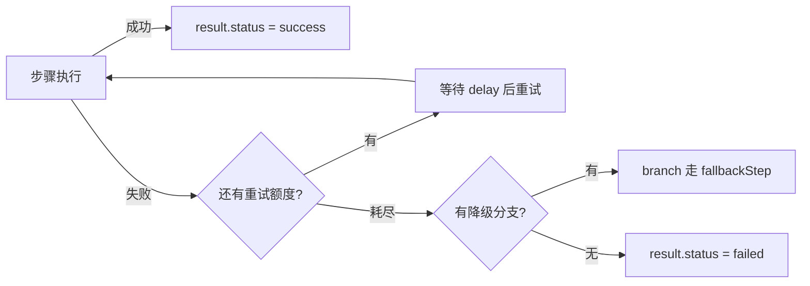

import { Canvas, Controls, Meta } from '@storybook/addon-docs/blocks';
import * as Stories from './workflow-error-handling.stories';

<Meta of={Stories} name="Docs" />

# 错误处理

工作流里的失败不是"抛异常就完事"：Mastra 把失败也当作一种**可检查的运行结果**。运行结束后用 `result.status` 判断结局、用 `result.steps` 定位坏步骤；创建工作流时可以挂 `onFinish` / `onError` 生命周期回调、配 `retryConfig` 全局重试；步骤内用 `retries` 覆盖重试，用 `bail()` 或 `throw` 决定退出语义；`stream` 模式下错误随 chunk 流出，`.branch()` 还能给流程铺一条降级路径。下面的实例把"失败 → 重试 → 降级 / 终止"的轨迹做成了动画，先调控件再看读数。



回查入口：本课关键配置点的位置与取值。

| 配置点 | 写在哪 | 作用 | 取值要点 |
| --- | --- | --- | --- |
| `result.status` | 运行结果 | 判断整体结局 | `'success'` \| `'failed'` \| `'suspended'` \| `'tripwire'` |
| `result.steps[id]` | 运行结果 | 定位失败步骤 | 每步有自己的 `status` 与 `error` |
| `onFinish` | `createWorkflow` 的 `options` | 任意结束状态都触发 | 收到 `status` / `error` / `steps` / `runId` 等字段 |
| `onError` | 同上 | 仅 `'failed'` / `'tripwire'` 触发 | 适合接告警 |
| `retryConfig` | `createWorkflow` 顶层 | 全部步骤的重试 | 文档示例 `{ attempts: 5, delay: 2000 }` |
| `retries` | `createStep` 配置对象 | 覆盖该步骤的全局重试 | 文档示例 `retries: 3` |
| `bail()` | 步骤 `execute` 内 | 成功语义提前退出 | 详见 [3.2.2 人工介入](?path=/docs/workflow-human-in-the-loop--docs) |

官方页面未标注 `retryConfig` 的默认值与退避算法，生产代码建议显式声明 `attempts` 与 `delay`。

## 检查运行结果

`run.start()` 返回的结果对象不抛异常，失败也安静地落在 `result.status` 里。`status` 有四种取值：`success` / `failed` / `suspended` / `tripwire`；失败时顶层 `result.error` 给出错误详情，但**定位到具体步骤**要靠逐步检查 `result.steps`——每个步骤条目都有自己的 `status` 和 `error`。

```ts
const run = await workflow.createRun();
const result = await run.start({ inputData: { orderId: 'A-1' } });

if (result.status === 'failed') {
  console.error('工作流失败:', result.error);
  for (const [stepId, step] of Object.entries(result.steps)) {
    if (step.status === 'failed') {
      console.error(`步骤 ${stepId} 失败:`, step.error);
    }
  }
}
```

可观察证据：控制台先输出工作流级错误，再逐行列出失败步骤的 `stepId` 与错误详情。

- `suspended` 表示流程挂起等待恢复，处理方式见 [3.2.1 挂起与恢复](?path=/docs/suspend-and-resume--docs)；`tripwire` 是触发护栏后的提前终止。
- 失败可能发生在步骤之间（如分支条件计算抛错），此时 `result.steps` 里也可能查不到失败条目，顶层 `result.error` 是唯一线索。

## 生命周期回调

两个回调都写在 `createWorkflow` 的 `options` 里，分工不同：`onFinish` **任何结束状态都触发**，适合统一记账与埋点；`onError` **只在 `'failed'` 或 `'tripwire'` 时触发**，适合接告警。两者可以组合——`onFinish` 永远记录，`onError` 只做报警。

```ts
export const orderWorkflow = createWorkflow({
  id: 'order-processing',
  inputSchema: z.object({ orderId: z.string() }),
  outputSchema: z.object({ status: z.string() }),
  options: {
    // 任何结束状态都触发：统一记账
    onFinish: async (result) => {
      if (result.status === 'success') {
        await db.updateOrderStatus(result.result.orderId, result.status);
      }
      await analytics.track('workflow_completed', { status: result.status });
    },
    // 仅 'failed' / 'tripwire' 触发：接告警
    onError: async (errorInfo) => {
      await alertService.notify({
        channel: 'payments-alerts',
        message: String(errorInfo.error),
      });
    },
  },
});
```

回调能拿到完整的运行上下文：`status`、`result`、`error`、`steps`、`tripwire`、`runId`、`workflowId`、`resourceId`、`getInitData()`、`mastra`、`requestContext`、`logger`、`state`——所以告警信息不必靠闭包拼凑，直接读回调参数即可。

边界：回调里再抛出的异常只会被捕获并记录，**不会影响工作流结果**。这让告警故障不至于拖垮业务，但也意味着关键业务逻辑不能只写在回调里。

## 重试配置

重试有两个层级：工作流级 `retryConfig` 作用于**全部步骤**；某个步骤在 `createStep` 配置对象里写自己的 `retries` 即可**覆盖全局值**。先记住它的适用边界：重试只救**瞬时故障**（外部服务抖动、网络闪断），持久失败配再多 `attempts` 也只是把失败重复一遍。

```ts
export const retryWorkflow = createWorkflow({
  id: 'retry-demo',
  retryConfig: { attempts: 5, delay: 2000 }, // 工作流级：全部步骤最多 5 次，间隔 2000ms
});

const fetchStep = createStep({
  id: 'call-external',
  retries: 3, // 步骤级：覆盖全局，这一步最多 3 次
  execute: async ({ inputData }) => {
    const response = await fetch(inputData.url);
    if (!response.ok) throw new Error(`上游返回 ${response.status}`);
    return await response.json();
  },
});
```

下面的实例把重试轨迹做成了动画：失败注入选「瞬时失败」时重试一次即恢复；选「持久失败」时每次尝试都失败，重试耗尽后要么走降级分支、要么整体 `failed`。

<Canvas of={Stories.Interactive} />
<Controls of={Stories.Interactive} />

| 读者操作 | 可观察证据 |
| --- | --- |
| 失败注入选「瞬时失败」 | 第二次尝试成功，最终状态 `success`，尝试次数 2 |
| 失败注入选「瞬时失败」并把重试次数调到 0 | 无额度可用，直接进入降级分支或 `failed` |
| 失败注入选「持久失败」 | 每个尝试徽标都是 ✗，重试额度全部耗尽 |
| 切换「降级分支」开关 | 耗尽后走 `fallbackStep` 得 `success（降级）`，否则 `failed` 且触发回调变为 `onFinish + onError` |

边界：`delay` 是重试间隔的毫秒数；文档本页未说明退避是否指数增长，示例按固定间隔理解，需要精确节奏时以实测为准。

## 提前退出：bail 与 throw

步骤 `execute` 里有两种提前退出，结局语义相反：

| 退出方式 | 写法 | 结局语义 |
| --- | --- | --- |
| `bail()` | `return bail({ result: 'bailed' })` | **成功语义**：载入的值成为步骤输出，流程正常结束 |
| `throw` | `throw new Error('error')` | **失败语义**：步骤 `failed`，工作流 `failed`，触发 `onError` |

```ts
const gateStep = createStep({
  id: 'gate',
  execute: async ({ bail }) => {
    if (autoApproved) {
      return bail({ result: 'skipped' }); // 正常收场：后续步骤不再执行
    }
    throw new Error('审核未通过'); // 失败收场：进入错误处理链路
  },
});
```

判断口径：流程"走到了预期的终点"用 `bail`，"出了问题需要追查"用 `throw`。`bail` 在人工审批场景的完整用法见 [3.2.2 人工介入](?path=/docs/workflow-human-in-the-loop--docs)。

## stream 中的错误观察

`run.start()` 一次性返回最终结果，`run.stream()` 则逐 chunk 吐出过程事件，错误信息也随 chunk 流过——消费循环本身就是监控点：

```ts
const run = await workflow.createRun();
const stream = await run.stream({ inputData: { value: 'initial data' } });

for await (const chunk of stream.stream) {
  console.log(chunk.payload.output.stats); // 过程与错误都以 chunk 形式流过
}
```

边界：文档本页未枚举错误 chunk 的完整类型，处理时按 `chunk.payload` 内容自行判断，不要假设循环里只会遇到正常输出。

## 错误分支：降级路径

重试解决"再来一次"，`.branch()` 解决"换个活法"：步骤捕获自身错误、把失败变成可判断的 `status` 字段，再由分支条件把流程引向降级步骤。

```ts
const riskyStep = createStep({
  id: 'risky',
  execute: async () => {
    try {
      return { status: 'ok', data: await callPrimary() };
    } catch {
      return { status: 'error' }; // 把失败变成可分支的数据
    }
  },
});

workflow
  .then(riskyStep)
  .branch([
    [async ({ inputData }) => inputData.status === 'ok', happyPath],
    [async ({ inputData }) => inputData.status === 'error', fallbackStep],
  ])
  .commit();
```

降级步骤里可以用 `getStepResult(riskyStep)` 读取主路径步骤的产出。这条路径与重试是互补关系：先重试，额度耗尽再走分支降级——实例中「降级分支」开关演示的正是"重试耗尽 → fallbackStep"的兜底链。

## 常见问题

- 配了重试，为什么结果还是 `failed`？
  把失败源换成瞬时故障类型，或检查失败是否持久性的（参数错误、配额耗尽、依赖下线）——持久失败下每次尝试都会失败，`attempts` 次用完后仍是 `failed`。实例里把「失败注入」切到「持久失败」即可复现，此时该上降级分支而不是加大重试次数。
- `onError` 里抛出的异常去哪了？
  只被捕获并记录，不会改变工作流结果，`result.error` 里也看不到它。要排查回调本身的问题，直接看日志输出，不要指望结果对象回传。

## 总结回顾

摘要：

工作流的失败是一种可检查的结果：运行结束后用 `result.status`（`success` / `failed` / `suspended` / `tripwire`）判断结局，用 `result.steps` 定位坏步骤。`createWorkflow` 的 `options` 里挂 `onFinish`（任意结束状态）与 `onError`（仅 `failed` / `tripwire`）两个回调，回调内抛错只记录不生效。重试分两级：工作流级 `retryConfig` 与步骤级 `retries` 覆盖，只对瞬时故障有效；持久失败要靠 `.branch()` 把流程引向降级步骤。步骤内 `bail()` 是成功语义的提前退出，`throw` 是失败语义；`stream` 模式下错误随 chunk 流过，消费循环即监控点。

一句话：

> 失败是可检查的结果而不是异常：status 与 steps 定位问题，重试救瞬时故障，branch 铺降级路径，bail 与 throw 决定退出语义。

知识要点：

- `result.status` 有哪四种取值？失败时去哪里找步骤级错误？
- `onFinish` 与 `onError` 的触发时机差在哪？回调里抛错会怎样？
- `retryConfig` 与 `retries` 谁覆盖谁？重试对哪类故障无效？
- `bail()` 与 `throw` 的结局语义分别是什么？
- `stream` 模式下错误如何被观察到？

## 参考资料

- [Workflows: Error Handling — Mastra Docs](https://mastra.ai/docs/workflows/error-handling)
