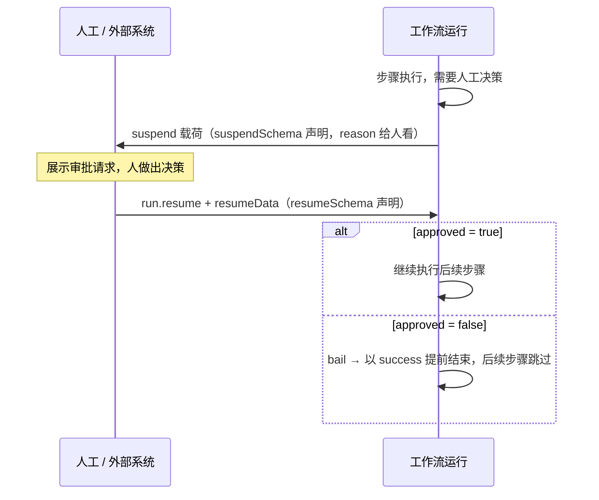

import { Canvas, Controls, Meta } from '@storybook/addon-docs/blocks';
import * as Stories from './workflow-human-in-the-loop.stories';

<Meta of={Stories} name="Docs" />

# 人工介入

工作流的「人工介入」把挂起点用作审批与人工输入环节：步骤执行到需要人决策时，用 `suspend()` 返回一份审批请求载荷，人或外部系统据此决策，再用 `run.resume()` 加 `resumeData` 把决策提交回工作流；人工拒绝时用 `bail()` 以 `success` 状态正常结束、跳过后续步骤，而不是把流程变成失败。suspend/resume 的机制本体（何时挂起、如何从存储恢复）已在[挂起与恢复](?path=/docs/suspend-and-resume--docs)讲清，本课专注审批往返的应用写法；Agent 单次工具调用级的人工审批是另一条路径，见[工具审批与挂起](?path=/docs/human-in-the-loop--docs)。



| API / 概念 | 声明位置 | 作用与要点 |
| --- | --- | --- |
| `suspendSchema` | `createStep` | 定义 `suspend()` 载荷形状，通常带 `reason` 给人看 |
| `resumeSchema` | `createStep` | 定义 `resumeData` 形状，即人工提交的决策数据 |
| `await suspend(payload)` | `execute` 内 | 挂起运行，状态变 `suspended`；挂起时 `resumeData` 为 `undefined` |
| `bail({ reason })` | `execute` 内 | 以 `success` 状态结束运行，跳过之后的所有逻辑 |
| `run.resume({ step, resumeData })` | 运行侧 | 从指定挂起步骤恢复；每个挂起步骤单独按序恢复 |
| `result.steps[id].suspendPayload` | 运行侧 | 读取挂起原因，用于向前端渲染审批请求 |

## 审批往返

一次审批往返分三拍：步骤发现需要决策 → `suspend` 挂起等待 → 人提交决策后恢复。判断顺序是先拒绝、再未提交、最后放行——`approved === false` 走 `bail`，没有决策走 `suspend`，`approved` 为真才继续：

```ts
import { createStep } from '@mastra/core/workflows';
import { z } from 'zod';

const approval = createStep({
  id: 'approval',
  inputSchema: z.object({ userEmail: z.string() }),
  outputSchema: z.object({ output: z.string() }),
  // 挂起时给人的审批请求 → 恢复时人工填的决策
  suspendSchema: z.object({ reason: z.string() }),
  resumeSchema: z.object({ approved: z.boolean() }),
  execute: async ({ inputData, resumeData, suspend, bail }) => {
    const { approved } = resumeData ?? {};
    if (approved === false) {
      // 人工拒绝：不抛错，以 success 正常收尾
      return bail({ reason: 'User rejected the request.' });
    }
    if (!approved) {
      // 首次执行还没有决策：挂起等待人工
      return await suspend({ reason: 'Human approval required.' });
    }
    return { output: `Email sent to ${inputData.userEmail}` };
  },
});
```

下方实例离线重演这个往返：读数区展示最终状态、步骤轨迹、人工轮数与挂起或 bail 原因，画布用「跳过」「未执行」区分两种非正常推进。

<Canvas of={Stories.Interactive} />
<Controls of={Stories.Interactive} />

| 读者操作 | 可观察证据 |
| --- | --- |
| 「人工决策」保持待定（未提交） | 读数「最终状态」为 suspended，「挂起原因」显示 `suspend()` 载荷里的 reason |
| 切到「批准」 | 状态变 success 且轨迹全为完成；切「两级审批」后「人工轮数」为 2 |
| 切到「拒绝」 | 状态仍是 success，但 bail 之后的步骤标记为跳过，「bail 原因」显示 bail 载荷 |

### suspend：发起审批请求

`suspendSchema` 声明审批请求的形状，`resumeSchema` 声明期望收回的决策，两者都挂在 `createStep` 上、每个步骤各自定义。运行侧等 `start()` 返回后检查状态，就能拿到挂起步骤和审批请求载荷：

```ts
const run = await workflow.createRun();
const result = await run.start({ inputData: { userEmail: 'alex@example.com' } });

if (result.status === 'suspended') {
  const suspendStep = result.suspended[0];
  console.log(result.steps[suspendStep[0]].suspendPayload);
  // { reason: 'Human approval required.' }
}
```

`suspend` 不是错误：运行状态是 `suspended` 而非 `failed`，流程停在存储里等人。恢复后该步骤的 `execute` 会带着 `resumeData` 重新执行，所以首次执行的「没有决策」必须用 `resumeData ?? {}` 兜底，不能直接解构。

### resume：提交决策恢复

人工（或外部系统）做出决策后，用 `resume()` 从挂起步骤恢复，`resumeData` 会按 `resumeSchema` 校验后传入 `execute`：

```ts
const result = await run.resume({
  step: 'approval',
  resumeData: { approved: true },
});
```

`step` 指定从哪个挂起步骤继续；提交 `approved: false` 会在下一拍触发 `bail`（见下）。在上方实例把「人工决策」切到「批准」，「最终状态」读数变为 success、轨迹走完，即是这次提交的效果。

### bail：人工拒绝提前收尾

`bail` 在 `execute` 上下文中与 `suspend` 并列提供，用于「人工已审阅并拒绝」这类正常业务结论：

```ts
// approved === false 时：以 success 状态结束，之后的逻辑全部跳过
return bail({ reason: 'User rejected the request.' });
```

可观察证据在上方实例：把「人工决策」切到「拒绝」，读数「最终状态」仍是 success——这正是 `bail` 与抛错的分界；但轨迹里 bail 之后的步骤变为「跳过」，画布上连线断流并标出 `bail({ reason })`。需要重试、失败回调等错误语义时才用 `throw`，两者对比见[工作流错误处理](?path=/docs/workflow-error-handling--docs)。

## 多轮人工输入

多个审批步骤串联时，每个步骤声明自己的 `suspendSchema` 与 `resumeSchema`，挂起顺序即恢复顺序——每个挂起步骤都要单独调用一次 `resume()`，按序提交：

```ts
await run.resume({ step: 'approval-1', resumeData: { approved: true } });
await run.resume({ step: 'approval-2', resumeData: { approved: true } });
```

每一轮可以约定不同字段，例如二级审批额外要求复核意见（放进它自己的 `resumeSchema`）。上方实例把「审批链」调到「两级审批」即可观察：选「批准」时两个挂起步骤各恢复一次，「人工轮数」读数为 2；选「拒绝」时第一轮就 `bail`，二级审批与执行发放直接跳过。

## 最佳实践

- **审批请求与决策分离建模。** `suspendSchema` 载荷给人看（原因、金额等上下文），`resumeSchema` 约束人提交的字段；前端先渲染 `suspendPayload`，再按 `resumeSchema` 校验并提交 `resumeData`。
- **拒绝走 `bail`，异常走 `throw`。** 「已审阅并拒绝」是正常业务分支，用 `bail` 保住 success 语义；步骤本身出错才抛错进错误处理，两条路径不要混用。
- **等待页从运行结果取数。** `result.status === 'suspended'` 时用 `result.suspended` 定位步骤、用 `result.steps[id].suspendPayload` 取原因渲染等待页，不要在前端硬编码审批文案。

## 常见问题

- 步骤一执行就在解构 `resumeData` 处报错，或恢复后决策丢失？
  首次执行时 `resumeData` 是 `undefined`：先 `const { approved } = resumeData ?? {}` 兜底，没有决策就 `suspend`，有决策再判 `approved === false` 走 `bail`；恢复会重新执行 `execute`，判断逻辑必须每次都能走通。
- 人工拒绝后上游拿到 success，误以为全部步骤都执行了？
  `bail` 的 success 与走完的 success 状态相同，区别只在后续步骤是否被跳过；上游需要区分时，把审批结论写进步骤 `output`（或按 `resumeData` 判断），不要只看运行状态。
- 恢复时不知道该传哪个 `step`、该向用户展示什么原因？
  从 `start()`（或上次 `resume()`）的返回值读 `result.suspended` 数组按挂起顺序定位步骤，再用 `result.steps[id].suspendPayload` 取 `reason` 渲染审批请求。

## 总结回顾

摘要：

工作流人工介入是一条「请求 → 决策 → 恢复」的往返：步骤在 `execute` 里用 `suspend()` 返回由 `suspendSchema` 约束的审批请求，运行停在 `suspended` 状态；运行侧从 `result.suspended` 与 `result.steps[id].suspendPayload` 读出挂起原因并展示给人，再用 `run.resume()` 携带符合 `resumeSchema` 的 `resumeData` 提交决策，步骤带着决策重新执行。批准则继续后续步骤；拒绝时 `return bail({ reason })`，运行仍以 success 结束但跳过之后的所有逻辑。多个审批步骤各自挂起、按序逐个恢复，形成多轮人工输入。

一句话：

> 人工介入 = suspend 发审批请求 + resume 提交决策；拒绝用 bail 以 success 提前收尾并跳过后续步骤，而不是抛错。

知识要点：

- `suspendSchema` 与 `resumeSchema` 各自定义什么、声明在哪个对象上？
- 如何从运行结果中定位挂起步骤并读取 `suspendPayload`？
- `bail` 与 `throw` 在最终状态和后续步骤上的差别是什么？
- 多个挂起点如何按序完成多轮人工输入？

## 参考资料

- [Human-in-the-Loop Workflows — Mastra Docs](https://mastra.ai/docs/workflows/human-in-the-loop)
