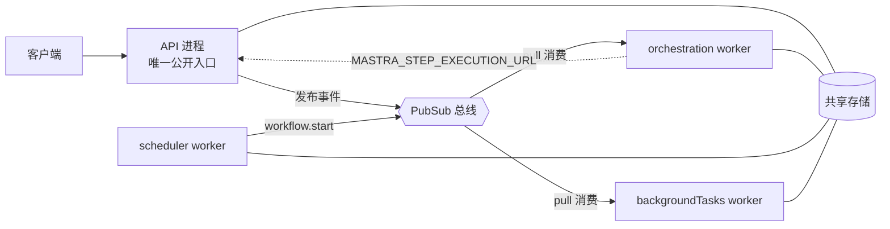

import { Canvas, Controls, Meta } from '@storybook/addon-docs/blocks';
import * as Stories from './workflow-runners.stories';

<Meta of={Stories} name="Docs" />

# 运行器、Workers 与 PubSub

Mastra 的工作流执行、cron 调度与后台工具调用默认都发生在 API 进程内：一条进程内事件总线加一个存储适配器即可工作。生产上要解决的是这些执行长期占用 API 进程、无法独立扩容：可以外接工作流运行器（Inngest / Temporal），也可以用 Mastra 自带的 worker 进程把三类执行拆出去，拆分后的进程间协调靠分布式 PubSub。实例是一张进程拆分拓扑图：切换部署形态、PubSub 后端与聚焦的 worker，读数直接给出配置判定与所需环境变量。



| 对象 | 是什么 | 默认 / 成熟度 | 关键约束 |
| --- | --- | --- | --- |
| 内置 runner | API 进程内直接执行工作流 | 默认形态 | 随 API 进程存亡，不独立扩容 |
| Inngest | 托管工作流平台，接管编排 | 按集成指南接入 | 步骤记忆化、自动重试、挂起/恢复 |
| Temporal | durable execution 平台 | `@mastra/temporal`，实验性 | 官方明确不可用于生产 |
| Workers | Mastra 自带后台 worker 进程 | 进程内（`MASTRA_WORKERS` 未设置），Beta | 无死信队列；scheduler 单实例 |
| PubSub | 内部事件总线 | `EventEmitterPubSub`（进程内） | 拆分部署需 pull 模式分布式后端 |

## 工作流运行器

外部运行器把「何时执行、失败怎么办」交给专门平台：工作流仍用 `createWorkflow` / `createStep` 编写，由平台负责编排、监控与可靠性。选型入口只有两条：不想自建基础设施选 Inngest；要 durable execution 选 Temporal（当前实验性）。

### Inngest

这是：无需管理基础设施的后台工作流平台。Mastra 工作流的步骤结果会被记忆化（memoization：重跑不重复执行已完成的步骤），失败自动重试，提供实时监控与挂起/恢复——对应 [human-in-the-loop](?path=/docs/human-in-the-loop--docs) 里的 suspend/resume 能力。

接入走官方 Inngest 部署指南与示例仓库；工作流代码不变，执行搬进 Inngest。适合 Serverless / 托管平台部署，或想要开箱可观测的后台任务但不想自建执行机群的团队。边界：重试策略、并发与事件绑定按 Inngest 的模型配置，不在 `MASTRA_WORKERS` 体系内。

### Temporal

这是：durable execution 平台，面向超长运行的工作流编排。Mastra 工作流跑在 Temporal worker 上，每个 `createStep` 映射为一个 Temporal activity，获得 activity 级自动重试与持久状态。

集成包是 `@mastra/temporal`，官方标注 experimental，明确不可用于生产。当前只适合评估；要上生产先选 Inngest 或下文的 Mastra workers。

## Workers

这是 Mastra 自身的后台 worker 机制（Beta，见 [部署概览与自托管](?path=/docs/deployment--docs) 的服务器形态）：把工作流步骤执行、cron 调度与后台工具调用从 API 进程拆成独立进程或容器，单独部署与扩容。共同模型先记三句：

- 三类 worker：orchestration（订阅工作流事件，执行步骤与生命周期迁移）、scheduler（轮询到期 cron，发布事件）、backgroundTasks（执行 `background: { enabled: true }` 的工具调用）。
- 依赖两件共享设施：pull 模式分布式 PubSub 拉事件 + 共享存储；worker 只有出站连接、不暴露 HTTP，API 是唯一公开入口。
- 判定：单机或低流量保持默认进程内形态；要独立扩容、崩溃隔离或多副本时才拆分。

最小闭环——构建与启动：

```bash
mastra build                              # API 产物 → .mastra/output/
mastra worker build --output-dir .mastra/worker
mastra worker start orchestration         # 派生进程内设置 MASTRA_WORKERS=orchestration
```

每个进程用 `MASTRA_WORKERS` 声明自己的角色：

| `MASTRA_WORKERS` | 本进程启动什么 |
| --- | --- |
| 未设置 | 进程内启动全部 worker（默认） |
| `false` | 全部关闭——拆分部署中的 API 进程 |
| `orchestration` / `scheduler` / `backgroundTasks` | 只启动对应 worker |
| 逗号组合，如 `orchestration,backgroundTasks` | 允许列表 |

<Canvas of={Stories.Interactive} />
<Controls of={Stories.Interactive} />

| 读者操作 | 可观察证据 |
| --- | --- |
| 部署形态切「拆分」、后端保持 EventEmitter | 总线变红虚线，读数报「配置冲突」 |
| 后端切 Redis Streams | 总线变绿，进程数变 4，出现紫色回传虚线 |
| 切换聚焦 worker | 高亮对应进程，读数给出该角色的边界提示 |

worker 侧的关键环境变量：

| 变量 | 取值与作用 | 谁需要 |
| --- | --- | --- |
| `MASTRA_WORKERS` | 见上表，声明本进程角色 | 全部进程 |
| `MASTRA_STEP_EXECUTION_URL` | 内部 API 地址（含 `/api` 前缀，如 `http://api:4111/api`）；缺省时 orchestration 会尝试本地执行步骤，缺少完整运行时 | orchestration |
| `MASTRA_WORKER_AUTH_TOKEN` | 调 API 的 Bearer 令牌，需 API 的 auth provider 接受 | orchestration（pull 拓扑） |

### orchestration worker

这是：编排执行者。订阅 PubSub 上的工作流事件，执行步骤与生命周期迁移；拆分模式下从 pull 模式 PubSub（`RedisStreamsPubSub`、`ValkeyStreamsPubSub`、`GoogleCloudPubSub`）拉事件，再把步骤执行经 HTTP 委托回 API——模型接入、工具、存储等完整运行时都在 API 侧。

可观察：实例聚焦「编排 worker」时，总线到节点的箭头是 pull 消费方向，节点到 API 的紫色虚线是步骤回传。

边界：不配 `MASTRA_STEP_EXECUTION_URL` 会退化成本地执行并缺运行时；扩容靠 PubSub 消费组，多副本安全。

### scheduler worker

这是：定时发布者。轮询存储中到期的 cron 计划（[scheduled-workflows](?path=/docs/scheduled-workflows--docs) 的 `schedule` 字段自动生效），发布 `workflow.start` 事件，自己不执行工作流。没有到期任务时只在启动时轮询一次即休眠（缩容到零）；运行期新建计划会经 PubSub 发唤醒事件。需要常驻轮询时用 `scheduler: { enabled: true }` 或 `MASTRA_WORKERS=scheduler` 强制。

边界：只允许一个实例，多副本会重复触发；重启后从当前时间计算下一次触发，不补跑错过的计划。

### backgroundTasks worker

这是：后台任务执行者。运行声明了 `background: { enabled: true }` 的 agent 工具调用，管理并发上限与任务生命周期，结果经 PubSub 回传。

边界：与 orchestration 一样可经消费组横向扩容；任务失败没有死信队列兜底。

拆分形态的三条硬边界（实例读数的「边界提示」会按焦点切换）：

- 无死信队列：失败事件 nack 后重试，重试耗尽即丢弃；pull 模式会重投递未确认事件，worker 重启后可能重复执行——步骤处理器必须幂等。
- scheduler 单实例：多副本重复触发 cron。
- API 崩溃可能遗留 `running` 状态的 run 且不自动重试；durable agents 可设 `recovery.durableAgents: 'auto'`，重启后重新驱动孤儿 run。

部署与健康：worker 产物复用同一 Dockerfile 模式（`node:22-alpine`，构建参数 `MASTRA_OUTPUT` 指向 worker 产物目录）；orchestration 与 backgroundTasks 按消费组水平扩容，scheduler 固定 1 副本；健康检查 `GET /health`（`PORT` 默认 4111），`startWorkers()` 初始化期间返回 503，探针需配 startup probe。

## PubSub

这是：Mastra 内部事件总线——工作流执行、cron 定时、后台任务、agent 信号与可恢复流的事件都从它走。交付模型两种：push（进程内 `EventEmitterPubSub`）与 pull（Redis 等流式后端）。单实例部署到默认为止；一旦事件要跨进程——拆分 workers、向另一实例发信号、多机部署、客户端重连后回放——就要换 pull 模式分布式后端。

| 后端 | 交付 | 适用场景 |
| --- | --- | --- |
| `EventEmitterPubSub` | push · 进程内 | 默认；单实例，零额外设施 |
| `RedisStreamsPubSub` | pull · Redis 流 | 拆分 workers、跨实例、多机（最常用） |
| `ValkeyStreamsPubSub` | pull · Valkey 流 | 同上，Valkey 技术栈 |
| `GoogleCloudPubSub` | pull · 托管服务 | GCP 托管部署 |
| `UnixSocketPubSub` | pull · 同机多进程 | 同一台机器拆多进程，不走外部网络 |
| `CachingPubSub` | 包装器 | 在任意后端上补历史事件回放（如客户端重连） |

判定从一句话出发：「事件要不要离开当前进程」。不离开用默认；离开选一个 pull 模式后端（Redis / Valkey / Google Cloud），同机拆进程可用 `UnixSocketPubSub`；还要回放就在其上叠 `CachingPubSub`。

## 最佳实践

- 运行器选型：托管平台、不想养执行机群 → Inngest（记忆化 + 重试 + 挂起恢复开箱即用）；超长任务要 durable execution → 评估 `@mastra/temporal` 但不进生产；自托管且要独立扩容 → Mastra workers + Redis Streams。
- 拆分清单：API 进程 `MASTRA_WORKERS=false`；每个 worker 进程一个 `MASTRA_WORKERS` 值加共享存储与 Redis 连接；orchestration 另配 `MASTRA_STEP_EXECUTION_URL` 与 `MASTRA_WORKER_AUTH_TOKEN`；scheduler 只部署 1 副本。
- 幂等优先：pull 模式重投递 + 无死信队列，意味着步骤与后台任务都要幂等；关键业务在步骤内自建兜底，durable agents 用 recovery 兜底孤儿 run。

## 常见问题

- 拆分部署后 worker 收不到任何工作流事件？
  检查 PubSub 后端：`EventEmitterPubSub` 只在进程内有效，orchestration 必须配 pull 模式分布式后端（`RedisStreamsPubSub` / `ValkeyStreamsPubSub` / `GoogleCloudPubSub`）与共享存储，且 API 进程设 `MASTRA_WORKERS=false`。
- cron 同一时刻被触发了两次？
  说明存在多个 scheduler 实例——它是唯一必须单实例的 worker，缩到 1 副本。重启后不补跑错过的计划属正常行为。
- worker 重启后某些步骤又执行了一遍？
  pull 模式对未确认事件重投递所致，处理器需幂等；失败事件重试耗尽后被直接丢弃（无死信队列），关键步骤要自建兜底。
- worker 容器健康检查一直 503？
  `/health` 在 `startWorkers()` 初始化完成前返回 503，属启动期正常现象；给探针配 startup probe 或延迟 liveness 检查，而不是直接重启容器。

## 总结回顾

摘要：默认形态下工作流执行、cron 调度与后台工具调用都留在 API 进程内，一条进程内事件总线就够。要外置编排时选工作流运行器：Inngest 提供托管的步骤记忆化、自动重试与挂起/恢复；`@mastra/temporal` 把每个 `createStep` 映射为 activity 但仍是实验性。要自托管拆分时用 Mastra workers（Beta）：orchestration / scheduler / backgroundTasks 三类进程各持一个 `MASTRA_WORKERS` 值，经 pull 模式分布式 PubSub 拉事件、共享存储读状态，orchestration 再经 `MASTRA_STEP_EXECUTION_URL` 把步骤执行回传 API。这套拓扑没有死信队列、scheduler 只能单实例，幂等是底线。PubSub 是贯穿全程的事件总线：事件不出进程用默认 `EventEmitterPubSub`，跨进程升级到 Redis / Valkey / Google Cloud 等 pull 后端，需要回放再叠 `CachingPubSub`。

一句话：

> 事件不出进程就保持默认；一旦跨进程，就必须 pull 模式分布式 PubSub 加共享存储，并接受「无死信队列、scheduler 单实例」的边界。

知识要点：

- 三条执行路径（内置 runner、Inngest / Temporal、Mastra workers）各解决什么问题、如何选？
- `MASTRA_WORKERS`、`MASTRA_STEP_EXECUTION_URL`、`MASTRA_WORKER_AUTH_TOKEN` 分别配在哪个进程？
- 为什么拆分部署必须替换 `EventEmitterPubSub`，有哪些 pull 模式后端可选？
- 三类 worker 各自的扩容规则与硬边界是什么？

## 参考资料

- [Workflow Runners - Mastra Docs](https://mastra.ai/docs/deployment/workflow-runners)
- [Workers - Mastra Docs](https://mastra.ai/docs/deployment/workers)
- [PubSub - Mastra Docs](https://mastra.ai/docs/server/pubsub)
