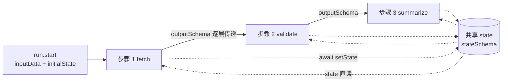

import { Canvas, Controls, Meta } from '@storybook/addon-docs/blocks';
import * as Stories from './workflow-state.stories';

<Meta of={Stories} name="Docs" />

# 共享状态

步骤之间的默认数据通道是 inputSchema / outputSchema：上一步的输出必须逐层匹配下一步的输入，想跨越三四个步骤传一个值，就得在中间每一层重复声明。共享 state 是另一条通道——贯穿整次运行的状态层：步骤在 execute 里用 `state` 读、用 `await setState(...)` 写，形状由 `stateSchema`（zod）约束，初值由 `run.start` 的 `initialState` 提供。state 会随运行快照持久化，suspend / resume 期间不丢；嵌套工作流也能读到父级写入的值。



| 成员 | 位置 | 作用 | 要点 |
| --- | --- | --- | --- |
| `state` | execute 上下文 | 读当前共享状态 | 普通对象，直接取属性 |
| `setState` | execute 上下文 | 更新共享状态 | 异步，必须 `await`；传入要更新的键即可 |
| `stateSchema` | createWorkflow / createStep 选项 | 用 zod 声明 state 形状 | 工作流声明全集，步骤只声明用到的子集 |
| `initialState` | run.start 参数 | state 的初始值 | 结构须匹配工作流的 stateSchema |
| `inputData` | run.start 参数 | 入口步骤的输入 | 走 inputSchema，与 state 是两条通道 |

## 用 state 与 setState 跨步骤读写

每个步骤的 execute 上下文都会注入 `state` 与 `setState`：`state` 是当前共享状态对象，`setState` 接收一个对象并合并进共享状态。写入不影响步骤输出——返回值仍然只承载传给下一步的最小数据。

```ts
import { createStep } from '@mastra/core/workflows';
import { z } from 'zod';

const fetchStep = createStep({
  id: 'fetch',
  inputSchema: z.object({ query: z.string() }),
  outputSchema: z.object({ done: z.boolean() }),
  stateSchema: z.object({ hits: z.number() }), // 只声明本步骤用到的子集
  execute: async ({ inputData, state, setState }) => {
    console.log(state.hits); // 读共享 state
    await setState({ hits: 12 }); // 写共享 state，必须 await
    return { done: true }; // 输出走 outputSchema，与 state 无关
  },
});
```

下面的记分板把两条通道画在一起：上路（蓝）是 input / output 逐层转发，下路（绿）是步骤把字段写入共享 state、汇总步直读。拖动滑杆，比较两条路径各能让汇总步看到几个字段。

<Canvas of={Stories.Interactive} />
<Controls of={Stories.Interactive} />

| 读者操作 | 可观察证据 |
| --- | --- |
| 调「写入 state 的步骤数」 | 绿色 setState 箭头逐个出现，state 带上的键芯片点亮，「经共享 state 可见」同步增加 |
| 调「输出链转发跳数」 | 蓝色箭头在「转发 / 不转发」间切换，「经输入输出链可见」随之增减 |
| 打开「汇总前挂起再恢复」 | 最后一段输出链上出现 suspend → resume 标记，state 键仍全部点亮 |

必要边界：`setState` 是异步操作，漏掉 `await` 时后续步骤可能读到旧值；state 不经过 outputSchema，不会被输出校验。

## stateSchema 与 initialState

`stateSchema` 用 zod 描述共享状态的形状：工作流选项里写全集（所有步骤可能用到的键），每个步骤只声明自己用到的子集。运行时初值不写在 schema 里，而是在 `run.start` 时用 `initialState` 传入，结构须匹配工作流的 `stateSchema`。

```ts
import { createWorkflow } from '@mastra/core/workflows';
import { z } from 'zod';

const workflow = createWorkflow({
  id: 'scoreboard',
  inputSchema: z.object({ query: z.string() }),
  outputSchema: z.object({ report: z.string() }),
  stateSchema: z.object({
    hits: z.number(),
    errors: z.number(),
    duration: z.number(),
  }), // 全集：所有步骤可能写入的键
  steps: [fetchStep, validateStep, summarizeStep],
});

const run = await workflow.createRun();
const result = await run.start({
  inputData: { query: 'mastra' }, // 入口步骤的输入，走 inputSchema
  initialState: { hits: 0, errors: 0, duration: 0 }, // 共享层初值
});
```

两者分工固定：`inputData` 是入口（进第一步的 input），`state` 是运行中的共享层（任何步骤都能读写）。把入口参数塞进 state，或指望 state 替代步骤签名，都会让数据流失去 schema 约束的位置。

## 挂起恢复与嵌套工作流

state 属于整次运行而不是某个步骤，所以它的生命周期比单个步骤长：工作流挂起时 state 随运行快照一起持久化，子工作流也能读到父级写入的值。

### suspend / resume 期间自动保留

挂起前用 `setState` 写入的更新会自动保留，恢复后直接可读，不需要把值塞进 suspend 载荷或步骤输出再手工搬回 state。

```ts
execute: async ({ state, setState, suspend, resumeData }) => {
  if (!resumeData) {
    await setState({ hits: state.hits + 1 }); // 挂起前写入
    await suspend({});
    return {};
  }
  // 恢复后：state.hits 仍是挂起前的值
  return { done: true };
}
```

### 嵌套工作流：父到子传播

父工作流的步骤先写入 state，再调用子工作流；子工作流内的步骤可以直接读到这些键（父到子传播）。

```ts
// 父工作流的步骤：调用子工作流前写入
await setState({ sharedValue: 'modified-by-parent' });

// 子工作流内的步骤：直接读父级写入的键
execute: async ({ state }) => ({ result: `Received: ${state.sharedValue}` });
```

边界：官方文档展示的是父到子传播；不要依赖子工作流对父级 state 的回写。

## 最佳实践

- **按消费范围选通道。** 数据只被相邻下一步消费、希望步骤保持可独立复用与测试，走 input / output；数据贯穿多个步骤（运行级计数、processedItems、metadata.processedBy 这类全程线索），走共享 state。
- **别把 state 当随处可写的全局变量。** 它仍受 stateSchema 约束：键先在工作流全集里声明，步骤里只声明用到的子集，写入点尽量集中。
- **入口与共享层不混用。** `run.start` 的 `inputData` 负责入口参数，state 负责运行中共享，二者各走各的 schema。

## 常见问题

- 步骤里读到 `state.xxx` 是 undefined
  先查两处：`run.start` 是否传了包含该键的 `initialState`；该键是否已写进工作流的 `stateSchema`。
- 后续步骤拿到的是旧值
  `setState` 返回 Promise，忘记 `await` 时写入可能在下一步读取之后才生效；所有 `setState` 都加 `await`。
- 并行步骤写同一个键会怎样
  官方文档未约定并行写入的合并行为，不要依赖「谁后写谁赢」；需要合并时让下游步骤统一归并。

## 总结回顾

摘要：

共享 state 是与 input / output 并列的第二条数据通道：execute 上下文用 `state` 读、`await setState` 写，形状由工作流级 `stateSchema`（全集）与步骤级子集约束，初值来自 `run.start` 的 `initialState`。它贯穿整次运行——suspend / resume 期间随快照保留，嵌套工作流从父读到子。与逐层转发的输出相比，state 免去中间步骤的重复声明，代价是要保持写入点集中、按消费范围选通道。

一句话：

> 数据只服务相邻下一步就走 input / output，贯穿多步的全局层才进共享 state，且别忘了 `await setState`。

知识要点：

- `state`、`setState`、`stateSchema`、`initialState` 分别写在哪里、各管什么？
- state 与步骤返回值有什么区别，为什么不经过 outputSchema？
- suspend / resume 时 state 需要手工搬运吗？嵌套工作流如何拿到父级的值？
- 什么样的数据该走 input / output，什么样的该进 state？

## 参考资料

- [Workflow State - Mastra Docs](https://mastra.ai/docs/workflows/workflow-state)
