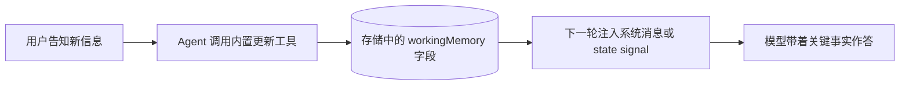

import { Canvas, Controls, Meta } from '@storybook/addon-docs/blocks';
import * as Stories from './working-memory.stories';

<Meta of={Stories} name="Docs" />

# 工作记忆

工作记忆（Working Memory）是 Mastra Memory 提供的长期「草稿板」：一小块随用户或线程持久化的关键事实（姓名、所在地、偏好、长期目标），每轮对话都注入上下文。它解决「每次会话都要重新自我介绍」的问题——消息召回（见 `?path=/docs/memory-basics--docs`）回看「说过什么」，工作记忆直接携带「已确认的事实」。两种形态二选一：Markdown 模板整块重写（replace），结构化 schema 增量合并（merge）。下面的离线示意把同一批「用户告知」分别放进两种形态，可对照写入负载的差异。



| `memory.options.workingMemory` 选项 | 取值 | 默认 | 回查要点 |
| --- | --- | --- | --- |
| `enabled` | boolean | 需显式 `true` | 总开关，不开启则没有工作记忆 |
| `scope` | `'resource'` \| `'thread'` | `'resource'` | resource 跨线程共享，thread 线程内隔离 |
| `template` | string | 内置用户画像模板 | Markdown 文本，replace 语义 |
| `schema` | Standard JSON Schema 兼容对象 | — | zod / Valibot / ArkType 均可，merge 语义 |
| `useStateSignals` | boolean（实验性） | `false` | 改为 state signal 投递，写入工具改名 |
| `readOnly`（调用时 `memory.options`） | boolean | `false` | 只提供记忆，禁止 agent 更新 |

`template` 与 `schema` 互斥，配置时只能二选一。

## 两种形态：模板与 schema

工作记忆块是挂在 resource 或 thread 上的一段文本或 JSON，两种形态共享同一存储位置，差别全在写入语义：replace 要求 agent 每次提交整块内容，merge 允许只提交变化字段。切换下面的「记忆形态」，观察同一批告知事件产生的写入负载。

<Canvas of={Stories.Interactive} />
<Controls of={Stories.Interactive} />

| 读者操作 | 可观察证据 |
| --- | --- |
| 「记忆形态」保持 Markdown 模板 | 左块固定 6 行（含空占位），右侧每轮负载都是整块蓝条 |
| 「记忆形态」切到结构化 schema | 左块只含已知字段，右侧每轮负载缩成小 patch |
| 「对话进度」从 0 推到 3 | 左块事实逐条累积，「最近写入负载」读数同步变化 |
| 「作用域」切到 thread | 角标从「跨线程共享」变为「仅当前线程」 |

### Markdown 模板：replace 语义

给 agent 一张固定格式的 Markdown 画像表，占位标签就是记忆的「字段」。agent 每次更新都必须重写整块（replace 语义）：没填的标签保留空位，漏带的旧字段则会从记忆里消失。不传 `template` 时 Memory 提供一份内置的用户画像模板。

```ts
import { Memory } from '@mastra/memory';
import { LibSQLStore } from '@mastra/libsql';

const memory = new Memory({
  storage: new LibSQLStore({ url: 'file:./mastra.db' }),
  options: {
    workingMemory: {
      enabled: true,
      scope: 'resource',
      template: `# User Profile
- **Name**:
- **Location**:
- **Interests**:
- **Preferences**:
- **Long-term Goals**:`,
    },
  },
});
```

模板设计决定 replace 的成败：标签短小聚焦、大小写一致、占位提示最小化（如 `[First name]`），并在 agent instructions 中写明「每次更新必须携带完整模板」。示意中左块始终 6 行，正是整块语义的直观体现。

### 结构化 schema：merge 语义

用 zod 等 Standard JSON Schema 兼容库定义记忆结构，agent 以 JSON 对象查看和更新记忆。写入走 merge 语义，三条规则：对象字段深度合并、只更新提供的字段；字段设为 `null` 删除该字段；数组整体替换、不逐元素合并。

```ts
import { z } from 'zod';

const userProfileSchema = z.object({
  name: z.string().optional(),
  location: z.string().optional(),
  preferences: z
    .object({
      communicationStyle: z.string().optional(),
      projectGoal: z.string().optional(),
    })
    .optional(),
});

const memory = new Memory({
  options: {
    workingMemory: {
      enabled: true,
      schema: userProfileSchema, // 与 template 互斥，不要再设 template
    },
  },
});
```

示意中切到 schema 后，左块只出现已告知的字段、未提供字段保持原样——这就是 merge 与 replace 的分界。

## 作用域：resource 与 thread

- `resource`（默认）：同一 `resourceId` 的所有线程共享同一块记忆，构成用户级画像；调用时必须传 `resource` 参数。
- `thread`：每条线程独立一份，适合只属于当前会话的临时状态。
- 两者互不可见：切换 scope 后不会迁移既有内容。

resource 级工作记忆存储在 `mastra_resources` 表，要求存储适配器支持该表：libSQL、PostgreSQL、OracleDB、Upstash、MongoDB 均已支持。

```ts
const response = await agent.generate('我叫 Sam，刚搬到 Berlin', {
  memory: {
    thread: 'conversation-123',
    resource: 'user-alice-456', // resource 级工作记忆必传
  },
});
```

## 更新工作记忆的三条路径

启用后 Memory 会注册一个内置更新工具供模型按需改写记忆块；也可以完全绕开模型编程式写入。

### Agent 自动更新（内置工具）

Memory 把工作记忆块注入上下文，并注册内置工具 `updateWorkingMemory`（开启 `useStateSignals` 后注册名变为 `setWorkingMemory`），模型在用户告知新信息时调用它重写记忆块。建议在 agent instructions 中写明更新时机与「每次携带完整模板」的要求，否则占位符容易一直空着。

### 编程式更新：updateWorkingMemory()

```ts
await memory.updateWorkingMemory({
  threadId: 'thread-123',
  resourceId: 'user-456', // resource 级必传
  workingMemory: '# User Profile\n- **Name**: Sam',
});
```

### 创建线程时注入初始记忆

```ts
const thread = await memory.createThread({
  threadId: 'thread-123',
  resourceId: 'user-456',
  metadata: {
    workingMemory: '# Patient Profile\n- Name: John Doe\n- Allergies: Penicillin',
  },
});
```

已有线程用 `memory.updateThread()`：把 `workingMemory` 写进 metadata，并展开旧 metadata 避免覆盖其他键。

## 只读与实验性投递

只读模式在调用时设置 `memory.options.readOnly: true`：记忆照常注入但内置更新工具不可用，适合路由 agent、多 agent 系统中只引用不拥有记忆的子 agent。

```ts
const response = await agent.generate('你知道我的哪些信息？', {
  memory: {
    thread: 'conversation-123',
    resource: 'user-alice-456',
    options: { readOnly: true }, // 提供记忆，禁止更新
  },
});
```

实验性 `useStateSignals: true`（Beta）改变投递方式：存储位置不变，记忆改以 state signal（`stateId: 'working-memory'`）注入，带来线程级追踪元数据、`cacheKey` 去重与快照重新注入；写入工具改名为 `setWorkingMemory`；不支持 template `version: 'vnext'`。

## 常见问题

- 占位符一直空着，用户说过的事实没被记住
  在 agent instructions 中写明「何时更新、每次携带完整模板」；replace 语义下模型只提交新字段会丢掉旧字段，这是最常见的静默丢失。
- resource 级记忆不跨线程生效
  先确认存储适配器支持 `mastra_resources` 表，再确认每次 `generate` 都传了 `resource`；两者缺一记忆都会查不到。
- 同时设置 `template` 与 `schema` 报错
  二者互斥、二选一；切到 schema 形态时删掉 `template` 配置。
- merge 后数组字段被整体覆盖
  这是 schema 形态的既定语义：数组整体替换、不逐元素合并；要保留旧元素就在更新时整读整写。

## 总结回顾

摘要：

工作记忆是长期「草稿板」，通过 `memory.options.workingMemory` 配置、随 resource 或 thread 持久化，每轮注入上下文。两种形态二选一：Markdown 模板走 replace 整块重写，zod 等 schema 走 merge 增量合并（null 删字段、数组整体替换）；scope 默认 `resource` 跨线程共享，依赖存储的 `mastra_resources` 表。更新有三条路径：agent 自动调用内置工具、`memory.updateWorkingMemory()` 编程写入、`createThread` 的 metadata 初始注入；`readOnly` 关闭写入，实验性 `useStateSignals` 改用 state signal 投递。

一句话：

> 工作记忆用「模板 replace、schema merge」两种写入语义把用户关键事实钉进每一轮上下文，scope 决定它属于一个用户还是一条线程。

知识要点：

- 两种形态的写入语义差别是什么，template 与 schema 为何互斥？
- scope 的默认值、两种取值的存储位置与可见范围？
- 三条更新路径分别在什么场景使用？
- `readOnly` 与 `useStateSignals` 各改变什么？
- resource 级工作记忆对存储后端与调用参数的要求？

## 参考资料

- [Working Memory - Mastra Docs](https://mastra.ai/docs/memory/working-memory)
