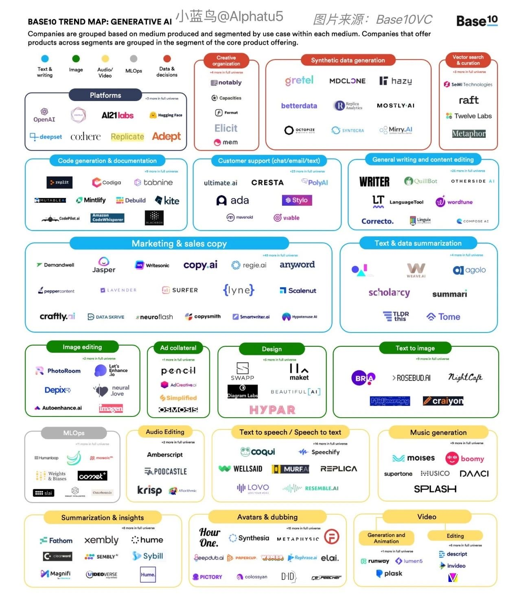

## 图片

### 模型

- DALL-E
- Midjourney​
- Stable Diffusion

    - [ControlNet](https://github.com/lllyasviel/ControlNet) - Let us control diffusion models
    - [GLIGEN](https://huggingface.co/gligen) / https://gligen.github.io/
    - [Linaqruf/anything-v3.0](https://huggingface.co/Linaqruf/anything-v3.0) - This model is intended to produce high-quality, highly detailed anime style with just a few prompts. Like other anime-style Stable Diffusion models, it also supports danbooru tags to generate images.
    - [runwayml/stable-diffusion-v1-5](https://huggingface.co/runwayml/stable-diffusion-v1-5) - Stable Diffusion is a latent text-to-image diffusion model capable of generating photo-realistic images given any text input. F
    - [stabilityai/stable-diffusion](https://huggingface.co/spaces/stabilityai/stable-diffusion) - This model card focuses on the model associated with the Stable Diffusion v2 model.
    - [prompthero/openjourney](https://huggingface.co/prompthero/openjourney) - Openjourney is an open source Stable Diffusion fine tuned model on Midjourney images, by PromptHero
    - [hakurei/waifu-diffusion](https://huggingface.co/hakurei/waifu-diffusion) - waifu-diffusion is a latent text-to-image diffusion model that has been conditioned on high-quality anime images through fine-tuning.
    - [nitrosocke/Arcane-Diffusion](https://huggingface.co/nitrosocke/Arcane-Diffusion) - This is the fine-tuned Stable Diffusion model trained on images from the TV Show Arcane. 
    - [dallinmackay/Tron-Legacy-diffusion](https://huggingface.co/dallinmackay/Tron-Legacy-diffusion) - This is a fine-tuned Stable Diffusion model (based on v1.5) trained on screenshots from the film Tron.
    - [nitrosocke/mo-di-diffusion](https://huggingface.co/nitrosocke/mo-di-diffusion) - This is the fine-tuned Stable Diffusion model trained on screenshots from a popular animation studio.
    - [nitrosocke/redshift-diffusion](https://huggingface.co/nitrosocke/redshift-diffusion) - This is the fine-tuned Stable Diffusion model trained on high resolution 3D artworks.
    - [CompVis/stable-diffusion](https://github.com/CompVis/stable-diffusion)
    - [Envvi/Inkpunk-Diffusion](https://huggingface.co/Envvi/Inkpunk-Diffusion) - Finetuned Stable Diffusion model trained on dreambooth. Vaguely inspired by Gorillaz, FLCL, and Yoji Shinkawa. Use nvinkpunk in your prompts.
    - [RODIN Diffusion](https://3d-avatar-diffusion.microsoft.com/) - A Generative Model for Sculpting 3D Digital Avatars / https://arxiv.org/abs/2212.06135
    - [Stable Diffusion Reimagine](https://stability.ai/blog/stable-diffusion-reimagine) - Stability AI is excited to announce the launch of Stable Diffusion Reimagine! We invite users to experiment with images and ‘reimagine’ their designs through Stable Diffusion.

- Disco Diffusion

### 平台

- [DALL·E 2](https://openai.com/dall-e-2/)

    - http://arxiv.org/abs/2204.06125
    - [DALLE2-pytorch](https://github.com/lucidrains/DALLE2-pytorch)

- [Stable Diffusion](https://stablediffusionweb.com)

    - [Dreamstudio](https://beta.dreamstudio.ai)
    - [stablediffusion](https://github.com/Stability-AI/stablediffusion)
    - [stable-diffusion](https://github.com/CompVis/stable-diffusion)
    - [InvokeAI](https://github.com/invoke-ai/InvokeAI) - This version of Stable Diffusion features a slick WebGUI, an interactive command-line script that combines text2img and img2img functionality in a "dream bot" style interface, and multiple features and other enhancements. For more info, see the website link below.
    - [stable-diffusion-webui](https://github.com/AUTOMATIC1111/stable-diffusion-webui)
    - [InvokeAI](https://github.com/invoke-ai/InvokeAI)
    - [diffusionbee-stable-diffusion-ui](https://github.com/divamgupta/diffusionbee-stable-diffusion-ui)
    - [sygil-webui](https://github.com/Sygil-Dev/sygil-webui)
    - [Dreambooth-Stable-Diffusion](https://github.com/XavierXiao/Dreambooth-Stable-Diffusion)
    - [stable-dreamfusion](https://github.com/ashawkey/stable-dreamfusion)
    - [stable-diffusion-ui](https://github.com/cmdr2/stable-diffusion-ui)
    - [fast-stable-diffusion](https://github.com/TheLastBen/fast-stable-diffusion)
    - [dalle-playground](https://github.com/saharmor/dalle-playground)
    - [stable-diffusion-videos](https://github.com/nateraw/stable-diffusion-videos)
    - [stable-diffusion-tensorflow](https://github.com/divamgupta/stable-diffusion-tensorflow)
    - [stability-ai/stable-diffusion](https://replicate.com/stability-ai/stable-diffusion)

- [Disco Diffusion](https://colab.research.google.com/github/alembics/disco-diffusion/blob/main/Disco_Diffusion.ipynb)

    - [disco-diffusion - github](https://github.com/alembics/disco-diffusion)
    - [人工智能绘画工具 Disco Diffusion 入门教程](https://zhuanlan.zhihu.com/p/563831317)

- [Midjourney](https://midjourney.com/)
- [jina](https://jina.ai/)

    - [discoart - github](https://github.com/jina-ai/discoart)
    - [disco-diffusion - replicate](https://replicate.com/nightmareai/disco-diffusion)

- [dream](https://dream.ai/create)
- [Imagen](https://imagen.research.google/)
- [百度·文心一格](https://yige.baidu.com/)
- [Draft](https://draft.art/)
- [昆仑万维](https://www.kunlun.com/)

    - [又一巨头宣布入局AIGC，一口气开源数个模型，还道出了它的变现之道](https://mp.weixin.qq.com/s/HZjxDhaMqqgM92puoedJvg)

### 算法

- [stable-diffusion](https://huggingface.co/spaces/stabilityai/stable-diffusion) - Stable Diffusion is a state of the art text-to-image model that generates images from text.

### 产品

- [AI Art Generator](https://creator.nightcafe.studio/) - Create amazing artworks using the power of Artificial Intelligence.
- [Novel AI](https://novelai.net/)
- https://dream.ai/create
- [Alpha 造图](https://www.iplaysoft.com/alpha-zaotu.html)
- [DiffusionBee](https://diffusionbee.com/) - 一个 MacOS 应用，将 Stable Diffusion 模型做成一个安装包，带有图形界面，号称是苹果电脑使用该模型的最容易方法。
- [Charl-E](https://www.charl-e.com/) - CHARL-E packages Stable Diffusion into a simple app. No complex setup, dependencies, or internet required — just download and say what you want to see.
- [imaginAIry](https://github.com/brycedrennan/imaginAIry) - AI imagined images. Pythonic generation of stable diffusion images.
- [滴墨社区 - AI绘画](https://www.domo.cool/introduction)
- [scribble-diffusion](https://github.com/replicate/scribble-diffusion) - Turn your rough sketch into a refined image using AI
- [flair](https://flair.ai/) - 帮助品牌生成高端产品图片。用户将产品图拖入画布，加入装饰贴纸，通过文字描述场景生成背景，完成产品图片的整体设计。
- [clipdrop](https://clipdrop.co/) - ClipDrop 是一个图片生成类 AI 产品，主要帮助商家或者个人对图片进行各种处理，包括用文字生成图片、去掉图片背景、自动从图片中删除人物/文本/缺陷/物品、提取图片里的某些主题，以及用 AI 将任何东西从一个地方传到另一个地方等。目前 ClipDrop 的使用场景主要有 4 个领域：电商、房地产、汽车经销商和团队画像。自从 2020 年上线以来，目前已经积累了 1500 万用户，处理的图片超过了 1 亿次，其免费版的功能限制比较多，付费版每月收费 10 美金，跟 Photoroom 的价格一样。

    - [10亿美金的Stability AI完成了第一笔收购，一个拥有1500万用户的产品](https://mp.weixin.qq.com/s/qDZx_2A2lk4B1_EpcUa4bA)

- [SketchGPT](https://www.sketchgpt.xyz/dream)
- [deepagency](https://www.deepagency.com/) - Deep Agency offers virtual photo studio services with advanced AI technology for professional photos without leaving home.

### 提示词

- [PromptBase](https://promptbase.com/) - Find top prompts, produce better results, save on API costs, sell your own prompts.
- [promptperfect](https://promptperfect.jina.ai/) -  PromptPerfect，它是专为大型语言模型 (LLM)、大型模型 (LM) 和 LMOps 设计的尖端提示优化器。
- [prompthero](https://prompthero.com/)

### 素材

- [Lexica](https://lexica.art/?)

### 云服务

- [Replicate](https://replicate.com) - You can use Replicate to run machine learning models in the cloud from your own code, without having to set up any servers.

    - [Text to image](https://replicate.com/collections/text-to-image)

- [Colaboratory](https://colab.research.google.com/)

    - [苦逼学生党的Google Colab使用心得](https://zhuanlan.zhihu.com/p/54389036)
    - [colab运行stable diffusion以及本地部署方法](https://zhuanlan.zhihu.com/p/561546984)

### 教程

...

### 示例

- a man with a blue shirt and a beard looks at the camera with a serious look on his face, (1girl:0.980), (blue_eyes:0.856), (forehead:0.805), (gradient:0.767), (gradient_background:0.736), (grey_background:0.777), (lips:0.843), (looking_at_viewer:0.734), (mole:0.933), (nose:0.770), (realistic:0.981), (solo:0.964), head portrait of man, fairy tale style background,  top lighting, perfect shadow, soft painting, reduce saturation, leaning towards watercolor, art by hidari and krenz cushart and wenjun lin and akihiko yoshida
- a man with glasses and a white shirt is looking at the camera with a serious look on his face, (3d:0.821), (black_hair:0.789), (blurry:1.000), (blurry_background:1.000), (blurry_foreground:0.993), (depth_of_field:1.000), (glasses:0.991), (green_eyes:0.872), (looking_at_viewer:0.743), (photo_\(medium\):0.944), (photo_inset:0.792), (realistic:0.919), (reference_inset:0.792), (solo:0.853), head portrait of man, fairy tale style background,  top lighting, perfect shadow, soft painting, reduce saturation, leaning towards watercolor, art by hidari and krenz cushart and wenjun lin and akihiko yoshida

### 文献

- [awesome-ai-painting](https://github.com/hua1995116/awesome-ai-painting) - AI绘画资料合集（包含国内外可使用平台、使用教程、参数教程、部署教程、业界新闻等等
- [State of AI Report 2022](https://www.stateof.ai/)
- [【个人翻译】AI绘画工具DALLE2、MidJourney与Stable Diffusion的对比](https://www.bilibili.com/read/cv18290360?from=articleDetail)
- [理解 DALL·E 2， Stable Diffusion 和 Midjourney 的工作原理](https://xie.infoq.cn/article/2c3b18864176bed4fbc0d576c)
- [AI作图创业高潮：国内有小程序日增65万用户，海外有产品月入近百万美金](https://www.baijing.cn/article/41647)
- [15 Best AI Art Generators 2022](https://rigorousthemes.com/blog/best-ai-art-generators/)
- [12 Best AI Art Generators You Should Use (Free & Paid)](https://beebom.com/best-ai-text-to-image-art-generators/)

## 视频

- [CogVideo](https://github.com/THUDM/CogVideo)
