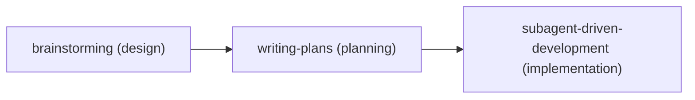
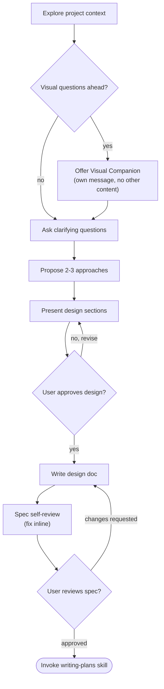
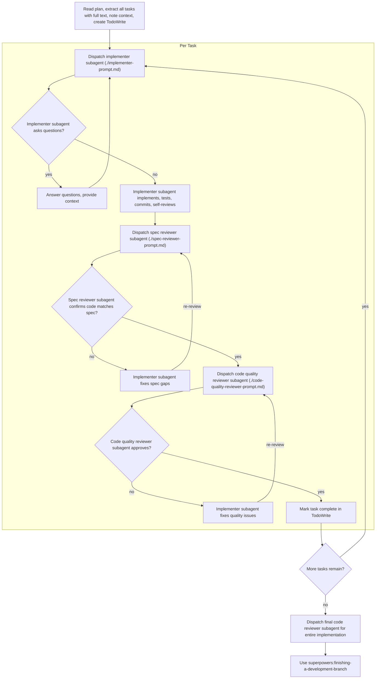

https://github.com/obra/superpowers

## 原理

### `using-superpowers`

该技能是引导 Agent 发现并应用所有其他技能的引导技能。

- 强制执行技能使用的 1% 调用阈值
- 定义指令优先级层级（用户 > 技能 > 系统提示）
- 设定技能类型优先级（优先处理流程技能，再处理实现技能）
- 为基于清单的技能指定 TodoWrite 清单集成

### `/brainstorming`

### `/writing-plans`

### `/subagent-driven-development`

## 优缺点

- 优点：访谈式完善需求，有详细的设计文档和任务规划
- 缺点：

  - 规划和执行任务时会提交代码，会出现较多 commit，有些东西没有生成最终效果可能得二次修改。
  - 一个简单的需求会过度设计，并且任务拆分过细，导致生成成本较高且时间较长
  - 没有维护一份完整的技术设计文档，每次都要查看全部代码来完成访谈，Token 消耗过高
  - 默认为英文，对英文不熟练的开发者不够友好
